# Актуальные видео-сцены и промты

Рабочий мастер-файл. Здесь хранятся только актуальные промты, которые ещё нужны для генерации или доработки. Когда ролик готов и промт больше не нужен, соответствующая сцена удаляется из файла и из оглавления.

**Канонический источник:** `video-prompts.md`. Это единственный редактируемый мастер; `video-prompts.html` генерируется из него автоматически и вручную не редактируется.

## 📌 РЕВИЗИЯ / ТЕКУЩИЙ СТАТУС

**15 сцен к генерации/доработке · 46 полных текста промта**

- **🛠️ 11** рабочих направлений в блоке **«Сцены в работе»**: W5–W15. Из них W14–W15 — «обдумать», а не отдельные сцены для автоматической генерации.
- **⏳ 3** сцены сейчас в медленной генерации: **20, 26, 27** — это **6 активных Topview-задач / 6 занятых слотов из 6**. Scene 20: «Песня Маши 9–11» (3× Wan 3.0); Scene 26: один Wan 3.0 render attempt; Scene 27: два Wan 3.0 render attempts основного 30-секундного варианта. Ранее завершённые задачи остаются только техническими результатами; technical success не означает редакционное одобрение. Повторно не запускать active slow-сцены до результата/ошибки или отдельного решения пользователя.
- **Последняя оформленная активная сцена:** 28 — финальный имперский танец: 10×15 с Seedance 2.0 и 10×30 с Wan 3.0, 20 самостоятельных промтов. Референсы ангара H28A/H28B и сохранённые постановочные кадры P28/L28/F28 созданы; R28A/R28B сохранены как вспомогательные композиционные кадры, а C28/S28/G28 ещё требуют отдельной подготовки/проверки (`DRAFT`). Правки кошачьей ветки 23–27 сохранены. Scene 20 получила защиту закрытого голубого дизайна Маши для будущих запусков.
- **Ревизия Control Center:** дата определяется автоматически по содержательному изменению canonical master; чистая техническая пересинхронизация без изменения содержимого дату ревизии не меняет.
- **Последняя полная синхронизация:** **06.10.2026 · текущая по live Topview/Drive сверке**. Точное техническое время свежей telemetry берётся из `topview-status.json.checked_at`.

**Статусы V3.5 для обсуждения правок:** `NEEDS_FIX` означает, что сцену/промт нужно отдельно обсудить и решить, требуется ли изменение; это не разрешение автоматически переписывать промт или запускать новый рендер. `NEEDS_RERENDER` означает, что предыдущий результат уже признан кандидатом на повторную генерацию, но для slow-сцен повторный запуск всё равно запрещён до результата/ошибки или отдельного решения пользователя.

**Синхронизация контекста:** **07.10.2026**. Точное техническое время зеркала хранится в `project-status.json` и здесь не дублируется. Фактическая карта — `film-analysis.md`, статусы и зависимости — `film-backlog.md`. Новые решения пользователя имеют приоритет над старым Notion. В active master остаются **15 актуальных сцен и 46 полных текста промта**. Сцены **1, 2, 3, 4, 5, 6, 7, 9, 12, 14, 15 и 18** удалены из active master; их Scene ID зарезервированы и не переиспользуются. По явному решению пользователя Scene 3 и 4 признаны неудачными и больше не дорабатываются, а Scene 5 принята как выбранный монтажный вариант и пойдёт в фильм, поэтому её prompt также больше не нужен в active master. Canonical slow-list сейчас: **20, 26, 27**. Live Topview сверка 07.10.2026 подтверждает **6/6 active task slots**: Scene 20 — «Песня Маши 9» `117b9d976d2c4a54945256e79fc64639`, «Песня Маши 10» `ef0a2cdb1c8841ac8d031a19fa07bd9e`, «Песня Маши 11» `42e5cdb42c1a45df8a037a26eb3fa26b`; Scene 26 — `b95a76b92f9d4787b738b165eaeb270f`; Scene 27 — `ffa34324436745beb161d72ae9d4394f` и `017bebefc4c54038954301968a4b5d68`. Все пять новых задач нормализационно совпадают с существующими canonical prompts и являются новыми попытками существующих Scene IDs, а не новыми сценами. Свободно 0 слотов. Ранее завершённые Scene 20 и Scene 27 задачи сохраняют только технический статус; editorial/approval state не менялся. Scenes 17, 19, 21, 22, 23 и 24 не имеют доказанных active tracked tasks на этой live сверке. Никакие старые промты Notion сюда автоматически не добавлены. Непрерывный аудиовизуальный контроль не выполнялся.

## ⏳ Сейчас в медленной генерации

| Сцена | Статус | Действие |
|---|---|---|
| 20 — Маша-Лагуна: рок-припев у озера | ⏳ В МЕДЛЕННОЙ ГЕНЕРАЦИИ · 3 задачи Wan 3.0 | Не запускать повторно |
| 26 — Коты-магистры: ультиматум Серёге | ⏳ В МЕДЛЕННОЙ ГЕНЕРАЦИИ · 1 задача Wan 3.0 | Не запускать повторно |
| 27 — Серёга против котов-магистров | ⏳ В МЕДЛЕННОЙ ГЕНЕРАЦИИ · 2 задачи Wan 3.0 | Не запускать повторно |

Статус снимается только после результата/ошибки или отдельного решения пользователя о новом запуске.

| # | Сцена | Референсы | Что происходит |
|---|-------|-----------|-----------------|
| 10 | [Кантина — допрос про товар, часть 1](#scene-10) | @Image1 = композиция/Чубакка; @Image2 = Han; @Image3 = Jedi | Джедай спрашивает Хана про товар, Хан делает вид, что не понимает, и ссылается на Чубакку. |
| 11 | [Кантина — допрос про товар, часть 2](#scene-11) | те же @Image1/@Image2/@Image3 | Прямое продолжение: шутка про Чубакку, вопрос про плёнку и финальная растерянность Хана. |
| 13 | [Совет джедаев — говорящий кот Лучик](#scene-13) | @image1 = композиция/локация; @image2 = Лучик; @image4 = Black; @image5 = Purple | После решения Совета кот на коленях у Purple спокойно человеческим голосом подтверждает решение. Black с кальяном и Purple воспринимают это как совершенно нормальное событие. |
| 16 | [Татуин — гигантский пустынный червь и бой на руинах](#scene-16) | @video1 = локация/герои Татуина | Огромный червь в духе Dune вырывается из песка в локации @video1 и разносит всё вокруг, пока герои сражаются на его фоне и уворачиваются от атак. |
| 17 | [Пещера — передышка после монстра и разговор о карте](#scene-17) | @video1/@video2/@video3 = продолжение пещеры/монстр | Прямое продолжение после боя: трое измотаны, сидят на отрубленных частях чудовища и начинают разговор о карте. |
| 19 | [Рыбалка и Маша-Лагуна](#scene-19) | @Image1 = стартовый кадр/рыбалка; @Image2 = финальный кадр/бег; @Image3 = Маша-Лагуна; @Image4 = Sasha; @Image5 = Pasha | Саша и Паша спокойно рыбачат у озера, из воды появляется Маша-Лагуна, Саша успевает сказать «Маша?..», получает пощёчину и слышит упрёк. Паша молча реагирует мимикой, Саша вспоминает про важное поручение, после чего оба срываются в бег к финальному кадру. |
| 20 | [Маша-Лагуна — рок-припев у озера](#scene-20)<br>**⏳ В МЕДЛЕННОЙ ГЕНЕРАЦИИ** (3 задачи Wan 3.0) | @Image1 = локация/берег озера; @Image2 = Маша-Лагуна | Полный музыкальный номер разбит на 11 взаимосвязанных 30-секундных фрагментов «Песня Маши 1–11»; три текущие Wan 3.0 задачи относятся к частям 9–11 существующей Scene 20 и не создают новые Scene ID. |
| 21 | [Мостик → космическая битва: бесшовный пролёт через окно](#scene-21) | @Image1 = точный первый кадр/мостик; @Image2 = точный последний кадр/космическая битва; @Image3 = Серёга; @Image4 = Юля | 30-секундный Seedance 2.5 first-and-last-frame переход: Серёга и Юля радуются на мостике, камера непрерывно приближается к окну, без бликов/отражений/преломления проходит сквозь стекло и физически продолжает полёт в космическом сражении до точной композиции @Image2. |
| 22 | [Разрушенная станция → внутренний коридор: бесшовный пролёт через пробоину](#scene-22) | @Image1 = точный первый кадр/разрушенная станция; @Image2 = точный последний кадр/коридор со штурмовиками | 30-секундный Seedance 2.5 first-and-last-frame переход: камера летит через продолжающуюся космическую битву к разрушенной станции, физически входит через пробоину в корпусе, проходит повреждённую внутреннюю структуру и без склейки приходит к точной композиции коридора @Image2. |
| 23 | [Люди → коты-джедаи: бесшовное раскрытие второго плана](#scene-23) | @Image1 = люди/старт; @Image2 = точные серый+рыжий коты/цель | Камера проходит между идущими людьми и без морфа раскрывает за ними двух котов-джедаев; коты пафосно идут с включёнными мечами и делают контролируемые вращения. |
| 24 | [Коты в кабине: запуск корабля и взлёт](#scene-24) | @Image1 = парный continuity котов; @Image2 = Лучик; @Image3 = Рыжик; @Image4 = **точный approved cockpit / composition reference** | Тот же тёплый жилой интерьер как на фото: Рыжик слева в кадре у навигации, Лучик справа у пилотских органов управления; обычный домашний масштаб котов, без гигантских полугуманоидных пропорций. |
| 25 | [Коты в кабине: космическое сражение](#scene-25) | @Image1 = парный continuity котов; @Image2 = Лучик; @Image3 = Рыжик; @Image4 = **точный approved cockpit / composition reference** | Сражение видно из той же кабины без redesign: Рыжик слева в кадре у тактики/навигации, Лучик справа пилотирует; оба остаются обычного кошачьего масштаба и хорошо читаются лицами. |
| 26 | [Коты-магистры на планете ситхов: ультиматум Серёге](#scene-26)<br>**⏳ В МЕДЛЕННОЙ ГЕНЕРАЦИИ** (1 задача Wan 3.0) | @Image1 = коты / парный continuity-composition; @Image2 = Лучик; @Image3 = Рыжик; @Image4 = точная локация древнего города-руины | В кадре **только два кота**; Серёга — исключительно off-camera адресат. Сохраняются пепел/пыль/редкие искрящиеся частицы, обычный кошачий масштаб, строгий русский lip sync и speaker ownership, Wan 3. |
| 27 | [Серёга против котов-магистров: бой на световых мечах](#scene-27)<br>**⏳ В МЕДЛЕННОЙ ГЕНЕРАЦИИ** (2 задачи Wan 3.0) | @Image1 = коты; @Image2 = Серёга; @Image3 = Лучик; @Image4 = Рыжик; @Image5 = точная локация древнего города-руины | Обе прошлые 15s Seedance 2.0 задачи технически завершены; сейчас активны две Wan 3.0 попытки основного 30s варианта. **30s и обе 15s версии исправлены:** обычный небольшой масштаб котов, непрерывная пепельно-пыльная атмосфера и значительно более быстрый, агрессивный бой без статичного позирования. |
| 28 | [Финальные титры — имперский строевой танец](#scene-28) | Character sheets из «Персонажей»; H28A/H28B; сохранённые P28/L28/F28; R28A/R28B как композиционные helpers; C28/S28/G28 ещё pending | Две версии: 10×15 с Seedance 2.0 / 10×30 с Wan 3.0. Церемония → дискотека; жесты у лица, разъезд, кружение на руках и на плече; монтаж около 90 с; `DRAFT` до оставшихся изображений. |

---

## Автоматизация референсов по Scene ID

Для каждой активной сцены используется собственный `Scene Reference Pack`. Перед новым prompt/rerender/запуском оператор сам определяет, какие входы нужны: individual identity sheets, точная локация, props, first/last frames и дополнительные pose/composition stills. Уже доступные референсы из Drive/сайта/Topview повторно у пользователя не запрашиваются.

**QC и сохранение:** новые постановочные фото делаются по одному; каждый результат сравнивается с identity/location authority. При дрейфе лица, одежды, геометрии, масштаба, позы, дубликатах или merged faces результат отклоняется и попытка продолжается. Как только кадр пригоден, он сохраняется в Scene pack **до следующей генерации**. Для групп сначала используются маленькие проверенные подгруппы; composition helper не заменяет individual identity sheet.

**Topview:** для уже запущенных сцен восстанавливаются точные task-input images из live Board provenance, когда они доступны. Команда пользователя `запускай сцену N` означает: fresh master/status → Scene pack → недостающие обязательные refs → prompt/reference mapping → live Topview preflight → submit. Existing slow locks и правило `technical success != approval` сохраняются. Помощник не должен молча тратить кредиты на вспомогательные изображения: unlimited/zero-credit путь должен быть подтверждён для конкретного submit.

**Rollout / чекпоинт:** актуальный аудит необходимости новых stills ведётся в Drive `Scene Reference Packs/scene-reference-plan`; приоритет сейчас: Scene 28 S28/G28, затем 13, 17, 27, 10/11 и 16. Сцены с достаточными first/last/cockpit refs не получают лишние изображения без наблюдаемой проблемы.

## Сцены в работе

Это не финальные промты, а рабочий блок. Сюжетные идеи из «Ближайших направлений», «Сюжетных идей-кандидатов», заметок Саши и отдельной сюжетной логики сведены сюда в одну очередь. Статус **ОБДУМАТЬ** означает монтажную/сюжетную задачу, которую пока не следует превращать в отдельную генерационную сцену без проверки существующего материала.

| ID | Очередь / сцена в работе | Статус | Базовые референсы | Что уже понятно |
|---|---|---|---|---|
| W9 | **После монстра: долг, карта и временное перемирие** | В РАЗРАБОТКЕ | Scene 17; существующие кадры после боя; персонажи Канцлер + джедаи | Продолжить линию Scene 17: джедаи признают, что Канцлер помог им выжить, но это не даёт ему автоматического права на карту. В диалоге естественно поднять вопросы «зачем тебе эта карта?» и «почему её отдали?». Сюда же относится Сашина заметка 48:22. Цель — объяснить временное перемирие и владельца фрагмента, а не заново снимать бой. |
| W10 | **После монстра → уход Лёхи и Виталика в лес** | В РАЗРАБОТКЕ | конечные кадры блока после монстра; начальные кадры лесной линии | Сашина идея 50:31: уход в лес, камера может вращаться между героями и затем раскрыть окрестности/лес. Это часть W7 и логическое продолжение W9. Сначала проверить, можно ли закрыть стык существующим кадром; новый рендер только если переход действительно нужен. |
| W6 | **Татуин: гигантский червь, карта и побег Канцлера** | В РАЗРАБОТКЕ / СВЕРИТЬ МОНТАЖ | развязка Татуина; карта; машина; Канцлер | Развалины/пустыня: разговор о карте, гигантский червь ломает машину, дуэль на фоне угрозы, Канцлер уезжает верхом. До промта выбрать судьбу карты и заменяемый кусок погони. Разрушать машину только после последнего сохраняемого кадра с ней. Не запускать генерацию автоматически. |
| W5 | **Три фрагмента / артефакта → запретное знание → Warcraft 3** | В РАЗРАБОТКЕ | три фрагмента/карты; компьютер/CRT; референс Канцлера | Главный сюжетный пакет. Совместить идеи «три ключа турнира» и Сашину логику «три карты → три артефакта древности». Фрагменты должны давать понятный доступ к знанию/координатам/терминалу; на CRT можно кратко связать пустыню, воду и лес с уже существующим Warcraft-финалом. Конкретный вариант «диск / провод / мышь» пока считать идеей, а не утверждённым каноном. |
| W11 | **Татуин: кто передал Канцлеру маршрут / координаты** | В РАЗРАБОТКЕ | кантина; существующий контакт/бармен/коммуникатор; татуинский блок | Короткий причинный payoff: координаты или маршрут были переданы/проданы Канцлеру, поэтому его появление дальше становится следствием предыдущего события. Согласовать с существующей кантиной и транспортной линией W8; не строить длинную новую сцену, если достаточно короткой реплики/сообщения. |
| W12 | **Кашиик: карта в обмен на спасение товарища** | ОБДУМАТЬ / СВЕРИТЬ МОНТАЖ | существующий кашиикский бой; фрагмент карты; герои сцены | Кандидат вместо чистого Force pull: фрагмент отдаётся сознательно ради спасения друга. Это делает получение последнего ключа поступком персонажа. До разработки обязательно сверить существующий монтаж и не ломать уже снятую причинность, если она читается. |
| W7 | **Переходы между крупными группами / полёт к следующей планете** | В РАЗРАБОТКЕ | конечные и начальные кадры соседних блоков; корабль/планета | Сюда входит Сашина идея 37:30: камера вылетает из корабля, открывает планету и летит к ней. Ключевые стыки: Татуин → Набу, последствия монстра → лесная группа, лесной финал → компьютер. Сначала проверять существующий материал, звук и короткие реплики; новый переход генерировать только если функция иначе не закрывается. |
| W13 | **Финальный Warcraft → callback «хлеб и молоко»** | В РАЗРАБОТКЕ ПОСЛЕ W5 | компьютер/Warcraft; начало фильма с бытовой просьбой; Канцлер | После того как W5 определит смысл карты и Warcraft, проверить короткий финальный callback «Ты хлеб и молоко купил?». Это должен быть комедийный последний удар, а не отдельный длинный эпизод. Не фиксировать окончательно до выбора W5. |
| W8 | **Недоделанные гонки и транспорт** | В РАЗРАБОТКЕ / СВЕРИТЬ | референсы конкретной машины/экипажа; татуинская линия | Космическая погоня решена: пользователь выбрал Scene 5, а Scenes 3+4 признаны неудачными и выведены из active master. Их больше не генерировать и не дорабатывать. Для татуинской гонки согласовать связь со сценой 16, чтобы машина не появлялась после уничтожения; сюжетно связать с W11 и уточнить владельца фрагмента карты. |
| W14 | **ОБДУМАТЬ: монтажные и локальные идеи из заметок Саши** | ОБДУМАТЬ, НЕ НОВАЯ СЦЕНА | существующий фильм и точные таймкоды | Пока не переносить в самостоятельные генерационные сцены: 13:37 смена кадров/Земля-карта; 14:49 переход в коридор; 15:18 «пилота сверху»; 16:11 возможная подрезка Артёма; 16:0x возможная переозвучка Wan; 22:30 переозвучка мата; 27:31 корабль→интерьер; 29:46 возможный Wan; 30:01 переход после монстров; 38:41 ускорить «закат→рассвет→закат»; 39:36 кадрирование рук; 43:07 заменить диалог; 44:47 драка/«2 Паши»; 45:20–45:34 связка подводных кадров; 49:26 монтажный эпизод; 52:25 эпичная речь джедая; 53:16 показать спуск на землю. Разбирать по одному пункту во время монтажного прохода. |
| W15 | **ОБДУМАТЬ: Маша / рыбалка / возврат к миссии после Scenes 19–20** | ОБДУМАТЬ / ПРОВЕРИТЬ ДУБЛИРОВАНИЕ | Scenes 19–20; существующий рыболовный блок | Исходная идея Саши «Маша появляется → упрёк → “у нас же важное поручение” → бег» уже частично реализована в Scene 19 и расширена линией Scene 20. Не создавать ещё одну сцену автоматически. После результатов 19–20 проверить, что осталось действительно недостающим. |

**Рабочая сюжетная очередь:** W9 → W10 → W5 → W11 → W12 → W7 → W13. W8 ведётся параллельно как transport-continuity. W14–W15 — пул «обдумать», а не разрешение на генерацию.

### Ближайшие направления

Это рабочие направления для последующего разбора. Они не являются автоматическим разрешением менять существующие промты, снимать slow-lock или запускать новые генерации без отдельного решения пользователя.

1. **Закрыть сюжетную логику карты и Warcraft.** Определить, зачем Канцлеру карта, что дают её части и как это связано с Warcraft 3 / турниром, чтобы уже существующий компьютерный финал стал понятным payoff, а не случайным эпизодом.
2. **Закрыть последствия боя с монстром.** Для сцены 17 / линии W1 определить владельца набусского фрагмента, причину временного перемирия Канцлера и джедаев и понятный выход к следующей сюжетной линии.
3. **Разобраться с Татуином и транспортом.** Согласовать W6/W8 с уже существующей погоней: какую часть материала заменяет эпизод с гигантским червём, когда окончательно исчезает/разрушается машина и у кого остаётся фрагмент карты.
4. **Доделать переходы W7.** Проверить Татуин → Набу, последствия монстра → лесную группу, лесной финал → компьютер и другие слабые стыки. Генерировать новый переход только там, где функцию нельзя закрыть существующим планом, звуком или короткой репликой.
5. **Разбирать существующие NEEDS_FIX / NEEDS_RERENDER по одной сцене.** Текущие кандидаты: Scene 10 и 11 — NEEDS_FIX; Scene 13 — NEEDS_RERENDER. Scenes 3 и 4 выведены из active master по решению пользователя в пользу Scene 5 и не являются текущими кандидатами на доработку. Scene 17 остаётся активной без статуса NEEDS_FIX / NEEDS_RERENDER; её технический результат не равен редакционному одобрению. Не переписывать сцены массово и не считать production status разрешением на новый render.
6. **После закрытия новых сцен перейти к финальному монтажному проходу.** Выбрать сокращения повторных боёв, танцев, гиперпрыжков и лесных проходов, пересчитать хронометраж и затем вручную проверить склейки, звук, музыку, continuity и краткие артефакты.
#### Сюжетные идеи-кандидаты для детального разбора

Это предложения соавтора, а не утверждённые сцены и не разрешение на генерацию. Их задача — закрыть уже найденные сюжетные пробелы минимальным количеством нового материала.

- **Три ключа турнира.** Три фрагмента могут складываться не просто в карту сокровищ, а в древний игровой/турнирный ключ: на CRT кратко проявляются пустыня, вода и лес, затем Warcraft. Это связывает реплику про «источник контроля» с уже существующим игровым финалом без отдельной длинной сцены.
- **Долг после монстра.** Продолжить сцену 17 коротким моральным последствием: один джедай признаёт, что Канцлер помог выжить, другой подчёркивает, что это не даёт права забрать карту. Так временное перемирие получает причину.
- **Кто сдал маршрут на Татуине.** Короткий payoff через контакт/бармена/коммуникатор: координаты были проданы или переданы Канцлеру. Его появление становится следствием предыдущей сцены, а не случайностью.
- **Карта в обмен на друга на Кашиике.** Рассмотреть вариант, где фрагмент отдаётся сознательно ради спасения товарища, вместо чистого Force pull. Это делает захват последнего ключа поступком персонажа.
- **Хлеб и молоко в финале.** После запуска Warcraft вернуть бытовую просьбу из начала — «Ты хлеб и молоко купил?». Использовать только если callback усиливает финал и не ломает уже выбранную W5-логику.

#### Идеи от Саши

Распознано с четырёх рукописных листов. Это идеи, монтажные замечания и варианты сюжетной логики от Саши, а не утверждённые сцены и не разрешение автоматически менять master-промты или запускать генерации. Места, которые по фотографии нельзя уверенно разобрать, оставлены как `[неразборчиво]` вместо догадки.

- **Маша / рыбалка / возврат к миссии.** Маша в виде «Лава-лагуны» появляется во время сцены на рыбалке, «лицом к лицу» `[формулировка частично неразборчива]`. Реплика/идея: «Когда наконец сможешь уделять внимание мне, а не своим увлечениям?» → «Ой, у нас же важное поручение» → сцена бегущих ног.
- **13:37 — смена кадров.** Сделать конечный кадр с ~13:47 и начальный с ~13:36; использовать движение/новое видео для перехода к теме. Во время видео — диалог о посещении планеты для поиска карты; рядом есть пометка про кадры с Землёй/картой `[частично неразборчиво]`.
- **14:49 — переход.** Склейка ухода от карты к переходу в коридор.
- **15:18.** «Пилота сверху».
- **16:11.** «Обрезать чуть-чуть Артёма?»
- **16:0x.** Попробовать переозвучить в Wan кадры третьей сцены с `[неразборчиво]`.
- **22:30.** «Мат перезвучить стоит».
- **27:31 — корабль / интерьер.** Начало с корабля и переход к планам Ильи и Артёма внутри.
- **Warcraft → хлеб и молоко.** Отдельно отмечен возврат к шутке/мотиву «хлеб и молоко» рядом с линией Warcraft.
- **Кадр с Землёй на карте.** Отмечен как отдельный переход/вставка; продолжение записи `[неразборчиво]`.
- **29:46.** Моменты Тёмы перед `[неразборчиво]` — попробовать в Wan.
- **30:01 — после монстров.** Переход к танцам после монстров; рядом пометка, что дополнительный переход между кадрами/эпизодами, возможно, не нужен `[частично неразборчиво]`.
- **32:51 — карта.** Меч гасится → карта левитирует/летит в руку к Канцлеру.
- **32:52.** Конечный кадр — момент, когда Серёгиус почти отвернулся.
- **37:30 — полёт к планете.** Полёт к планете Саши/Паши: камера вылетает из корабля, мы видим планету и летим к ней.
- **38:41.** «Закат → рассвет → закат» — ускорить.
- **39:36.** Скрыть пару рук / кадрировать.
- **41:53 — появление Маши.** Вставка на рассвете → появление Маши → «Ой, у нас же важная миссия» → побежали.
- **42:02.** Песня `[неразборчиво]` после исчезновения/погружения в воде.
- **42:07.** После «Лава-лагуны» — кадры погружения.
- **43:07.** Диалог заменить `[продолжение неразборчиво]`.
- **44:47.** Драка после `[неразборчиво]`; рядом пометка «2 Паши».
- **45:20.** «2 Саши из-под воды» — до подводной сцены.
- **45:22.** Связать сцену под водой.
- **45:34.** Кадр со скрещёнными мечами переходит в кадр с `[неразборчиво]` → в кадр 45:44.
- **48:22 — продолжение после монстра.** Вторая сцена с `[неразборчиво]` над/после монстра продолжается. Предложенные реплики: «Спасибо, что не оставил нас сражаться в одиночку против этого гада»; «Вы бы и не справились без меня»; «Помнишь, когда мы в детстве мечтали вместе стать джедаями?» `[дальше часть фразы неразборчива]`; «А зачем тебе эта карта?»; «Почему отдал?» / «Там было…» `[продолжение неразборчиво]`.
- **49:26.** Поставить эпизод с `[неразборчиво]` при отделении/отдалении камеры.
- **50:31 — уход в лес.** Уход Лёхи и Виталика в лес → первый кадр → камера вращается между ними → показ окрестностей с подлётом к лесу (новый кадр).
- **50:44.** Олень с кораблём → `[неразборчиво]` эвоков → приветствует Олега и берёт за руку.
- **52:25.** Вставить речь джедая на озвучке, сделать её эпичной.
- **53:16.** Показ спуска на землю.

**Отдельная сюжетная логика от Саши:**
- Продумать связную логику происходящего **от кантины до попадания в комнату с Канцлером**.
- **Три карты → три артефакта древности.** Рядом пометки: «диск / провод к розетке / мышь» `[частично неразборчиво]`.
- Реплика/смысл: **«Вы получили доступ к запретному знанию»**.
- Предусмотреть заключительный кадр с джедаями, которые потеряли карту `[часть формулировки неразборчива]`.
- Карты/артефакты дают доступ к **координатам заброшенного объекта в космосе** `[точное определение объекта неразборчиво]`; в связанной комнате/объекте есть компьютер/терминал, после чего появляется голограмма/карта с координатами `[частично неразборчиво]`.

---

<a id="scene-10"></a>

## Сцена 10 — Кантина: допрос про товар, часть 1

<!-- scene-meta: {"target_engine":"Wan 3","production_state":"NEEDS_FIX","duration_s":30,"dialogue":{"enabled":true,"language":"ru"},"tags":["dialogue","needs_fix"]} -->

**Контекст использования:** Сверка: актуальная связка со сценой 11. В фильме уже есть контакт в кантине; наличие именно разговора Хана о товаре не подтверждено. При замене сохранить функцию эпизода с картой (P10).

**Референсы:** @Image1 = композиция кантины и Чубакка · @Image2 = Han · @Image3 = Jedi

**Используемые identity-референсы на сайте:**
<div class="scene-ref-gallery" style="display:grid;grid-template-columns:repeat(auto-fit,minmax(145px,1fr));gap:10px;margin:10px 0 16px">
<figure style="margin:0"><a href="references/ilyusha.webp" target="_blank" rel="noopener">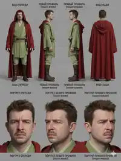</a><figcaption style="font-size:12px;margin-top:5px">Jedi / Илюша — identity</figcaption></figure>
</div>

**Exact scene-specific source:** location/composition/first-last inputs remain authoritative in the scene mapping; when their exact Topview/Drive binary is not yet in GitHub, publish it from the recovered Scene pack rather than asking the owner to upload it again.

**Что происходит:** Джедай требует от Хана обещанный товар. Хан изображает полное непонимание и в конце обращается к Чубакке как к свидетелю; Чубакка отвечает вопросительным рыком.

```text
[IMAGE REFERENCE 1: @Image1 - Cantina Composition & Chewbacca Reference] 
[IMAGE REFERENCE 2: @Image2 - Han Model Sheet] 
[IMAGE REFERENCE 3: @Image3 - The Jedi Model Sheet] 
 
Optimized for Wan 3 | Photorealistic Acting, Facial Micro-Expressions & Dialogue Focus | Duration: 30s | 4K 24fps 
 
ENVIRONMENT & ASSET LOCK: 
- THE JEDI (@Image3): Mustached man, tousled brown hair, weathered face with faint frown lines, light-green layered tunic, hooded deep-red cloak with the hood down, brown leather boots, a metal lightsaber hilt clipped to his belt. Wary, slightly bewildered expression throughout — this is clearly not going the way he expected. 
- HAN (@Image2): Sandy-brown hair, light stubble, cream shirt under an open black vest, blue trousers with a red side-stripe, holstered blaster on a leg-strap. Relaxed, faux-innocent expression, visibly playing dumb. 
- CHEWBACCA (matching @Image1): Towering bipedal Wookiee, shaggy reddish-brown fur, bandolier across his chest, expressive amber eyes. Communicates only in wookiee growls/roars — no words, no subtitles. 
- Setting: Same dim, smoke-hazed desert-cantina interior as @Image1 — stone archways, hanging amber lantern overhead, alien patrons blurred in the background, round metal table between the three. 

REFERENCE PRIORITY / IDENTITY LOCK:
@Image2 is the absolute identity authority for HAN. @Image3 is the absolute identity authority for THE JEDI. @Image1 controls the cantina composition, Chewbacca, table placement, background atmosphere and lighting only.
Do not average Han or the Jedi with faces visible in @Image1. Keep all three characters in their established seats/positions and preserve costume, face, hair, body proportions and left-right geography throughout.

START / END STATE:
Start as an already-established conversation at the same table, with the Jedi focused on Han and Chewbacca present as a silent witness.
End with Chewbacca's questioning growl and the Jedi visibly thrown off, while Han remains committed to playing dumb. Preserve this exact emotional and spatial state for Scene 11.

CAMERA / CONTINUITY:
Use motivated cinematic dialogue coverage only: readable medium three-shot for geography, then restrained singles/reaction shots that preserve eyelines and screen direction.
No arbitrary side swaps, no 180-degree axis break, no teleporting between seats, no random montage, and no camera move that obscures the speaking face during a line.
Keep camera motion physically stable with controlled inertia; subtle dolly or locked-off coverage is preferred over handheld movement.

PERFORMANCE / LIP SYNC:
All Russian dialogue must be spoken exactly by the assigned character with natural Russian pronunciation, no accent unless present in the reference performance, and accurate lip sync.
Jedi is serious and increasingly puzzled; Han performs believable faux innocence rather than broad comedy; Chewbacca reacts only through natural head/eye/body motion and Wookiee vocalization.
Allow natural blinking, breathing, small posture shifts and reaction pauses. Do not overlap key dialogue lines.

ACTING & DIALOGUE TIMELINE (00:00 - 00:30): 
 
- 00:00–00:08 (Shot 1 - The Accusation): 
Medium three-shot across the table. THE JEDI leans forward slightly, direct and serious, holding eye contact with Han: 
JEDI: «Ты добыл товар как договаривались?» 
Quick cut to Han's face — genuine-looking confusion mixed with a faint, too-innocent smile: 
HAN: «Какой ещё товар?» 
 
- 00:08–00:16 (Shot 2 - Spelling It Out): 
Close-up on THE JEDI, brow furrowed, patient but firm, spelling it out slowly and clearly: 
JEDI: «Я заплатил тебе, чтобы ты выкрал снюс у торговца спайсом.» 
Hold on his stern expression for a beat after the line. 
 
- 00:16–00:24 (Shot 3 - Playing Dumb): 
Cut to Han, shrugging with exaggerated innocence, glancing sideways toward Chewbacca as he speaks: 
HAN: «Не помню такого. Я тебя впервые вижу. Правда же, Чубака?» 
 
- 00:24–00:30 (Shot 4 - The Growl): 
Cut to CHEWBACCA — a long, questioning-sounding growl/roar, head tilting slightly. Quick reaction cut to THE JEDI's face, eyebrows raised, visibly thrown off. 
 
LIGHTING & VISUAL EFFECTS: 
Warm amber lantern light from directly overhead, soft haze/smoke drifting through the light beam, out-of-focus alien patrons in the background, shallow depth of field keeping the three main faces sharp. 
 
AUDIO: 
Clear Russian dialogue as written, one long expressive Wookiee growl in Shot 4, quiet ambient cantina chatter and distant alien music underneath — kept low enough not to compete with the dialogue, no non-diegetic score. 
 
NEGATIVE PROMPT: identity drift, face averaging, face swapping, costume drift, seat swapping, broken eyelines, 180-degree axis flip, random camera cuts, rushed dialogue, overlapping speech, wrong speaker, bad Russian pronunciation, lip desync, Wookiee speaking actual words, subtitles, captions, text on screen, duplicated characters, extra foreground characters, distorted hands, expressionless faces, exaggerated slapstick acting, warped table or cantina geometry, camera jitter, cartoon, anime, game-render look, plastic skin, low-detail faces, watermark, logo, unwanted non-diegetic music.

FRAME FILL / NO BARS: Fill the entire generated frame edge-to-edge. No letterboxing, no pillarboxing, no black bars, no side bars, no decorative borders, no empty margins.
```

---

<a id="scene-11"></a>

## Сцена 11 — Кантина: допрос про товар, часть 2

<!-- scene-meta: {"target_engine":"Wan 3","production_state":"NEEDS_FIX","duration_s":30,"dialogue":{"enabled":true,"language":"ru"},"dependencies":[{"type":"continues","scene":10}],"tags":["dialogue","needs_fix","continuity"]} -->

**Контекст использования:** Сверка: продолжение сцены 10. Плёнка на стекле уже показана в части 1 / 19:05–19:36; здесь нужно уточнить смысл повторного вопроса о плёнке, не представлять сцену без пояснения как её первое получение. Реплики пока сохранены (P11).

**Референсы:** те же @Image1 = композиция/Чубакка · @Image2 = Han · @Image3 = Jedi

**Используемые identity-референсы на сайте:**
<div class="scene-ref-gallery" style="display:grid;grid-template-columns:repeat(auto-fit,minmax(145px,1fr));gap:10px;margin:10px 0 16px">
<figure style="margin:0"><a href="references/ilyusha.webp" target="_blank" rel="noopener"></a><figcaption style="font-size:12px;margin-top:5px">Jedi / Илюша — identity</figcaption></figure>
</div>

**Exact scene-specific source:** location/composition/first-last inputs remain authoritative in the scene mapping; when their exact Topview/Drive binary is not yet in GitHub, publish it from the recovered Scene pack rather than asking the owner to upload it again.

**Что происходит:** Прямое продолжение части 1 без скачка во времени. Джедай шутит про Чубакку, тот возмущённо рычит, затем разговор переключается на плёнку, и Хан окончательно перестаёт понимать, о чём речь.

```text
[IMAGE REFERENCE 1: @Image1 - Cantina Composition & Chewbacca Reference] 
[IMAGE REFERENCE 2: @Image2 - Han Model Sheet] 
[IMAGE REFERENCE 3: @Image3 - The Jedi Model Sheet] 
 
Optimized for Wan 3 | Photorealistic Acting, Facial Micro-Expressions & Dialogue Focus | Duration: 30s | 4K 24fps 
 
ENVIRONMENT & ASSET LOCK: 
- THE JEDI (@Image3): Mustached man, tousled brown hair, weathered face with faint frown lines, light-green layered tunic, hooded deep-red cloak with the hood down, brown leather boots, a metal lightsaber hilt clipped to his belt. 
- HAN (@Image2): Sandy-brown hair, light stubble, cream shirt under an open black vest, blue trousers with a red side-stripe, holstered blaster on a leg-strap. 
- CHEWBACCA (matching @Image1): Towering bipedal Wookiee, shaggy reddish-brown fur, bandolier across his chest, expressive amber eyes. Growls/roars only, no words. 
- Setting: Direct continuation from the previous scene — identical cantina table, seating, and lighting, no time skip. 

REFERENCE PRIORITY / IDENTITY LOCK:
@Image2 is the absolute identity authority for HAN. @Image3 is the absolute identity authority for THE JEDI. @Image1 controls Chewbacca, the cantina composition, table placement, background atmosphere and lighting only.
Do not average Han or the Jedi with faces visible in @Image1. Preserve the same costumes, seats, left-right geography, table layout, eyelines and lighting established in Scene 10.

CONTINUITY FROM SCENE 10 / START STATE:
This begins immediately after Chewbacca's questioning growl at the end of Scene 10. No time skip, no reset of posture, no new entrance and no changed seating.
The Jedi is still thrown off but tries to recover; Han is still playing dumb; Chewbacca is attentive after his previous growl.

END STATE:
End on Han's baffled close reaction after «Какую плёнку? Мужик, ты вообще кто?» with the Jedi and Chewbacca remaining in the same established space, leaving a clean reaction beat for the next edit.

CAMERA / CONTINUITY:
Maintain the same dialogue axis and screen direction as Scene 10. Use restrained motivated coverage: medium shot, reaction shot, then close framing only when it serves the line.
No arbitrary side swaps, no 180-degree axis break, no teleporting between seats, no random montage, and no camera movement that hides the active speaker's mouth.
Physically stable cinematic motion with controlled inertia; subtle dolly or locked-off coverage is preferred.

PERFORMANCE / LIP SYNC:
All Russian dialogue must be spoken exactly by the assigned character with natural Russian pronunciation and accurate lip sync.
The Jedi delivers the crude joke dryly rather than theatrically, then shifts back to business. Chewbacca's offended reaction is readable but still physically natural. Han's final confusion feels genuine and increasingly exasperated.
Allow natural blinking, breathing, restrained gestures and short reaction pauses. Do not overlap key lines.

ACTING & DIALOGUE TIMELINE (00:00 - 00:30): 
 
- 00:00–00:10 (Shot 1 - The Theory): 
Medium shot on THE JEDI, gesturing dismissively toward Chewbacca, half-amused and half-exasperated. Deliver with a small natural beat/pause between the two sentences for comedic timing — unhurried: 
JEDI: «Да никто не понимает, что он говорит. Может, он просто срать хочет, а выйти не может — ты тут сидишь.» 
 
- 00:10–00:16 (Shot 2 - Offended Growl): 
Cut to CHEWBACCA — a sharper, more indignant-sounding growl/roar, visibly offended by the remark. Brief reaction cut to Han smirking slightly. 
 
- 00:16–00:22 (Shot 3 - Changing the Subject): 
Cut to THE JEDI, tone shifting, more businesslike, moving on to his next question: 
JEDI: «Так а плёнку ты принёс?» 
 
- 00:22–00:30 (Shot 4 - Final Confusion): 
Close-up on Han, throwing his hands up slightly, genuinely exasperated now: 
HAN: «Какую плёнку? Мужик, ты вообще кто?» 
Hold on his baffled expression as the shot ends. 
 
LIGHTING & VISUAL EFFECTS: 
Same warm amber lantern light and soft haze as the previous scene, shallow depth of field, out-of-focus background patrons. 
 
AUDIO: 
Clear Russian dialogue as written, one sharp indignant Wookiee growl in Shot 2, same quiet ambient cantina bed as the previous scene, no non-diegetic score. 
 
NEGATIVE PROMPT: identity drift, face averaging, face swapping, costume drift, changed seating, broken eyelines, 180-degree axis flip, time-skip look, random camera cuts, rushed dialogue, overlapping speech, wrong speaker, bad Russian pronunciation, lip desync, Wookiee speaking actual words, subtitles, captions, text on screen, duplicated characters, extra foreground characters, distorted hands, expressionless faces, exaggerated slapstick acting, warped table or cantina geometry, camera jitter, cartoon, anime, game-render look, plastic skin, low-detail faces, watermark, logo, unwanted non-diegetic music.

FRAME FILL / NO BARS: Fill the entire generated frame edge-to-edge. No letterboxing, no pillarboxing, no black bars, no side bars, no decorative borders, no empty margins.
```

---

<a id="scene-13"></a>

## Сцена 13 — Совет джедаев: говорящий кот Лучик

<!-- scene-meta: {"target_engine":"Wan 3","production_state":"NEEDS_RERENDER","duration_s":30,"dialogue":{"enabled":true,"language":"ru"},"tags":["dialogue","comedy","continuous_take","needs_rerender","speaker_ownership"]} -->

**Контекст использования:** Текущий результат отклонён пользователем: в речевом отрезке артикулировал PURPLE, а кот почти не двигал пастью; последующий обмен взглядами BLACK↔PURPLE дополнительно делал сцену похожей на разговор людей. Говорящий кот канонически идентифицирован как **Лучик**. Новый prompt сохраняет композицию и deadpan-комедию, но жёстко закрепляет голос и артикуляцию только за Лучиком. Автоматически не перезапускать: это готовая переработка для следующего пользовательского запуска.

**Референсы:** @image1 = композиция, кресла, кальяны, панорамный город и общий свет · @image2 = **Лучик**, точный индивидуальный identity reference · @image4 = BLACK, первичный референс лица/телосложения/костюма · @image5 = PURPLE, первичный референс лица/телосложения/костюма

**Используемые identity-референсы на сайте:**
<div class="scene-ref-gallery" style="display:grid;grid-template-columns:repeat(auto-fit,minmax(145px,1fr));gap:10px;margin:10px 0 16px">
<figure style="margin:0"><a href="references/luchik.jpg" target="_blank" rel="noopener">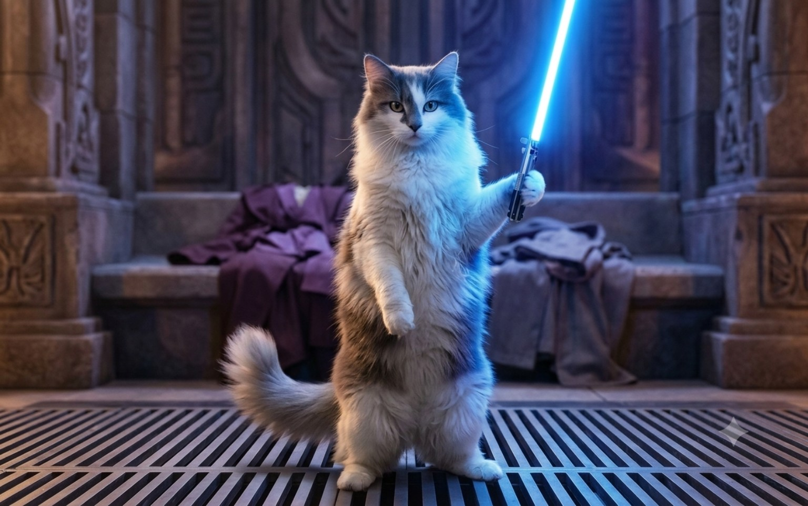</a><figcaption style="font-size:12px;margin-top:5px">Лучик — identity</figcaption></figure>
<figure style="margin:0"><a href="references/vitalik.webp" target="_blank" rel="noopener">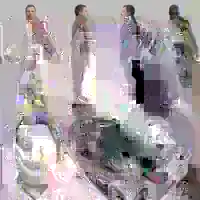</a><figcaption style="font-size:12px;margin-top:5px">BLACK / Виталик — identity</figcaption></figure>
<figure style="margin:0"><a href="references/lesha.webp" target="_blank" rel="noopener">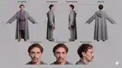</a><figcaption style="font-size:12px;margin-top:5px">PURPLE / Лёша — identity</figcaption></figure>
</div>

**Exact scene-specific source:** location/composition/first-last inputs remain authoritative in the scene mapping; when their exact Topview/Drive binary is not yet in GitHub, publish it from the recovered Scene pack rather than asking the owner to upload it again.

**Что происходит:** BLACK спокойно сидит слева и курит кальян. PURPLE сидит справа; **Лучик** всё время естественно лежит поперёк его колен, не садится вертикально. После длинной серьёзной паузы камера одним непрерывным медленным движением приближается к коту и ДО начала реплики приходит в настоящий крупный план его морды. BLACK и PURPLE к этому моменту уходят из читаемой речевой зоны кадра и всё время держат рты полностью закрытыми. Весь текст кот произносит целиком в крупном плане с отчётливым естественным липсинком: «Полностью с вами согласен, коллеги. Так и поступим». Голос серьёзный, спокойный и уверенный — без комедийной интонации. После реплики камера очень мягко освобождает место для реакции: BLACK переводит взгляд именно на кота, PURPLE слегка кивает именно коту, гладит его, кот снова опускает голову.

```text
Mode: reference-to-video | Duration: 30s | Resolution: 1080p | Aspect ratio: 16:9 | FPS: 24 | Native audio: on
Optimized for Wan 3 | Photoreal live-action deadpan comedy | One continuous restrained camera move

REFERENCES:
@image1 — PRIMARY COMPOSITION / ENVIRONMENT reference: two seated Jedi in large armchairs inside the futuristic high-rise council lounge, panoramic golden city skyline, hookahs, furniture placement, camera axis, warm sunset light and the cat resting on the right character's lap.
@image2 — PRIMARY LUCHIK / ЛУЧИК IDENTITY reference: exact recurring fluffy white-and-grey long-haired cat. Preserve his exact face shape, white muzzle/chest/legs, grey crown/facial and back markings, ears, natural eye appearance, long fur, coat pattern and feline anatomy. The blue lightsaber, upright pose and temple background visible in the model sheet are IDENTITY-REFERENCE ARTIFACTS ONLY for this scene: do NOT import the saber, standing pose or temple environment into the Jedi Council shot.
@image4 — PRIMARY BLACK identity reference: heavyset man, short brown hair, black tunic with dark leather vest panels, dark forearm protection, brown trousers and boots. He remains seated on the LEFT.
@image5 — PRIMARY PURPLE identity reference: leaner mustached man with brown hair, purple inner tunic under a long grey hooded outer robe, brown belt and tan boots. He remains seated on the RIGHT with the cat across his lap.

REFERENCE PRIORITY / IDENTITY LOCK:
@image4 and @image5 are absolute identity authorities for BLACK and PURPLE. @image2 is absolute identity authority for LUCHIK / ЛУЧИК. @image1 controls composition, environment, furniture, hookahs, lighting and starting geography only. Never average human faces with incidental faces in @image1. Preserve every character's face, body proportions, costume, left-right position and the cat's coat pattern throughout.

LUCHIK BODY LOCK:
The cat remains a normal realistic domestic cat for the entire shot. It lies naturally HORIZONTALLY ACROSS PURPLE'S LAP. It does NOT sit upright, stand on hind legs, become humanoid, grow human lips, gesture with paws or change body proportions. During the speaking beat only the cat's HEAD and NECK rise slightly. After the line it naturally lowers its head again.

ABSOLUTE SPEAKER OWNERSHIP — CRITICAL:
ONLY LUCHIK / ЛУЧИК SPEAKS.
BLACK and PURPLE NEVER speak, whisper, mutter, mouth words, imitate speech or lip-sync at any point.
During the entire cat line BOTH HUMAN MOUTHS remain fully CLOSED, still and visibly non-speaking.
The Russian voice originates physically from LUCHIK and ONLY LUCHIK'S muzzle/jaw makes small synchronized speech movements.
No ventriloquism. No off-screen human speaker. No voice transfer. No speech animation on BLACK. No speech animation on PURPLE.
If the frame contains a human mouth during the line, it must remain clearly closed and motionless.

START STATE:
Match @image1. BLACK is relaxed on the left with the hookah. PURPLE is relaxed on the right with the cat lying across his lap. The meeting has already reached a calm conclusion. No one is surprised by the cat's presence.

TIMELINE / PERFORMANCE:
[0:00–0:07] — SERIOUS SILENCE
Stable medium-wide composition matching @image1. BLACK slowly inhales from the hookah. PURPLE gently strokes the cat once along its back. The cat lies comfortably, breathes naturally and blinks. Nobody speaks.

[0:07–0:13] — DEADPAN BUILD
BLACK exhales a thin realistic smoke cloud. PURPLE keeps a neutral, serious council expression. The cat becomes attentive: ears adjust slightly and eyes focus forward. It stays lying down. Human mouths remain closed.

[0:13–0:17] — CAMERA PUSHES INTO A TRUE CAT CLOSE-UP
Without cutting, the camera begins a slow, physically continuous push directly toward the cat's face. By the END of this beat, BEFORE any word is spoken, arrive at a TRUE CLOSE-UP of the cat's face/muzzle: eyes, nose and mouth clearly readable, with the cat unmistakably owning the frame. BLACK and PURPLE must be pushed out of the readable speaking area; ideally their faces are outside frame, and if any part of a human face remains visible, the mouth is fully closed and motionless. The cat lifts ONLY its head and neck. No body straightening, no anthropomorphic posture.

[0:17–0:23] — CAT LINE IN CLOSE-UP
HOLD THE TRUE CLOSE-UP for the ENTIRE spoken line. Do not cut away, widen, pan to a human or reduce the cat to a secondary subject while it speaks.
The cat looks forward and says in natural Russian:
LUCHIK: «Полностью с вами согласен, коллеги. Так и поступим».
VOICE / DELIVERY: serious, calm, controlled and confident; mature and authoritative, with no jokey, cute, excited or theatrical intonation. The humor comes only from the absurd fact that a realistic cat is speaking and everyone accepts it as normal.
LIP SYNC: clear, readable and accurately synchronized to every Russian syllable, using restrained natural feline muzzle/jaw motion. The mouth movement must be visible in the close-up without turning into human lips.
BLACK and PURPLE remain absolutely silent with closed mouths for the complete line.

[0:23–0:27] — REACTION TO THE CAT
After the cat finishes, hold the close-up for a short silent beat, then let the camera ease back/reframe only as much as needed to reveal the human reactions. BLACK shifts his eyes first and then turns his head slightly TOWARD THE CAT — not toward PURPLE. PURPLE looks DOWN/TOWARD THE CAT and gives one tiny approving nod. No human-to-human conversational look exchange.

[0:27–0:30] — RETURN TO NORMAL
PURPLE resumes gently stroking the cat. The cat blinks and lowers its head back onto PURPLE's lap. BLACK calmly returns to the hookah. End on the same absurdly serious atmosphere.

CAMERA / SPACE:
One continuous unbroken take. The defining camera move is a slow physical PUSH-IN from the established two-shot to a TRUE CLOSE-UP of the cat's face BEFORE the cat begins speaking. HOLD that close-up for the full line so the cat's lip sync is impossible to misread. Only after the final word may the camera ease slightly back/reframe for BLACK and PURPLE's reaction. No reaction cuts during the line. Preserve the established 180-degree axis, chair positions, hookahs, panoramic window and skyline. Camera motion is physically stable with controlled inertia. No digital zoom look, handheld jitter, whip pan, zoom jump or geometry reset.

LIGHTING / MATERIAL REALISM:
Warm sunset backlight through the panoramic windows, realistic skin and fur texture, soft practical interior fill, subtle haze catching the hookah smoke, physically plausible reflections and fabric response. Preserve @image1 color balance. No plastic skin, no glossy fake fur, no fantasy glow on the cat.

AUDIO:
Clear natural Russian LUCHIK dialogue only. LUCHIK VOICE: serious, calm, mature, controlled and confident; no comic delivery, no cute voice, no excitement, no exaggerated bass or villain effect. BLACK and PURPLE produce no spoken sound. Quiet room tone, faint futuristic city ambience, subtle hookah bubbling/inhalation and cloth/fur movement. No subtitles, no narrator, no non-diegetic music. The cat voice must remain spatially centered on the cat's on-screen close-up position.

NEGATIVE PROMPT:
wrong speaker, PURPLE speaking, BLACK speaking, human lip-sync, human mouth movement during cat line, ventriloquism, off-screen speaker, transferred voice, cat voice from human, silent cat mouth during dialogue, exaggerated human lips on cat, cat sitting upright, cat standing, anthropomorphic cat body, cat gesturing with paws, cat anatomy changing, cat leaving PURPLE's lap, human-to-human conversational glance after the line, shocked reaction, slapstick acting, identity drift, face averaging, face swap, costume drift, changed seating, duplicated people, duplicated cat, warped furniture, broken eyelines, random cut, hard cut, camera jitter, micro-shake, subtitles, captions, text, logo, watermark, cartoon, anime, game-render look, black bars, side bars.

FRAME FILL / NO BARS:
Fill the entire generated frame edge-to-edge. No letterboxing, no pillarboxing, no black bars, no side bars, no decorative borders, no empty margins.
```

<a id="scene-16"></a>

## Сцена 16 — Татуин: гигантский пустынный червь и бой на руинах

<!-- scene-meta: {"target_engine":"Seedance 2.5","production_state":"READY","duration_s":30,"dialogue":{"enabled":false,"language":null},"tags":["action","continuous_take"]} -->

**Контекст использования:** Новый активный промт на основе бывшей W6; рабочий пункт W6 получил конкретные референсы и теперь оформлен как активная сцена 16. 30-секундная большая пустынная сцена для Seedance 2.5: двое татуинных джедаев и Канцлер сталкиваются на руинах, а из-под земли вырывается колоссальный песчаный червь. Сцена должна работать как самостоятельный мощный экшен-блок, из которого потом при желании можно отдельно собрать и более короткий фрагмент.

**Референсы:** @Video1 = пустынная локация, руины, общий масштаб и композиционный дух сцены · @Image1 = Hooded Jedi · @Image2 = Bearded Jedi · @Image3 = Chancellor

**Используемые identity-референсы на сайте:**
<div class="scene-ref-gallery" style="display:grid;grid-template-columns:repeat(auto-fit,minmax(145px,1fr));gap:10px;margin:10px 0 16px">
<figure style="margin:0"><a href="references/ilyusha.webp" target="_blank" rel="noopener"></a><figcaption style="font-size:12px;margin-top:5px">Hooded Jedi / Илюша</figcaption></figure>
<figure style="margin:0"><a href="references/artem.webp" target="_blank" rel="noopener"></a><figcaption style="font-size:12px;margin-top:5px">Bearded Jedi / Артём</figcaption></figure>
<figure style="margin:0"><a href="references/serega.webp" target="_blank" rel="noopener">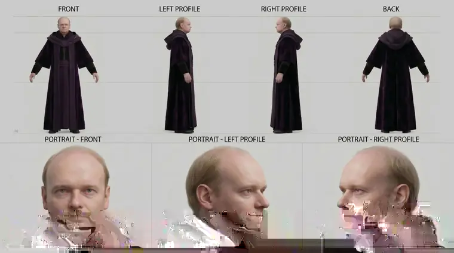</a><figcaption style="font-size:12px;margin-top:5px">Серёга / Chancellor</figcaption></figure>
</div>

**Exact scene-specific source:** location/composition/first-last inputs remain authoritative in the scene mapping; when their exact Topview/Drive binary is not yet in GitHub, publish it from the recovered Scene pack rather than asking the owner to upload it again.

**Что происходит:** На пустынных руинах двое джедаев и Канцлер находятся в напряжённом противостоянии. Внезапно земля начинает дрожать, и из песка вырывается колоссальный пустынный червь масштаба «гигантское стихийное бедствие». Он рушит окружающие конструкции, вздымает песчаные волны, делает несколько агрессивных заходов и кружит вокруг героев. На протяжении всей сцены герои остаются в кадре на фоне катастрофы, продолжают сражаться и вынуждены постоянно уклоняться от атак чудовища и обрушений.

```text
Mode: reference-to-video | Duration: 30s | Resolution: 1080p | Aspect ratio: 16:9 | FPS: 24 | Native audio: on

REFERENCES:
@Video1 — PRIMARY environment and staging reference: a desert ruins location with open sandy space, broken structures, weathered stone or metal debris, and a composition suitable for a large-scale action scene. Use it for the location feel, scale, terrain, ruin placement, and general camera mood.
@Image1 — PRIMARY identity reference for the Hooded Jedi: mustached man, tousled brown hair, weathered face, light-green layered tunic, deep-red hooded cloak, brown boots, lightsaber hilt on belt. Preserve face, costume, proportions and overall identity exactly.
@Image2 — PRIMARY identity reference for the Bearded Jedi: heavier build, short beard, cream tunic under a brown Jedi over-robe, wide brown belt, brown boots, lightsaber hilt on belt. Preserve face, build, costume and identity exactly.
@Image3 — PRIMARY identity reference for the Chancellor: pale man with thinning hair / bald crown and deep purple robes. Preserve face, body type, robe silhouette and identity exactly.

REFERENCE PRIORITY:
Use @Image1, @Image2 and @Image3 as the absolute identity lock for the three characters. Use @Video1 for the desert ruins environment, spatial layout and action scale. Do not let the environment reference overwrite the character identities.

SCENE OVERVIEW:
A photorealistic cinematic desert action scene on ruined Tatooine-like wasteland terrain. The Hooded Jedi and the Bearded Jedi are confronting the Chancellor among weathered ruins when a colossal subterranean sandworm erupts from beneath the ground and turns the entire location into chaos. The worm is gigantic on the scale of a natural disaster — towering, segmented, immense, powerful, with a massive circular maw and rows of terrifying teeth. It is not a small monster; it feels like an unstoppable force of nature. Throughout the scene, the three characters stay grounded in the same battle space and must keep fighting and dodging while the worm attacks the environment around them.

ACTION TIMELINE — SINGLE CONTINUOUS 30-SECOND TAKE:
[0:00–0:05]
Begin with a tense standoff on the ruined desert location. The Hooded Jedi and the Bearded Jedi face the Chancellor at medium distance. Wind moves robes and loose sand. The camera glides laterally through the ruins, keeping all three readable in the same frame. Small grains of sand begin to tremble across the ground and a low subterranean rumble builds beneath the dialogue-free tension.

[0:05–0:09]
The rumble intensifies violently. Sand ripples outward in fast concentric waves. Broken beams, rocks and debris start to shake loose. All three characters instinctively shift their stance and glance toward the source of the vibration. Then the ground splits open behind and slightly to the side of them. A colossal sandworm bursts out of the earth in an explosive eruption of sand and debris, instantly dominating the background.

[0:09–0:14]
The worm rises to full terrifying scale, rearing high above the ruins with its gigantic circular mouth open. Sand cascades off its ridged body. The shockwave throws dust through the air and knocks loose pieces of the surrounding structures. The heroes break their positions and sprint in different directions to avoid the collapse and the worm's initial surge. The camera keeps moving fluidly, holding spatial continuity so the audience clearly understands where each person is relative to the worm.

[0:14–0:20]
The Hooded Jedi and the Bearded Jedi attempt to regroup while the Chancellor uses the chaos to press his advantage. The three continue their live-action fight in short fast exchanges — evasive footwork, quick defensive movements, robe motion, physical urgency — but the worm remains the dominant threat in the background. It sweeps across the ruins, slamming its body through structures and sending dust clouds and fragments outward. Everyone is forced to interrupt combat and dodge a second aggressive pass from the worm.

[0:20–0:25]
The worm circles partially beneath the sand and surges up again from a new angle, its massive head and upper body carving through the location. One ruin wall collapses, sending debris and sand down around the fighters. The Bearded Jedi dives clear. The Hooded Jedi uses a fast sidestep and roll. The Chancellor pivots away with dangerous precision, barely avoiding the jaws. Keep the worm huge in frame and unmistakably larger than every surrounding structure.

[0:25–0:30]
Final escalation. The worm rears behind the three combatants while they continue the standoff in the foreground, battered by wind and sand. The scene ends on a powerful wide action composition: the two Jedi and the Chancellor still alive and in motion on the ruined desert ground, the colossal sandworm towering behind them amid collapsing debris and swirling dust, with the conflict still unresolved and continuing beyond the cut.

CAMERA:
Single continuous unbroken shot for the full 30 seconds. High-end cinematic motion with controlled inertia and stable spatial continuity. The camera may drift, arc and reframe to preserve all three characters and the worm, but there are no cuts, jump cuts or teleporting viewpoints. Emphasize scale through parallax, dust layers, foreground debris and wide-to-medium re-framing within the same take. No random micro-shake; only motivated impact vibration during the biggest eruptions.

MOVEMENT / STAGING RULES:
The worm's motion must feel massive and heavy, displacing huge volumes of sand. Its attacks are broad environmental threats: eruptions, surges, rears, sweeping passes, partial dives and re-emergence. The three characters must remain readable, keep their identities locked, and react believably to the danger. They are not standing still while the worm performs in the background: they are actively dodging, repositioning and trying to continue their conflict in the middle of the chaos.

STYLE / LIGHTING:
Photorealistic cinematic sci-fi/fantasy. Harsh warm desert light, dry haze, blown sand, long ruin shadows, strong scale cues, natural motion blur, realistic cloth and dust interaction. Serious blockbuster tone. No comedy.

AUDIO (native):
Powerful subterranean rumble, violent sand eruption, debris crashes, heavy impacts, rushing sand, distant wind, robe movement, footsteps on sand and stone, and huge monstrous roar / throat resonance from the worm. Optional brief exertion grunts from the characters, but no dialogue and no music.

NEGATIVE PROMPT:
small worm, tiny creature, comedic monster, cartoon, anime, stylized rendering, game-render look, floating worm, worm flying in the air without sand displacement, characters ignoring the worm, static posing, identity drift, face swap, extra characters, costume changes, missing robe colors, duplicate Chancellor, duplicate Jedi, warping ruins, popping geometry, sudden scene reset, teleporting camera, hard cuts, subtitles, on-screen text, logo, watermark.

FRAME FILL / NO BARS: Fill the entire generated frame edge-to-edge. No letterboxing, no pillarboxing, no black bars, no side bars, no decorative borders, no empty margins.
```

---

<a id="scene-17"></a>

## Сцена 17 — Пещера: передышка после монстра и разговор о карте

<!-- scene-meta: {"target_engine":"Wan 3","production_state":"READY","duration_s":30,"dialogue":{"enabled":true,"language":"ru"},"tags":["dialogue","continuous_take","continuity","deadpan_comedy","map"]} -->

**Контекст использования:** Прямое продолжение уже существующего боя в пещере. Главная комедийная конструкция сцены — трое совершенно серьёзно и буднично разговаривают после тяжёлого боя, при этом всё это время сидят на трёх крупных отрубленных частях тела только что побеждённого монстра. Персонажи не считают ситуацию смешной и никак специально её не комментируют: юмор возникает только из абсурдного визуального контраста. Серёга вспоминает старые времена, спрашивает о карте; Паша сначала не понимает, зачем она ему, затем Серёга тихо говорит Паше что-то на ухо, после чего Паша без колебаний отдаёт карту Серёге. Содержание шёпота не раскрывается.

**Референсы:** @Image1 = Паша / Jedi 1, тёмно-синий туник · @Image2 = Саша / Jedi 2, борода и очки · @Image3 = Серёга / Канцлер, глубокая тёмно-фиолетовая мантия · @Image4 = фото локации пещеры, точный environment reference · @Image5 = фото карты, точный prop reference · @Video1 = пещера, чудовище и прямое визуальное продолжение предыдущего боя · @Video2 = дополнительные ракурсы монстра/пещеры при необходимости continuity

**Используемые identity-референсы на сайте:**
<div class="scene-ref-gallery" style="display:grid;grid-template-columns:repeat(auto-fit,minmax(145px,1fr));gap:10px;margin:10px 0 16px">
<figure style="margin:0"><a href="references/pasha.webp" target="_blank" rel="noopener"></a><figcaption style="font-size:12px;margin-top:5px">Паша — identity</figcaption></figure>
<figure style="margin:0"><a href="references/sasha.webp" target="_blank" rel="noopener">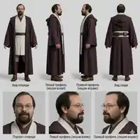</a><figcaption style="font-size:12px;margin-top:5px">Саша — identity</figcaption></figure>
<figure style="margin:0"><a href="references/serega.webp" target="_blank" rel="noopener"></a><figcaption style="font-size:12px;margin-top:5px">Серёга — identity</figcaption></figure>
</div>

**Exact scene-specific source:** location/composition/first-last inputs remain authoritative in the scene mapping; when their exact Topview/Drive binary is not yet in GitHub, publish it from the recovered Scene pack rather than asking the owner to upload it again.

**Что происходит:** Бой окончен. В тёмной влажной пещере трое измотанных героев сидят каждый на отдельной массивной отрубленной части тела чудовища с прижжёнными срезами без крови и органов. Несколько секунд они молча приходят в себя. Серёга с усталой ностальгией говорит: «Как в старые добрые времена. Куда вы дели карту?» Паша отвечает: «Да зачем она вообще тебе?» Серёга наклоняется и тихо шепчет Паше что-то на ухо — слов зритель не слышит. Паша сразу, совершенно без раздумий и без дальнейших вопросов, достаёт карту и отдаёт её Серёге. Саша наблюдает за этим с усталой сдержанной реакцией. Все продолжают сидеть на частях монстра, будто это самое обычное место для разговора.

```text
Mode: reference-to-video | Duration: 30s | Resolution: 1080p | Aspect ratio: 16:9 | FPS: 24 | Native audio: on

REFERENCES:
@Image1 — PRIMARY exact identity reference for PASHA / Jedi 1: clean-shaven man in a dark navy-blue Jedi tunic, wet and battle-worn from the previous cavern fight. Preserve his exact face, age, hairstyle, costume, body proportions and identity.
@Image2 — PRIMARY exact identity reference for SASHA / Jedi 2: bearded man with glasses in a brown-and-cream Jedi robe, wet and battle-worn from the previous cavern fight. Preserve his exact face, beard, glasses, hairstyle, costume, body proportions and identity.
@Image3 — PRIMARY exact identity reference for SEREGA / the Chancellor: pale man in a long deep dark-purple robe, exhausted after combat. Preserve his exact face, hairstyle, robe silhouette, proportions and identity.
@Image4 — PRIMARY LOCATION reference: exact cavern location photo. Preserve its rock formations, wet surfaces, water layout, spatial proportions, lighting direction and recognizable environment design. Do not copy incidental people or unrelated props from this image.
@Image5 — PRIMARY MAP PROP reference: exact map used in the story. Preserve its shape, material, markings, proportions, folds/edges and overall appearance throughout the handoff.
@Video1 — PRIMARY continuity reference for the cavern environment, defeated monster remains and immediate post-battle geography. Match the wet rocks, shallow splashing water, waterfall ambience, mist, lighting, scale and the pale reptilian creature.
@Video2 — supplemental continuity reference for alternate angles of the same monster and cavern only.

REFERENCE PRIORITY / IDENTITY LOCK:
@Image1, @Image2 and @Image3 are the absolute identity and costume authority for Pasha, Sasha and Serega. @Image4 is the exact location/environment authority. @Image5 is the exact map-prop authority. @Video1 and @Video2 provide motion, monster anatomy and immediate post-battle continuity. Environment references must never override or average the three character identities, and the map must not be redesigned from the video references. Keep all three men visually distinct and stable for the entire take.

COMEDY / TONE LOCK:
The comedy is entirely deadpan and situational. The central visual joke is that three exhausted men conduct a serious, almost ordinary conversation while each of them is sitting on a different severed body section of the monster they have just defeated. They do NOT laugh, grin, wink at the camera, make jokes about the body parts, act goofy, or acknowledge how absurd the seating is. Play the dialogue sincerely and naturally. The stranger and more matter-of-fact their behavior feels against the bizarre seating arrangement, the better the comedy works.

START STATE:
The battle has just ended. The same cavern, monster, wet clothing, lighting and physical aftermath continue directly from the preceding footage. Three large separated sections of the defeated creature are already lying naturally in the cavern. Their cut surfaces are fully cauterized and darkened, with faint steam but no liquid blood, exposed organs or graphic gore. Pasha, Sasha and Serega are exhausted and remain close together in one readable conversational area.

SCENE OVERVIEW:
Direct continuation after the monster battle in a dark subterranean cavern. Pasha, Sasha and Serega settle onto three separate large severed sections of the defeated pale reptilian creature as improvised seats. They stay seated there through the conversation. Serega nostalgically remarks that it feels like old times, asks where the map is, and Pasha questions why he needs it. Serega then leans close and whispers something privately into Pasha's ear. The whisper content is deliberately inaudible and never revealed. Immediately afterward Pasha gives Serega the map without hesitation, argument or explanation. Sasha witnesses the strange exchange with restrained exhausted curiosity.

ACTION TIMELINE — SINGLE CONTINUOUS 30-SECOND TAKE:
[0:00–0:05]
Open in the immediate aftermath of the fight. A slow controlled camera glide reveals the wet cavern, drifting mist, shallow water, steam and the defeated monster's massive separated body sections. Reveal Pasha, Sasha and Serega already lowering themselves onto or settling on three different monster sections. Make the bizarre improvised seating visually unmistakable without framing it as a gag. They are simply exhausted and need somewhere to sit.

[0:05–0:10]
Hold a quiet recovery beat. All three remain seated on the monster pieces, breathing heavily. Pasha leans forward slightly from fatigue. Sasha adjusts his posture and glasses. Serega looks from one old companion to the other. Nobody comments on what they are sitting on. Their complete seriousness is essential.

[0:10–0:16]
Serega looks at Pasha and Sasha with a faint trace of tired nostalgia, not a smile, and says clearly in natural Russian:
SEREGA: «Как в старые добрые времена. Куда вы дели карту?»
He delivers both sentences as one natural thought: first a weary recollection, then a direct practical question. Pasha and Sasha look toward him.

[0:16–0:20]
Pasha answers Serega directly, guarded and genuinely puzzled, in natural Russian:
PASHA: «Да зачем она вообще тебе?»
No one else speaks over him. Accurate Russian lip sync. Sasha remains silent and watches.

[0:20–0:24]
Serega calmly leans sideways toward Pasha without standing up and whispers something very quietly into Pasha's ear. The actual words must NOT be intelligible to the audience: only a soft indistinct whisper/murmur is heard. Do not invent audible dialogue, subtitles or captions. Sasha notices the whisper and watches them with restrained curiosity.

[0:24–0:28]
The instant Serega finishes whispering, Pasha reacts with a tiny matter-of-fact acknowledgement and, without hesitation, without asking another question and without looking conflicted, takes out the map and hands it directly to Serega. The handoff must be clear and physically readable: one map, Pasha releases it, Serega receives it securely. No Force pull, no magical levitation, no struggle.

[0:28–0:30]
Serega looks down at the map in his hand with quiet satisfaction while remaining seated on the monster section. Pasha settles back as if the matter is completely resolved. Sasha gives them a brief tired, slightly puzzled look but says nothing. End with all three still seated on the grotesquely inappropriate monster-body seats, preserving the deadpan visual joke and setting up the next story beat.

CAMERA / CONTINUITY:
One physically stable continuous take. Begin with a gentle low-to-medium establishing glide that clearly reveals all three separate monster-body seats and the cavern geography, then settle into a readable three-shot. During dialogue use only a subtle controlled push-in and small lateral adjustment so the speaker and listener remain readable without cuts. For the whisper, allow a modest natural move closer to Serega and Pasha while Sasha remains visible or spatially understandable. For the map handoff, frame both hands clearly without turning the scene into an insert shot. No cuts, jump cuts, teleporting camera, random orbiting or micro-shake. Maintain coherent left/right screen positions and the same cavern axis throughout.

PERFORMANCE:
All three are genuinely exhausted after a brutal fight: heavy breathing, sore posture, damp clothes, restrained movements and small natural facial reactions. Play everything straight. Serega is calm, tired, slightly nostalgic and purposeful. Pasha is initially suspicious/puzzled, then after the whisper changes instantly to uncomplicated cooperation and hands over the map as though the whispered explanation completely settles the issue. Sasha remains a silent observer with a restrained "what was that?" reaction, never broad or cartoonish. No theatrical comedy acting.

DIALOGUE / LIP SYNC:
Spoken language: Russian, natural native pronunciation, no foreign accent.
Only these two public lines are audible:
SEREGA: «Как в старые добрые времена. Куда вы дели карту?»
PASHA: «Да зачем она вообще тебе?»
Then Serega whispers privately into Pasha's ear. The whisper must remain unintelligible; do not generate additional understandable words. Accurate lip sync for the two audible lines. No subtitles, captions or on-screen text.

MAP PROP / HANDOFF:
Use the exact physical map from @Image5. Preserve its recognizable design, proportions, material and markings; do not redesign, simplify or substitute it. It must not appear from nowhere: Pasha retrieves it naturally from his clothing, belt pouch or an already plausible carried place. Keep the same prop shape throughout the handoff. Pasha physically gives it to Serega. Serega ends the scene holding the map. No duplicate map, no disappearing prop, no morphing object.

ENVIRONMENT / MATERIAL REALISM:
Dark wet cavern, slick rock, shallow water, runoff or distant waterfall, lingering mist and subtle steam from cauterized monster wounds. Soft reflected light on wet stone and damp fabric. The defeated creature remains must clearly belong to the same massive pale reptilian monster from the previous fight. Body sections have sealed, charred/cauterized cut surfaces only — no liquid red blood, no exposed organs, no graphic gore. Preserve believable weight: the monster sections compress or support the seated characters naturally and do not wobble like rubber.

AUDIO (native):
Natural cavern ambience, dripping and splashing water, distant waterfall, faint steam hiss, tired breathing and subtle robe movement. The two Russian lines are clear and foregrounded. During the private whisper, lower the voice to an indistinct close murmur that the audience cannot decipher. No music. No comedic sting or sound effect when Pasha hands over the map.

NEGATIVE PROMPT:
wrong speaker, Sasha speaking either dialogue line, Pasha saying Serega's line, Serega saying Pasha's line, intelligible whispered words, invented extra dialogue, subtitles, captions, on-screen text, characters laughing or smiling at the situation, slapstick acting, exaggerated comedy faces, characters commenting on the monster seats, anyone standing up during the core conversation, ordinary chairs or rocks replacing the monster-body seats, characters sitting on the same body section, living monster, new monster attack, red liquid blood, blood spray, exposed organs, graphic gore, duplicate characters, missing character, identity drift, face swapping, missing Sasha's glasses, costume changes, map appearing from nowhere, duplicate map, map levitation, Force pull, refusal or hesitation after the whisper, broken hand interaction, extra fingers, warped anatomy, dry cave, bright daylight, random camera shake, micro-jitter, hard cuts, jump cuts, cartoon look, glossy video-game render, logo, watermark.

END STATE:
Serega is seated and clearly holds the map. Pasha has willingly surrendered it and remains seated. Sasha remains seated and silently observes. All three are still resting on separate severed monster sections in the same cavern, ready for a clean continuation into the next story beat.

FRAME FILL / NO BARS:
Fill the entire generated frame edge-to-edge. No letterboxing, no pillarboxing, no black bars, no side bars, no decorative borders, no empty margins.
```

---

<a id="scene-19"></a>

## Сцена 19 — Рыбалка и Маша-Лагуна

<!-- scene-meta: {"target_engine":"Wan 3.0","production_state":"READY","duration_s":30,"dialogue":{"enabled":true,"language":"ru"},"tags":["dialogue","fantasy_comedy","mission_return","continuous_take"]} -->

**Контекст использования:** Новая активная 30-секундная диалоговая сцена для Wan 3.0. Сцена основана на рукописной идее Саши и затем была отдельно утверждена пользователем: Саша и Паша рыбачат у озера, из воды появляется Маша в форме Лава-Лагуны, происходит короткий эмоциональный конфликт, после чего сюжет резко возвращается к миссии и выходит в бегущий финал. Это отдельная активная сцена; текущая Topview-задача технически завершена. Technical success не означает editorial approval; новый запуск — только по отдельному решению пользователя.

**Референсы:** @Image1 = стартовый кадр / композиция рыбалки · @Image2 = финальный кадр / композиция бега · @Image3 = Маша в форме «Лава-Лагуны» · @Image4 = Sasha model sheet · @Image5 = Pasha model sheet

**Используемые identity-референсы на сайте:**
<div class="scene-ref-gallery" style="display:grid;grid-template-columns:repeat(auto-fit,minmax(145px,1fr));gap:10px;margin:10px 0 16px">
<figure style="margin:0"><a href="references/masha-laguna.webp" target="_blank" rel="noopener">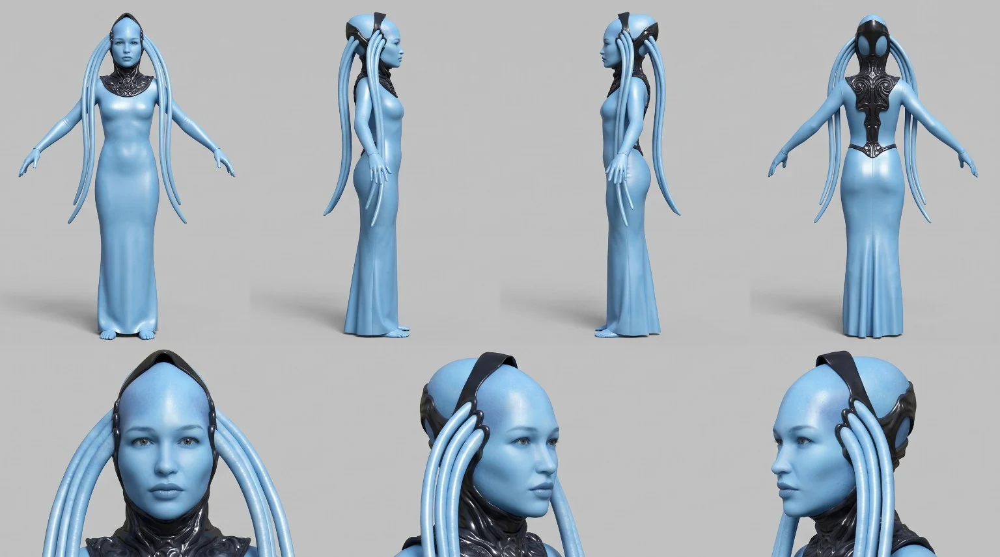</a><figcaption style="font-size:12px;margin-top:5px">Маша-Лагуна — identity</figcaption></figure>
<figure style="margin:0"><a href="references/sasha.webp" target="_blank" rel="noopener"></a><figcaption style="font-size:12px;margin-top:5px">Саша — identity</figcaption></figure>
<figure style="margin:0"><a href="references/pasha.webp" target="_blank" rel="noopener"></a><figcaption style="font-size:12px;margin-top:5px">Паша — identity</figcaption></figure>
</div>

**Exact scene-specific source:** location/composition/first-last inputs remain authoritative in the scene mapping; when their exact Topview/Drive binary is not yet in GitHub, publish it from the recovered Scene pack rather than asking the owner to upload it again.

**Что происходит:** Саша и Паша спокойно рыбачат у озера. На воде появляется странная рябь, из воды поднимается Маша в образе Лава-Лагуны, быстро подходит к Саше лицом к лицу. Саша успевает удивлённо сказать «Маша?..», после чего получает пощёчину. Маша эмоционально упрекает его: «Опять ты пропадаешь на рыбалке! Когда наконец сможешь уделять внимание мне, а не своим увлечениям?» Паша молчит, но ярко реагирует мимикой. Саша резко вспоминает про поручение — «Ой, у нас же важное поручение!» — и вместе с Пашей срывается с места. Сцена заканчивается переходом в бег и приходит к композиции @Image2.

```text
Mode: reference-to-video | Duration: 30s | Resolution: 1080p | Aspect ratio: 16:9 | FPS: 24 | Native audio: on

References:
@Image1 — starting shot / fishing composition reference: Sasha and Pasha sitting by the lake and fishing. Use this image for the opening composition, lakeside environment, relaxed fishing setup, and the overall mood of the first beat.
@Image2 — ending shot / running composition reference: Sasha and Pasha running away. Use this image only for the final running composition, motion direction, and ending energy.
@Image3 — design reference for Masha in the “Lava-Laguna” form. Preserve her blue aquatic fantasy appearance, facial features, silhouette, and overall design identity.
@Image4 — PRIMARY exact identity reference for Sasha. Preserve his exact face, proportions, costume, and identity throughout the whole scene.
@Image5 — PRIMARY exact identity reference for Pasha. Preserve his exact face, proportions, costume, and identity throughout the whole scene.

IMPORTANT REFERENCE RULE:
Use @Image4 and @Image5 as the PRIMARY identity references for Sasha and Pasha.
Use @Image1 only for the starting composition, fishing environment, and staging.
Use @Image2 only for the final running composition.
Use @Image3 only for Masha’s appearance, silhouette, face design, and color palette in her Lava-Laguna form.
Do not average or replace Sasha and Pasha’s identities using the fishing or running stills.

Scene:
Create a 30-second live-action fantasy-comedy scene with clear Russian dialogue, expressive facial acting, coherent geography, stable identity, and natural physical movement. The tone starts calm and slightly comedic, becomes surprising and emotional when Masha appears, and then sharply returns to mission urgency. No horror tone. No subtitles. No on-screen text.

Story flow:
Start with Sasha and Pasha sitting by the lake in the spirit of @Image1, quietly fishing in a relaxed way. The environment is bright daytime by a peaceful lake with a large fantasy city or palace-like architecture in the background, matching the atmosphere of @Image1. Fishing rods, bottles, and small fishing details may remain present if visually consistent with @Image1.

At around 0:05, strange circular ripples begin forming on the water surface. Both men notice the disturbance. The camera should clearly show that something unusual is happening in the lake.

At around 0:07–0:09, Masha in her Lava-Laguna form rises out of the water. Her emergence should feel magical, surprising, and dramatic, but not monstrous or horror-like. She is wet, elegant, otherworldly, and visually faithful to @Image3. She quickly moves toward Sasha and stops face-to-face with him on the shore.

Sasha looks shocked and says in Russian:
«Маша?..»

Immediately after this line, Masha gives Sasha a clear slap across the face. The slap must be readable and emotionally charged, but not brutal or violent. It is an offended dramatic slap, not an assault scene. Sasha visibly reacts in surprise.

Right after the slap, Masha speaks emotionally in Russian, with clear lip sync and expressive facial acting:
«Опять ты пропадаешь на рыбалке! Когда наконец сможешь уделять внимание мне, а не своим увлечениям?»

While Masha is speaking, Pasha remains silent, but his reaction must be clearly visible. He reacts with expressive facial acting: surprise, awkwardness, discomfort, and confusion. Do not give Pasha any spoken lines.

After a short stunned beat, Sasha suddenly remembers the mission and says in Russian:
«Ой, у нас же важное поручение!»

Immediately after this line, Sasha and Pasha abruptly jump up and run away. Use a dynamic but clear transition into the running ending. The final part of the scene must visually arrive at the energy and composition of @Image2: Sasha and Pasha running fast near the lakeside with urgency, as if rushing back to the mission.

Camera:
Use cinematic live-action coverage with stable motion and clean continuity. You may use natural shot progression inside the same scene: a calm medium-wide opening for the fishing setup, a lake-focused view for the ripples, a dramatic medium shot for Masha emerging, a tighter face-to-face shot for «Маша?..» and the slap, a visible reaction shot of Pasha, and then a dynamic wider motion transition into the running ending. Do not make the scene feel like random montage. All transitions should feel motivated and coherent.

Performance:
Sasha should feel distracted, caught off guard, and then suddenly alarmed when he remembers the mission. Masha should feel emotionally upset, offended, and demanding attention, but still believable and expressive rather than hysterical. Pasha should remain silent and react with strong readable facial expressions. All facial animation and lip sync must be natural.

Dialogue rules:
All spoken dialogue must be in natural Russian. Use clear Russian pronunciation and believable emotional delivery. No subtitles.

Audio:
Use natural environment sound: light wind, water movement, fishing ambience. Add clear splash and water movement when Masha emerges. The slap should have a natural audible impact. Keep spoken dialogue clearly understandable. No background music, or only extremely subtle cinematic underscore if needed, but dialogue clarity is the priority.

Style:
Photoreal live-action fantasy-comedy. Natural skin, cloth, and water simulation. Good facial consistency throughout. Readable staging. No exaggerated cartoon motion.

Negative prompt:
bad Russian lip sync, incorrect dialogue speaker, subtitles, captions, text on screen, black bars, side bars, decorative borders, identity drift, face swapping, merged faces, duplicated people, extra characters, distorted hands, extra fingers, broken slap motion, stiff facial acting, horror monster look, random teleportation, confusing geography, unstable water, broken reflections, abrupt incoherent cuts, low-detail faces, watermark, logo.

FRAME FILL / NO BARS:
Fill the entire generated frame edge-to-edge. No letterboxing, no pillarboxing, no black bars, no side bars, no decorative borders, no empty margins.
```

---

<a id="scene-20"></a>

## Сцена 20 — Маша-Лагуна: рок-припев у озера

<!-- scene-meta: {"target_engine":"Seedance 2.5","production_state":"READY","duration_s":30,"dialogue":{"enabled":true,"language":"en"},"tags":["music_performance","vocal_performance","11_part_sequence","lakeshore","cinematic_music_video","musical"]} -->

**⏳ В МЕДЛЕННОЙ ГЕНЕРАЦИИ**

**Текущие задачи:** три active Wan 3.0 задачи относятся к существующим частям «Песня Маши 9–11» и занимают 3/6 Topview slots. «Песня Маши 9» — `117b9d976d2c4a54945256e79fc64639`, «Песня Маши 10» — `ef0a2cdb1c8841ac8d031a19fa07bd9e`, «Песня Маши 11» — `42e5cdb42c1a45df8a037a26eb3fa26b`. Это render attempts существующей Scene 20; не создавать новые Scene ID, не менять target_engine canonical prompt-ов и не считать success редакционным approval.

**Коррекция дизайна 05.10.2026:** присланный результат — «Песня Маши 3», task `2b87094928e14ca7827b911f2fbbd747`, фактический движок Wan 3.0, 30 с. Промт source-task сопоставлен с частью 3 с отличиями только в служебной записи image-токенов/пробелов; обложка результата соответствует присланному ролику. Визуальная проверка выявила добавленные соски/рельеф груди и пупок, которых нет на утверждённой model sheet. Это отклонение от дизайна, не новая утверждённая версия персонажа. Вероятная причина — неоднозначность описания голубой кожи и цельного облегающего силуэта; точный внутренний механизм генерации неизвестен. Во ВСЕ 11 текстов ниже добавлен автономный `COSTUME SURFACE LOCK`: непрозрачный гладкий закрытый торс из @Image2 без анатомических деталей, с сохранением существующего длинного силуэта. Это редакция ДЛЯ БУДУЩИХ запусков. Уже завершённая часть 3 и находившиеся на момент коррекции в очереди части 4–9 используют прежние отправленные тексты; редактирование master не исправляет их задним числом. Исходный submitted prompt остаётся в соответствующей Topview task и в истории master до этой правки. Task IDs, slow membership и технические статусы не изменены; автоматического rerender/approval нет. Проверить остальные получаемые части на тот же дефект перед монтажом; не объявлять их бракованными до просмотра.

**Контекст использования:** Полный музыкальный номер Маши-Лагуны разбит на **11 самостоятельных 30-секундных генераций Seedance 2.5**, которые затем собираются в единый клип / музыкальную сцену. Это не 11 новых Scene ID: весь номер остаётся **Scene 20**. @Image1 задаёт точный берег озера, @Image2 — точную identity Маши-Лагуны. Все части используют одинаковую внешность, одежду, причёску, локацию, погоду, световую логику и цветокоррекцию. Вокальный текст внутри prompts взят **только из текста, напрямую предоставленного пользователем**, и должен исполняться дословно с sung lip sync.

**Референсы:** @Image1 = LOCATION / берег озера / окружение · @Image2 = MASHA-LAGUNA / PRIMARY exact identity reference

**Используемые identity-референсы на сайте:**
<div class="scene-ref-gallery" style="display:grid;grid-template-columns:repeat(auto-fit,minmax(145px,1fr));gap:10px;margin:10px 0 16px">
<figure style="margin:0"><a href="references/masha-laguna.webp" target="_blank" rel="noopener"></a><figcaption style="font-size:12px;margin-top:5px">Маша-Лагуна — exact identity</figcaption></figure>
</div>

**Exact scene-specific source:** location/composition/first-last inputs remain authoritative in the scene mapping; when their exact Topview/Drive binary is not yet in GitHub, publish it from the recovered Scene pack rather than asking the owner to upload it again.

**Режиссёрская формула всей Scene 20:** основа всегда — берег озера; Маша почти всё время остаётся в кадре и является эмоциональным центром. Клип не должен быть статичным: по ходу номера она то стоит, то медленно идёт вдоль воды, то поворачивается к камере, то смотрит вдаль, то поёт прямо в объектив. Камера сознательно чередует **wide establishing shot, slow dolly-in, side tracking, gentle orbit / partial orbit, backward tracking, medium performance framing, expressive close-up и slow final pull-back**. Общая эстетика — **меланхоличный, драматичный и красивый cinematic music video, соединённый с эмоциональной ясностью мюзикла**. Никакой концертной сцены, танцоров, случайного клипового хаоса или одиннадцати одинаковых статичных кадров.

**Что происходит:** номер развивается как единая драматургическая дуга: тихое одиночное вступление → нарастающее внутреннее напряжение → первый припевный выброс → музыкальная передышка с движением вдоль воды → более тяжёлый второй куплет → финальное нарастание → главный эмоциональный пик → спокойный широкий аутро. Каждая часть — один устойчивый 30-секундный кинематографичный фрагмент; монтаж между частями формирует единый клип.

**Монтажная сетка / camera-blocking map:**

| Часть | Музыкальный диапазон | Драматургия | Маша / камера |
|---:|---:|---|---|
| 1 | 0:00–0:30 | вступление и начало первого куплета | стоит → slow dolly-in → medium |
| 2 | 0:30–1:00 | первый куплет — движение вдоль воды | медленно идёт вдоль воды → боковой tracking |
| 3 | 1:00–1:30 | первый куплет — война в голове | стоит / поворот плеч → gentle orbit |
| 4 | 1:30–2:00 | первый припев — первый эмоциональный выброс | шаг к камере → dolly-in → close-up |
| 5 | 2:00–2:30 | первый припев — кульминация и вопрос | пол-оборота к озеру и обратно → half-orbit |
| 6 | 2:30–3:00 | вокализ / инструментальная передышка | идёт вдоль воды → wide side tracking |
| 7 | 3:00–3:30 | второй куплет — новая волна | 1–2 шага к воде → diagonal dolly-in |
| 8 | 3:30–4:00 | второй куплет — историческая тема и нарастание | почти стоит → поворот к камере → near-frontal orbit |
| 9 | 4:00–4:30 | финальный подъём — война продолжается | идёт к камере по диагонали → backward tracking |
| 10 | 4:30–5:00 | финальный припев — вершина | почти стоит, максимум эмоции → close-up + partial orbit |
| 11 | 5:00–5:30 | финальный вокализ и визуальный аутро | остаётся у воды → slow pull-back → wide outro |

**Важно о таймингах:** интервалы 0:00–5:30 — рабочая сетка 11 генерационных блоков по 30 секунд. Порядок вокального текста фиксирован. Если фактический аудиотрек имеет иные внутренние длительности пауз/инструментальных мест, финальная синхронизация выполняется по реальной waveform в монтаже без изменения порядка слов.

### GLOBAL DIRECTING BIBLE — Scene 20

GLOBAL DIRECTING BIBLE — APPLY TO ALL 11 PARTS:
- The lakeshore from @Image1 is the permanent visual foundation of the entire number. Every part remains in this same real location; only camera position and Masha's position along the shoreline may evolve naturally.
- Masha from @Image2 is the emotional and visual protagonist and must remain visible for almost the entire sequence. Do not cut away to empty landscapes for long periods.
- The clip must NEVER feel like eleven static clips of a woman standing still. Across the sequence Masha alternates naturally between: standing still, slowly walking along the waterline, turning toward camera, turning partly toward the lake, looking into the distance, and singing directly to lens.
- Performance is music-video cinematic but also has the emotional clarity of a musical: the song feels physically performed in the space, while camera movement and blocking create cinematic progression.
- Camera vocabulary across the eleven parts intentionally varies: wide establishing shot, slow dolly-in, side tracking move, gentle orbit / partial orbit, backward tracking while Masha approaches, medium performance shot, expressive close-up, and slow final pull-back.
- Camera motion must always be physically stable, smooth and motivated, with controlled inertia. No random jitter, no micro-shake, no teleporting, no arbitrary reversal of screen direction.
- Visual tone remains melancholic, dramatic and beautiful from beginning to end. Do not turn the sequence into glossy pop, concert coverage, cheerful choreography or fashion advertising.
- Emotional arc: quiet melancholy → growing tension → first release → lyrical breathing space → heavier second verse → rising anger/urgency → final catharsis → exhausted quiet outro.
- Identity, costume, hairstyle, lake geography, lighting logic, weather family, color grade and physical realism stay consistent across all eleven generations.
- Adjacent parts must end/start in compatible emotional and spatial states so the eleven renders can be assembled into one coherent clip.

### CHARACTER APPEARANCE / IDENTITY LOCK — MASHA-LAGUNA

This appearance lock applies unchanged to **all 11 parts** of Scene 20.

- **@Image2 is the absolute visual authority for Masha-Laguna.** If any written description conflicts with @Image2, follow @Image2.
- Masha-Laguna is an adult woman with a smooth pale aquatic-blue complexion and a human feminine face with soft, balanced features.
- Her silhouette is tall, slender and elegant. Preserve the exact body proportions and overall figure from @Image2.
- Instead of ordinary human hair, she has long, thick, light-blue tentacle-like head strands descending along both sides and behind the head. Preserve their number, placement, length, thickness and natural movement as closely as the reference allows.
- A glossy black organic ornamental structure frames the crown / upper head and continues into a high black neck-chest collar with a matching elongated decorative element over the upper back. Preserve this black ornamentation as part of the approved design.
- Her main body silhouette is a sleek, floor-length, form-fitting light-blue gown-like / aquatic fantasy design matching @Image2. Preserve the exact approved design rather than inventing a new costume. The chest and abdomen are fully covered by a smooth opaque blue costume surface, never bare blue skin; do not invent nipples, areolae, nipple outlines or a navel. This coverage rule is also repeated inside every independently copied production prompt.
- Keep the same face, blue skin tone, head shape, head strands, black ornamental elements, body proportions and silhouette in every shot and every camera angle.
- Do not replace the head strands with ordinary hair, do not add a mermaid tail, fins, horns or extra tentacles, do not redesign the black ornamentation, do not change skin color, and do not turn her into a monster or a different fantasy species.
- Wide shots, profile views, side tracking, orbit shots and close-ups must all preserve the same identity and design. Natural motion, wind and body movement are allowed; design drift is not.

### Песня Маши 1 — вступление и начало первого куплета

**Музыкальный таймкод:** 0:00–0:30

**Функция фрагмента:** Открыть весь музыкальный номер: сначала озеро и одиночество Маши, затем первое очень личное вокальное вступление.

**Пластика Маши:** Маша начинает почти неподвижно у самой воды. После первого вдоха медленно переводит взгляд с озера к камере, но ещё не идёт.

**Камера:** Start in a wide establishing shot that clearly shows Masha and the lake, then perform one very slow controlled dolly-in toward a medium-wide / medium framing. No orbit yet.

```text
Mode: reference-to-video | Duration: 30s | Resolution: 1080p | Aspect ratio: 16:9 | FPS: 24 | Native audio: on

REFERENCES:
@Image1 — LOCATION / ENVIRONMENT reference only: preserve the exact lakeshore, shoreline shape, water placement, background geography, natural color relationships, horizon, and overall spatial mood.
@Image2 — PRIMARY exact identity reference for MASHA-LAGUNA: preserve her exact face, aquatic-blue skin tone, head shape, long light-blue tentacle-like head strands, black ornamental head / neck / upper-back elements, body proportions, approved light-blue full-length character design, silhouette, and overall identity.

IMPORTANT REFERENCE RULE:
@Image2 is the absolute identity lock for Masha-Laguna.
@Image1 controls only location, geography, shoreline, water, environmental composition, and natural lighting logic.
Do not average Masha's face or body with anything from @Image1.
Do not beautify, restyle, age-shift, redesign, change costume, or alter body proportions.
Do not redesign the lake or introduce large new structures absent from the location reference.

CHARACTER APPEARANCE / IDENTITY LOCK:
@Image2 is the absolute visual authority for Masha-Laguna. Preserve her exact face and body proportions, pale aquatic-blue skin, long thick light-blue tentacle-like head strands, glossy black ornamental crown / neck / upper-back elements, and the same sleek light-blue full-length aquatic-fantasy silhouette. Do not replace the head strands with ordinary hair, redesign the black ornamentation, change skin color, alter body proportions, or change her approved design.

COSTUME SURFACE LOCK:
The exact full-length light-blue costume in @Image2 is OPAQUE and continuously covers the entire chest and abdomen. The torso is smooth costume material, not bare blue skin. Preserve its approved outer silhouette without adding anatomical surface detail: no visible nipples, areolae, nipple outlines, navel or navel indentation, bare chest, bare abdomen, transparency or cutouts. Do not emboss breast-tip or belly-button anatomy through the costume. Preserve the original long hem, color and black ornamental elements; do not solve this by inventing new armor, panels, seams or a different garment. @Image2 outranks inferred human anatomy.

SEQUENCE CONTINUITY LOCK:
This is MASHA SONG PART 1 of 11.
Keep the same Masha, same exact approved character design, same aquatic-blue skin tone, same head strands and black ornamental elements, same lake, same shoreline, same weather, same time-of-day logic, same color grade, same overall screen-direction logic, and the same grounded live-action visual language established across the sequence.
Treat all eleven parts as one continuous music-video / musical performance assembled in editing.
Do not reset the character, wardrobe, location or visual style between parts.
Do not introduce an audience, band, stage, microphone stand, backup dancers, costume change, or new location.

GLOBAL DIRECTING BIBLE — APPLY TO ALL 11 PARTS:
- The lakeshore from @Image1 is the permanent visual foundation of the entire number. Every part remains in this same real location; only camera position and Masha's position along the shoreline may evolve naturally.
- Masha from @Image2 is the emotional and visual protagonist and must remain visible for almost the entire sequence. Do not cut away to empty landscapes for long periods.
- The clip must NEVER feel like eleven static clips of a woman standing still. Across the sequence Masha alternates naturally between: standing still, slowly walking along the waterline, turning toward camera, turning partly toward the lake, looking into the distance, and singing directly to lens.
- Performance is music-video cinematic but also has the emotional clarity of a musical: the song feels physically performed in the space, while camera movement and blocking create cinematic progression.
- Camera vocabulary across the eleven parts intentionally varies: wide establishing shot, slow dolly-in, side tracking move, gentle orbit / partial orbit, backward tracking while Masha approaches, medium performance shot, expressive close-up, and slow final pull-back.
- Camera motion must always be physically stable, smooth and motivated, with controlled inertia. No random jitter, no micro-shake, no teleporting, no arbitrary reversal of screen direction.
- Visual tone remains melancholic, dramatic and beautiful from beginning to end. Do not turn the sequence into glossy pop, concert coverage, cheerful choreography or fashion advertising.
- Emotional arc: quiet melancholy → growing tension → first release → lyrical breathing space → heavier second verse → rising anger/urgency → final catharsis → exhausted quiet outro.
- Identity, costume, hairstyle, lake geography, lighting logic, weather family, color grade and physical realism stay consistent across all eleven generations.
- Adjacent parts must end/start in compatible emotional and spatial states so the eleven renders can be assembled into one coherent clip.

STYLE GOAL:
Photorealistic live-action cinematic rock music video at a real lakeshore, staged with the emotional clarity and physical presence of a musical performance.
Melancholic, dramatic, beautiful, raw and intimate; emotionally serious rather than glossy or fashionable.
Masha is not merely posing for a camera: she is physically performing the song inside the landscape.
The scene must feel photographed with a real actress in a real outdoor location, not a stage show, not concert coverage, not animation, and not a synthetic game cutscene.

SCENE — MASHA SONG PART 1 / GLOBAL MUSIC TIMECODE 0:00–0:30:
Open the full musical number with the lake and Masha's solitude, then move into the first deeply personal vocal entrance.
BLOCKING / PHYSICAL ACTION:
Masha begins almost motionless at the water's edge. After the first breath, she slowly shifts her gaze from the lake toward the camera, but does not walk yet.

VOCALS / EXACT USER-PROVIDED LYRICS / LIP SYNC:
Masha sings in English. This is SUNG performance, not spoken dialogue.
Use natural breathing, phrasing, consonant articulation, sustained-vowel mouth shapes and tight musical lip sync.
She must sing ONLY the exact user-provided lyric material below, in this exact order:

Another head hangs lowly,
Child is slowly taken

Do not add, remove, reorder, paraphrase, translate, censor, correct, replace, or invent any lyric words.
Do not substitute generic filler words or a different chorus.
Where the timeline says “no new words”, use only instrumental music, breath, or the natural sustained ending of the immediately preceding provided syllable.
Do not display lyrics as subtitles, captions, karaoke text, or typography on screen.

TIMELINE / STORY FLOW:
[0:00–0:06]
Wide establishing image of the exact lakeshore. Masha is already present near the water, almost still. One natural preparatory breath; wind moves only loose hair and fabric.
[0:06–0:15]
Sing the first exact lyric line. Masha looks mostly toward the distance across the lake, not directly at camera.
[0:15–0:24]
Sing the second exact lyric line. Her gaze slowly returns toward camera; emotion becomes more personal.
[0:24–0:30]
No new words. Let the final syllable resolve naturally into the music while the dolly-in settles into a clean medium composition.

CAMERA / LENS / CONTINUITY:
Start in a wide establishing shot that clearly shows Masha and the lake, then perform one very slow controlled dolly-in toward a medium-wide / medium framing. No orbit yet.
Use physically stable cinematic dolly / precision-gimbal behavior with controlled inertia.
Use natural cinematic perspective approximately equivalent to a 40–65 mm full-frame lens depending on framing.
Maintain one coherent 3D space. Horizon, shoreline, waterline and background objects remain geometrically stable.
Objects are revealed by camera movement; they do not teleport, morph or appear from nowhere.
No hard cuts, no jump cuts and no random montage inside this 30-second part.
Keep movement direction compatible with adjacent parts; do not arbitrarily flip screen direction.
No random jitter or micro-shake.

PERFORMANCE / ACTING:
Masha performs as a real person singing an emotionally heavy rock song.
Natural blinking, inhalation, jaw movement, sustained-vowel mouth shapes, throat/neck motion, chest and shoulder breathing, subtle weight transfer and precise eye focus.
Her body language changes with the music: sometimes quiet and almost still, sometimes walking slowly, sometimes turning toward camera, sometimes looking over the lake, sometimes giving direct eye contact.
Every gesture must be motivated by the phrase; avoid repetitive generic “music video” arm movements.
Emotion may grow from melancholy into grief, restrained anger and strength, but never into uncontrolled theatrical screaming or cheerful pop choreography.
Identity, face, hair, costume and proportions remain stable every frame.

PART-SPECIFIC EMOTIONAL TARGET:
quiet melancholy, contained grief, intimate vulnerability.
The emotional state must visibly evolve inside the part rather than staying as one frozen expression.

LIGHTING / MATERIAL REALISM / PRODUCTION DESIGN:
Preserve the environmental and lighting identity of @Image1. Keep one continuous time-of-day and weather family across all eleven parts.
Natural skin texture and pores, realistic individual hair strands, cloth weave, physically plausible wind response and natural motion blur.
Water has small believable ripples and consistent reflections; shoreline material, vegetation and background geometry do not morph.
Use cinematic depth of field only when physically plausible; never blur the environment so aggressively that location continuity is lost.
No fantasy aura, magical glow, neon concert wash, impossible reflections, changing sky state, or sudden weather transition unless already intrinsic to @Image1.

AUDIO (native):
Lead vocal: clear expressive female singing voice, accurate English articulation, exact provided lyrics, tight SUNG lip sync.
Backing: melancholic alternative-rock instrumentation with electric guitar, bass and drums, supporting the vocal without overpowering it.
Keep tempo, vocal timbre, arrangement character and musical energy compatible from one 30-second part to the next so the eleven renders can be assembled as one song sequence.
Natural lake ambience remains subtle underneath: soft water, light wind and distant outdoor atmosphere.
No spoken dialogue, no crowd, no applause, no narrator, no subtitles.

TRANSITION / EDITING HANDOFF:
End this part on a stable, usable composition and a believable emotional state that can cut naturally into MASHA SONG PART 2.
Do not fade to black, do not freeze-frame, and do not jump to a different location.
The final few frames should preserve the same lake, wardrobe, weather and screen-direction logic so the next 30-second render can continue seamlessly.

NEGATIVE PROMPT:
visible nipples, areolae, nipple outlines, navel, navel indentation, bare chest, bare abdomen, transparent torso costume, anatomical torso embossing, costume cutouts, identity drift, different face, face morphing, changed age, changed hairstyle, costume change, body-shape drift, beauty-filter face, wax skin, plastic skin, over-smoothed skin, bad sung lip sync, spoken delivery instead of singing, wrong lyric order, invented lyrics, omitted lyrics, translated lyrics, extra lyric words, subtitles, captions, karaoke text, lyrics on screen, visible band, audience, backup dancers, concert stage, handheld microphone, microphone stand, exaggerated choreography, repetitive generic arm waving, cheerful pop performance, fashion-ad posing, long empty landscape cutaways without Masha, duplicated Masha, extra foreground characters, distorted hands, extra fingers, warped body, unstable horizon, changing shoreline, moving geography, lake morphing, broken water reflections, sudden weather shift, objects appearing from nowhere, hard cuts inside a part, jump cuts, random montage, sudden zoom, camera jitter, micro-shake, cartoon, anime, stylized CGI, game cutscene, oversaturated neon lighting, logo, watermark, black bars, side bars, decorative borders, empty margins.

FRAME FILL / NO BARS:
Fill the entire generated frame edge-to-edge. No letterboxing, no pillarboxing, no black bars, no side bars, no decorative borders, no empty margins.

```

### Песня Маши 2 — первый куплет — движение вдоль воды

**Музыкальный таймкод:** 0:30–1:00

**Функция фрагмента:** Сделать номер визуально живым: Маша начинает медленно идти вдоль воды и впервые вступает с камерой в более прямой эмоциональный контакт.

**Пластика Маши:** Два-три медленных шага параллельно береговой линии; короткий взгляд в камеру, затем снова вдаль; к концу она останавливается и разворачивает корпус к объективу.

**Камера:** A smooth side-tracking move parallel to the shoreline, gradually curving only slightly toward a three-quarter front view. End in medium framing.

```text
Mode: reference-to-video | Duration: 30s | Resolution: 1080p | Aspect ratio: 16:9 | FPS: 24 | Native audio: on

REFERENCES:
@Image1 — LOCATION / ENVIRONMENT reference only: preserve the exact lakeshore, shoreline shape, water placement, background geography, natural color relationships, horizon, and overall spatial mood.
@Image2 — PRIMARY exact identity reference for MASHA-LAGUNA: preserve her exact face, aquatic-blue skin tone, head shape, long light-blue tentacle-like head strands, black ornamental head / neck / upper-back elements, body proportions, approved light-blue full-length character design, silhouette, and overall identity.

IMPORTANT REFERENCE RULE:
@Image2 is the absolute identity lock for Masha-Laguna.
@Image1 controls only location, geography, shoreline, water, environmental composition, and natural lighting logic.
Do not average Masha's face or body with anything from @Image1.
Do not beautify, restyle, age-shift, redesign, change costume, or alter body proportions.
Do not redesign the lake or introduce large new structures absent from the location reference.

CHARACTER APPEARANCE / IDENTITY LOCK:
@Image2 is the absolute visual authority for Masha-Laguna. Preserve her exact face and body proportions, pale aquatic-blue skin, long thick light-blue tentacle-like head strands, glossy black ornamental crown / neck / upper-back elements, and the same sleek light-blue full-length aquatic-fantasy silhouette. Do not replace the head strands with ordinary hair, redesign the black ornamentation, change skin color, alter body proportions, or change her approved design.

COSTUME SURFACE LOCK:
The exact full-length light-blue costume in @Image2 is OPAQUE and continuously covers the entire chest and abdomen. The torso is smooth costume material, not bare blue skin. Preserve its approved outer silhouette without adding anatomical surface detail: no visible nipples, areolae, nipple outlines, navel or navel indentation, bare chest, bare abdomen, transparency or cutouts. Do not emboss breast-tip or belly-button anatomy through the costume. Preserve the original long hem, color and black ornamental elements; do not solve this by inventing new armor, panels, seams or a different garment. @Image2 outranks inferred human anatomy.

SEQUENCE CONTINUITY LOCK:
This is MASHA SONG PART 2 of 11.
Keep the same Masha, same exact approved character design, same aquatic-blue skin tone, same head strands and black ornamental elements, same lake, same shoreline, same weather, same time-of-day logic, same color grade, same overall screen-direction logic, and the same grounded live-action visual language established across the sequence.
Treat all eleven parts as one continuous music-video / musical performance assembled in editing.
Do not reset the character, wardrobe, location or visual style between parts.
Do not introduce an audience, band, stage, microphone stand, backup dancers, costume change, or new location.

GLOBAL DIRECTING BIBLE — APPLY TO ALL 11 PARTS:
- The lakeshore from @Image1 is the permanent visual foundation of the entire number. Every part remains in this same real location; only camera position and Masha's position along the shoreline may evolve naturally.
- Masha from @Image2 is the emotional and visual protagonist and must remain visible for almost the entire sequence. Do not cut away to empty landscapes for long periods.
- The clip must NEVER feel like eleven static clips of a woman standing still. Across the sequence Masha alternates naturally between: standing still, slowly walking along the waterline, turning toward camera, turning partly toward the lake, looking into the distance, and singing directly to lens.
- Performance is music-video cinematic but also has the emotional clarity of a musical: the song feels physically performed in the space, while camera movement and blocking create cinematic progression.
- Camera vocabulary across the eleven parts intentionally varies: wide establishing shot, slow dolly-in, side tracking move, gentle orbit / partial orbit, backward tracking while Masha approaches, medium performance shot, expressive close-up, and slow final pull-back.
- Camera motion must always be physically stable, smooth and motivated, with controlled inertia. No random jitter, no micro-shake, no teleporting, no arbitrary reversal of screen direction.
- Visual tone remains melancholic, dramatic and beautiful from beginning to end. Do not turn the sequence into glossy pop, concert coverage, cheerful choreography or fashion advertising.
- Emotional arc: quiet melancholy → growing tension → first release → lyrical breathing space → heavier second verse → rising anger/urgency → final catharsis → exhausted quiet outro.
- Identity, costume, hairstyle, lake geography, lighting logic, weather family, color grade and physical realism stay consistent across all eleven generations.
- Adjacent parts must end/start in compatible emotional and spatial states so the eleven renders can be assembled into one coherent clip.

STYLE GOAL:
Photorealistic live-action cinematic rock music video at a real lakeshore, staged with the emotional clarity and physical presence of a musical performance.
Melancholic, dramatic, beautiful, raw and intimate; emotionally serious rather than glossy or fashionable.
Masha is not merely posing for a camera: she is physically performing the song inside the landscape.
The scene must feel photographed with a real actress in a real outdoor location, not a stage show, not concert coverage, not animation, and not a synthetic game cutscene.

SCENE — MASHA SONG PART 2 / GLOBAL MUSIC TIMECODE 0:30–1:00:
Make the performance visually more alive: Masha begins walking slowly along the water and establishes a more direct emotional connection with the camera for the first time.
BLOCKING / PHYSICAL ACTION:
She takes two or three slow steps parallel to the shoreline, gives the camera a brief look, then looks into the distance again; by the end she stops and turns her torso toward the lens.

VOCALS / EXACT USER-PROVIDED LYRICS / LIP SYNC:
Masha sings in English. This is SUNG performance, not spoken dialogue.
Use natural breathing, phrasing, consonant articulation, sustained-vowel mouth shapes and tight musical lip sync.
She must sing ONLY the exact user-provided lyric material below, in this exact order:

And the violence caused such silence
Who are we mistaken
But You see it's not me,
It's not my family

Do not add, remove, reorder, paraphrase, translate, censor, correct, replace, or invent any lyric words.
Do not substitute generic filler words or a different chorus.
Where the timeline says “no new words”, use only instrumental music, breath, or the natural sustained ending of the immediately preceding provided syllable.
Do not display lyrics as subtitles, captions, karaoke text, or typography on screen.

TIMELINE / STORY FLOW:
[0:00–0:07]
Sing the first exact line while beginning a slow walk along the waterline.
[0:07–0:13]
Sing the second exact line. Briefly slow the walk so the question lands.
[0:13–0:20]
Sing the third exact line. Masha looks directly toward camera for the first time with more intensity.
[0:20–0:27]
Sing the fourth exact line. She stops and turns her upper body slightly more toward camera.
[0:27–0:30]
No new words. Hold the breath and expression as a transition into the next part.

CAMERA / LENS / CONTINUITY:
A smooth side-tracking move parallel to the shoreline, gradually curving only slightly toward a three-quarter front view. End in medium framing.
Use physically stable cinematic dolly / precision-gimbal behavior with controlled inertia.
Use natural cinematic perspective approximately equivalent to a 40–65 mm full-frame lens depending on framing.
Maintain one coherent 3D space. Horizon, shoreline, waterline and background objects remain geometrically stable.
Objects are revealed by camera movement; they do not teleport, morph or appear from nowhere.
No hard cuts, no jump cuts and no random montage inside this 30-second part.
Keep movement direction compatible with adjacent parts; do not arbitrarily flip screen direction.
No random jitter or micro-shake.

PERFORMANCE / ACTING:
Masha performs as a real person singing an emotionally heavy rock song.
Natural blinking, inhalation, jaw movement, sustained-vowel mouth shapes, throat/neck motion, chest and shoulder breathing, subtle weight transfer and precise eye focus.
Her body language changes with the music: sometimes quiet and almost still, sometimes walking slowly, sometimes turning toward camera, sometimes looking over the lake, sometimes giving direct eye contact.
Every gesture must be motivated by the phrase; avoid repetitive generic “music video” arm movements.
Emotion may grow from melancholy into grief, restrained anger and strength, but never into uncontrolled theatrical screaming or cheerful pop choreography.
Identity, face, hair, costume and proportions remain stable every frame.

PART-SPECIFIC EMOTIONAL TARGET:
growing tension, restrained pain, questioning.
The emotional state must visibly evolve inside the part rather than staying as one frozen expression.

LIGHTING / MATERIAL REALISM / PRODUCTION DESIGN:
Preserve the environmental and lighting identity of @Image1. Keep one continuous time-of-day and weather family across all eleven parts.
Natural skin texture and pores, realistic individual hair strands, cloth weave, physically plausible wind response and natural motion blur.
Water has small believable ripples and consistent reflections; shoreline material, vegetation and background geometry do not morph.
Use cinematic depth of field only when physically plausible; never blur the environment so aggressively that location continuity is lost.
No fantasy aura, magical glow, neon concert wash, impossible reflections, changing sky state, or sudden weather transition unless already intrinsic to @Image1.

AUDIO (native):
Lead vocal: clear expressive female singing voice, accurate English articulation, exact provided lyrics, tight SUNG lip sync.
Backing: melancholic alternative-rock instrumentation with electric guitar, bass and drums, supporting the vocal without overpowering it.
Keep tempo, vocal timbre, arrangement character and musical energy compatible from one 30-second part to the next so the eleven renders can be assembled as one song sequence.
Natural lake ambience remains subtle underneath: soft water, light wind and distant outdoor atmosphere.
No spoken dialogue, no crowd, no applause, no narrator, no subtitles.

TRANSITION / EDITING HANDOFF:
End this part on a stable, usable composition and a believable emotional state that can cut naturally into MASHA SONG PART 3.
Do not fade to black, do not freeze-frame, and do not jump to a different location.
The final few frames should preserve the same lake, wardrobe, weather and screen-direction logic so the next 30-second render can continue seamlessly.

NEGATIVE PROMPT:
visible nipples, areolae, nipple outlines, navel, navel indentation, bare chest, bare abdomen, transparent torso costume, anatomical torso embossing, costume cutouts, identity drift, different face, face morphing, changed age, changed hairstyle, costume change, body-shape drift, beauty-filter face, wax skin, plastic skin, over-smoothed skin, bad sung lip sync, spoken delivery instead of singing, wrong lyric order, invented lyrics, omitted lyrics, translated lyrics, extra lyric words, subtitles, captions, karaoke text, lyrics on screen, visible band, audience, backup dancers, concert stage, handheld microphone, microphone stand, exaggerated choreography, repetitive generic arm waving, cheerful pop performance, fashion-ad posing, long empty landscape cutaways without Masha, duplicated Masha, extra foreground characters, distorted hands, extra fingers, warped body, unstable horizon, changing shoreline, moving geography, lake morphing, broken water reflections, sudden weather shift, objects appearing from nowhere, hard cuts inside a part, jump cuts, random montage, sudden zoom, camera jitter, micro-shake, cartoon, anime, stylized CGI, game cutscene, oversaturated neon lighting, logo, watermark, black bars, side bars, decorative borders, empty margins.

FRAME FILL / NO BARS:
Fill the entire generated frame edge-to-edge. No letterboxing, no pillarboxing, no black bars, no side bars, no decorative borders, no empty margins.

```

### Песня Маши 3 — первый куплет — война в голове

**Музыкальный таймкод:** 1:00–1:30

**Функция фрагмента:** Перевести песню из личной печали в более масштабное, тревожное высказывание и впервые использовать мягкое круговое движение камеры.

**Пластика Маши:** Маша остаётся на месте, но тело становится выразительнее: небольшой поворот плеч, сдержанный жест рукой, взгляд то в объектив, то поверх камеры.

**Камера:** Begin medium. Use a gentle partial orbit around Masha, never faster than a slow walking pace, moving toward medium-close framing by the end.

```text
Mode: reference-to-video | Duration: 30s | Resolution: 1080p | Aspect ratio: 16:9 | FPS: 24 | Native audio: on

REFERENCES:
@Image1 — LOCATION / ENVIRONMENT reference only: preserve the exact lakeshore, shoreline shape, water placement, background geography, natural color relationships, horizon, and overall spatial mood.
@Image2 — PRIMARY exact identity reference for MASHA-LAGUNA: preserve her exact face, aquatic-blue skin tone, head shape, long light-blue tentacle-like head strands, black ornamental head / neck / upper-back elements, body proportions, approved light-blue full-length character design, silhouette, and overall identity.

IMPORTANT REFERENCE RULE:
@Image2 is the absolute identity lock for Masha-Laguna.
@Image1 controls only location, geography, shoreline, water, environmental composition, and natural lighting logic.
Do not average Masha's face or body with anything from @Image1.
Do not beautify, restyle, age-shift, redesign, change costume, or alter body proportions.
Do not redesign the lake or introduce large new structures absent from the location reference.

CHARACTER APPEARANCE / IDENTITY LOCK:
@Image2 is the absolute visual authority for Masha-Laguna. Preserve her exact face and body proportions, pale aquatic-blue skin, long thick light-blue tentacle-like head strands, glossy black ornamental crown / neck / upper-back elements, and the same sleek light-blue full-length aquatic-fantasy silhouette. Do not replace the head strands with ordinary hair, redesign the black ornamentation, change skin color, alter body proportions, or change her approved design.

COSTUME SURFACE LOCK:
The exact full-length light-blue costume in @Image2 is OPAQUE and continuously covers the entire chest and abdomen. The torso is smooth costume material, not bare blue skin. Preserve its approved outer silhouette without adding anatomical surface detail: no visible nipples, areolae, nipple outlines, navel or navel indentation, bare chest, bare abdomen, transparency or cutouts. Do not emboss breast-tip or belly-button anatomy through the costume. Preserve the original long hem, color and black ornamental elements; do not solve this by inventing new armor, panels, seams or a different garment. @Image2 outranks inferred human anatomy.

SEQUENCE CONTINUITY LOCK:
This is MASHA SONG PART 3 of 11.
Keep the same Masha, same exact approved character design, same aquatic-blue skin tone, same head strands and black ornamental elements, same lake, same shoreline, same weather, same time-of-day logic, same color grade, same overall screen-direction logic, and the same grounded live-action visual language established across the sequence.
Treat all eleven parts as one continuous music-video / musical performance assembled in editing.
Do not reset the character, wardrobe, location or visual style between parts.
Do not introduce an audience, band, stage, microphone stand, backup dancers, costume change, or new location.

GLOBAL DIRECTING BIBLE — APPLY TO ALL 11 PARTS:
- The lakeshore from @Image1 is the permanent visual foundation of the entire number. Every part remains in this same real location; only camera position and Masha's position along the shoreline may evolve naturally.
- Masha from @Image2 is the emotional and visual protagonist and must remain visible for almost the entire sequence. Do not cut away to empty landscapes for long periods.
- The clip must NEVER feel like eleven static clips of a woman standing still. Across the sequence Masha alternates naturally between: standing still, slowly walking along the waterline, turning toward camera, turning partly toward the lake, looking into the distance, and singing directly to lens.
- Performance is music-video cinematic but also has the emotional clarity of a musical: the song feels physically performed in the space, while camera movement and blocking create cinematic progression.
- Camera vocabulary across the eleven parts intentionally varies: wide establishing shot, slow dolly-in, side tracking move, gentle orbit / partial orbit, backward tracking while Masha approaches, medium performance shot, expressive close-up, and slow final pull-back.
- Camera motion must always be physically stable, smooth and motivated, with controlled inertia. No random jitter, no micro-shake, no teleporting, no arbitrary reversal of screen direction.
- Visual tone remains melancholic, dramatic and beautiful from beginning to end. Do not turn the sequence into glossy pop, concert coverage, cheerful choreography or fashion advertising.
- Emotional arc: quiet melancholy → growing tension → first release → lyrical breathing space → heavier second verse → rising anger/urgency → final catharsis → exhausted quiet outro.
- Identity, costume, hairstyle, lake geography, lighting logic, weather family, color grade and physical realism stay consistent across all eleven generations.
- Adjacent parts must end/start in compatible emotional and spatial states so the eleven renders can be assembled into one coherent clip.

STYLE GOAL:
Photorealistic live-action cinematic rock music video at a real lakeshore, staged with the emotional clarity and physical presence of a musical performance.
Melancholic, dramatic, beautiful, raw and intimate; emotionally serious rather than glossy or fashionable.
Masha is not merely posing for a camera: she is physically performing the song inside the landscape.
The scene must feel photographed with a real actress in a real outdoor location, not a stage show, not concert coverage, not animation, and not a synthetic game cutscene.

SCENE — MASHA SONG PART 3 / GLOBAL MUSIC TIMECODE 1:00–1:30:
Shift the song from personal sadness into a broader, more unsettling statement and introduce the first gentle orbiting camera move.
BLOCKING / PHYSICAL ACTION:
Masha remains in place, but her body language becomes more expressive: a slight shoulder turn, one restrained hand gesture, and a gaze alternating between the lens and just beyond the camera.

VOCALS / EXACT USER-PROVIDED LYRICS / LIP SYNC:
Masha sings in English. This is SUNG performance, not spoken dialogue.
Use natural breathing, phrasing, consonant articulation, sustained-vowel mouth shapes and tight musical lip sync.
She must sing ONLY the exact user-provided lyric material below, in this exact order:

In your head,
in your head they are fighting
With their tanks, and their bombs
And their bombs, and their guns

Do not add, remove, reorder, paraphrase, translate, censor, correct, replace, or invent any lyric words.
Do not substitute generic filler words or a different chorus.
Where the timeline says “no new words”, use only instrumental music, breath, or the natural sustained ending of the immediately preceding provided syllable.
Do not display lyrics as subtitles, captions, karaoke text, or typography on screen.

TIMELINE / STORY FLOW:
[0:00–0:05]
Sing exactly “In your head,” in a controlled medium shot.
[0:05–0:12]
Sing the second exact line as the slow orbit begins.
[0:12–0:20]
Sing the third exact line. Her face becomes more focused; one small motivated hand gesture is allowed.
[0:20–0:27]
Sing the fourth exact line. Orbit continues smoothly, keeping the lake readable behind her.
[0:27–0:30]
No new words. Hold the final expression while the camera finishes the partial arc.

CAMERA / LENS / CONTINUITY:
Begin medium. Use a gentle partial orbit around Masha, never faster than a slow walking pace, moving toward medium-close framing by the end.
Use physically stable cinematic dolly / precision-gimbal behavior with controlled inertia.
Use natural cinematic perspective approximately equivalent to a 40–65 mm full-frame lens depending on framing.
Maintain one coherent 3D space. Horizon, shoreline, waterline and background objects remain geometrically stable.
Objects are revealed by camera movement; they do not teleport, morph or appear from nowhere.
No hard cuts, no jump cuts and no random montage inside this 30-second part.
Keep movement direction compatible with adjacent parts; do not arbitrarily flip screen direction.
No random jitter or micro-shake.

PERFORMANCE / ACTING:
Masha performs as a real person singing an emotionally heavy rock song.
Natural blinking, inhalation, jaw movement, sustained-vowel mouth shapes, throat/neck motion, chest and shoulder breathing, subtle weight transfer and precise eye focus.
Her body language changes with the music: sometimes quiet and almost still, sometimes walking slowly, sometimes turning toward camera, sometimes looking over the lake, sometimes giving direct eye contact.
Every gesture must be motivated by the phrase; avoid repetitive generic “music video” arm movements.
Emotion may grow from melancholy into grief, restrained anger and strength, but never into uncontrolled theatrical screaming or cheerful pop choreography.
Identity, face, hair, costume and proportions remain stable every frame.

PART-SPECIFIC EMOTIONAL TARGET:
melancholy turning into restrained anger and urgency.
The emotional state must visibly evolve inside the part rather than staying as one frozen expression.

LIGHTING / MATERIAL REALISM / PRODUCTION DESIGN:
Preserve the environmental and lighting identity of @Image1. Keep one continuous time-of-day and weather family across all eleven parts.
Natural skin texture and pores, realistic individual hair strands, cloth weave, physically plausible wind response and natural motion blur.
Water has small believable ripples and consistent reflections; shoreline material, vegetation and background geometry do not morph.
Use cinematic depth of field only when physically plausible; never blur the environment so aggressively that location continuity is lost.
No fantasy aura, magical glow, neon concert wash, impossible reflections, changing sky state, or sudden weather transition unless already intrinsic to @Image1.

AUDIO (native):
Lead vocal: clear expressive female singing voice, accurate English articulation, exact provided lyrics, tight SUNG lip sync.
Backing: melancholic alternative-rock instrumentation with electric guitar, bass and drums, supporting the vocal without overpowering it.
Keep tempo, vocal timbre, arrangement character and musical energy compatible from one 30-second part to the next so the eleven renders can be assembled as one song sequence.
Natural lake ambience remains subtle underneath: soft water, light wind and distant outdoor atmosphere.
No spoken dialogue, no crowd, no applause, no narrator, no subtitles.

TRANSITION / EDITING HANDOFF:
End this part on a stable, usable composition and a believable emotional state that can cut naturally into MASHA SONG PART 4.
Do not fade to black, do not freeze-frame, and do not jump to a different location.
The final few frames should preserve the same lake, wardrobe, weather and screen-direction logic so the next 30-second render can continue seamlessly.

NEGATIVE PROMPT:
visible nipples, areolae, nipple outlines, navel, navel indentation, bare chest, bare abdomen, transparent torso costume, anatomical torso embossing, costume cutouts, identity drift, different face, face morphing, changed age, changed hairstyle, costume change, body-shape drift, beauty-filter face, wax skin, plastic skin, over-smoothed skin, bad sung lip sync, spoken delivery instead of singing, wrong lyric order, invented lyrics, omitted lyrics, translated lyrics, extra lyric words, subtitles, captions, karaoke text, lyrics on screen, visible band, audience, backup dancers, concert stage, handheld microphone, microphone stand, exaggerated choreography, repetitive generic arm waving, cheerful pop performance, fashion-ad posing, long empty landscape cutaways without Masha, duplicated Masha, extra foreground characters, distorted hands, extra fingers, warped body, unstable horizon, changing shoreline, moving geography, lake morphing, broken water reflections, sudden weather shift, objects appearing from nowhere, hard cuts inside a part, jump cuts, random montage, sudden zoom, camera jitter, micro-shake, cartoon, anime, stylized CGI, game cutscene, oversaturated neon lighting, logo, watermark, black bars, side bars, decorative borders, empty margins.

FRAME FILL / NO BARS:
Fill the entire generated frame edge-to-edge. No letterboxing, no pillarboxing, no black bars, no side bars, no decorative borders, no empty margins.

```

### Песня Маши 4 — первый припев — первый эмоциональный выброс

**Музыкальный таймкод:** 1:30–2:00

**Функция фрагмента:** Дать первый настоящий припевный подъём: Маша сильнее обращается прямо к камере, но остаётся кинематографичной, без концертной истерики.

**Пластика Маши:** Она делает один небольшой шаг к камере, потом остаётся на месте; плечи и руки раскрываются немного сильнее, чем в куплете.

**Камера:** Start medium-close. Use a slow frontal dolly-in with a very subtle lateral arc, ending on an expressive close-up without cutting.

```text
Mode: reference-to-video | Duration: 30s | Resolution: 1080p | Aspect ratio: 16:9 | FPS: 24 | Native audio: on

REFERENCES:
@Image1 — LOCATION / ENVIRONMENT reference only: preserve the exact lakeshore, shoreline shape, water placement, background geography, natural color relationships, horizon, and overall spatial mood.
@Image2 — PRIMARY exact identity reference for MASHA-LAGUNA: preserve her exact face, aquatic-blue skin tone, head shape, long light-blue tentacle-like head strands, black ornamental head / neck / upper-back elements, body proportions, approved light-blue full-length character design, silhouette, and overall identity.

IMPORTANT REFERENCE RULE:
@Image2 is the absolute identity lock for Masha-Laguna.
@Image1 controls only location, geography, shoreline, water, environmental composition, and natural lighting logic.
Do not average Masha's face or body with anything from @Image1.
Do not beautify, restyle, age-shift, redesign, change costume, or alter body proportions.
Do not redesign the lake or introduce large new structures absent from the location reference.

CHARACTER APPEARANCE / IDENTITY LOCK:
@Image2 is the absolute visual authority for Masha-Laguna. Preserve her exact face and body proportions, pale aquatic-blue skin, long thick light-blue tentacle-like head strands, glossy black ornamental crown / neck / upper-back elements, and the same sleek light-blue full-length aquatic-fantasy silhouette. Do not replace the head strands with ordinary hair, redesign the black ornamentation, change skin color, alter body proportions, or change her approved design.

COSTUME SURFACE LOCK:
The exact full-length light-blue costume in @Image2 is OPAQUE and continuously covers the entire chest and abdomen. The torso is smooth costume material, not bare blue skin. Preserve its approved outer silhouette without adding anatomical surface detail: no visible nipples, areolae, nipple outlines, navel or navel indentation, bare chest, bare abdomen, transparency or cutouts. Do not emboss breast-tip or belly-button anatomy through the costume. Preserve the original long hem, color and black ornamental elements; do not solve this by inventing new armor, panels, seams or a different garment. @Image2 outranks inferred human anatomy.

SEQUENCE CONTINUITY LOCK:
This is MASHA SONG PART 4 of 11.
Keep the same Masha, same exact approved character design, same aquatic-blue skin tone, same head strands and black ornamental elements, same lake, same shoreline, same weather, same time-of-day logic, same color grade, same overall screen-direction logic, and the same grounded live-action visual language established across the sequence.
Treat all eleven parts as one continuous music-video / musical performance assembled in editing.
Do not reset the character, wardrobe, location or visual style between parts.
Do not introduce an audience, band, stage, microphone stand, backup dancers, costume change, or new location.

GLOBAL DIRECTING BIBLE — APPLY TO ALL 11 PARTS:
- The lakeshore from @Image1 is the permanent visual foundation of the entire number. Every part remains in this same real location; only camera position and Masha's position along the shoreline may evolve naturally.
- Masha from @Image2 is the emotional and visual protagonist and must remain visible for almost the entire sequence. Do not cut away to empty landscapes for long periods.
- The clip must NEVER feel like eleven static clips of a woman standing still. Across the sequence Masha alternates naturally between: standing still, slowly walking along the waterline, turning toward camera, turning partly toward the lake, looking into the distance, and singing directly to lens.
- Performance is music-video cinematic but also has the emotional clarity of a musical: the song feels physically performed in the space, while camera movement and blocking create cinematic progression.
- Camera vocabulary across the eleven parts intentionally varies: wide establishing shot, slow dolly-in, side tracking move, gentle orbit / partial orbit, backward tracking while Masha approaches, medium performance shot, expressive close-up, and slow final pull-back.
- Camera motion must always be physically stable, smooth and motivated, with controlled inertia. No random jitter, no micro-shake, no teleporting, no arbitrary reversal of screen direction.
- Visual tone remains melancholic, dramatic and beautiful from beginning to end. Do not turn the sequence into glossy pop, concert coverage, cheerful choreography or fashion advertising.
- Emotional arc: quiet melancholy → growing tension → first release → lyrical breathing space → heavier second verse → rising anger/urgency → final catharsis → exhausted quiet outro.
- Identity, costume, hairstyle, lake geography, lighting logic, weather family, color grade and physical realism stay consistent across all eleven generations.
- Adjacent parts must end/start in compatible emotional and spatial states so the eleven renders can be assembled into one coherent clip.

STYLE GOAL:
Photorealistic live-action cinematic rock music video at a real lakeshore, staged with the emotional clarity and physical presence of a musical performance.
Melancholic, dramatic, beautiful, raw and intimate; emotionally serious rather than glossy or fashionable.
Masha is not merely posing for a camera: she is physically performing the song inside the landscape.
The scene must feel photographed with a real actress in a real outdoor location, not a stage show, not concert coverage, not animation, and not a synthetic game cutscene.

SCENE — MASHA SONG PART 4 / GLOBAL MUSIC TIMECODE 1:30–2:00:
Deliver the first true chorus lift: Masha addresses the camera more directly and intensely while remaining cinematic, with no concert-style hysteria.
BLOCKING / PHYSICAL ACTION:
She takes one small step toward the camera, then stays in place; her shoulders and arms open slightly more than during the verse.

VOCALS / EXACT USER-PROVIDED LYRICS / LIP SYNC:
Masha sings in English. This is SUNG performance, not spoken dialogue.
Use natural breathing, phrasing, consonant articulation, sustained-vowel mouth shapes and tight musical lip sync.
She must sing ONLY the exact user-provided lyric material below, in this exact order:

In your head,
In your head they are cryin'
In your head, In your head

Do not add, remove, reorder, paraphrase, translate, censor, correct, replace, or invent any lyric words.
Do not substitute generic filler words or a different chorus.
Where the timeline says “no new words”, use only instrumental music, breath, or the natural sustained ending of the immediately preceding provided syllable.
Do not display lyrics as subtitles, captions, karaoke text, or typography on screen.

TIMELINE / STORY FLOW:
[0:00–0:07]
Sing the first exact line while taking one small step forward.
[0:07–0:17]
Sing the second exact line with stronger projection and direct eye contact.
[0:17–0:26]
Sing the third exact line. Let the camera arrive at a close but natural framing; preserve facial realism.
[0:26–0:30]
No new words. Let the phrase breathe while the close-up holds her emotional reaction.

CAMERA / LENS / CONTINUITY:
Start medium-close. Use a slow frontal dolly-in with a very subtle lateral arc, ending on an expressive close-up without cutting.
Use physically stable cinematic dolly / precision-gimbal behavior with controlled inertia.
Use natural cinematic perspective approximately equivalent to a 40–65 mm full-frame lens depending on framing.
Maintain one coherent 3D space. Horizon, shoreline, waterline and background objects remain geometrically stable.
Objects are revealed by camera movement; they do not teleport, morph or appear from nowhere.
No hard cuts, no jump cuts and no random montage inside this 30-second part.
Keep movement direction compatible with adjacent parts; do not arbitrarily flip screen direction.
No random jitter or micro-shake.

PERFORMANCE / ACTING:
Masha performs as a real person singing an emotionally heavy rock song.
Natural blinking, inhalation, jaw movement, sustained-vowel mouth shapes, throat/neck motion, chest and shoulder breathing, subtle weight transfer and precise eye focus.
Her body language changes with the music: sometimes quiet and almost still, sometimes walking slowly, sometimes turning toward camera, sometimes looking over the lake, sometimes giving direct eye contact.
Every gesture must be motivated by the phrase; avoid repetitive generic “music video” arm movements.
Emotion may grow from melancholy into grief, restrained anger and strength, but never into uncontrolled theatrical screaming or cheerful pop choreography.
Identity, face, hair, costume and proportions remain stable every frame.

PART-SPECIFIC EMOTIONAL TARGET:
first emotional release, grief becoming force.
The emotional state must visibly evolve inside the part rather than staying as one frozen expression.

LIGHTING / MATERIAL REALISM / PRODUCTION DESIGN:
Preserve the environmental and lighting identity of @Image1. Keep one continuous time-of-day and weather family across all eleven parts.
Natural skin texture and pores, realistic individual hair strands, cloth weave, physically plausible wind response and natural motion blur.
Water has small believable ripples and consistent reflections; shoreline material, vegetation and background geometry do not morph.
Use cinematic depth of field only when physically plausible; never blur the environment so aggressively that location continuity is lost.
No fantasy aura, magical glow, neon concert wash, impossible reflections, changing sky state, or sudden weather transition unless already intrinsic to @Image1.

AUDIO (native):
Lead vocal: clear expressive female singing voice, accurate English articulation, exact provided lyrics, tight SUNG lip sync.
Backing: melancholic alternative-rock instrumentation with electric guitar, bass and drums, supporting the vocal without overpowering it.
Keep tempo, vocal timbre, arrangement character and musical energy compatible from one 30-second part to the next so the eleven renders can be assembled as one song sequence.
Natural lake ambience remains subtle underneath: soft water, light wind and distant outdoor atmosphere.
No spoken dialogue, no crowd, no applause, no narrator, no subtitles.

TRANSITION / EDITING HANDOFF:
End this part on a stable, usable composition and a believable emotional state that can cut naturally into MASHA SONG PART 5.
Do not fade to black, do not freeze-frame, and do not jump to a different location.
The final few frames should preserve the same lake, wardrobe, weather and screen-direction logic so the next 30-second render can continue seamlessly.

NEGATIVE PROMPT:
visible nipples, areolae, nipple outlines, navel, navel indentation, bare chest, bare abdomen, transparent torso costume, anatomical torso embossing, costume cutouts, identity drift, different face, face morphing, changed age, changed hairstyle, costume change, body-shape drift, beauty-filter face, wax skin, plastic skin, over-smoothed skin, bad sung lip sync, spoken delivery instead of singing, wrong lyric order, invented lyrics, omitted lyrics, translated lyrics, extra lyric words, subtitles, captions, karaoke text, lyrics on screen, visible band, audience, backup dancers, concert stage, handheld microphone, microphone stand, exaggerated choreography, repetitive generic arm waving, cheerful pop performance, fashion-ad posing, long empty landscape cutaways without Masha, duplicated Masha, extra foreground characters, distorted hands, extra fingers, warped body, unstable horizon, changing shoreline, moving geography, lake morphing, broken water reflections, sudden weather shift, objects appearing from nowhere, hard cuts inside a part, jump cuts, random montage, sudden zoom, camera jitter, micro-shake, cartoon, anime, stylized CGI, game cutscene, oversaturated neon lighting, logo, watermark, black bars, side bars, decorative borders, empty margins.

FRAME FILL / NO BARS:
Fill the entire generated frame edge-to-edge. No letterboxing, no pillarboxing, no black bars, no side bars, no decorative borders, no empty margins.

```

### Песня Маши 5 — первый припев — кульминация и вопрос

**Музыкальный таймкод:** 2:00–2:30

**Функция фрагмента:** Закрыть первый припев мощным, клиповым, но не хаотичным блоком и сделать первый большой зрительский payoff.

**Пластика Маши:** Маша поёт прямо в камеру, затем на одной фразе поворачивается на пол-оборота к озеру и снова возвращается в объектив; движения рук редкие и мотивированные.

**Камера:** A controlled half-orbit that starts medium-close, briefly opens to a medium-wide view showing the lake, then returns toward medium. No cuts.

```text
Mode: reference-to-video | Duration: 30s | Resolution: 1080p | Aspect ratio: 16:9 | FPS: 24 | Native audio: on

REFERENCES:
@Image1 — LOCATION / ENVIRONMENT reference only: preserve the exact lakeshore, shoreline shape, water placement, background geography, natural color relationships, horizon, and overall spatial mood.
@Image2 — PRIMARY exact identity reference for MASHA-LAGUNA: preserve her exact face, aquatic-blue skin tone, head shape, long light-blue tentacle-like head strands, black ornamental head / neck / upper-back elements, body proportions, approved light-blue full-length character design, silhouette, and overall identity.

IMPORTANT REFERENCE RULE:
@Image2 is the absolute identity lock for Masha-Laguna.
@Image1 controls only location, geography, shoreline, water, environmental composition, and natural lighting logic.
Do not average Masha's face or body with anything from @Image1.
Do not beautify, restyle, age-shift, redesign, change costume, or alter body proportions.
Do not redesign the lake or introduce large new structures absent from the location reference.

CHARACTER APPEARANCE / IDENTITY LOCK:
@Image2 is the absolute visual authority for Masha-Laguna. Preserve her exact face and body proportions, pale aquatic-blue skin, long thick light-blue tentacle-like head strands, glossy black ornamental crown / neck / upper-back elements, and the same sleek light-blue full-length aquatic-fantasy silhouette. Do not replace the head strands with ordinary hair, redesign the black ornamentation, change skin color, alter body proportions, or change her approved design.

COSTUME SURFACE LOCK:
The exact full-length light-blue costume in @Image2 is OPAQUE and continuously covers the entire chest and abdomen. The torso is smooth costume material, not bare blue skin. Preserve its approved outer silhouette without adding anatomical surface detail: no visible nipples, areolae, nipple outlines, navel or navel indentation, bare chest, bare abdomen, transparency or cutouts. Do not emboss breast-tip or belly-button anatomy through the costume. Preserve the original long hem, color and black ornamental elements; do not solve this by inventing new armor, panels, seams or a different garment. @Image2 outranks inferred human anatomy.

SEQUENCE CONTINUITY LOCK:
This is MASHA SONG PART 5 of 11.
Keep the same Masha, same exact approved character design, same aquatic-blue skin tone, same head strands and black ornamental elements, same lake, same shoreline, same weather, same time-of-day logic, same color grade, same overall screen-direction logic, and the same grounded live-action visual language established across the sequence.
Treat all eleven parts as one continuous music-video / musical performance assembled in editing.
Do not reset the character, wardrobe, location or visual style between parts.
Do not introduce an audience, band, stage, microphone stand, backup dancers, costume change, or new location.

GLOBAL DIRECTING BIBLE — APPLY TO ALL 11 PARTS:
- The lakeshore from @Image1 is the permanent visual foundation of the entire number. Every part remains in this same real location; only camera position and Masha's position along the shoreline may evolve naturally.
- Masha from @Image2 is the emotional and visual protagonist and must remain visible for almost the entire sequence. Do not cut away to empty landscapes for long periods.
- The clip must NEVER feel like eleven static clips of a woman standing still. Across the sequence Masha alternates naturally between: standing still, slowly walking along the waterline, turning toward camera, turning partly toward the lake, looking into the distance, and singing directly to lens.
- Performance is music-video cinematic but also has the emotional clarity of a musical: the song feels physically performed in the space, while camera movement and blocking create cinematic progression.
- Camera vocabulary across the eleven parts intentionally varies: wide establishing shot, slow dolly-in, side tracking move, gentle orbit / partial orbit, backward tracking while Masha approaches, medium performance shot, expressive close-up, and slow final pull-back.
- Camera motion must always be physically stable, smooth and motivated, with controlled inertia. No random jitter, no micro-shake, no teleporting, no arbitrary reversal of screen direction.
- Visual tone remains melancholic, dramatic and beautiful from beginning to end. Do not turn the sequence into glossy pop, concert coverage, cheerful choreography or fashion advertising.
- Emotional arc: quiet melancholy → growing tension → first release → lyrical breathing space → heavier second verse → rising anger/urgency → final catharsis → exhausted quiet outro.
- Identity, costume, hairstyle, lake geography, lighting logic, weather family, color grade and physical realism stay consistent across all eleven generations.
- Adjacent parts must end/start in compatible emotional and spatial states so the eleven renders can be assembled into one coherent clip.

STYLE GOAL:
Photorealistic live-action cinematic rock music video at a real lakeshore, staged with the emotional clarity and physical presence of a musical performance.
Melancholic, dramatic, beautiful, raw and intimate; emotionally serious rather than glossy or fashionable.
Masha is not merely posing for a camera: she is physically performing the song inside the landscape.
The scene must feel photographed with a real actress in a real outdoor location, not a stage show, not concert coverage, not animation, and not a synthetic game cutscene.

SCENE — MASHA SONG PART 5 / GLOBAL MUSIC TIMECODE 2:00–2:30:
Close the first chorus with a powerful music-video passage that feels dynamic but never chaotic, delivering the sequence's first major visual payoff.
BLOCKING / PHYSICAL ACTION:
Masha sings directly to camera, turns halfway toward the lake during one phrase, then returns her gaze to the lens; hand gestures remain sparse and motivated.

VOCALS / EXACT USER-PROVIDED LYRICS / LIP SYNC:
Masha sings in English. This is SUNG performance, not spoken dialogue.
Use natural breathing, phrasing, consonant articulation, sustained-vowel mouth shapes and tight musical lip sync.
She must sing ONLY the exact user-provided lyric material below, in this exact order:

Zombie Zombie
Zombie ie ie
What's in your head, in your head
Zombie Zombie Zombie ie ie ie ou

Do not add, remove, reorder, paraphrase, translate, censor, correct, replace, or invent any lyric words.
Do not substitute generic filler words or a different chorus.
Where the timeline says “no new words”, use only instrumental music, breath, or the natural sustained ending of the immediately preceding provided syllable.
Do not display lyrics as subtitles, captions, karaoke text, or typography on screen.

TIMELINE / STORY FLOW:
[0:00–0:06]
Sing exactly “Zombie Zombie”. Strong direct gaze.
[0:06–0:11]
Sing exactly “Zombie ie ie”. Keep the mouth shapes and breathing clearly sung, not spoken.
[0:11–0:19]
Sing the exact question line while Masha turns partly toward the lake.
[0:19–0:28]
Sing the final exact lyric line of this part as she turns back toward camera; the half-orbit reveals more of the shoreline.
[0:28–0:30]
No additional words. Let the final “ou” resolve naturally into the instrumental transition.

CAMERA / LENS / CONTINUITY:
A controlled half-orbit that starts medium-close, briefly opens to a medium-wide view showing the lake, then returns toward medium. No cuts.
Use physically stable cinematic dolly / precision-gimbal behavior with controlled inertia.
Use natural cinematic perspective approximately equivalent to a 40–65 mm full-frame lens depending on framing.
Maintain one coherent 3D space. Horizon, shoreline, waterline and background objects remain geometrically stable.
Objects are revealed by camera movement; they do not teleport, morph or appear from nowhere.
No hard cuts, no jump cuts and no random montage inside this 30-second part.
Keep movement direction compatible with adjacent parts; do not arbitrarily flip screen direction.
No random jitter or micro-shake.

PERFORMANCE / ACTING:
Masha performs as a real person singing an emotionally heavy rock song.
Natural blinking, inhalation, jaw movement, sustained-vowel mouth shapes, throat/neck motion, chest and shoulder breathing, subtle weight transfer and precise eye focus.
Her body language changes with the music: sometimes quiet and almost still, sometimes walking slowly, sometimes turning toward camera, sometimes looking over the lake, sometimes giving direct eye contact.
Every gesture must be motivated by the phrase; avoid repetitive generic “music video” arm movements.
Emotion may grow from melancholy into grief, restrained anger and strength, but never into uncontrolled theatrical screaming or cheerful pop choreography.
Identity, face, hair, costume and proportions remain stable every frame.

PART-SPECIFIC EMOTIONAL TARGET:
dramatic, wounded, strong, musically expansive.
The emotional state must visibly evolve inside the part rather than staying as one frozen expression.

LIGHTING / MATERIAL REALISM / PRODUCTION DESIGN:
Preserve the environmental and lighting identity of @Image1. Keep one continuous time-of-day and weather family across all eleven parts.
Natural skin texture and pores, realistic individual hair strands, cloth weave, physically plausible wind response and natural motion blur.
Water has small believable ripples and consistent reflections; shoreline material, vegetation and background geometry do not morph.
Use cinematic depth of field only when physically plausible; never blur the environment so aggressively that location continuity is lost.
No fantasy aura, magical glow, neon concert wash, impossible reflections, changing sky state, or sudden weather transition unless already intrinsic to @Image1.

AUDIO (native):
Lead vocal: clear expressive female singing voice, accurate English articulation, exact provided lyrics, tight SUNG lip sync.
Backing: melancholic alternative-rock instrumentation with electric guitar, bass and drums, supporting the vocal without overpowering it.
Keep tempo, vocal timbre, arrangement character and musical energy compatible from one 30-second part to the next so the eleven renders can be assembled as one song sequence.
Natural lake ambience remains subtle underneath: soft water, light wind and distant outdoor atmosphere.
No spoken dialogue, no crowd, no applause, no narrator, no subtitles.

TRANSITION / EDITING HANDOFF:
End this part on a stable, usable composition and a believable emotional state that can cut naturally into MASHA SONG PART 6.
Do not fade to black, do not freeze-frame, and do not jump to a different location.
The final few frames should preserve the same lake, wardrobe, weather and screen-direction logic so the next 30-second render can continue seamlessly.

NEGATIVE PROMPT:
visible nipples, areolae, nipple outlines, navel, navel indentation, bare chest, bare abdomen, transparent torso costume, anatomical torso embossing, costume cutouts, identity drift, different face, face morphing, changed age, changed hairstyle, costume change, body-shape drift, beauty-filter face, wax skin, plastic skin, over-smoothed skin, bad sung lip sync, spoken delivery instead of singing, wrong lyric order, invented lyrics, omitted lyrics, translated lyrics, extra lyric words, subtitles, captions, karaoke text, lyrics on screen, visible band, audience, backup dancers, concert stage, handheld microphone, microphone stand, exaggerated choreography, repetitive generic arm waving, cheerful pop performance, fashion-ad posing, long empty landscape cutaways without Masha, duplicated Masha, extra foreground characters, distorted hands, extra fingers, warped body, unstable horizon, changing shoreline, moving geography, lake morphing, broken water reflections, sudden weather shift, objects appearing from nowhere, hard cuts inside a part, jump cuts, random montage, sudden zoom, camera jitter, micro-shake, cartoon, anime, stylized CGI, game cutscene, oversaturated neon lighting, logo, watermark, black bars, side bars, decorative borders, empty margins.

FRAME FILL / NO BARS:
Fill the entire generated frame edge-to-edge. No letterboxing, no pillarboxing, no black bars, no side bars, no decorative borders, no empty margins.

```

### Песня Маши 6 — вокализ / инструментальная передышка

**Музыкальный таймкод:** 2:30–3:00

**Функция фрагмента:** Дать клипу дыхание между куплетами: меньше фронтального пения, больше красивого движения Маши и пейзажа, сохраняя её почти постоянно в кадре.

**Пластика Маши:** Маша медленно идёт вдоль воды, иногда смотрит на горизонт; вокализ исполняет свободнее, как часть музыкального номера, но не танцует.

**Камера:** Begin with a wide side-tracking shot. Gradually move to a medium profile / three-quarter view while keeping Masha and the waterline in one coherent composition.

```text
Mode: reference-to-video | Duration: 30s | Resolution: 1080p | Aspect ratio: 16:9 | FPS: 24 | Native audio: on

REFERENCES:
@Image1 — LOCATION / ENVIRONMENT reference only: preserve the exact lakeshore, shoreline shape, water placement, background geography, natural color relationships, horizon, and overall spatial mood.
@Image2 — PRIMARY exact identity reference for MASHA-LAGUNA: preserve her exact face, aquatic-blue skin tone, head shape, long light-blue tentacle-like head strands, black ornamental head / neck / upper-back elements, body proportions, approved light-blue full-length character design, silhouette, and overall identity.

IMPORTANT REFERENCE RULE:
@Image2 is the absolute identity lock for Masha-Laguna.
@Image1 controls only location, geography, shoreline, water, environmental composition, and natural lighting logic.
Do not average Masha's face or body with anything from @Image1.
Do not beautify, restyle, age-shift, redesign, change costume, or alter body proportions.
Do not redesign the lake or introduce large new structures absent from the location reference.

CHARACTER APPEARANCE / IDENTITY LOCK:
@Image2 is the absolute visual authority for Masha-Laguna. Preserve her exact face and body proportions, pale aquatic-blue skin, long thick light-blue tentacle-like head strands, glossy black ornamental crown / neck / upper-back elements, and the same sleek light-blue full-length aquatic-fantasy silhouette. Do not replace the head strands with ordinary hair, redesign the black ornamentation, change skin color, alter body proportions, or change her approved design.

COSTUME SURFACE LOCK:
The exact full-length light-blue costume in @Image2 is OPAQUE and continuously covers the entire chest and abdomen. The torso is smooth costume material, not bare blue skin. Preserve its approved outer silhouette without adding anatomical surface detail: no visible nipples, areolae, nipple outlines, navel or navel indentation, bare chest, bare abdomen, transparency or cutouts. Do not emboss breast-tip or belly-button anatomy through the costume. Preserve the original long hem, color and black ornamental elements; do not solve this by inventing new armor, panels, seams or a different garment. @Image2 outranks inferred human anatomy.

SEQUENCE CONTINUITY LOCK:
This is MASHA SONG PART 6 of 11.
Keep the same Masha, same exact approved character design, same aquatic-blue skin tone, same head strands and black ornamental elements, same lake, same shoreline, same weather, same time-of-day logic, same color grade, same overall screen-direction logic, and the same grounded live-action visual language established across the sequence.
Treat all eleven parts as one continuous music-video / musical performance assembled in editing.
Do not reset the character, wardrobe, location or visual style between parts.
Do not introduce an audience, band, stage, microphone stand, backup dancers, costume change, or new location.

GLOBAL DIRECTING BIBLE — APPLY TO ALL 11 PARTS:
- The lakeshore from @Image1 is the permanent visual foundation of the entire number. Every part remains in this same real location; only camera position and Masha's position along the shoreline may evolve naturally.
- Masha from @Image2 is the emotional and visual protagonist and must remain visible for almost the entire sequence. Do not cut away to empty landscapes for long periods.
- The clip must NEVER feel like eleven static clips of a woman standing still. Across the sequence Masha alternates naturally between: standing still, slowly walking along the waterline, turning toward camera, turning partly toward the lake, looking into the distance, and singing directly to lens.
- Performance is music-video cinematic but also has the emotional clarity of a musical: the song feels physically performed in the space, while camera movement and blocking create cinematic progression.
- Camera vocabulary across the eleven parts intentionally varies: wide establishing shot, slow dolly-in, side tracking move, gentle orbit / partial orbit, backward tracking while Masha approaches, medium performance shot, expressive close-up, and slow final pull-back.
- Camera motion must always be physically stable, smooth and motivated, with controlled inertia. No random jitter, no micro-shake, no teleporting, no arbitrary reversal of screen direction.
- Visual tone remains melancholic, dramatic and beautiful from beginning to end. Do not turn the sequence into glossy pop, concert coverage, cheerful choreography or fashion advertising.
- Emotional arc: quiet melancholy → growing tension → first release → lyrical breathing space → heavier second verse → rising anger/urgency → final catharsis → exhausted quiet outro.
- Identity, costume, hairstyle, lake geography, lighting logic, weather family, color grade and physical realism stay consistent across all eleven generations.
- Adjacent parts must end/start in compatible emotional and spatial states so the eleven renders can be assembled into one coherent clip.

STYLE GOAL:
Photorealistic live-action cinematic rock music video at a real lakeshore, staged with the emotional clarity and physical presence of a musical performance.
Melancholic, dramatic, beautiful, raw and intimate; emotionally serious rather than glossy or fashionable.
Masha is not merely posing for a camera: she is physically performing the song inside the landscape.
The scene must feel photographed with a real actress in a real outdoor location, not a stage show, not concert coverage, not animation, and not a synthetic game cutscene.

SCENE — MASHA SONG PART 6 / GLOBAL MUSIC TIMECODE 2:30–3:00:
Give the clip breathing room between verses: less frontal singing and more graceful movement through the lakeside environment, while keeping Masha visible almost continuously.
BLOCKING / PHYSICAL ACTION:
Masha walks slowly along the water, occasionally looking toward the horizon; she performs the vocalization more freely as part of the musical number, but does not dance.

VOCALS / EXACT USER-PROVIDED LYRICS / LIP SYNC:
Masha sings in English. This is SUNG performance, not spoken dialogue.
Use natural breathing, phrasing, consonant articulation, sustained-vowel mouth shapes and tight musical lip sync.
She must sing ONLY the exact user-provided lyric material below, in this exact order:

tu tu tu tu tu tu tu tu tu tu tu tu tu tu tu tu

Do not add, remove, reorder, paraphrase, translate, censor, correct, replace, or invent any lyric words.
Do not substitute generic filler words or a different chorus.
Where the timeline says “no new words”, use only instrumental music, breath, or the natural sustained ending of the immediately preceding provided syllable.
Do not display lyrics as subtitles, captions, karaoke text, or typography on screen.

TIMELINE / STORY FLOW:
[0:00–0:08]
Masha begins the exact provided “tu” vocalise while walking slowly parallel to the shore. Keep the rhythm musical and natural.
[0:08–0:16]
Continue only the remaining provided “tu” syllables in exact order. She looks out over the lake rather than into camera.
[0:16–0:23]
No new lyric words. Continue instrumental backing; camera tracks beside her and lets the landscape breathe.
[0:23–0:30]
She slows to a stop and turns slightly back toward camera, preparing the second verse. No invented lyrics.

CAMERA / LENS / CONTINUITY:
Begin with a wide side-tracking shot. Gradually move to a medium profile / three-quarter view while keeping Masha and the waterline in one coherent composition.
Use physically stable cinematic dolly / precision-gimbal behavior with controlled inertia.
Use natural cinematic perspective approximately equivalent to a 40–65 mm full-frame lens depending on framing.
Maintain one coherent 3D space. Horizon, shoreline, waterline and background objects remain geometrically stable.
Objects are revealed by camera movement; they do not teleport, morph or appear from nowhere.
No hard cuts, no jump cuts and no random montage inside this 30-second part.
Keep movement direction compatible with adjacent parts; do not arbitrarily flip screen direction.
No random jitter or micro-shake.

PERFORMANCE / ACTING:
Masha performs as a real person singing an emotionally heavy rock song.
Natural blinking, inhalation, jaw movement, sustained-vowel mouth shapes, throat/neck motion, chest and shoulder breathing, subtle weight transfer and precise eye focus.
Her body language changes with the music: sometimes quiet and almost still, sometimes walking slowly, sometimes turning toward camera, sometimes looking over the lake, sometimes giving direct eye contact.
Every gesture must be motivated by the phrase; avoid repetitive generic “music video” arm movements.
Emotion may grow from melancholy into grief, restrained anger and strength, but never into uncontrolled theatrical screaming or cheerful pop choreography.
Identity, face, hair, costume and proportions remain stable every frame.

PART-SPECIFIC EMOTIONAL TARGET:
melancholic afterglow, suspended beauty, quiet movement.
The emotional state must visibly evolve inside the part rather than staying as one frozen expression.

LIGHTING / MATERIAL REALISM / PRODUCTION DESIGN:
Preserve the environmental and lighting identity of @Image1. Keep one continuous time-of-day and weather family across all eleven parts.
Natural skin texture and pores, realistic individual hair strands, cloth weave, physically plausible wind response and natural motion blur.
Water has small believable ripples and consistent reflections; shoreline material, vegetation and background geometry do not morph.
Use cinematic depth of field only when physically plausible; never blur the environment so aggressively that location continuity is lost.
No fantasy aura, magical glow, neon concert wash, impossible reflections, changing sky state, or sudden weather transition unless already intrinsic to @Image1.

AUDIO (native):
Lead vocal: clear expressive female singing voice, accurate English articulation, exact provided lyrics, tight SUNG lip sync.
Backing: melancholic alternative-rock instrumentation with electric guitar, bass and drums, supporting the vocal without overpowering it.
Keep tempo, vocal timbre, arrangement character and musical energy compatible from one 30-second part to the next so the eleven renders can be assembled as one song sequence.
Natural lake ambience remains subtle underneath: soft water, light wind and distant outdoor atmosphere.
No spoken dialogue, no crowd, no applause, no narrator, no subtitles.

TRANSITION / EDITING HANDOFF:
End this part on a stable, usable composition and a believable emotional state that can cut naturally into MASHA SONG PART 7.
Do not fade to black, do not freeze-frame, and do not jump to a different location.
The final few frames should preserve the same lake, wardrobe, weather and screen-direction logic so the next 30-second render can continue seamlessly.

NEGATIVE PROMPT:
visible nipples, areolae, nipple outlines, navel, navel indentation, bare chest, bare abdomen, transparent torso costume, anatomical torso embossing, costume cutouts, identity drift, different face, face morphing, changed age, changed hairstyle, costume change, body-shape drift, beauty-filter face, wax skin, plastic skin, over-smoothed skin, bad sung lip sync, spoken delivery instead of singing, wrong lyric order, invented lyrics, omitted lyrics, translated lyrics, extra lyric words, subtitles, captions, karaoke text, lyrics on screen, visible band, audience, backup dancers, concert stage, handheld microphone, microphone stand, exaggerated choreography, repetitive generic arm waving, cheerful pop performance, fashion-ad posing, long empty landscape cutaways without Masha, duplicated Masha, extra foreground characters, distorted hands, extra fingers, warped body, unstable horizon, changing shoreline, moving geography, lake morphing, broken water reflections, sudden weather shift, objects appearing from nowhere, hard cuts inside a part, jump cuts, random montage, sudden zoom, camera jitter, micro-shake, cartoon, anime, stylized CGI, game cutscene, oversaturated neon lighting, logo, watermark, black bars, side bars, decorative borders, empty margins.

FRAME FILL / NO BARS:
Fill the entire generated frame edge-to-edge. No letterboxing, no pillarboxing, no black bars, no side bars, no decorative borders, no empty margins.

```

### Песня Маши 7 — второй куплет — новая волна

**Музыкальный таймкод:** 3:00–3:30

**Функция фрагмента:** Вернуть текст после интерлюдии, но уже с более зрелым и тяжёлым эмоциональным состоянием Маши.

**Пластика Маши:** Она стоит под углом к камере, затем делает один-два медленных шага в сторону воды; периодически взгляд опускается и снова поднимается.

**Камера:** A diagonal slow dolly-in from medium-wide to medium-close, with a slight side drift to keep the frame alive.

```text
Mode: reference-to-video | Duration: 30s | Resolution: 1080p | Aspect ratio: 16:9 | FPS: 24 | Native audio: on

REFERENCES:
@Image1 — LOCATION / ENVIRONMENT reference only: preserve the exact lakeshore, shoreline shape, water placement, background geography, natural color relationships, horizon, and overall spatial mood.
@Image2 — PRIMARY exact identity reference for MASHA-LAGUNA: preserve her exact face, aquatic-blue skin tone, head shape, long light-blue tentacle-like head strands, black ornamental head / neck / upper-back elements, body proportions, approved light-blue full-length character design, silhouette, and overall identity.

IMPORTANT REFERENCE RULE:
@Image2 is the absolute identity lock for Masha-Laguna.
@Image1 controls only location, geography, shoreline, water, environmental composition, and natural lighting logic.
Do not average Masha's face or body with anything from @Image1.
Do not beautify, restyle, age-shift, redesign, change costume, or alter body proportions.
Do not redesign the lake or introduce large new structures absent from the location reference.

CHARACTER APPEARANCE / IDENTITY LOCK:
@Image2 is the absolute visual authority for Masha-Laguna. Preserve her exact face and body proportions, pale aquatic-blue skin, long thick light-blue tentacle-like head strands, glossy black ornamental crown / neck / upper-back elements, and the same sleek light-blue full-length aquatic-fantasy silhouette. Do not replace the head strands with ordinary hair, redesign the black ornamentation, change skin color, alter body proportions, or change her approved design.

COSTUME SURFACE LOCK:
The exact full-length light-blue costume in @Image2 is OPAQUE and continuously covers the entire chest and abdomen. The torso is smooth costume material, not bare blue skin. Preserve its approved outer silhouette without adding anatomical surface detail: no visible nipples, areolae, nipple outlines, navel or navel indentation, bare chest, bare abdomen, transparency or cutouts. Do not emboss breast-tip or belly-button anatomy through the costume. Preserve the original long hem, color and black ornamental elements; do not solve this by inventing new armor, panels, seams or a different garment. @Image2 outranks inferred human anatomy.

SEQUENCE CONTINUITY LOCK:
This is MASHA SONG PART 7 of 11.
Keep the same Masha, same exact approved character design, same aquatic-blue skin tone, same head strands and black ornamental elements, same lake, same shoreline, same weather, same time-of-day logic, same color grade, same overall screen-direction logic, and the same grounded live-action visual language established across the sequence.
Treat all eleven parts as one continuous music-video / musical performance assembled in editing.
Do not reset the character, wardrobe, location or visual style between parts.
Do not introduce an audience, band, stage, microphone stand, backup dancers, costume change, or new location.

GLOBAL DIRECTING BIBLE — APPLY TO ALL 11 PARTS:
- The lakeshore from @Image1 is the permanent visual foundation of the entire number. Every part remains in this same real location; only camera position and Masha's position along the shoreline may evolve naturally.
- Masha from @Image2 is the emotional and visual protagonist and must remain visible for almost the entire sequence. Do not cut away to empty landscapes for long periods.
- The clip must NEVER feel like eleven static clips of a woman standing still. Across the sequence Masha alternates naturally between: standing still, slowly walking along the waterline, turning toward camera, turning partly toward the lake, looking into the distance, and singing directly to lens.
- Performance is music-video cinematic but also has the emotional clarity of a musical: the song feels physically performed in the space, while camera movement and blocking create cinematic progression.
- Camera vocabulary across the eleven parts intentionally varies: wide establishing shot, slow dolly-in, side tracking move, gentle orbit / partial orbit, backward tracking while Masha approaches, medium performance shot, expressive close-up, and slow final pull-back.
- Camera motion must always be physically stable, smooth and motivated, with controlled inertia. No random jitter, no micro-shake, no teleporting, no arbitrary reversal of screen direction.
- Visual tone remains melancholic, dramatic and beautiful from beginning to end. Do not turn the sequence into glossy pop, concert coverage, cheerful choreography or fashion advertising.
- Emotional arc: quiet melancholy → growing tension → first release → lyrical breathing space → heavier second verse → rising anger/urgency → final catharsis → exhausted quiet outro.
- Identity, costume, hairstyle, lake geography, lighting logic, weather family, color grade and physical realism stay consistent across all eleven generations.
- Adjacent parts must end/start in compatible emotional and spatial states so the eleven renders can be assembled into one coherent clip.

STYLE GOAL:
Photorealistic live-action cinematic rock music video at a real lakeshore, staged with the emotional clarity and physical presence of a musical performance.
Melancholic, dramatic, beautiful, raw and intimate; emotionally serious rather than glossy or fashionable.
Masha is not merely posing for a camera: she is physically performing the song inside the landscape.
The scene must feel photographed with a real actress in a real outdoor location, not a stage show, not concert coverage, not animation, and not a synthetic game cutscene.

SCENE — MASHA SONG PART 7 / GLOBAL MUSIC TIMECODE 3:00–3:30:
Bring the lyrics back after the interlude with Masha now carrying a more mature, heavier emotional state.
BLOCKING / PHYSICAL ACTION:
She stands at an angle to the camera, then takes one or two slow steps toward the water; her gaze occasionally drops and then rises again.

VOCALS / EXACT USER-PROVIDED LYRICS / LIP SYNC:
Masha sings in English. This is SUNG performance, not spoken dialogue.
Use natural breathing, phrasing, consonant articulation, sustained-vowel mouth shapes and tight musical lip sync.
She must sing ONLY the exact user-provided lyric material below, in this exact order:

Another mother's breakin'
Heart is taking over
When the violence causes silence
We must be mistaken

Do not add, remove, reorder, paraphrase, translate, censor, correct, replace, or invent any lyric words.
Do not substitute generic filler words or a different chorus.
Where the timeline says “no new words”, use only instrumental music, breath, or the natural sustained ending of the immediately preceding provided syllable.
Do not display lyrics as subtitles, captions, karaoke text, or typography on screen.

TIMELINE / STORY FLOW:
[0:00–0:07]
Sing the first exact line, starting from a quiet three-quarter profile.
[0:07–0:13]
Sing the second exact line. One small step toward the water; eyes briefly lower.
[0:13–0:21]
Sing the third exact line as the diagonal dolly-in continues.
[0:21–0:27]
Sing the fourth exact line. Masha lifts her gaze back toward camera.
[0:27–0:30]
No new words. Hold a natural breath and transition.

CAMERA / LENS / CONTINUITY:
A diagonal slow dolly-in from medium-wide to medium-close, with a slight side drift to keep the frame alive.
Use physically stable cinematic dolly / precision-gimbal behavior with controlled inertia.
Use natural cinematic perspective approximately equivalent to a 40–65 mm full-frame lens depending on framing.
Maintain one coherent 3D space. Horizon, shoreline, waterline and background objects remain geometrically stable.
Objects are revealed by camera movement; they do not teleport, morph or appear from nowhere.
No hard cuts, no jump cuts and no random montage inside this 30-second part.
Keep movement direction compatible with adjacent parts; do not arbitrarily flip screen direction.
No random jitter or micro-shake.

PERFORMANCE / ACTING:
Masha performs as a real person singing an emotionally heavy rock song.
Natural blinking, inhalation, jaw movement, sustained-vowel mouth shapes, throat/neck motion, chest and shoulder breathing, subtle weight transfer and precise eye focus.
Her body language changes with the music: sometimes quiet and almost still, sometimes walking slowly, sometimes turning toward camera, sometimes looking over the lake, sometimes giving direct eye contact.
Every gesture must be motivated by the phrase; avoid repetitive generic “music video” arm movements.
Emotion may grow from melancholy into grief, restrained anger and strength, but never into uncontrolled theatrical screaming or cheerful pop choreography.
Identity, face, hair, costume and proportions remain stable every frame.

PART-SPECIFIC EMOTIONAL TARGET:
weariness, sorrow, deeper internal pressure.
The emotional state must visibly evolve inside the part rather than staying as one frozen expression.

LIGHTING / MATERIAL REALISM / PRODUCTION DESIGN:
Preserve the environmental and lighting identity of @Image1. Keep one continuous time-of-day and weather family across all eleven parts.
Natural skin texture and pores, realistic individual hair strands, cloth weave, physically plausible wind response and natural motion blur.
Water has small believable ripples and consistent reflections; shoreline material, vegetation and background geometry do not morph.
Use cinematic depth of field only when physically plausible; never blur the environment so aggressively that location continuity is lost.
No fantasy aura, magical glow, neon concert wash, impossible reflections, changing sky state, or sudden weather transition unless already intrinsic to @Image1.

AUDIO (native):
Lead vocal: clear expressive female singing voice, accurate English articulation, exact provided lyrics, tight SUNG lip sync.
Backing: melancholic alternative-rock instrumentation with electric guitar, bass and drums, supporting the vocal without overpowering it.
Keep tempo, vocal timbre, arrangement character and musical energy compatible from one 30-second part to the next so the eleven renders can be assembled as one song sequence.
Natural lake ambience remains subtle underneath: soft water, light wind and distant outdoor atmosphere.
No spoken dialogue, no crowd, no applause, no narrator, no subtitles.

TRANSITION / EDITING HANDOFF:
End this part on a stable, usable composition and a believable emotional state that can cut naturally into MASHA SONG PART 8.
Do not fade to black, do not freeze-frame, and do not jump to a different location.
The final few frames should preserve the same lake, wardrobe, weather and screen-direction logic so the next 30-second render can continue seamlessly.

NEGATIVE PROMPT:
visible nipples, areolae, nipple outlines, navel, navel indentation, bare chest, bare abdomen, transparent torso costume, anatomical torso embossing, costume cutouts, identity drift, different face, face morphing, changed age, changed hairstyle, costume change, body-shape drift, beauty-filter face, wax skin, plastic skin, over-smoothed skin, bad sung lip sync, spoken delivery instead of singing, wrong lyric order, invented lyrics, omitted lyrics, translated lyrics, extra lyric words, subtitles, captions, karaoke text, lyrics on screen, visible band, audience, backup dancers, concert stage, handheld microphone, microphone stand, exaggerated choreography, repetitive generic arm waving, cheerful pop performance, fashion-ad posing, long empty landscape cutaways without Masha, duplicated Masha, extra foreground characters, distorted hands, extra fingers, warped body, unstable horizon, changing shoreline, moving geography, lake morphing, broken water reflections, sudden weather shift, objects appearing from nowhere, hard cuts inside a part, jump cuts, random montage, sudden zoom, camera jitter, micro-shake, cartoon, anime, stylized CGI, game cutscene, oversaturated neon lighting, logo, watermark, black bars, side bars, decorative borders, empty margins.

FRAME FILL / NO BARS:
Fill the entire generated frame edge-to-edge. No letterboxing, no pillarboxing, no black bars, no side bars, no decorative borders, no empty margins.

```

### Песня Маши 8 — второй куплет — историческая тема и нарастание

**Музыкальный таймкод:** 3:30–4:00

**Функция фрагмента:** Сделать сильный драматический мост к финальному припевному блоку; камера становится ближе, а Маша — собраннее и жёстче.

**Пластика Маши:** Маша почти неподвижна в начале, затем разворачивается к камере и делает один уверенный шаг; на последней строке смотрит прямо в объектив.

**Камера:** Begin medium-wide with a slow push-in. Transition into a gentle near-frontal orbit of only a few degrees, ending medium-close.

```text
Mode: reference-to-video | Duration: 30s | Resolution: 1080p | Aspect ratio: 16:9 | FPS: 24 | Native audio: on

REFERENCES:
@Image1 — LOCATION / ENVIRONMENT reference only: preserve the exact lakeshore, shoreline shape, water placement, background geography, natural color relationships, horizon, and overall spatial mood.
@Image2 — PRIMARY exact identity reference for MASHA-LAGUNA: preserve her exact face, aquatic-blue skin tone, head shape, long light-blue tentacle-like head strands, black ornamental head / neck / upper-back elements, body proportions, approved light-blue full-length character design, silhouette, and overall identity.

IMPORTANT REFERENCE RULE:
@Image2 is the absolute identity lock for Masha-Laguna.
@Image1 controls only location, geography, shoreline, water, environmental composition, and natural lighting logic.
Do not average Masha's face or body with anything from @Image1.
Do not beautify, restyle, age-shift, redesign, change costume, or alter body proportions.
Do not redesign the lake or introduce large new structures absent from the location reference.

CHARACTER APPEARANCE / IDENTITY LOCK:
@Image2 is the absolute visual authority for Masha-Laguna. Preserve her exact face and body proportions, pale aquatic-blue skin, long thick light-blue tentacle-like head strands, glossy black ornamental crown / neck / upper-back elements, and the same sleek light-blue full-length aquatic-fantasy silhouette. Do not replace the head strands with ordinary hair, redesign the black ornamentation, change skin color, alter body proportions, or change her approved design.

COSTUME SURFACE LOCK:
The exact full-length light-blue costume in @Image2 is OPAQUE and continuously covers the entire chest and abdomen. The torso is smooth costume material, not bare blue skin. Preserve its approved outer silhouette without adding anatomical surface detail: no visible nipples, areolae, nipple outlines, navel or navel indentation, bare chest, bare abdomen, transparency or cutouts. Do not emboss breast-tip or belly-button anatomy through the costume. Preserve the original long hem, color and black ornamental elements; do not solve this by inventing new armor, panels, seams or a different garment. @Image2 outranks inferred human anatomy.

SEQUENCE CONTINUITY LOCK:
This is MASHA SONG PART 8 of 11.
Keep the same Masha, same exact approved character design, same aquatic-blue skin tone, same head strands and black ornamental elements, same lake, same shoreline, same weather, same time-of-day logic, same color grade, same overall screen-direction logic, and the same grounded live-action visual language established across the sequence.
Treat all eleven parts as one continuous music-video / musical performance assembled in editing.
Do not reset the character, wardrobe, location or visual style between parts.
Do not introduce an audience, band, stage, microphone stand, backup dancers, costume change, or new location.

GLOBAL DIRECTING BIBLE — APPLY TO ALL 11 PARTS:
- The lakeshore from @Image1 is the permanent visual foundation of the entire number. Every part remains in this same real location; only camera position and Masha's position along the shoreline may evolve naturally.
- Masha from @Image2 is the emotional and visual protagonist and must remain visible for almost the entire sequence. Do not cut away to empty landscapes for long periods.
- The clip must NEVER feel like eleven static clips of a woman standing still. Across the sequence Masha alternates naturally between: standing still, slowly walking along the waterline, turning toward camera, turning partly toward the lake, looking into the distance, and singing directly to lens.
- Performance is music-video cinematic but also has the emotional clarity of a musical: the song feels physically performed in the space, while camera movement and blocking create cinematic progression.
- Camera vocabulary across the eleven parts intentionally varies: wide establishing shot, slow dolly-in, side tracking move, gentle orbit / partial orbit, backward tracking while Masha approaches, medium performance shot, expressive close-up, and slow final pull-back.
- Camera motion must always be physically stable, smooth and motivated, with controlled inertia. No random jitter, no micro-shake, no teleporting, no arbitrary reversal of screen direction.
- Visual tone remains melancholic, dramatic and beautiful from beginning to end. Do not turn the sequence into glossy pop, concert coverage, cheerful choreography or fashion advertising.
- Emotional arc: quiet melancholy → growing tension → first release → lyrical breathing space → heavier second verse → rising anger/urgency → final catharsis → exhausted quiet outro.
- Identity, costume, hairstyle, lake geography, lighting logic, weather family, color grade and physical realism stay consistent across all eleven generations.
- Adjacent parts must end/start in compatible emotional and spatial states so the eleven renders can be assembled into one coherent clip.

STYLE GOAL:
Photorealistic live-action cinematic rock music video at a real lakeshore, staged with the emotional clarity and physical presence of a musical performance.
Melancholic, dramatic, beautiful, raw and intimate; emotionally serious rather than glossy or fashionable.
Masha is not merely posing for a camera: she is physically performing the song inside the landscape.
The scene must feel photographed with a real actress in a real outdoor location, not a stage show, not concert coverage, not animation, and not a synthetic game cutscene.

SCENE — MASHA SONG PART 8 / GLOBAL MUSIC TIMECODE 3:30–4:00:
Create a strong dramatic bridge into the final chorus section; the camera moves closer while Masha becomes more focused and emotionally firm.
BLOCKING / PHYSICAL ACTION:
Masha is almost motionless at first, then turns toward the camera and takes one confident step; on the final line she looks directly into the lens.

VOCALS / EXACT USER-PROVIDED LYRICS / LIP SYNC:
Masha sings in English. This is SUNG performance, not spoken dialogue.
Use natural breathing, phrasing, consonant articulation, sustained-vowel mouth shapes and tight musical lip sync.
She must sing ONLY the exact user-provided lyric material below, in this exact order:

It's the same old theme since nineteen sixteen
In your head
In your head they're still fightin'

Do not add, remove, reorder, paraphrase, translate, censor, correct, replace, or invent any lyric words.
Do not substitute generic filler words or a different chorus.
Where the timeline says “no new words”, use only instrumental music, breath, or the natural sustained ending of the immediately preceding provided syllable.
Do not display lyrics as subtitles, captions, karaoke text, or typography on screen.

TIMELINE / STORY FLOW:
[0:00–0:11]
Sing the first exact line slowly enough for natural articulation; Masha begins still and grounded.
[0:11–0:16]
Sing exactly “In your head”. She turns more directly toward camera.
[0:16–0:25]
Sing the third exact line as the camera makes a subtle near-frontal arc.
[0:25–0:30]
No new words. Let the musical tension build visibly in her face and breathing.

CAMERA / LENS / CONTINUITY:
Begin medium-wide with a slow push-in. Transition into a gentle near-frontal orbit of only a few degrees, ending medium-close.
Use physically stable cinematic dolly / precision-gimbal behavior with controlled inertia.
Use natural cinematic perspective approximately equivalent to a 40–65 mm full-frame lens depending on framing.
Maintain one coherent 3D space. Horizon, shoreline, waterline and background objects remain geometrically stable.
Objects are revealed by camera movement; they do not teleport, morph or appear from nowhere.
No hard cuts, no jump cuts and no random montage inside this 30-second part.
Keep movement direction compatible with adjacent parts; do not arbitrarily flip screen direction.
No random jitter or micro-shake.

PERFORMANCE / ACTING:
Masha performs as a real person singing an emotionally heavy rock song.
Natural blinking, inhalation, jaw movement, sustained-vowel mouth shapes, throat/neck motion, chest and shoulder breathing, subtle weight transfer and precise eye focus.
Her body language changes with the music: sometimes quiet and almost still, sometimes walking slowly, sometimes turning toward camera, sometimes looking over the lake, sometimes giving direct eye contact.
Every gesture must be motivated by the phrase; avoid repetitive generic “music video” arm movements.
Emotion may grow from melancholy into grief, restrained anger and strength, but never into uncontrolled theatrical screaming or cheerful pop choreography.
Identity, face, hair, costume and proportions remain stable every frame.

PART-SPECIFIC EMOTIONAL TARGET:
historical weight, restrained anger, gathering force.
The emotional state must visibly evolve inside the part rather than staying as one frozen expression.

LIGHTING / MATERIAL REALISM / PRODUCTION DESIGN:
Preserve the environmental and lighting identity of @Image1. Keep one continuous time-of-day and weather family across all eleven parts.
Natural skin texture and pores, realistic individual hair strands, cloth weave, physically plausible wind response and natural motion blur.
Water has small believable ripples and consistent reflections; shoreline material, vegetation and background geometry do not morph.
Use cinematic depth of field only when physically plausible; never blur the environment so aggressively that location continuity is lost.
No fantasy aura, magical glow, neon concert wash, impossible reflections, changing sky state, or sudden weather transition unless already intrinsic to @Image1.

AUDIO (native):
Lead vocal: clear expressive female singing voice, accurate English articulation, exact provided lyrics, tight SUNG lip sync.
Backing: melancholic alternative-rock instrumentation with electric guitar, bass and drums, supporting the vocal without overpowering it.
Keep tempo, vocal timbre, arrangement character and musical energy compatible from one 30-second part to the next so the eleven renders can be assembled as one song sequence.
Natural lake ambience remains subtle underneath: soft water, light wind and distant outdoor atmosphere.
No spoken dialogue, no crowd, no applause, no narrator, no subtitles.

TRANSITION / EDITING HANDOFF:
End this part on a stable, usable composition and a believable emotional state that can cut naturally into MASHA SONG PART 9.
Do not fade to black, do not freeze-frame, and do not jump to a different location.
The final few frames should preserve the same lake, wardrobe, weather and screen-direction logic so the next 30-second render can continue seamlessly.

NEGATIVE PROMPT:
visible nipples, areolae, nipple outlines, navel, navel indentation, bare chest, bare abdomen, transparent torso costume, anatomical torso embossing, costume cutouts, identity drift, different face, face morphing, changed age, changed hairstyle, costume change, body-shape drift, beauty-filter face, wax skin, plastic skin, over-smoothed skin, bad sung lip sync, spoken delivery instead of singing, wrong lyric order, invented lyrics, omitted lyrics, translated lyrics, extra lyric words, subtitles, captions, karaoke text, lyrics on screen, visible band, audience, backup dancers, concert stage, handheld microphone, microphone stand, exaggerated choreography, repetitive generic arm waving, cheerful pop performance, fashion-ad posing, long empty landscape cutaways without Masha, duplicated Masha, extra foreground characters, distorted hands, extra fingers, warped body, unstable horizon, changing shoreline, moving geography, lake morphing, broken water reflections, sudden weather shift, objects appearing from nowhere, hard cuts inside a part, jump cuts, random montage, sudden zoom, camera jitter, micro-shake, cartoon, anime, stylized CGI, game cutscene, oversaturated neon lighting, logo, watermark, black bars, side bars, decorative borders, empty margins.

FRAME FILL / NO BARS:
Fill the entire generated frame edge-to-edge. No letterboxing, no pillarboxing, no black bars, no side bars, no decorative borders, no empty margins.

```

### Песня Маши 9 — финальный подъём — война продолжается

**Музыкальный таймкод:** 4:00–4:30

**Функция фрагмента:** Максимально приблизить номер к финальной кульминации: быстрых склеек нет, но движения камеры и Маши ощущаются мощнее.

**Пластика Маши:** Маша медленно идёт к камере по диагонали вдоль берега, затем останавливается; на последних строках удерживает прямой взгляд.

**Камера:** A smooth backward tracking move as Masha advances slowly, then settle into a medium-close framing when she stops. No handheld feel.

```text
Mode: reference-to-video | Duration: 30s | Resolution: 1080p | Aspect ratio: 16:9 | FPS: 24 | Native audio: on

REFERENCES:
@Image1 — LOCATION / ENVIRONMENT reference only: preserve the exact lakeshore, shoreline shape, water placement, background geography, natural color relationships, horizon, and overall spatial mood.
@Image2 — PRIMARY exact identity reference for MASHA-LAGUNA: preserve her exact face, aquatic-blue skin tone, head shape, long light-blue tentacle-like head strands, black ornamental head / neck / upper-back elements, body proportions, approved light-blue full-length character design, silhouette, and overall identity.

IMPORTANT REFERENCE RULE:
@Image2 is the absolute identity lock for Masha-Laguna.
@Image1 controls only location, geography, shoreline, water, environmental composition, and natural lighting logic.
Do not average Masha's face or body with anything from @Image1.
Do not beautify, restyle, age-shift, redesign, change costume, or alter body proportions.
Do not redesign the lake or introduce large new structures absent from the location reference.

CHARACTER APPEARANCE / IDENTITY LOCK:
@Image2 is the absolute visual authority for Masha-Laguna. Preserve her exact face and body proportions, pale aquatic-blue skin, long thick light-blue tentacle-like head strands, glossy black ornamental crown / neck / upper-back elements, and the same sleek light-blue full-length aquatic-fantasy silhouette. Do not replace the head strands with ordinary hair, redesign the black ornamentation, change skin color, alter body proportions, or change her approved design.

COSTUME SURFACE LOCK:
The exact full-length light-blue costume in @Image2 is OPAQUE and continuously covers the entire chest and abdomen. The torso is smooth costume material, not bare blue skin. Preserve its approved outer silhouette without adding anatomical surface detail: no visible nipples, areolae, nipple outlines, navel or navel indentation, bare chest, bare abdomen, transparency or cutouts. Do not emboss breast-tip or belly-button anatomy through the costume. Preserve the original long hem, color and black ornamental elements; do not solve this by inventing new armor, panels, seams or a different garment. @Image2 outranks inferred human anatomy.

SEQUENCE CONTINUITY LOCK:
This is MASHA SONG PART 9 of 11.
Keep the same Masha, same exact approved character design, same aquatic-blue skin tone, same head strands and black ornamental elements, same lake, same shoreline, same weather, same time-of-day logic, same color grade, same overall screen-direction logic, and the same grounded live-action visual language established across the sequence.
Treat all eleven parts as one continuous music-video / musical performance assembled in editing.
Do not reset the character, wardrobe, location or visual style between parts.
Do not introduce an audience, band, stage, microphone stand, backup dancers, costume change, or new location.

GLOBAL DIRECTING BIBLE — APPLY TO ALL 11 PARTS:
- The lakeshore from @Image1 is the permanent visual foundation of the entire number. Every part remains in this same real location; only camera position and Masha's position along the shoreline may evolve naturally.
- Masha from @Image2 is the emotional and visual protagonist and must remain visible for almost the entire sequence. Do not cut away to empty landscapes for long periods.
- The clip must NEVER feel like eleven static clips of a woman standing still. Across the sequence Masha alternates naturally between: standing still, slowly walking along the waterline, turning toward camera, turning partly toward the lake, looking into the distance, and singing directly to lens.
- Performance is music-video cinematic but also has the emotional clarity of a musical: the song feels physically performed in the space, while camera movement and blocking create cinematic progression.
- Camera vocabulary across the eleven parts intentionally varies: wide establishing shot, slow dolly-in, side tracking move, gentle orbit / partial orbit, backward tracking while Masha approaches, medium performance shot, expressive close-up, and slow final pull-back.
- Camera motion must always be physically stable, smooth and motivated, with controlled inertia. No random jitter, no micro-shake, no teleporting, no arbitrary reversal of screen direction.
- Visual tone remains melancholic, dramatic and beautiful from beginning to end. Do not turn the sequence into glossy pop, concert coverage, cheerful choreography or fashion advertising.
- Emotional arc: quiet melancholy → growing tension → first release → lyrical breathing space → heavier second verse → rising anger/urgency → final catharsis → exhausted quiet outro.
- Identity, costume, hairstyle, lake geography, lighting logic, weather family, color grade and physical realism stay consistent across all eleven generations.
- Adjacent parts must end/start in compatible emotional and spatial states so the eleven renders can be assembled into one coherent clip.

STYLE GOAL:
Photorealistic live-action cinematic rock music video at a real lakeshore, staged with the emotional clarity and physical presence of a musical performance.
Melancholic, dramatic, beautiful, raw and intimate; emotionally serious rather than glossy or fashionable.
Masha is not merely posing for a camera: she is physically performing the song inside the landscape.
The scene must feel photographed with a real actress in a real outdoor location, not a stage show, not concert coverage, not animation, and not a synthetic game cutscene.

SCENE — MASHA SONG PART 9 / GLOBAL MUSIC TIMECODE 4:00–4:30:
Drive the number decisively toward its final climax: there are no rapid cuts, but both Masha's movement and the camera movement feel more powerful.
BLOCKING / PHYSICAL ACTION:
Masha slowly approaches the camera on a diagonal path along the shoreline, then stops; during the final lines she holds direct eye contact.

VOCALS / EXACT USER-PROVIDED LYRICS / LIP SYNC:
Masha sings in English. This is SUNG performance, not spoken dialogue.
Use natural breathing, phrasing, consonant articulation, sustained-vowel mouth shapes and tight musical lip sync.
She must sing ONLY the exact user-provided lyric material below, in this exact order:

With their tanks, and their bombs
And their bombs, and their guns
In your head In your head
they are dying
In your head, in your head

Do not add, remove, reorder, paraphrase, translate, censor, correct, replace, or invent any lyric words.
Do not substitute generic filler words or a different chorus.
Where the timeline says “no new words”, use only instrumental music, breath, or the natural sustained ending of the immediately preceding provided syllable.
Do not display lyrics as subtitles, captions, karaoke text, or typography on screen.

TIMELINE / STORY FLOW:
[0:00–0:06]
Sing the first exact line while beginning the slow approach.
[0:06–0:12]
Sing the second exact line. Camera retreats at the same measured pace.
[0:12–0:18]
Sing the third exact line as Masha slows.
[0:18–0:23]
Sing exactly “they are dying”. She stops and the camera also settles.
[0:23–0:29]
Sing the final exact line with direct eye contact.
[0:29–0:30]
No extra words; take one breath into the final chorus.

CAMERA / LENS / CONTINUITY:
A smooth backward tracking move as Masha advances slowly, then settle into a medium-close framing when she stops. No handheld feel.
Use physically stable cinematic dolly / precision-gimbal behavior with controlled inertia.
Use natural cinematic perspective approximately equivalent to a 40–65 mm full-frame lens depending on framing.
Maintain one coherent 3D space. Horizon, shoreline, waterline and background objects remain geometrically stable.
Objects are revealed by camera movement; they do not teleport, morph or appear from nowhere.
No hard cuts, no jump cuts and no random montage inside this 30-second part.
Keep movement direction compatible with adjacent parts; do not arbitrarily flip screen direction.
No random jitter or micro-shake.

PERFORMANCE / ACTING:
Masha performs as a real person singing an emotionally heavy rock song.
Natural blinking, inhalation, jaw movement, sustained-vowel mouth shapes, throat/neck motion, chest and shoulder breathing, subtle weight transfer and precise eye focus.
Her body language changes with the music: sometimes quiet and almost still, sometimes walking slowly, sometimes turning toward camera, sometimes looking over the lake, sometimes giving direct eye contact.
Every gesture must be motivated by the phrase; avoid repetitive generic “music video” arm movements.
Emotion may grow from melancholy into grief, restrained anger and strength, but never into uncontrolled theatrical screaming or cheerful pop choreography.
Identity, face, hair, costume and proportions remain stable every frame.

PART-SPECIFIC EMOTIONAL TARGET:
urgent, tragic, increasingly forceful.
The emotional state must visibly evolve inside the part rather than staying as one frozen expression.

LIGHTING / MATERIAL REALISM / PRODUCTION DESIGN:
Preserve the environmental and lighting identity of @Image1. Keep one continuous time-of-day and weather family across all eleven parts.
Natural skin texture and pores, realistic individual hair strands, cloth weave, physically plausible wind response and natural motion blur.
Water has small believable ripples and consistent reflections; shoreline material, vegetation and background geometry do not morph.
Use cinematic depth of field only when physically plausible; never blur the environment so aggressively that location continuity is lost.
No fantasy aura, magical glow, neon concert wash, impossible reflections, changing sky state, or sudden weather transition unless already intrinsic to @Image1.

AUDIO (native):
Lead vocal: clear expressive female singing voice, accurate English articulation, exact provided lyrics, tight SUNG lip sync.
Backing: melancholic alternative-rock instrumentation with electric guitar, bass and drums, supporting the vocal without overpowering it.
Keep tempo, vocal timbre, arrangement character and musical energy compatible from one 30-second part to the next so the eleven renders can be assembled as one song sequence.
Natural lake ambience remains subtle underneath: soft water, light wind and distant outdoor atmosphere.
No spoken dialogue, no crowd, no applause, no narrator, no subtitles.

TRANSITION / EDITING HANDOFF:
End this part on a stable, usable composition and a believable emotional state that can cut naturally into MASHA SONG PART 10.
Do not fade to black, do not freeze-frame, and do not jump to a different location.
The final few frames should preserve the same lake, wardrobe, weather and screen-direction logic so the next 30-second render can continue seamlessly.

NEGATIVE PROMPT:
visible nipples, areolae, nipple outlines, navel, navel indentation, bare chest, bare abdomen, transparent torso costume, anatomical torso embossing, costume cutouts, identity drift, different face, face morphing, changed age, changed hairstyle, costume change, body-shape drift, beauty-filter face, wax skin, plastic skin, over-smoothed skin, bad sung lip sync, spoken delivery instead of singing, wrong lyric order, invented lyrics, omitted lyrics, translated lyrics, extra lyric words, subtitles, captions, karaoke text, lyrics on screen, visible band, audience, backup dancers, concert stage, handheld microphone, microphone stand, exaggerated choreography, repetitive generic arm waving, cheerful pop performance, fashion-ad posing, long empty landscape cutaways without Masha, duplicated Masha, extra foreground characters, distorted hands, extra fingers, warped body, unstable horizon, changing shoreline, moving geography, lake morphing, broken water reflections, sudden weather shift, objects appearing from nowhere, hard cuts inside a part, jump cuts, random montage, sudden zoom, camera jitter, micro-shake, cartoon, anime, stylized CGI, game cutscene, oversaturated neon lighting, logo, watermark, black bars, side bars, decorative borders, empty margins.

FRAME FILL / NO BARS:
Fill the entire generated frame edge-to-edge. No letterboxing, no pillarboxing, no black bars, no side bars, no decorative borders, no empty margins.

```

### Песня Маши 10 — финальный припев — вершина

**Музыкальный таймкод:** 4:30–5:00

**Функция фрагмента:** Дать главный эмоциональный пик всего номера: наиболее сильная актёрская подача, самый выразительный close-up и затем расширение кадра перед аутро.

**Пластика Маши:** Маша почти не ходит: энергия теперь в лице, дыхании, корпусе и нескольких точных жестах. На середине припева может слегка раскрыть руки, затем снова собрать их.

**Камера:** Start medium-close, continue into an expressive close-up, then complete a graceful partial orbit and ease slightly wider by the end. One continuous shot.

```text
Mode: reference-to-video | Duration: 30s | Resolution: 1080p | Aspect ratio: 16:9 | FPS: 24 | Native audio: on

REFERENCES:
@Image1 — LOCATION / ENVIRONMENT reference only: preserve the exact lakeshore, shoreline shape, water placement, background geography, natural color relationships, horizon, and overall spatial mood.
@Image2 — PRIMARY exact identity reference for MASHA-LAGUNA: preserve her exact face, aquatic-blue skin tone, head shape, long light-blue tentacle-like head strands, black ornamental head / neck / upper-back elements, body proportions, approved light-blue full-length character design, silhouette, and overall identity.

IMPORTANT REFERENCE RULE:
@Image2 is the absolute identity lock for Masha-Laguna.
@Image1 controls only location, geography, shoreline, water, environmental composition, and natural lighting logic.
Do not average Masha's face or body with anything from @Image1.
Do not beautify, restyle, age-shift, redesign, change costume, or alter body proportions.
Do not redesign the lake or introduce large new structures absent from the location reference.

CHARACTER APPEARANCE / IDENTITY LOCK:
@Image2 is the absolute visual authority for Masha-Laguna. Preserve her exact face and body proportions, pale aquatic-blue skin, long thick light-blue tentacle-like head strands, glossy black ornamental crown / neck / upper-back elements, and the same sleek light-blue full-length aquatic-fantasy silhouette. Do not replace the head strands with ordinary hair, redesign the black ornamentation, change skin color, alter body proportions, or change her approved design.

COSTUME SURFACE LOCK:
The exact full-length light-blue costume in @Image2 is OPAQUE and continuously covers the entire chest and abdomen. The torso is smooth costume material, not bare blue skin. Preserve its approved outer silhouette without adding anatomical surface detail: no visible nipples, areolae, nipple outlines, navel or navel indentation, bare chest, bare abdomen, transparency or cutouts. Do not emboss breast-tip or belly-button anatomy through the costume. Preserve the original long hem, color and black ornamental elements; do not solve this by inventing new armor, panels, seams or a different garment. @Image2 outranks inferred human anatomy.

SEQUENCE CONTINUITY LOCK:
This is MASHA SONG PART 10 of 11.
Keep the same Masha, same exact approved character design, same aquatic-blue skin tone, same head strands and black ornamental elements, same lake, same shoreline, same weather, same time-of-day logic, same color grade, same overall screen-direction logic, and the same grounded live-action visual language established across the sequence.
Treat all eleven parts as one continuous music-video / musical performance assembled in editing.
Do not reset the character, wardrobe, location or visual style between parts.
Do not introduce an audience, band, stage, microphone stand, backup dancers, costume change, or new location.

GLOBAL DIRECTING BIBLE — APPLY TO ALL 11 PARTS:
- The lakeshore from @Image1 is the permanent visual foundation of the entire number. Every part remains in this same real location; only camera position and Masha's position along the shoreline may evolve naturally.
- Masha from @Image2 is the emotional and visual protagonist and must remain visible for almost the entire sequence. Do not cut away to empty landscapes for long periods.
- The clip must NEVER feel like eleven static clips of a woman standing still. Across the sequence Masha alternates naturally between: standing still, slowly walking along the waterline, turning toward camera, turning partly toward the lake, looking into the distance, and singing directly to lens.
- Performance is music-video cinematic but also has the emotional clarity of a musical: the song feels physically performed in the space, while camera movement and blocking create cinematic progression.
- Camera vocabulary across the eleven parts intentionally varies: wide establishing shot, slow dolly-in, side tracking move, gentle orbit / partial orbit, backward tracking while Masha approaches, medium performance shot, expressive close-up, and slow final pull-back.
- Camera motion must always be physically stable, smooth and motivated, with controlled inertia. No random jitter, no micro-shake, no teleporting, no arbitrary reversal of screen direction.
- Visual tone remains melancholic, dramatic and beautiful from beginning to end. Do not turn the sequence into glossy pop, concert coverage, cheerful choreography or fashion advertising.
- Emotional arc: quiet melancholy → growing tension → first release → lyrical breathing space → heavier second verse → rising anger/urgency → final catharsis → exhausted quiet outro.
- Identity, costume, hairstyle, lake geography, lighting logic, weather family, color grade and physical realism stay consistent across all eleven generations.
- Adjacent parts must end/start in compatible emotional and spatial states so the eleven renders can be assembled into one coherent clip.

STYLE GOAL:
Photorealistic live-action cinematic rock music video at a real lakeshore, staged with the emotional clarity and physical presence of a musical performance.
Melancholic, dramatic, beautiful, raw and intimate; emotionally serious rather than glossy or fashionable.
Masha is not merely posing for a camera: she is physically performing the song inside the landscape.
The scene must feel photographed with a real actress in a real outdoor location, not a stage show, not concert coverage, not animation, and not a synthetic game cutscene.

SCENE — MASHA SONG PART 10 / GLOBAL MUSIC TIMECODE 4:30–5:00:
Deliver the main emotional peak of the entire number: the strongest performance, the most expressive close-up, then widen the framing in preparation for the outro.
BLOCKING / PHYSICAL ACTION:
Masha barely walks here; the energy is carried by her face, breathing, torso, and a few precise gestures. Midway through the chorus she may open her arms slightly, then bring them back in.

VOCALS / EXACT USER-PROVIDED LYRICS / LIP SYNC:
Masha sings in English. This is SUNG performance, not spoken dialogue.
Use natural breathing, phrasing, consonant articulation, sustained-vowel mouth shapes and tight musical lip sync.
She must sing ONLY the exact user-provided lyric material below, in this exact order:

Zombie Zombie
Zombie ie ie
What's in your head, in your head
Zombie Zombie Zombie
ie ie ie

Do not add, remove, reorder, paraphrase, translate, censor, correct, replace, or invent any lyric words.
Do not substitute generic filler words or a different chorus.
Where the timeline says “no new words”, use only instrumental music, breath, or the natural sustained ending of the immediately preceding provided syllable.
Do not display lyrics as subtitles, captions, karaoke text, or typography on screen.

TIMELINE / STORY FLOW:
[0:00–0:05]
Sing exactly “Zombie Zombie” with the strongest direct performance of the sequence.
[0:05–0:10]
Sing exactly “Zombie ie ie”. Camera reaches the closest natural framing of the whole clip.
[0:10–0:18]
Sing the exact question line; begin a graceful partial orbit.
[0:18–0:24]
Sing exactly “Zombie Zombie Zombie”. Her posture opens slightly.
[0:24–0:28]
Sing exactly “ie ie ie”. Sustain only these provided syllables.
[0:28–0:30]
No additional words. Ease slightly wider, preparing the final vocal tail and outro.

CAMERA / LENS / CONTINUITY:
Start medium-close, continue into an expressive close-up, then complete a graceful partial orbit and ease slightly wider by the end. One continuous shot.
Use physically stable cinematic dolly / precision-gimbal behavior with controlled inertia.
Use natural cinematic perspective approximately equivalent to a 40–65 mm full-frame lens depending on framing.
Maintain one coherent 3D space. Horizon, shoreline, waterline and background objects remain geometrically stable.
Objects are revealed by camera movement; they do not teleport, morph or appear from nowhere.
No hard cuts, no jump cuts and no random montage inside this 30-second part.
Keep movement direction compatible with adjacent parts; do not arbitrarily flip screen direction.
No random jitter or micro-shake.

PERFORMANCE / ACTING:
Masha performs as a real person singing an emotionally heavy rock song.
Natural blinking, inhalation, jaw movement, sustained-vowel mouth shapes, throat/neck motion, chest and shoulder breathing, subtle weight transfer and precise eye focus.
Her body language changes with the music: sometimes quiet and almost still, sometimes walking slowly, sometimes turning toward camera, sometimes looking over the lake, sometimes giving direct eye contact.
Every gesture must be motivated by the phrase; avoid repetitive generic “music video” arm movements.
Emotion may grow from melancholy into grief, restrained anger and strength, but never into uncontrolled theatrical screaming or cheerful pop choreography.
Identity, face, hair, costume and proportions remain stable every frame.

PART-SPECIFIC EMOTIONAL TARGET:
catharsis, tragic power, emotional apex.
The emotional state must visibly evolve inside the part rather than staying as one frozen expression.

LIGHTING / MATERIAL REALISM / PRODUCTION DESIGN:
Preserve the environmental and lighting identity of @Image1. Keep one continuous time-of-day and weather family across all eleven parts.
Natural skin texture and pores, realistic individual hair strands, cloth weave, physically plausible wind response and natural motion blur.
Water has small believable ripples and consistent reflections; shoreline material, vegetation and background geometry do not morph.
Use cinematic depth of field only when physically plausible; never blur the environment so aggressively that location continuity is lost.
No fantasy aura, magical glow, neon concert wash, impossible reflections, changing sky state, or sudden weather transition unless already intrinsic to @Image1.

AUDIO (native):
Lead vocal: clear expressive female singing voice, accurate English articulation, exact provided lyrics, tight SUNG lip sync.
Backing: melancholic alternative-rock instrumentation with electric guitar, bass and drums, supporting the vocal without overpowering it.
Keep tempo, vocal timbre, arrangement character and musical energy compatible from one 30-second part to the next so the eleven renders can be assembled as one song sequence.
Natural lake ambience remains subtle underneath: soft water, light wind and distant outdoor atmosphere.
No spoken dialogue, no crowd, no applause, no narrator, no subtitles.

TRANSITION / EDITING HANDOFF:
End this part on a stable, usable composition and a believable emotional state that can cut naturally into MASHA SONG PART 11.
Do not fade to black, do not freeze-frame, and do not jump to a different location.
The final few frames should preserve the same lake, wardrobe, weather and screen-direction logic so the next 30-second render can continue seamlessly.

NEGATIVE PROMPT:
visible nipples, areolae, nipple outlines, navel, navel indentation, bare chest, bare abdomen, transparent torso costume, anatomical torso embossing, costume cutouts, identity drift, different face, face morphing, changed age, changed hairstyle, costume change, body-shape drift, beauty-filter face, wax skin, plastic skin, over-smoothed skin, bad sung lip sync, spoken delivery instead of singing, wrong lyric order, invented lyrics, omitted lyrics, translated lyrics, extra lyric words, subtitles, captions, karaoke text, lyrics on screen, visible band, audience, backup dancers, concert stage, handheld microphone, microphone stand, exaggerated choreography, repetitive generic arm waving, cheerful pop performance, fashion-ad posing, long empty landscape cutaways without Masha, duplicated Masha, extra foreground characters, distorted hands, extra fingers, warped body, unstable horizon, changing shoreline, moving geography, lake morphing, broken water reflections, sudden weather shift, objects appearing from nowhere, hard cuts inside a part, jump cuts, random montage, sudden zoom, camera jitter, micro-shake, cartoon, anime, stylized CGI, game cutscene, oversaturated neon lighting, logo, watermark, black bars, side bars, decorative borders, empty margins.

FRAME FILL / NO BARS:
Fill the entire generated frame edge-to-edge. No letterboxing, no pillarboxing, no black bars, no side bars, no decorative borders, no empty margins.

```

### Песня Маши 11 — финальный вокализ и визуальный аутро

**Музыкальный таймкод:** 5:00–5:30

**Функция фрагмента:** Закончить песню и дать красивое кинематографичное послевкусие: после последних звуков Маша остаётся у воды одна, а камера медленно отступает.

**Пластика Маши:** Первые секунды — финальный вокализ; затем Маша перестаёт петь, выдыхает, переводит взгляд на озеро и остаётся почти неподвижной.

**Камера:** Start medium-close, then perform one slow stable pull-back to a wide final lakeside composition with Masha small but clearly readable in frame.

```text
Mode: reference-to-video | Duration: 30s | Resolution: 1080p | Aspect ratio: 16:9 | FPS: 24 | Native audio: on

REFERENCES:
@Image1 — LOCATION / ENVIRONMENT reference only: preserve the exact lakeshore, shoreline shape, water placement, background geography, natural color relationships, horizon, and overall spatial mood.
@Image2 — PRIMARY exact identity reference for MASHA-LAGUNA: preserve her exact face, aquatic-blue skin tone, head shape, long light-blue tentacle-like head strands, black ornamental head / neck / upper-back elements, body proportions, approved light-blue full-length character design, silhouette, and overall identity.

IMPORTANT REFERENCE RULE:
@Image2 is the absolute identity lock for Masha-Laguna.
@Image1 controls only location, geography, shoreline, water, environmental composition, and natural lighting logic.
Do not average Masha's face or body with anything from @Image1.
Do not beautify, restyle, age-shift, redesign, change costume, or alter body proportions.
Do not redesign the lake or introduce large new structures absent from the location reference.

CHARACTER APPEARANCE / IDENTITY LOCK:
@Image2 is the absolute visual authority for Masha-Laguna. Preserve her exact face and body proportions, pale aquatic-blue skin, long thick light-blue tentacle-like head strands, glossy black ornamental crown / neck / upper-back elements, and the same sleek light-blue full-length aquatic-fantasy silhouette. Do not replace the head strands with ordinary hair, redesign the black ornamentation, change skin color, alter body proportions, or change her approved design.

COSTUME SURFACE LOCK:
The exact full-length light-blue costume in @Image2 is OPAQUE and continuously covers the entire chest and abdomen. The torso is smooth costume material, not bare blue skin. Preserve its approved outer silhouette without adding anatomical surface detail: no visible nipples, areolae, nipple outlines, navel or navel indentation, bare chest, bare abdomen, transparency or cutouts. Do not emboss breast-tip or belly-button anatomy through the costume. Preserve the original long hem, color and black ornamental elements; do not solve this by inventing new armor, panels, seams or a different garment. @Image2 outranks inferred human anatomy.

SEQUENCE CONTINUITY LOCK:
This is MASHA SONG PART 11 of 11.
Keep the same Masha, same exact approved character design, same aquatic-blue skin tone, same head strands and black ornamental elements, same lake, same shoreline, same weather, same time-of-day logic, same color grade, same overall screen-direction logic, and the same grounded live-action visual language established across the sequence.
Treat all eleven parts as one continuous music-video / musical performance assembled in editing.
Do not reset the character, wardrobe, location or visual style between parts.
Do not introduce an audience, band, stage, microphone stand, backup dancers, costume change, or new location.

GLOBAL DIRECTING BIBLE — APPLY TO ALL 11 PARTS:
- The lakeshore from @Image1 is the permanent visual foundation of the entire number. Every part remains in this same real location; only camera position and Masha's position along the shoreline may evolve naturally.
- Masha from @Image2 is the emotional and visual protagonist and must remain visible for almost the entire sequence. Do not cut away to empty landscapes for long periods.
- The clip must NEVER feel like eleven static clips of a woman standing still. Across the sequence Masha alternates naturally between: standing still, slowly walking along the waterline, turning toward camera, turning partly toward the lake, looking into the distance, and singing directly to lens.
- Performance is music-video cinematic but also has the emotional clarity of a musical: the song feels physically performed in the space, while camera movement and blocking create cinematic progression.
- Camera vocabulary across the eleven parts intentionally varies: wide establishing shot, slow dolly-in, side tracking move, gentle orbit / partial orbit, backward tracking while Masha approaches, medium performance shot, expressive close-up, and slow final pull-back.
- Camera motion must always be physically stable, smooth and motivated, with controlled inertia. No random jitter, no micro-shake, no teleporting, no arbitrary reversal of screen direction.
- Visual tone remains melancholic, dramatic and beautiful from beginning to end. Do not turn the sequence into glossy pop, concert coverage, cheerful choreography or fashion advertising.
- Emotional arc: quiet melancholy → growing tension → first release → lyrical breathing space → heavier second verse → rising anger/urgency → final catharsis → exhausted quiet outro.
- Identity, costume, hairstyle, lake geography, lighting logic, weather family, color grade and physical realism stay consistent across all eleven generations.
- Adjacent parts must end/start in compatible emotional and spatial states so the eleven renders can be assembled into one coherent clip.

STYLE GOAL:
Photorealistic live-action cinematic rock music video at a real lakeshore, staged with the emotional clarity and physical presence of a musical performance.
Melancholic, dramatic, beautiful, raw and intimate; emotionally serious rather than glossy or fashionable.
Masha is not merely posing for a camera: she is physically performing the song inside the landscape.
The scene must feel photographed with a real actress in a real outdoor location, not a stage show, not concert coverage, not animation, and not a synthetic game cutscene.

SCENE — MASHA SONG PART 11 / GLOBAL MUSIC TIMECODE 5:00–5:30:
Finish the song with a cinematic afterglow: after the final sounds, Masha remains alone by the water as the camera slowly pulls away.
BLOCKING / PHYSICAL ACTION:
The opening seconds contain the final vocalization; then Masha stops singing, exhales, turns her gaze toward the lake, and remains almost motionless.

VOCALS / EXACT USER-PROVIDED LYRICS / LIP SYNC:
Masha sings in English. This is SUNG performance, not spoken dialogue.
Use natural breathing, phrasing, consonant articulation, sustained-vowel mouth shapes and tight musical lip sync.
She must sing ONLY the exact user-provided lyric material below, in this exact order:

ou ou ou ou ou ou ou ou
yea

Do not add, remove, reorder, paraphrase, translate, censor, correct, replace, or invent any lyric words.
Do not substitute generic filler words or a different chorus.
Where the timeline says “no new words”, use only instrumental music, breath, or the natural sustained ending of the immediately preceding provided syllable.
Do not display lyrics as subtitles, captions, karaoke text, or typography on screen.

TIMELINE / STORY FLOW:
[0:00–0:05]
Sing the exact eight “ou” syllables rhythmically and naturally, without adding any extra sounds.
[0:05–0:07]
Sing exactly “yea” as the final vocal word/sound.
[0:07–0:16]
No lyrics. Masha exhales, lowers her intensity and turns her gaze toward the lake.
[0:16–0:24]
Camera begins a slow controlled pull-back; Masha remains still or makes one small natural shift of weight.
[0:24–0:30]
End in a stable wide composition of the exact lakeshore with Masha alone against the water. No fade to another location, no text, no freeze frame.

CAMERA / LENS / CONTINUITY:
Start medium-close, then perform one slow stable pull-back to a wide final lakeside composition with Masha small but clearly readable in frame.
Use physically stable cinematic dolly / precision-gimbal behavior with controlled inertia.
Use natural cinematic perspective approximately equivalent to a 40–65 mm full-frame lens depending on framing.
Maintain one coherent 3D space. Horizon, shoreline, waterline and background objects remain geometrically stable.
Objects are revealed by camera movement; they do not teleport, morph or appear from nowhere.
No hard cuts, no jump cuts and no random montage inside this 30-second part.
Keep movement direction compatible with adjacent parts; do not arbitrarily flip screen direction.
No random jitter or micro-shake.

PERFORMANCE / ACTING:
Masha performs as a real person singing an emotionally heavy rock song.
Natural blinking, inhalation, jaw movement, sustained-vowel mouth shapes, throat/neck motion, chest and shoulder breathing, subtle weight transfer and precise eye focus.
Her body language changes with the music: sometimes quiet and almost still, sometimes walking slowly, sometimes turning toward camera, sometimes looking over the lake, sometimes giving direct eye contact.
Every gesture must be motivated by the phrase; avoid repetitive generic “music video” arm movements.
Emotion may grow from melancholy into grief, restrained anger and strength, but never into uncontrolled theatrical screaming or cheerful pop choreography.
Identity, face, hair, costume and proportions remain stable every frame.

PART-SPECIFIC EMOTIONAL TARGET:
release, exhaustion, melancholy after catharsis.
The emotional state must visibly evolve inside the part rather than staying as one frozen expression.

LIGHTING / MATERIAL REALISM / PRODUCTION DESIGN:
Preserve the environmental and lighting identity of @Image1. Keep one continuous time-of-day and weather family across all eleven parts.
Natural skin texture and pores, realistic individual hair strands, cloth weave, physically plausible wind response and natural motion blur.
Water has small believable ripples and consistent reflections; shoreline material, vegetation and background geometry do not morph.
Use cinematic depth of field only when physically plausible; never blur the environment so aggressively that location continuity is lost.
No fantasy aura, magical glow, neon concert wash, impossible reflections, changing sky state, or sudden weather transition unless already intrinsic to @Image1.

AUDIO (native):
Lead vocal: clear expressive female singing voice, accurate English articulation, exact provided lyrics, tight SUNG lip sync.
Backing: melancholic alternative-rock instrumentation with electric guitar, bass and drums, supporting the vocal without overpowering it.
Keep tempo, vocal timbre, arrangement character and musical energy compatible from one 30-second part to the next so the eleven renders can be assembled as one song sequence.
Natural lake ambience remains subtle underneath: soft water, light wind and distant outdoor atmosphere.
No spoken dialogue, no crowd, no applause, no narrator, no subtitles.

TRANSITION / EDITING HANDOFF:
End this part on a stable, usable composition and a believable emotional state that can cut naturally into MASHA SONG PART 11.
Do not fade to black, do not freeze-frame, and do not jump to a different location.
The final few frames should preserve the same lake, wardrobe, weather and screen-direction logic so the next 30-second render can continue seamlessly.

NEGATIVE PROMPT:
visible nipples, areolae, nipple outlines, navel, navel indentation, bare chest, bare abdomen, transparent torso costume, anatomical torso embossing, costume cutouts, identity drift, different face, face morphing, changed age, changed hairstyle, costume change, body-shape drift, beauty-filter face, wax skin, plastic skin, over-smoothed skin, bad sung lip sync, spoken delivery instead of singing, wrong lyric order, invented lyrics, omitted lyrics, translated lyrics, extra lyric words, subtitles, captions, karaoke text, lyrics on screen, visible band, audience, backup dancers, concert stage, handheld microphone, microphone stand, exaggerated choreography, repetitive generic arm waving, cheerful pop performance, fashion-ad posing, long empty landscape cutaways without Masha, duplicated Masha, extra foreground characters, distorted hands, extra fingers, warped body, unstable horizon, changing shoreline, moving geography, lake morphing, broken water reflections, sudden weather shift, objects appearing from nowhere, hard cuts inside a part, jump cuts, random montage, sudden zoom, camera jitter, micro-shake, cartoon, anime, stylized CGI, game cutscene, oversaturated neon lighting, logo, watermark, black bars, side bars, decorative borders, empty margins.

FRAME FILL / NO BARS:
Fill the entire generated frame edge-to-edge. No letterboxing, no pillarboxing, no black bars, no side bars, no decorative borders, no empty margins.

```
---

<a id="scene-21"></a>

## Сцена 21 — Мостик → космическая битва: бесшовный пролёт через окно

<!-- scene-meta: {"target_engine":"Seedance 2.5","production_state":"READY","duration_s":30,"dialogue":{"enabled":false,"language":null},"tags":["space_battle","continuous_take","first_last_frame","seamless_transition","character_identity"]} -->

**✅ Технический результат Topview получен (30.09.2026); редакционное решение не принято.**

**Контекст использования:** Промежуточная 30-секундная сцена между двумя уже существующими роликами. Первый кадр — мостик корабля во время космического сражения; второй кадр — внешний вид продолжающегося боя в космосе. Два исходных видео использованы только как контекст монтажа и не являются референсами генерации. Критический переход: камера физически приближается к большому окну мостика и проходит сквозь стекло в одном непрерывном движении, после чего оказывается в открытом космосе и к финалу точно приходит к композиции @Image2. При пересечении стекла запрещены блики, lens flare, отражение, преломление, размытие, вспышка или белый переход — стекло в момент пересечения должно быть визуально нейтральным и практически незаметным.

**Референсы:** @Image1 = точный первый кадр / композиция мостика · @Image2 = точный последний кадр / композиция космической битвы · @Image3 = Серёга, каноническая model sheet из «Персонажей» · @Image4 = Юля, каноническая model sheet из «Персонажей».

**Используемые identity-референсы на сайте:**
<div class="scene-ref-gallery" style="display:grid;grid-template-columns:repeat(auto-fit,minmax(145px,1fr));gap:10px;margin:10px 0 16px">
<figure style="margin:0"><a href="references/serega.webp" target="_blank" rel="noopener"></a><figcaption style="font-size:12px;margin-top:5px">Серёга — identity</figcaption></figure>
<figure style="margin:0"><a href="references/yulya.webp" target="_blank" rel="noopener">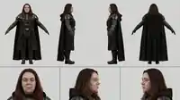</a><figcaption style="font-size:12px;margin-top:5px">Юля — identity</figcaption></figure>
</div>

**Exact scene-specific source:** location/composition/first-last inputs remain authoritative in the scene mapping; when their exact Topview/Drive binary is not yet in GitHub, publish it from the recovered Scene pack rather than asking the owner to upload it again.

**Что происходит:** На мостике идёт напряжённое сражение, видимое через панорамные окна. Серёга и Юля стоят рядом в центре и искренне радуются удачному ходу боя; экипаж продолжает работать за консолями. Камера начинает внутри мостика, плавно движется вперёд между персонажами и рабочими местами к центральному окну. По мере приближения космический бой за стеклом занимает всё больше кадра. Камера без остановки, склейки и визуального эффекта пересекает плоскость стекла, оказывается снаружи и продолжает тот же полёт вперёд среди кораблей, лазерного огня и следов движения, постепенно приходя к точной геометрии и направлению @Image2.

```text
Mode: first-and-last-frame (first frame: @Image1, last frame: @Image2) + character reference images @Image3 (Serega) and @Image4 (Yulia)
Duration: 30s | Resolution: 1080p | Aspect ratio: 16:9 | FPS: 24 | Native audio: on
Optimized for Seedance 2.5 | Photoreal live-action space-opera | One continuous unbroken camera move

REFERENCES:
@Image1 — PRIMARY START-FRAME / BRIDGE COMPOSITION reference. Match the exact opening bridge geometry, panoramic windows, console placement, crew distribution, lighting, exterior battle visible through the windows, camera height, lens perspective and starting framing. It controls the environment and first-frame composition, not the exact identities of Serega or Yulia.
@Image2 — PRIMARY END-FRAME / SPACE-BATTLE COMPOSITION reference. The final frames must converge naturally toward this exact exterior battle view: same broad camera direction, depth, starfield/planet relationship, attacking craft distribution, smoke/contrail flow and forward-motion feeling. Do not snap or dissolve into it; arrive through continuous physical camera travel.
@Image3 — PRIMARY EXACT IDENTITY reference for SEREGA. Use the approved Serega model sheet from the Characters registry as the absolute authority for his face, age, hair, body proportions and established Chancellor identity. In this scene preserve the dark-purple Chancellor robe visible on the bridge.
@Image4 — PRIMARY EXACT IDENTITY reference for YULIA. Use the approved Yulia model sheet from the Characters registry as the absolute authority for her face, age, hair, body proportions and established appearance. Preserve the dark bridge outfit/robe appropriate to the opening composition.

REFERENCE PRIORITY / IDENTITY LOCK:
@Image3 and @Image4 outrank @Image1 for Serega and Yulia's identities. @Image1 controls bridge architecture, crew layout, opening staging and lighting only. @Image2 controls the target exterior composition and motion direction only. Never average Serega or Yulia with incidental faces in @Image1. Keep both identities, hairstyles, proportions and clothing stable until the camera leaves the bridge.
The two source videos surrounding this insert are CONTEXT ONLY and are NOT generation references; do not invent extra reference-video dependencies.

START STATE:
Begin exactly from @Image1 as though the preceding shot has continued without interruption. The battle is already active outside the panoramic bridge windows. Serega and Yulia stand together near the center of the bridge. Bridge officers remain at their stations and continue operating consoles. No one enters from nowhere and no geometry resets.

SCENE GOAL:
Create a physically convincing invisible bridge between the interior bridge shot and the exterior space-battle shot. The audience should feel that one real camera travels from inside the command bridge, approaches the central panoramic window, crosses its plane without any edit or optical transition effect, and continues into open space until the view becomes @Image2.

TIMELINE / STORY FLOW:
[0:00–0:06]
Hold the exact @Image1 geography while beginning a slow controlled forward dolly. Serega and Yulia react to a successful moment in the battle with genuine restrained excitement: broad relieved smiles, a short celebratory look toward each other and toward the battle, a natural small victory gesture. They do not speak. Officers remain focused on their consoles. Outside, multiple ships exchange fire and distant impacts illuminate parts of the battlefield without changing the bridge lighting unrealistically.

[0:06–0:12]
The camera continues forward through the bridge on a clear physical path toward the large central window. Pass Serega and Yulia naturally while keeping them readable for several seconds; their celebration settles into focused satisfaction as they look out at the battle. Consoles and crew gain parallax and slide past the frame edges. The exterior battle grows larger through the window. No cuts and no sudden acceleration.

[0:12–0:17]
Approach the window until its frame moves toward the edges of the image. The camera trajectory remains perpendicular enough to the glass to make the crossing clean and spatially understandable. The battlefield beyond remains perfectly continuous in scale and direction. The window frame itself may pass around the edges, but the glass surface must NOT announce itself with an effect.

[0:17–0:19] — CRITICAL GLASS CROSSING
The camera crosses the physical plane of the panoramic glass in one uninterrupted forward movement and emerges outside the ship.
ABSOLUTELY NO lens flare, glare, reflected bridge image, reflection sweep, refraction, distortion, chromatic aberration, bloom, haze burst, blur, focus wash, white flash, exposure flash, ripple, shimmer, glass texture overlay, glass shatter or transition effect at the crossing.
Do not make the glass disappear dramatically. Treat the transparent pane as optically neutral at the exact crossing so the audience perceives only continuous forward movement from interior air to exterior space. No hard cut, hidden cut, whip transition or speed-ramp masking the crossing.

[0:19–0:25]
Now fully outside, continue the SAME forward camera vector into the battle. The bridge and window fall naturally behind camera. Fighters and larger ships move at different depths with believable parallax. Laser fire crosses the scene at safe readable distances; several ships bank through the battle and leave persistent smoke/engine trails consistent with @Image2. Preserve coherent scale and inertia — no teleporting ships, duplicated craft or instant formation changes.

[0:25–0:30]
Use only subtle steering/reframing while continuing forward so the spatial arrangement progressively converges on @Image2. By the final frame match @Image2 as closely as possible in camera angle, forward direction, starfield/planet placement, visible craft, trail flow, depth and overall composition. The last frame must feel like the natural next instant of the same continuous shot, not a morph into a still image.

CAMERA / LENS / CONTINUITY:
One continuous unbroken take for the full 30 seconds. No edits of any kind.
Physically stable cinematic camera with controlled inertia, smooth forward dolly/flight and no random jitter or micro-shake.
Maintain one coherent 3D coordinate system from bridge interior through the window plane into exterior space. The battle visible through the glass before crossing must be the SAME battle the camera enters afterward; ships cannot relocate when the camera crosses the window.
Use a natural cinematic perspective approximately equivalent to a 28–35 mm full-frame lens inside the bridge, preserving perspective continuously rather than changing focal length at the glass.
No artificial zoom. Forward scale change comes from real camera translation.
The window crossing is geometry, not an optical effect.

CHARACTER PERFORMANCE:
SEREGA: genuine relief and delighted satisfaction at the battle turning in their favor; smiling, energized, one restrained celebratory gesture, then attention returns to the battle. No dialogue, no caricature, no dancing.
YULIA: shares the victory beat naturally with Serega — warm excited smile, brief eye contact/reaction, then looks back through the window. No dialogue, no exaggerated cheering.
Both remain photoreal human performers with natural blinking, breathing, posture shifts and cloth motion. Preserve exact identity throughout their visible portion of the shot.
Bridge crew stay professional and busy; they do not all stop to celebrate or stare at camera.

SPACE BATTLE / PHYSICS:
The battle is already underway at frame one and continues without reset across the window crossing. Use multiple readable depth layers: distant capital ships, mid-distance combat, nearer fighters and projectile paths. Motion has mass and inertia. Engine trails and smoke persist consistently rather than spawning randomly. Impacts are localized and do not fill the entire frame with fire. Keep enough visual clarity that the forward camera path remains readable.

LIGHTING / MATERIAL REALISM:
Photoreal live-action space-opera cinematography. Inside: practical console illumination, restrained overhead industrial lighting, realistic metal, glass and fabric response, natural skin texture. Exterior battle light may create subtle physically motivated changes on the bridge but never a giant flare across camera.
At the glass crossing, preserve exposure and color continuously. NO brightness jump, NO reflection, NO highlight streak, NO flare and NO refractive distortion.
Outside: deep black space, physically coherent ship lighting, engine glow and distant battle illumination consistent with @Image2. Avoid game-render sheen and synthetic plastic surfaces.

AUDIO (native):
Inside bridge: low command-deck ambience, console beeps, restrained crew activity, distant muffled battle impacts through the hull, engine/ship vibration. Serega and Yulia may make brief natural nonverbal celebratory breaths/laughs, but NO spoken dialogue.
During the window crossing, transition the sound perspective smoothly from muffled interior battle/hull ambience toward cinematic exterior battle sound design without a whoosh used to hide an edit.
Outside: engines, distant weapons fire, impacts and low cinematic battle rumble. No music unless already present in the surrounding edit. No narrator.

NEGATIVE PROMPT:
hard cut, hidden cut, dissolve, crossfade, morph transition, whip-pan transition, speed-ramp transition, lens flare, anamorphic flare, glare on glass, window reflection, reflected bridge, reflected characters, reflection sweep, refraction, refractive warp, chromatic aberration, glass distortion, glass blur, frosted glass, white flash, exposure flash, bloom burst, haze burst, focus wash, ripple, shimmer, glass shattering, broken window, visible transition effect, camera collision with glass, camera stopping at window, sudden focal-length change, artificial zoom, camera teleportation, spatial reset after crossing, battle changing when crossing glass, identity drift, face averaging, face swap, changed Serega face, changed Yulia face, costume drift, duplicated Serega, duplicated Yulia, all crew cheering, exaggerated celebration, dancing, wrong bridge geometry, consoles morphing, crew teleporting, duplicated ships, disappearing ships, fighters morphing, random trail spawning, warped starfield, changing planet position, incoherent scale, camera jitter, micro-shake, cartoon, anime, game-render look, plastic skin, subtitles, captions, text, logo, watermark, black bars, side bars, decorative borders, empty margins.

FRAME FILL / NO BARS:
Fill the entire generated frame edge-to-edge. No letterboxing, no pillarboxing, no black bars, no side bars, no decorative borders, no empty margins.
```

---

<a id="scene-22"></a>

## Сцена 22 — Разрушенная станция → внутренний коридор: бесшовный пролёт через пробоину

<!-- scene-meta: {"target_engine":"Seedance 2.5","production_state":"READY","duration_s":30,"dialogue":{"enabled":false,"language":null},"tags":["action","space_battle","continuous_take","first_last_frame","seamless_transition"]} -->

**✅ Технический результат Topview получен (01.10.2026); редакционное решение не принято.**

**Контекст использования:** Новая промежуточная 30-секундная сцена между двумя уже существующими роликами. Первый кадр — внешний вид сильно повреждённой космической станции в разгаре боя; второй кадр — внутренний коридор станции со штурмовиками. Два исходных видео используются только как монтажный контекст, чтобы понимать, какие фрагменты сцена соединяет; их не прикреплять и не трактовать как reference input. Критическая задача — один физически непрерывный перелёт: космос → подлёт к станции → вход через реальную пробоину в корпусе → повреждённая внутренняя структура → целый коридор. Никакой склейки, телепортации или мгновенной подмены пространства.

**Референсы:** @Image1 = точный первый кадр / разрушенная станция снаружи · @Image2 = точный последний кадр / внутренний коридор станции со штурмовиками.

**Публикация exact scene-refs:** first/last frame уже используются канонически; их бинарные источники зафиксированы в Topview provenance и должны быть опубликованы миниатюрами после materialize шага, без повторного запроса у владельца.

**Что происходит:** Вокруг разрушенной станции продолжается активное космическое сражение: корабли пересекают пространство, ведут огонь, вдали вспыхивают попадания и взрывы. Камера начинает точно с @Image1 и сразу выбирает одну хорошо читаемую пробоину в повреждённом корпусе как цель. В течение сцены она непрерывно ускоряется к станции, проходит рядом с обломками и боевыми кораблями, затем физически входит через пробоину, пролетает сквозь разрушенные наружные и внутренние конструкции и постепенно выравнивается по геометрии целого коридора. В финальные секунды пространство должно стать точно таким, как @Image2: тот же коридор, перспектива, свет и бегущие штурмовики, с точным приходом к последнему кадру.

```text
Mode: first-and-last-frame (first frame: @Image1, last frame: @Image2)
Duration: 30s | Resolution: 1080p | Aspect ratio: 16:9 | FPS: 24 | Native audio: on
Optimized for Seedance 2.5 | Photoreal live-action space-opera | One continuous unbroken camera move

REFERENCES:
@Image1 — PRIMARY START-FRAME / EXTERIOR reference. Match the exact opening composition, damaged battle-station silhouette, visible hull destruction, burning sections, debris field, space background, camera orientation, lighting balance, scale and battle atmosphere.
@Image2 — PRIMARY END-FRAME / INTERIOR reference. Match the exact final corridor geometry, perspective, camera height, vanishing point, wall and ceiling architecture, overhead lighting, red warning lights, floor reflections and the running stormtroopers.

IMPORTANT REFERENCE RULE:
@Image1 owns only the start composition and exterior station identity. @Image2 owns only the final interior destination and exact ending composition. Do not blend the two reference images into a surreal hybrid frame. The interior must not suddenly replace the exterior. The camera must physically travel from the exterior of the same station through a visible pre-existing hull breach and through plausible damaged internal structure before reaching the intact corridor. Preserve one coherent 3D space and one continuous direction of travel.

The two surrounding source videos are EDITING CONTEXT ONLY and are NOT generation references. Do not infer extra visual identities, exact frames, characters or geometry from them beyond the stated narrative continuity.

STYLE GOAL:
Photorealistic live-action space-opera cinematography with realistic scale, physically believable camera inertia, dense but readable battle action, detailed scorched metal, volumetric smoke and sparks inside the breach, convincing depth, restrained anamorphic highlights and subtle film grain. The shot should feel like an expensive practical/VFX transition in a feature film, not a game cutscene or a morphing AI transition.

SCENE / CONTINUITY GOAL:
This is a bridge shot between an exterior space-battle sequence and an interior chase/run sequence. It must make the audience feel that the second clip is physically inside the damaged station seen in the first clip. Every stage of the move must reveal the next space naturally: the breach is visible before entry, internal structure is revealed only after crossing the hull, and the final corridor emerges from the same forward trajectory.

TIMELINE / STORY FLOW:
[0:00–0:05] — EXACT START / BATTLE ESTABLISHMENT
Begin exactly on @Image1. The damaged station remains clearly readable while the surrounding battle is already active. Distant capital ships and smaller fighters exchange laser fire; one or two ships cross the midground without obscuring the station. Small explosions and glowing impacts flicker across distant damaged surfaces. The camera is already alive with a subtle forward drift but does not immediately lose the reference composition.

[0:05–0:11] — COMMIT TO THE BREACH
The camera accelerates toward one specific large existing breach in the station hull. The chosen opening must remain visually stable from this point onward — do not create a new hole later. Nearby ships streak past at different depths; laser fire crosses the wider battlefield. The station grows convincingly in scale and surface detail. Keep the route into the breach unobstructed and visually understandable.

[0:11–0:17] — CLOSE EXTERIOR APPROACH
Now very close to the hull: scorched plating, torn structural ribs, exposed decks, glowing damage, venting smoke or vapor, sparks and slowly drifting fragments become readable. The camera makes only a small physically motivated alignment correction toward the breach. It never clips through intact metal. Battle flashes still illuminate the exterior behind and around the camera path.

[0:17–0:22] — PHYSICAL BREACH ENTRY
Cross through the actual torn opening in one uninterrupted move. Pass between broken armor plates and structural beams with believable clearance. The transition must be achieved by real geometry moving past the lens — not a white flash, blur wipe, smoke wipe, dissolve, portal, lens flare or hidden cut. Exterior battle light falls off naturally as the camera enters the station.

[0:22–0:26] — DAMAGED INTERNAL TRANSITION ZONE
Continue forward through a short damaged service/deck section logically behind the breach: exposed beams, broken wall panels, hanging cables, sparks, smoke, emergency red lighting and distant vibration from impacts. This zone gradually becomes less destroyed. The architecture must begin aligning toward the proportions, camera height and vanishing point of @Image2 while still feeling like the same station.

[0:26–0:30] — EXACT CORRIDOR ARRIVAL / LAST FRAME
The damaged transition opens naturally into the intact corridor from @Image2. Several stormtroopers are already running toward camera exactly within the established corridor geography; they do not pop into existence. Camera motion smooths and settles into the exact framing, angle, height, perspective, lighting, wall geometry and troop placement of @Image2. The final generated frame must match @Image2 as closely as possible.

CAMERA / MOVEMENT:
One continuous take, no cuts. Physically stable cinematic motion with controlled inertia. One dominant forward flight path from space into the station. No random orbit, no backward reset, no teleport, no impossible acceleration changes, no micro-shake. Small lateral/vertical corrections are allowed only to avoid debris and line up with the breach. Camera must never pass through intact hull, walls, floor, ceiling, ships or characters.

SPACE BATTLE:
The battle remains active during the exterior half: multiple ships at different distances, laser exchanges, engine trails, occasional explosions and drifting debris. Keep action layered around the camera route rather than directly blocking it. Ships must maintain stable geometry and scale. Do not overcrowd the frame so much that the approach to the breach becomes unreadable.

STATION / ENVIRONMENT LOCK:
The station remains the same object throughout: same hull material family, same damage language, same structural scale. The breach is a real opening caused by battle damage and visibly connects exterior plating to interior structure. No giant impossible cavity, no TARDIS-like larger-on-the-inside space, no sudden architectural style change. The final corridor should feel like an intact internal section farther behind the damaged outer shell.

STORMTROOPERS / FINAL ACTION:
Stormtroopers appear only after the camera reaches the interior corridor. Match @Image2's white armor silhouette, approximate number, running direction and spatial arrangement. Their movement is urgent but grounded: natural stride, stable anatomy, no sliding feet, no duplicated limbs or melting helmets. They remain secondary to the transition and must not block the camera path.

LIGHTING / MATERIALS:
Exterior: cold deep-space illumination mixed with orange fire from station damage, red/blue battle flashes and realistic reflected light on hull plates.
Breach: strong contrast, hot sparks, glowing damaged metal, intermittent red emergency light, smoke catching directional light.
Interior corridor: transition cleanly into the white overhead panels and red accents of @Image2. Preserve realistic metallic roughness, panel seams, floor reflections and atmospheric depth.

AUDIO (native):
Exterior: layered ship engines, laser fire, distant explosions and low-frequency battle rumble. As the camera enters the breach, exterior battle becomes more muffled and structural vibrations, metal groans, sparks, electrical crackles and emergency alarms take over. Final corridor: alarm ambience, running footsteps, armor movement and distant impacts transmitted through the station. No dialogue. No music. No abrupt audio reset at the transition.

NEGATIVE PROMPT:
hard cut, hidden edit, jump cut, dissolve, morph transition, portal, teleporting camera, white flash transition, lens-flare wipe, smoke wipe, instant exterior-to-interior replacement, camera clipping through intact hull, wall or ceiling, impossible station geometry, corridor appearing from nowhere, giant empty cavity, changing station design, changing breach location, warped perspective, unstable scale, ships morphing or duplicating, excessive battle clutter blocking the route, static empty battle, low-detail ships, random camera spin, camera jitter, micro-shake, game-render look, cartoon, anime, oversaturated neon, stormtroopers in open space, stormtroopers appearing before the corridor, duplicated stormtroopers, melted armor, warped limbs, sliding feet, distorted corridor, moving walls, floating interior props, text, subtitles, logos, watermark.

FRAME FILL / NO BARS:
Fill the entire generated frame edge-to-edge. No letterboxing, no pillarboxing, no black bars, no side bars, no decorative borders, no empty margins.
```

<a id="scene-23"></a>

## Сцена 23 — Люди → коты-джедаи: бесшовное раскрытие второго плана

<!-- scene-meta: {"target_engine":"Seedance 2.5","production_state":"READY","duration_s":30,"dialogue":{"enabled":false,"language":null},"dependencies":[],"tags":["continuous_take","seamless_transition","cats","jedi","character_identity"]} -->

**✅ Технический результат Topview получен (02.10.2026); редакционное решение не принято.**

**Контекст использования:** Начало новой кошачьей ветки. Переход должен соединить фото1 с фото2 без морфа людей в котов: камера физически приближается к идущим людям, проходит между ними и естественно раскрывает двух котов, которые всё это время шли позади. Коты становятся новым центром кадра и продолжают движение с включёнными световыми мечами.

**Референсы:** @Image1 = точный первый кадр / идущие люди и их пространство · @Image2 = точный второй кадр / парная целевая композиция котов · @Image3 = **Лучик**, точный индивидуальный identity reference · @Image4 = **Рыжик**, точный индивидуальный identity reference

**Используемые identity-референсы на сайте:**
<div class="scene-ref-gallery" style="display:grid;grid-template-columns:repeat(auto-fit,minmax(145px,1fr));gap:10px;margin:10px 0 16px">
<figure style="margin:0"><a href="references/luchik.jpg" target="_blank" rel="noopener"></a><figcaption style="font-size:12px;margin-top:5px">Лучик — identity</figcaption></figure>
<figure style="margin:0"><a href="references/ryzhik.jpg" target="_blank" rel="noopener">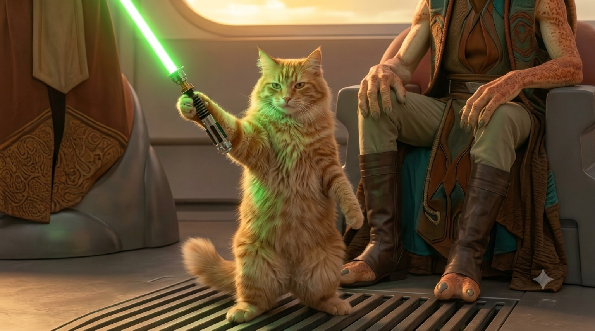</a><figcaption style="font-size:12px;margin-top:5px">Рыжик — identity</figcaption></figure>
</div>

**Exact scene-specific source:** location/composition/first-last inputs remain authoritative in the scene mapping; when their exact Topview/Drive binary is not yet in GitHub, publish it from the recovered Scene pack rather than asking the owner to upload it again.

**Что происходит:** Камера начинает с @Image1, движется вперёд в том же направлении, аккуратно проходит между идущими людьми. За ними постепенно открываются LUCHIK и RYZHIK из @Image2. Люди уходят к краям/за камеру, а коты без склейки становятся главным планом: пафосно идут вперёд, серый держит синий, рыжий зелёный световой меч; оба делают контролируемые эффектные вращения клинками, не останавливаясь.

```text
Mode: first-and-last-frame / reference-to-video | First frame: @Image1 | Target identity/composition: @Image2
Duration: 30s | Resolution: 1080p | Aspect ratio: 16:9 | FPS: 24 | Native audio: on
Optimized for Seedance 2.5 | Photoreal live-action space-fantasy | One continuous unbroken camera move

REFERENCES:
@Image1 — PRIMARY START FRAME / HUMAN GROUP / SPACE reference. Preserve exact opening camera height, walking direction, ground plane, perspective, lighting and positions of the people.
@Image2 — PRIMARY TARGET COMPOSITION / PAIR STAGING reference for the two cats once revealed. Use it for their relative placement and target composition, but do not let it override the individual identities.
@Image3 — ABSOLUTE INDIVIDUAL IDENTITY reference for LUCHIK / ЛУЧИК: fluffy white-and-grey long-haired cat with white muzzle, chest and legs, grey crown/facial and back markings, dense natural fur and serious calm expression.
@Image4 — ABSOLUTE INDIVIDUAL IDENTITY reference for RYZHIK / РЫЖИК: fluffy ginger long-haired tabby cat with warm orange coat, visible darker tabby striping, lighter muzzle/chest and serious confident expression.

REFERENCE PRIORITY:
@Image1 owns the opening people and physical starting space. @Image2 owns pair staging/target composition. @Image3 owns LUCHIK identity. @Image4 owns RYZHIK identity. Individual identity references outrank the pair/composition image for face, coat and body proportions. Never morph a person into a cat and never average the two cats together.

CHARACTER / PROP LOCK:
LUCHIK / ЛУЧИК: exact recurring fluffy white-and-grey long-haired cat from @Image3; white muzzle/chest/legs, grey crown/facial and back markings; calm, stern master-like expression; uses one stable BLUE lightsaber.
RYZHIK / РЫЖИК: exact recurring fluffy ginger long-haired tabby cat from @Image4; warm orange coat, darker tabby striping, lighter muzzle/chest; serious, confident, slightly more aggressive expression; uses one stable GREEN lightsaber.
They are photoreal cats with recognizably feline heads, coats and body proportions, but capable of confident stylized Jedi movement. When manipulating sabers they may balance upright briefly and grip compact hilts with their front paws; do not give them human arms, human hands or humanoid faces. Saber colors, hilts and cat identities remain fixed.

START STATE:
Begin exactly on @Image1. The people are already walking in a coherent direction. Camera shares their forward movement and does not yet reveal the cats clearly.

TIMELINE:
[0:00–0:07] — MATCH PHOTO 1
Hold @Image1 composition long enough to establish the walking group. Smooth forward tracking, natural human steps and cloth motion. No cats popping into the foreground.

[0:07–0:14] — APPROACH THE GAP
Camera gradually accelerates and closes distance. Two people naturally separate just enough for a real corridor of visibility. Camera threads physically BETWEEN them without clipping bodies. Foreground shoulders/arms pass the lens edges with real parallax.

[0:14–0:19] — REVEAL THE CATS
Through the gap, LUCHIK and RYZHIK are revealed several meters behind the people, already walking in the same direction. They were present in the same space all along; they do not spawn, teleport or replace the humans. Their exact identities converge toward @Image2.

[0:19–0:25] — HERO WALK
The humans slide naturally behind camera or to the far edges. Camera settles into a low heroic backward tracking shot in front of the cats. Both cats advance with calm, intimidating confidence. Their sabers ignite cleanly: LUCHIK blue, RYZHIK green.

[0:25–0:30] — SABER FLOURISH / TARGET COMPOSITION
Without stopping their forward momentum, each cat performs one controlled, readable saber flourish — elegant wrist/forepaw rotation, blades tracing clean arcs without hitting each other or the ground. End with both cats still advancing and composition matching @Image2 as closely as possible.

CAMERA / SPACE:
One continuous physical shot. Maintain one ground plane, one forward axis and believable parallax. No teleportation, hidden cut, whip-mask, morph or impossible pass through bodies. Stable cinematic inertia, no random micro-shake. Lens perspective stays consistent; scale changes come from real camera translation.

LIGHTING / VFX:
Match @Image1 lighting at the start and preserve the same world lighting through the reveal. Lightsaber glow is restrained and physically motivates subtle colored light on nearby fur/ground; no giant bloom, no overexposed neon fog. Fur remains detailed and photoreal.

AUDIO:
Footsteps from the human group, ambient environment, subtle cloth movement; as cats become dominant, soft feline paw impacts, saber ignition, controlled saber hum and air swishes. No dialogue, no music unless present in surrounding edit.

NEGATIVE PROMPT:
person morphing into cat, cat appearing from nowhere, teleport, hidden cut, hard cut, dissolve, wipe, whip transition, camera clipping through people, changing ground plane, wrong cat identity, Luchik/Ryzhik identity swap, merged cats, duplicated cats, extra cats, human arms on cats, human hands, humanoid face, deformed paws, extra limbs, saber through body, changing saber color, duplicated saber, floating hilt, blade wobble, random acrobatics, cartoon, anime, game-render look, plastic fur, camera jitter, text, subtitles, logo, watermark, black bars, side bars.

FRAME FILL / NO BARS:
Fill the entire generated frame edge-to-edge. No letterboxing, no pillarboxing, no black bars, no side bars, no decorative borders, no empty margins.
```

---

<a id="scene-24"></a>

## Сцена 24 — Коты в кабине: запуск корабля и взлёт

<!-- scene-meta: {"target_engine":"Seedance 2.5","production_state":"READY","duration_s":30,"dialogue":{"enabled":false,"language":null},"dependencies":[{"type":"continues","scene":23}],"tags":["cats","cockpit","takeoff","continuous_take","character_identity"]} -->

**✅ Технический результат Topview получен (02.10.2026); редакционное решение не принято.**

**Контекст использования:** Продолжение кошачьей ветки после просмотра результата. Главный визуальный приоритет — **точно сохранить approved cockpit photo**: тёплый янтарный жилой интерьер корабля с плотными физическими панелями, глубиной заднего отсека/коридора и той же фронтальной композицией. Рыжик остаётся штурманом/оператором систем и виден **слева в кадре**; Лучик остаётся пилотом и виден **справа в кадре**. Коты обычного домашнего размера относительно кресел и консолей, не гигантские полугуманоидные существа.

**Референсы:** @Image1 = парный continuity/composition reference тех же двух котов из Scene 23 · @Image2 = **Лучик**, точный индивидуальный identity reference · @Image3 = **Рыжик**, точный индивидуальный identity reference · @Image4 = **APPROVED EXACT COCKPIT / COMPOSITION reference**: текущая фотография с тёплым интерьером, Рыжиком слева в кадре у навигации и Лучиком справа у пилотских органов управления. @Image4 абсолютен для интерьера, света, масштаба кресел/консолей и композиции.

**Используемые identity-референсы на сайте:**
<div class="scene-ref-gallery" style="display:grid;grid-template-columns:repeat(auto-fit,minmax(145px,1fr));gap:10px;margin:10px 0 16px">
<figure style="margin:0"><a href="references/luchik.jpg" target="_blank" rel="noopener"></a><figcaption style="font-size:12px;margin-top:5px">Лучик — identity</figcaption></figure>
<figure style="margin:0"><a href="references/ryzhik.jpg" target="_blank" rel="noopener"></a><figcaption style="font-size:12px;margin-top:5px">Рыжик — identity</figcaption></figure>
</div>

**Exact scene-specific source:** location/composition/first-last inputs remain authoritative in the scene mapping; when their exact Topview/Drive binary is not yet in GitHub, publish it from the recovered Scene pack rather than asking the owner to upload it again.

**Что происходит:** В **той же кабине, что на @Image4**, RYZHIK визуально остаётся слева в кадре и работает с навигацией/голографическими системами, а LUCHIK справа держит основные пилотские органы управления. Оба кота читаются лицами и сохраняют обычный кошачий масштаб. Панели оживают, двигатели набирают тягу, корабль физически взлетает без redesign интерьера и без перехода к generic starfighter cockpit.

```text
Mode: reference-to-video | Duration: 30s | Resolution: 1080p | Aspect ratio: 16:9 | FPS: 24 | Native audio: on
Optimized for Seedance 2.5 | Photoreal live-action space-opera cockpit | Continuous physical take

REFERENCES / AUTHORITY ORDER:
@Image1 — PAIR CONTINUITY reference for the recurring cat duo.
@Image2 — ABSOLUTE INDIVIDUAL IDENTITY reference for LUCHIK / ЛУЧИК: fluffy white-and-grey long-haired cat with white muzzle/chest/legs, grey crown/facial and back markings, dense natural fur and calm stern expression; fixed PILOT identity and recurring BLUE lightsaber identity.
@Image3 — ABSOLUTE INDIVIDUAL IDENTITY reference for RYZHIK / РЫЖИК: fluffy ginger long-haired tabby cat with warm orange coat, darker tabby striping, lighter muzzle/chest and serious confident expression; fixed NAVIGATOR / SYSTEMS identity and recurring GREEN lightsaber identity.
@Image4 — PRIMARY EXACT COCKPIT / STAGING reference. Match this approved photo closely: warm amber practical lighting, dense tactile consoles, the visible rear compartment/corridor depth, seat proportions, camera height and the exact visual placement of RYZHIK on frame-left and LUCHIK on frame-right.
Priority: @Image4 controls cockpit environment, lighting, seat/console scale and composition. @Image2/@Image3 control individual cat identity. @Image1 supports pair continuity only. Do not average or swap identities.

CHARACTER APPEARANCE / ROLE LOCK:
LUCHIK remains the PILOT, but visually occupies the RIGHT SIDE OF FRAME at the main flight controls exactly as in @Image4.
RYZHIK remains the NAVIGATOR / SYSTEMS operator, visually occupying the LEFT SIDE OF FRAME with the holographic/navigation displays exactly as in @Image4.
They remain visually natural photoreal cats. No human hands, no human arms, no humanoid faces, no costume drift. Their blue/green Jedi sabers from Scene 23 are safely clipped/stowed and remain OFF inside the cockpit.

CAT SCALE / ANATOMY LOCK — CRITICAL:
Both cats remain ordinary adult domestic-cat scale relative to the chairs, armrests, yokes and consoles in @Image4.
They must never become giant half-human cats, never approach half a human's height and never gain oversized humanoid torsos.
Their bodies remain fully feline; only their paw interactions are adapted to the controls.

ENVIRONMENT / COCKPIT LOCK — @Image4 IS ABSOLUTE:
Use the exact warm lived-in ship interior shown in @Image4, not a generic cold starfighter cockpit.
Preserve the amber practical strip lights, dense physical panels, tactile mechanical controls, modest holographic/nav displays, visible depth into the rear cabin/corridor and the same believable furniture/console proportions.
Do not replace the cabin with a bubble canopy, empty fighter cockpit, blue game-HUD environment or a different ship interior.

START STATE:
Ship is stationary on a launch pad or inside a hangar opening. Engines are off or at idle.
Begin from a front-biased medium-wide composition closely matching @Image4: RYZHIK clearly visible on frame-left at navigation, LUCHIK clearly visible on frame-right at the main pilot controls, both faces readable and both bodies correctly scaled to the seats/consoles.

TIMELINE:
[0:00–0:06] — PRE-FLIGHT
Medium-wide cockpit view matches @Image4 closely: RYZHIK stays on frame-left at navigation and LUCHIK stays on frame-right at the pilot controls. Both faces remain readable. RYZHIK taps two or three deliberate controls; indicators wake in sequence. LUCHIK places both front paws on the flight yoke/dual controls.

[0:06–0:12] — SYSTEMS ONLINE
Power rises through the cockpit: displays illuminate, engine vibration builds, navigation route appears. RYZHIK confirms readiness with a focused look toward LUCHIK, no speech. LUCHIK responds with a brief determined glance and returns eyes forward.

[0:12–0:18] — ENGINE START / LIFT
LUCHIK advances the throttle. A deep engine spool builds. Through the canopy, the hangar/pad begins to move downward relative to the ship. Camera and loose cockpit details react to believable acceleration — mild vibration only, no chaotic shake.

[0:18–0:24] — DEPARTURE
Ship moves forward and upward through a real exit path. Exterior structures slide past the canopy with correct parallax. RYZHIK actively manages navigation and power distribution while LUCHIK keeps the flight path stable.

[0:24–0:30] — CLEAR OF BASE
The craft clears the structure/atmospheric boundary into a broad open flight path. Stars/upper atmosphere become visible ahead. LUCHIK banks gently toward the chosen vector; RYZHIK checks tactical/nav display. End in a stable forward-flight cockpit state that can continue directly into Scene 25.

CAMERA / CONTINUITY:
Keep the camera inside the cockpit for the complete shot and compositionally close to the approved @Image4 photo: front-biased medium-wide / three-quarter-front view, not a long rear-view of the cats.
Both faces should remain readable for most of the scene. One continuous take, no exterior cutaway. Stable camera attached to ship with controlled vibration from engines.
Never swap the frame-left/frame-right placement: RYZHIK stays left in frame, LUCHIK stays right.

PERFORMANCE:
Both cats act competent, serious and purposeful. Paw interactions are clean and minimal. No comedy mugging, no random meowing, no licking/grooming during launch. Natural ears, blinking, breathing and small body adjustments under acceleration.

LIGHTING / MATERIALS:
Preserve the warm amber practical-light mood of @Image4 as the base look. Practical display glow falls naturally on fur; realistic brushed/worn metal and controlled glass reflections remain visible. Exterior light may change during launch but must not turn the cabin into a cold generic blue sci-fi cockpit. Avoid neon overload and game-HUD look.

AUDIO:
Cockpit power-up tones, switches, relays, navigation beeps, engine turbine/reactor spool, hull vibration, rising thrust, wind/launch ambience transitioning toward muted space-flight rumble. No dialogue, no narrator, no music.

NEGATIVE PROMPT:
wrong cockpit, cockpit redesign, generic bubble-canopy starfighter, cold blue cockpit replacing @Image4, missing rear-cabin depth, frame-left/frame-right swap, RYZHIK on frame-right, LUCHIK on frame-left, giant cats, half-human cats, cats oversized relative to seats, back-only cat framing, hidden cat, identity swap, extra cat, duplicated cat, human hands, human arms, humanoid body, warped paws, impossible control interaction, cockpit geometry changing, random seat movement, ship teleporting to space, hard cut, exterior cutaway, random camera shake, floating controls, unreadable overlaid UI, cartoon, anime, game-render look, plastic fur, subtitles, text, logo, watermark, black bars.

FRAME FILL / NO BARS:
Fill the entire generated frame edge-to-edge. No letterboxing, no pillarboxing, no black bars, no side bars, no decorative borders, no empty margins.
```

---

<a id="scene-25"></a>

## Сцена 25 — Коты в кабине: космическое сражение

<!-- scene-meta: {"target_engine":"Seedance 2.5","production_state":"READY","duration_s":30,"dialogue":{"enabled":false,"language":null},"dependencies":[{"type":"continues","scene":24}],"tags":["cats","cockpit","space_battle","action","character_identity"]} -->

**Контекст использования:** Прямое продолжение исправленной Scene 24. Те же коты и **тот же exact cockpit @Image4** без redesign: RYZHIK остаётся слева в кадре у навигации/оружия, LUCHIK справа пилотирует. Оба кота сохраняют обычный домашний масштаб и читаются лицами. Всё сражение видно изнутри того же тёплого жилого корабля.

**Референсы:** @Image1 = парный continuity reference котов · @Image2 = **Лучик**, точный индивидуальный identity reference · @Image3 = **Рыжик**, точный индивидуальный identity reference · @Image4 = **APPROVED EXACT COCKPIT / COMPOSITION reference**, тот же что в Scene 24. Финальный кадр Scene 24 можно добавить как дополнительный start continuity reference только если он реально доступен; он не переопределяет @Image4.

**Используемые identity-референсы на сайте:**
<div class="scene-ref-gallery" style="display:grid;grid-template-columns:repeat(auto-fit,minmax(145px,1fr));gap:10px;margin:10px 0 16px">
<figure style="margin:0"><a href="references/luchik.jpg" target="_blank" rel="noopener"></a><figcaption style="font-size:12px;margin-top:5px">Лучик — identity</figcaption></figure>
<figure style="margin:0"><a href="references/ryzhik.jpg" target="_blank" rel="noopener"></a><figcaption style="font-size:12px;margin-top:5px">Рыжик — identity</figcaption></figure>
</div>

**Exact scene-specific source:** location/composition/first-last inputs remain authoritative in the scene mapping; when their exact Topview/Drive binary is not yet in GitHub, publish it from the recovered Scene pack rather than asking the owner to upload it again.

**Что происходит:** Через окна **той же кабины @Image4** видно плотное космическое сражение. LUCHIK справа в кадре резко, но физически правдоподобно уклоняет корабль от огня; RYZHIK слева ведёт навигацию, переключает щиты и стреляет. Интерьер, свет, масштаб кресел и обычный кошачий размер не меняются.

```text
Mode: reference-to-video | Duration: 30s | Resolution: 1080p | Aspect ratio: 16:9 | FPS: 24 | Native audio: on
Optimized for Seedance 2.5 | Photoreal cockpit battle | Continuous interior perspective

REFERENCES / AUTHORITY ORDER:
@Image1 — PAIR CONTINUITY reference for the recurring cat pair.
@Image2 — ABSOLUTE INDIVIDUAL IDENTITY reference for LUCHIK / ЛУЧИК: fluffy white-and-grey long-haired cat with white muzzle/chest/legs and grey crown/facial/back markings; PILOT; recurring BLUE lightsaber identity.
@Image3 — ABSOLUTE INDIVIDUAL IDENTITY reference for RYZHIK / РЫЖИК: fluffy ginger long-haired tabby cat with warm orange coat, darker tabby striping and lighter muzzle/chest; NAVIGATOR / WEAPONS; recurring GREEN lightsaber identity.
@Image4 — PRIMARY EXACT COCKPIT / STAGING reference, identical to Scene 24. Preserve its warm amber practical lighting, dense physical controls, visible rear-cabin depth, seat/console proportions, camera family and frame-left/frame-right placement.
Priority: @Image4 controls cockpit environment/composition. @Image2/@Image3 control identity. @Image1 supports pair continuity.

COCKPIT / SCALE LOCK — CRITICAL:
Use the exact same warm lived-in @Image4 cockpit from Scene 24.
RYZHIK remains on the LEFT SIDE OF FRAME at tactical/navigation systems; LUCHIK remains on the RIGHT SIDE OF FRAME at the pilot controls.
Both remain ordinary adult domestic-cat scale relative to chairs and consoles; no giant or half-human cats.

START STATE:
Begin as a direct continuation of Scene 24 after takeoff. The ship is already in forward flight. Both cats are clearly visible from the front/three-quarter front in the same cockpit geometry and the first signs of a larger battle appear outside.

TIMELINE:
[0:00–0:06] — BATTLE ARRIVAL
Fighters cross the canopy at different depths. Distant capital ships exchange fire. LUCHIK leans into the controls and aligns the craft with a safe route. RYZHIK switches the tactical display from navigation to combat.

[0:06–0:13] — FIRST EVASION
Incoming fire crosses ahead. LUCHIK makes one clean bank and controlled dive/roll with believable inertia. Exterior starfield and ships rotate consistently through the canopy. RYZHIK braces naturally and adjusts shields.

[0:13–0:20] — RETURN FIRE
RYZHIK acquires a target and deliberately activates weapons. Short controlled bursts fire forward from the ship; one enemy craft ahead is hit or forced away. LUCHIK maintains the flight path and does not abandon the controls.

[0:20–0:26] — THREAD THE FIGHT
The ship passes between a larger vessel and drifting debris with clear depth and safe clearance. A nearby explosion briefly lights the cockpit, but does not white-out the frame. LUCHIK corrects course; RYZHIK rapidly checks another system.

[0:26–0:30] — BREAK THROUGH
LUCHIK accelerates through an opening in the battle formation. RYZHIK looks forward with focused satisfaction while keeping one paw on the tactical controls. End with the craft still in combat, ready for the next exterior or narrative shot.

CAMERA / SPACE:
Camera remains inside the cockpit for the full scene, but stays compositionally close to @Image4 rather than settling into a back-only angle. Both cat faces remain readable for most of the scene.
No exterior cutaway. Cockpit geometry stays fixed; all external movement is visible through windows/canopy with correct parallax. Motion follows ship physics: mass, inertia, no instantaneous 180-degree turns, no starfield teleport.

PERFORMANCE:
Competent, angry-focused Jedi-cat crew rather than slapstick animals. LUCHIK actively flies; RYZHIK actively navigates/fires. Natural ear movement, blinking and body lean under G-forces. No dialogue and no random meowing.

LIGHTING / VFX:
Exterior battle flashes cast brief motivated reflections on fur and metal. Weapon bolts and engines retain stable colors and geometry. Avoid giant lens flares, oversaturated neon and screen-filling explosions.

AUDIO:
Cockpit engine tone, alert beeps, weapon charging/firing, shield impact, hull creaks, distant muffled explosions, rapid control clicks. No spoken dialogue, narrator or music.

NEGATIVE PROMPT:
wrong cockpit, cockpit redesign, generic fighter canopy replacing @Image4, cold blue cockpit, missing rear-cabin depth, frame-left/frame-right swap, RYZHIK on frame-right, LUCHIK on frame-left, giant cats, half-human cats, oversized cats relative to seats, hidden cat, back-only cat framing, role swap, identity swap, duplicated cats, extra cats, human hands, humanoid faces, cockpit morphing, seats moving, external camera cut, impossible ship rotation, teleporting stars, duplicated ships, random explosions inside cockpit, weapons firing backward, floating paws, broken controls, excessive camera shake, white flash transition, cartoon, anime, game-render look, subtitles, text, logo, watermark, black bars.

FRAME FILL / NO BARS:
Fill the entire generated frame edge-to-edge. No letterboxing, no pillarboxing, no black bars, no side bars, no decorative borders, no empty margins.
```

---

<a id="scene-26"></a>

## Сцена 26 — Коты-магистры на планете ситхов: ультиматум Серёге

<!-- scene-meta: {"target_engine":"Wan 3","production_state":"READY","duration_s":30,"dialogue":{"enabled":true,"language":"ru"},"dependencies":[{"type":"continues","scene":25}],"tags":["cats","dialogue","sith_planet","jedi","confrontation","lip_sync"]} -->

**⏳ В МЕДЛЕННОЙ ГЕНЕРАЦИИ**

Active Wan 3.0 task `b95a76b92f9d4787b738b165eaeb270f` — нормализационно эквивалентная попытка существующей Scene 26; новый Scene ID не создаётся.

**Контекст использования:** Исправленная после просмотра результата диалоговая сцена. В кадре должны быть **только Лучик и Рыжик**. Серёга является адресатом их слов, но остаётся полностью **off-camera** и не появляется ни лицом, ни телом, ни мантией, ни силуэтом, ни отражением, ни фрагментом, поэтому не может «раствориться» в воздухе. Локация остаётся тем же древним монументальным каменным городом-руиной на оранжево-золотом закате. Сохраняем удачную атмосферу прошлой генерации: заметная, но не чрезмерная взвесь мелкой сухой пыли, пепла и редких ember-like частиц. Оба кота обычного домашнего масштаба.

**Референсы:** @Image1 = парный continuity/composition reference котов · @Image2 = **Лучик**, точный индивидуальный identity reference · @Image3 = **Рыжик**, точный индивидуальный identity reference · @Image4 = **точный LOCATION / ENVIRONMENT reference**: чистый широкий кадр древнего монументального каменного города-руины на закате. **Серёгу как image reference в исправленную Scene 26 не прикреплять**, потому что он не должен быть виден.

**Используемые identity-референсы на сайте:**
<div class="scene-ref-gallery" style="display:grid;grid-template-columns:repeat(auto-fit,minmax(145px,1fr));gap:10px;margin:10px 0 16px">
<figure style="margin:0"><a href="references/luchik.jpg" target="_blank" rel="noopener"></a><figcaption style="font-size:12px;margin-top:5px">Лучик — identity</figcaption></figure>
<figure style="margin:0"><a href="references/ryzhik.jpg" target="_blank" rel="noopener"></a><figcaption style="font-size:12px;margin-top:5px">Рыжик — identity</figcaption></figure>
</div>

**Exact scene-specific source:** location/composition/first-last inputs remain authoritative in the scene mapping; when their exact Topview/Drive binary is not yet in GitHub, publish it from the recovered Scene pack rather than asking the owner to upload it again.

**Что происходит:** На широкой ступенчатой террасе древнего города-руины видны только два кота-магистра. Рыжик первым зло и уверенно обращается к Серёге, который находится за пределами кадра; затем Лучик выдерживает паузу и добавляет свой ультиматум. Только активный кот артикулирует. Тёплый закатный свет режет пыльный воздух, а мелкий пепел, сухая пыль и редкие искрящиеся частицы постоянно проходят через глубину кадра и затем продолжаются в Scene 27.

```text
Mode: reference-to-video | Duration: 30s | Resolution: 1080p | Aspect ratio: 16:9 | FPS: 24 | Native audio: on
Optimized for Wan 3 | Photoreal live-action dark space-fantasy | Russian dialogue and strict lip sync

REFERENCES / AUTHORITY ORDER:
@Image1 — PAIR CONTINUITY / COMPOSITION reference for the two recurring Jedi cats.
@Image2 — ABSOLUTE INDIVIDUAL IDENTITY reference for LUCHIK / ЛУЧИК: fluffy white-and-grey long-haired cat with white muzzle/chest/legs, grey crown/facial/back markings and a calm stern master-like expression.
@Image3 — ABSOLUTE INDIVIDUAL IDENTITY reference for RYZHIK / РЫЖИК: fluffy ginger long-haired tabby cat with warm orange coat, darker tabby striping, lighter muzzle/chest and a serious confident, more aggressive expression.
@Image4 — PRIMARY EXACT LOCATION / ENVIRONMENT reference: the clean wide view of the vast ancient ruined stone city/temple complex at sunset. Preserve its warm reddish-brown / ochre weathered stone, monumental robed statues, massive temple façades, broad stepped terraces and stairways, broken columns, tall rectangular ruin towers, scattered masonry, jagged canyon/mesa-like rock spires and layered distant ruins, together with the warm orange-gold low sun and dramatic cloudscape.
@Image2/@Image3 outrank @Image1 for individual cat identity. @Image4 is absolute for environment, architecture, material palette, spatial scale, sunset direction and atmosphere.

CRITICAL COMPOSITION RULE — ONLY TWO CATS VISIBLE:
ONLY LUCHIK AND RYZHIK may appear visually in this entire scene.
SEREGA is an OFF-CAMERA addressee only.
Never show SEREGA's face, body, robe, silhouette, reflection, shadow-figure, hand, lightsaber, partial limb or vanishing artifact.
No third character enters, appears, dissolves or teleports in frame.

CAT / SABER CONTINUITY:
LUCHIK keeps the BLUE lightsaber identity.
RYZHIK keeps the GREEN lightsaber identity.
Both sabers are ignited but held controlled during dialogue.

CAT SCALE / ANATOMY LOCK — CRITICAL:
Both cats remain ordinary adult domestic-cat scale relative to terrace stones, steps and monumental architecture.
Even when upright, their head height stays roughly around a human knee, never half-human height and never giant humanoid-cat scale.
Retain feline faces, coat, ears, paws and body proportions; no human hands, no human arms, no oversized humanoid torsos.

ENVIRONMENT / ATMOSPHERE LOCK — @Image4 IS ABSOLUTE:
Use @Image4 as the exact visual authority for the ancient ruined stone city.
Keep the warm ochre/red-brown weathered stone, monumental statues, temple façades, terraces, stairs, broken columns/towers, distant jagged rock spires and orange-gold sunset.
Add the successful atmospheric layer from the reviewed result: fine drifting dry ash, dust motes and sparse ember-like particles moving through the warm air at several depth planes. This is dry ruin atmosphere, not volcanic smoke and not a storm wall.
The same particulate atmosphere must continue into Scene 27.

START STATE / BLOCKING:
Only RYZHIK and LUCHIK stand on the open weathered-stone terrace, both facing slightly toward an off-camera position where SEREGA is understood to be.
RYZHIK is slightly forward on camera-left/center; LUCHIK is half a step behind/opposite side.
No visible opponent stands in front of them.

ABSOLUTE SPEAKER OWNERSHIP:
Only RYZHIK / РЫЖИК speaks the first line.
Only LUCHIK / ЛУЧИК speaks the second line.
While RYZHIK speaks, LUCHIK keeps his mouth fully closed and motionless.
While LUCHIK speaks, RYZHIK keeps his mouth fully closed and motionless.
Each Russian voice originates physically from the correct cat; only that cat's muzzle/jaw makes synchronized speech movements.
No transferred lip sync, no ventriloquism and no third/off-screen speaking voice.

TIMELINE / DIALOGUE:
[0:00–0:05] — HOSTILE STANDOFF
Low, slow forward camera move across the weathered-stone terrace. Warm sunset light cuts through visible drifting ash/dust/embers; a light dry wind moves fur naturally. Both cats stare toward the off-camera SEREGA position with controlled fury. Saber hum is audible. No dialogue yet.

[0:05–0:18] — RYZHIK
Camera favors RYZHIK enough that his muzzle is unmistakably the active speaking face. He is furious, contemptuous and completely confident, not comedic. Natural Russian pronunciation, aggressive but intelligible pacing:
RYZHIK: «Да с чего ты, блядь, решил, что всё будет так просто? Думаешь, если разобрался с этими распиздяями и алкашами, то дальше всё пойдёт как ты задумал?»
LUCHIK remains visibly silent with closed mouth.

[0:18–0:21] — PAUSE / HANDOFF
RYZHIK finishes and locks his gaze toward the off-camera addressee. Camera shifts smoothly toward LUCHIK without crossing the action axis. Both mouths are closed for the pause. Ash/dust remains visible.

[0:21–0:28] — LUCHIK
LUCHIK delivers the line slowly, menacingly and with absolute conviction:
LUCHIK: «Познай же силу истинных магистров Ордена джедаев, жалкий слизняк!»
Only LUCHIK articulates. RYZHIK remains silent.

[0:28–0:30] — PRE-FIGHT BEAT
Both cats lower their center of gravity into ready stances and angle their sabers toward the off-camera opponent position. End with both cats fully visible and ready for Scene 27; do not reveal SEREGA before the cut.

CAMERA / CONTINUITY:
One coherent cinematic axis. Slow intimidating push and restrained lateral handoff between speakers; no frantic cuts that confuse lip sync.
Keep both cats visible for most of the scene. Never cut/reframe to reveal SEREGA.
Preserve the same sunset ruins and the same drifting ash/dust/embers for Scene 27.

PERFORMANCE:
Maximum anger and threat, grounded rather than cartoonish. Cats' eyes, ears, tails and posture show focused aggression. RYZHIK is more openly hostile; LUCHIK is colder and more controlled. No smiles, no comic reaction, no overacting.

LIGHTING / MATERIALS:
Follow @Image4: low orange-gold sunset, strong warm rim/edge light, long directional shadows, dramatic cloud cover and dusty atmospheric depth across the ancient city.
Blue/green saber light colors nearby fur and warm weathered stone only at close range.
Fine ash/dust/embers remain visible through the light shafts. No volcanic glow, no heavy smoke wall, no glossy game materials and no giant bloom.

AUDIO:
Exact Russian dialogue above with clean Wan 3 lip sync. Dry wind moving through monumental stone ruins, faint grit and light ash/dust movement, stable saber hum, distant stone creaks and subtle open-valley ambience. No volcanic rumble, no narrator, no background dialogue, no third voice.

NEGATIVE PROMPT:
visible Serega, Serega in background, Serega face, Serega body, Serega robe, Serega silhouette, Serega reflection, Serega disappearing, vanishing human, third character in frame, human lightsaber visible, wrong speaker, both cats speaking together, transferred voice, ventriloquism, bad Russian pronunciation, lip desync, cat identity swap, giant cats, half-human cats, oversized humanoid cat torso, human arms, human hands, extra cats, environment morph, location drift, clean empty air, missing ash, missing dust, black basalt plateau, lava field, volcanic glow, deep red storm sky, smiling, slapstick comedy, subtitles, captions, text, logo, watermark, cartoon, anime, game-render look, camera jitter, black bars.

FRAME FILL / NO BARS:
Fill the entire generated frame edge-to-edge. No letterboxing, no pillarboxing, no black bars, no side bars, no decorative borders, no empty margins.
```

---

<a id="scene-27"></a>

## Сцена 27 — Серёга против котов-магистров: бой на световых мечах

<!-- scene-meta: {"target_engine":"Seedance 2.5","production_state":"READY","duration_s":30,"dialogue":{"enabled":false,"language":null},"dependencies":[{"type":"continues","scene":26}],"tags":["cats","lightsaber_battle","sith_planet","action","jedi","character_identity"]} -->

**⏳ В МЕДЛЕННОЙ ГЕНЕРАЦИИ**

**Последние Topview-задачи:** обе 15-секундные альтернативные части Seedance 2.0 технически завершены (`success`): Part 1 — 03.10.2026 19:01:20, Part 2 — 04.10.2026 07:05:59. Сейчас активны две Wan 3.0 попытки существующего основного 30-секундного варианта: `ffa34324436745beb161d72ae9d4394f` и `017bebefc4c54038954301968a4b5d68`. Scene 27 снова Topview-managed slow; новые Scene ID не создаются. Technical success не означает редакционное одобрение.

**Лимит split-версии — 07.10.2026:** каждый самостоятельный промт Seedance 2.0 на 15 с — не более **10 000 символов**  включая пробелы и переносы. Часть 1: **9 680**  часть 2: **9 580** символов. Редакция ниже предназначена для будущего запуска; уже полученные ролики использовали ранее отправленные тексты.

**Контекст использования:** Немедленное продолжение исправленной Scene 26. **Все три production-варианта Scene 27 — основной 30s Seedance 2.5 и обе 15s части Seedance 2.0 — получают одинаковые коррективы после просмотра результатов:** коты остаются обычного небольшого домашнего масштаба, в воздухе непрерывно присутствует та же сухая пепельно-пыльная взвесь с редкими искрящимися частицами, а бой становится заметно быстрее, агрессивнее и подвижнее, без долгих hero-pose пауз и статичного стояния. Коты явно превосходят Серёгу скоростью и координацией; Серёга почти всё время вынужден обороняться.

**Референсы:** @Image1 = парный continuity/composition reference котов · @Image2 = канонический model sheet Серёги · @Image3 = **Лучик**, точный индивидуальный identity reference · @Image4 = **Рыжик**, точный индивидуальный identity reference · @Image5 = **точный LOCATION / ENVIRONMENT reference**: чистый широкий кадр древнего монументального каменного города-руины на закате. @Image5 является абсолютным визуальным источником локации, архитектуры, материала, пространственного масштаба, направления света и цветовой атмосферы. При будущей генерации фактический последний кадр Scene 26 можно добавить как start-frame continuity reference только для стартовых позиций/эмоционального состояния; он не должен переопределять @Image5 как authority окружения.

**Используемые identity-референсы на сайте:**
<div class="scene-ref-gallery" style="display:grid;grid-template-columns:repeat(auto-fit,minmax(145px,1fr));gap:10px;margin:10px 0 16px">
<figure style="margin:0"><a href="references/serega.webp" target="_blank" rel="noopener"></a><figcaption style="font-size:12px;margin-top:5px">Серёга — identity</figcaption></figure>
<figure style="margin:0"><a href="references/luchik.jpg" target="_blank" rel="noopener"></a><figcaption style="font-size:12px;margin-top:5px">Лучик — identity</figcaption></figure>
<figure style="margin:0"><a href="references/ryzhik.jpg" target="_blank" rel="noopener"></a><figcaption style="font-size:12px;margin-top:5px">Рыжик — identity</figcaption></figure>
</div>

**Exact scene-specific source:** location/composition/first-last inputs remain authoritative in the scene mapping; when their exact Topview/Drive binary is not yet in GitHub, publish it from the recovered Scene pack rather than asking the owner to upload it again.

**Что происходит:** Бой разворачивается прямо в локации @Image5 и сохраняет атмосферу Scene 26: в тёплом закатном воздухе постоянно движутся мелкий сухой пепел, пыль и редкие ember-like частицы. Оба кота заметно меньше Серёги — даже в вертикальной боевой стойке их голова не выше примерно уровня его колена. Они не позируют, а непрерывно меняют позиции и углы атаки: Лучик давит точными силовыми сериями с синим клинком, Рыжик быстро обходит и режет углы зелёным. Серёга с красным мечом отбивается и пытается контратаковать, но почти каждый обмен заставляет его отступать, блокировать или восстанавливаться.

```text
Mode: reference-to-video | Duration: 30s | Resolution: 1080p | Aspect ratio: 16:9 | FPS: 24 | Native audio: on
Optimized for Seedance 2.5 | Photoreal live-action lightsaber combat | Aggressive but readable choreography

REFERENCES / IDENTITY:
@Image1 — PAIR CONTINUITY / COMPOSITION reference for LUCHIK and RYZHIK.
@Image2 — PRIMARY exact identity reference for SEREGA / THE CHANCELLOR.
@Image3 — ABSOLUTE INDIVIDUAL IDENTITY reference for LUCHIK / ЛУЧИК: fluffy white-and-grey long-haired cat with white muzzle/chest/legs, grey crown/facial/back markings; cold, disciplined master-like presence.
@Image4 — ABSOLUTE INDIVIDUAL IDENTITY reference for RYZHIK / РЫЖИК: fluffy ginger long-haired tabby cat with warm orange coat, darker tabby striping and lighter muzzle/chest; faster, more aggressive predatory confidence.
@Image5 — PRIMARY EXACT LOCATION / ENVIRONMENT reference: the clean wide view of the same vast ancient ruined stone city/temple complex at sunset. Preserve its warm reddish-brown / ochre weathered stone, monumental robed statues, massive temple façades, broad stepped terraces and stairways, broken columns, tall rectangular ruin towers, scattered masonry, jagged canyon/mesa-like rock spires and layered distant ruins, together with the warm orange-gold low sun, dramatic cloudscape and dusty atmospheric depth.
Preserve exact faces, fur, coat patterns, body proportions and costume. @Image3/@Image4 outrank @Image1 for individual cat identity. @Image5 is the absolute authority for battlefield environment, architecture, material palette, spatial scale, sunset direction and atmosphere. @Image1 controls pair continuity/composition only and must not override @Image5 environment. No identity swaps.
LUCHIK = BLUE saber.
RYZHIK = GREEN saber.
SEREGA = RED saber.
All three saber colors remain fixed for the entire shot.

CAT SCALE / ANATOMY LOCK — CRITICAL:
LUCHIK and RYZHIK remain ordinary adult domestic-cat scale relative to SEREGA and the ruins.
Even in upright combat posture, the top of each cat's head stays roughly around SEREGA's knee level, never half-human height and never giant humanoid-cat scale.
Retain feline heads, fur, paws and body proportions. No human hands, no human arms and no oversized humanoid torsos.

ENVIRONMENT / LOCATION LOCK — @Image5 IS ABSOLUTE:
Use @Image5 as the exact visual authority for the battlefield environment. The fight takes place inside the vast ancient monumental ruined stone city shown there, not on a generic dark Sith plateau. Preserve the recognizable architecture and scale logic: warm reddish-brown / ochre weathered stone, giant robed statues, massive temple façades, broad stepped terraces, long stairways, broken columns and parapets, tall rectangular ruin towers, fallen masonry, jagged desert canyon/mesa spires and layered ruined silhouettes receding into dusty haze.
Lighting must follow @Image5: a low warm orange-gold sunset near the horizon beneath dramatic dark clouds, strong golden edge light, long natural shadows and warm atmospheric haze between the ruins. Saber colors may add only local blue/green/red light near the characters.
This is NOT a black-basalt plateau, NOT a lava field, NOT a volcanic battlefield, NOT a featureless field of black monoliths and NOT a deep-red storm-sky environment. Do not replace @Image5 with generic Sith architecture.

ATMOSPHERE CONTINUITY — REQUIRED:
Carry over the successful atmosphere from Scene 26: fine drifting dry ash, dust motes and sparse ember-like particles remain visible throughout the fight at several depth planes.
This is dry ruin atmosphere, not volcanic smoke. The particles should react subtly to footwork, blade motion and impacts, adding motion and depth without obscuring the choreography.
Do not render clean empty air.

CONTINUITY FROM SCENE 26:
Continue the exact emotional instant and opening left-right fighter positions from Scene 26, but for Scene 27 the battlefield itself is now concretely defined by @Image5. @Image5 overrides older black-basalt / black-monolith / volcanic-glow / deep-red-storm wording. Fine dry ash/dust/embers are now intentionally retained as atmosphere. Begin directly after the cats issue their challenge, already inside the ancient sunset-lit stone city/ruin environment shown in @Image5. No new arrival, no temporal reset and no location drift away from @Image5.

POWER DYNAMIC — CRITICAL:
The CATS ARE CLEARLY THE SUPERIOR FIGHTERS.
SEREGA is competent and dangerous, but the two Jedi cats are faster, more coordinated, more precise and physically dominant.
Do not stage a balanced 50/50 duel. Do not make SEREGA casually overpower either cat.
Every major exchange should push SEREGA farther backward or force him to recover.
The cats never look helpless, confused or accidentally lucky; their advantage is intentional mastery.

ANTI-STATIC ACTION RULE — CRITICAL:
This must NOT look like actors posing with sabers.
Except for the final resolving beat, no fighter may remain planted in a hero pose for more than about 1–1.5 seconds.
Every exchange must create visible locomotion, angle change, pressure or recovery: cats flank, close distance, redirect and re-angle; SEREGA blocks while giving ground.
Avoid isolated single-cat glamour close-ups during the fight. Keep the two-on-one interaction readable in the same evolving 3D space.

TIMELINE / CHOREOGRAPHY:
[0:00–0:05] — EXPLOSIVE OPEN
RYZHIK attacks first from one angle while LUCHIK immediately closes from the other. SEREGA catches both strikes in a desperate compact guard. Clean saber contact, sparks and light interaction; no bodies intersect.

[0:05–0:11] — LUCHIK DOMINATES CENTER
LUCHIK drives a powerful precise three-beat combination that forces SEREGA back several steps across the broad weathered-stone terrace shown in @Image5. RYZHIK circles to cut off the escape angle rather than randomly spinning.

[0:11–0:17] — SEREGA COUNTERS / CATS READ HIM
SEREGA attempts one skilled red-saber counterattack. The cats anticipate it: RYZHIK redirects the blade, LUCHIK slips inside the line and forces SEREGA to turn and retreat. The choreography clearly shows teamwork and superior timing.

[0:17–0:23] — TWO-ON-ONE PRESSURE
Both cats attack in alternating rhythm, not chaotic simultaneous flailing. Blue and green blades create readable crossing patterns around SEREGA's red defense. SEREGA blocks but loses ground. A nearby broken stone column, parapet or fallen architectural fragment from @Image5 is struck and throws localized sparks/stone chips, demonstrating force without harming bodies graphically.

[0:23–0:27] — DECISIVE BREAK
LUCHIK pins/deflects SEREGA's saber line for a beat while RYZHIK lands a controlled Force-like impact or hilt/physical strike that throws SEREGA backward onto one knee or against a low broken stone terrace / fallen masonry element from the @Image5 ruins. No gore, no dismemberment. His saber remains in hand but his defense is broken.

[0:27–0:30] — CATS OWN THE FRAME
SEREGA recovers into a low defensive position, breathing hard. LUCHIK and RYZHIK advance together with sabers ready, completely composed. Camera settles low behind/near SEREGA so the two cats dominate the final composition and their superiority is unmistakable.

CAMERA:
Dynamic but physically readable action camera: controlled lateral tracking, short motivated push-ins and one low finishing angle. Do not use frantic random cuts, impossible orbiting, teleporting camera or constant shake. Preserve screen direction and action axis so the two cats' teamwork can be followed.

COMBAT PHYSICS:
Every blade has one continuous hilt and one continuous blade. Contacts happen at believable distances. No saber passing through bodies, no floating hilts, no extra blades, no blade length/color changes. Cats may use stylized bipedal combat balance while retaining feline anatomy; no human hands/arms. Landings and impacts obey gravity and momentum.

PERFORMANCE:
LUCHIK: cold, forceful, disciplined master.
RYZHIK: faster, more aggressive, predatory confidence.
SEREGA: skilled but increasingly pressured; anger gives way to concentration and strain. No clowning, no fear caricature, no dialogue.

LIGHTING / VFX:
Follow @Image5 lighting exactly: low warm orange-gold sunset, strong natural golden edge light, long directional shadows, dramatic cloud cover and dusty atmospheric depth across the ruined city. Saber light subtly adds local blue/green/red illumination to fur, SEREGA's robe/costume and nearby warm stone only at close range. Sparks and small stone chips are localized at impacts. Preserve the warm ochre/reddish-brown stone palette and cinematic sunset contrast. No volcanic glow, no heavy volcanic smoke wall, no giant bloom and no game-like particle spam. Keep the intentional fine dry ash/dust/embers visible.

AUDIO:
Distinct blue/green/red saber hum, hard blade clashes, air swishes, boots/paws on dry weathered stone, wind moving through monumental ruins, light grit/dust movement, localized stone chips/impacts and SEREGA's exertion breaths/grunts only. Cats may produce brief natural exertion growls/hisses, but no spoken dialogue. No narrator.

NEGATIVE PROMPT:
Serega winning, Serega overpowering both cats, balanced 50/50 staging, cat helplessness, random flailing, static posing, long hero pose, isolated single-cat glamour shot, giant cats, half-human cats, oversized cats, cat head above Serega knee level, clean empty air, missing ash, missing dust, wrong saber color, extra saber, duplicated blade, floating hilt, saber through body, gore, blood spray, dismemberment, severed limbs, identity swap, merged cats, duplicated cats, human hands on cats, humanoid cat face, extra limbs, teleporting fighters, position reset, environment morph, impossible camera spin, constant shaky cam, cartoon, anime, game-render look, black basalt plateau, lava field, volcanic glow, deep red storm sky, featureless black monolith field, generic dark Sith plateau, location drift away from @Image5, missing monumental statues/terraces/stairs/towers, subtitles, text, logo, watermark, black bars.

FRAME FILL / NO BARS:
Fill the entire generated frame edge-to-edge. No letterboxing, no pillarboxing, no black bars, no side bars, no decorative borders, no empty margins.
```

### Дополнительная версия — Seedance 2.0 — 2 × 15 секунд

**Назначение:** Альтернативная split-версия той же Scene 27 для Seedance 2.0. Исходный 30-секундный вариант выше остаётся основным и не заменяется. **Обе 15-секундные части получают те же исправления, что и 30s:** normal domestic-cat scale, голова котов примерно не выше колена Серёги в вертикальной стойке; постоянная мелкая пепельно-пыльная взвесь/редкие embers; быстрый агрессивный two-on-one без долгого статичного позирования. Оба используют ту же точную локацию @Image5 и сохраняют identity, цвета мечей и пространственную географию.

#### Часть 1 — 15 секунд

```text
Mode: reference-to-video | Duration: 15s | Resolution: 1080p | Aspect ratio: 16:9 | FPS: 24 | Native audio: on
Optimized for Seedance 2.0 | Photoreal live-action lightsaber combat | Aggressive but readable choreography

REFERENCES / IDENTITY:
@Image1 = LUCHIK/RYZHIK pair continuity and composition ONLY.
@Image2 = absolute SEREGA identity/costume sheet.
@Image3 = absolute individual LUCHIK identity sheet.
@Image4 = absolute individual RYZHIK identity sheet.
@Image5 = absolute location, architecture, scale, sunset and atmospheric reference: the supplied wide ancient ruined stone city.
Individual sheets override the pair image for faces, bodies, fur and clothing; @Image5 overrides other images for environment. A sheet's multiple views show ONE character. Exactly SEREGA and the two cats. No swaps or duplicates.
Saber ownership is fixed: LUCHIK BLUE, RYZHIK GREEN, SEREGA RED.

CAT SCALE / ANATOMY LOCK — CRITICAL:
LUCHIK and RYZHIK remain ordinary adult domestic-cat scale relative to SEREGA and the ruins.
Even in upright combat posture, the top of each cat's head stays roughly around SEREGA's knee level, never half-human height and never giant humanoid-cat scale.
Retain feline heads, fur, paws and body proportions. No human hands, no human arms and no oversized humanoid torsos.

ENVIRONMENT / LOCATION LOCK — @Image5 IS ABSOLUTE:
Use the exact ancient ruined city in @Image5: weathered reddish-brown/ochre stone, giant robed statues, monumental temple facades, broad stepped terraces and stairs, broken columns/parapets, tall rectangular towers and fallen masonry. Preserve the jagged canyon/mesa spires and layered distant ruins fading into dusty haze. Keep the same coherent battlefield scale and geometry throughout.
Match its low orange-gold sunset, dramatic clouds, golden edge light and long natural shadows. Saber light adds only local blue/green/red accents. Never substitute a generic Sith plateau, black basalt, lava, volcanic glow, black monolith field or deep-red storm sky.

ATMOSPHERE CONTINUITY — REQUIRED:
Carry over the successful atmosphere from Scene 26: fine drifting dry ash, dust motes and sparse ember-like particles remain visible throughout the fight at several depth planes.
This is dry ruin atmosphere, not volcanic smoke. The particles should react subtly to footwork, blade motion and impacts, adding motion and depth without obscuring the choreography.
Do not render clean empty air.

CHARACTER APPEARANCE / IDENTITY LOCK:
SEREGA (@Image2): exact pale older Chancellor face and build, balding crown with sparse light hair, long deep-purple robe; preserve approved head shape, age, silhouette and material. No beautification or redesign.
LUCHIK (@Image3): white-and-grey long-haired cat, white muzzle/chest/legs, grey crown/facial/back markings, full natural fur and exact feline face; cold, disciplined master.
RYZHIK (@Image4): ginger long-haired tabby, warm orange coat, darker tabby stripes, lighter muzzle/chest and exact feline face; fast, confident and aggressive.
Preserve the individual sheets' proportions, ears, muzzles, paws, tails and coat patterns. Compact hilts may be held with stylized feline combat balance; cats never acquire human hands, arms, faces or torsos.

CONTINUITY FROM SCENE 26:
Continue the exact emotional instant and opening left-right fighter positions from Scene 26, but use @Image5 as the absolute environment authority. @Image5 overrides older black-basalt / black-monolith / volcanic-glow / deep-red-storm wording. Fine dry ash/dust/embers are now intentionally retained as atmosphere. Begin directly after the cats issue their challenge inside the ancient sunset-lit stone city/ruin environment defined by @Image5. No new arrival, no temporal reset and no location drift away from @Image5.

START STATE / BLOCKING:
SEREGA faces the two cats across a broad open weathered-stone terrace/plaza matching @Image5, with monumental ruined architecture clearly readable around and behind them.
RYZHIK is slightly forward on camera-left/center.
LUCHIK is offset on the opposite side, half a step back but ready to close.
All three sabers are already ignited:
RYZHIK = GREEN.
LUCHIK = BLUE.
SEREGA = RED.
The fight begins immediately from this standoff tension.

POWER DYNAMIC — CRITICAL:
The cats are clearly superior in speed, coordination and precision. SEREGA is skilled but forced to defend, give ground and recover; his counters never reverse their advantage. LUCHIK controls center with disciplined pressure; RYZHIK flanks aggressively. Their mastery is deliberate, never accidental luck or helpless flailing. No balanced 50/50 duel.

ANTI-STATIC ACTION RULE — CRITICAL:
This must NOT look like actors posing with sabers.
Except for the final resolving beat, no fighter may remain planted in a hero pose for more than about 1–1.5 seconds.
Every exchange must create visible locomotion, angle change, pressure or recovery: cats flank, close distance, redirect and re-angle; SEREGA blocks while giving ground.
Avoid isolated single-cat glamour close-ups during the fight. Keep the two-on-one interaction readable in the same evolving 3D space.

TIMELINE / CHOREOGRAPHY:
[0:00–0:04] — EXPLOSIVE OPEN
Immediately after the standoff, RYZHIK attacks first from one angle while LUCHIK closes from the other. SEREGA catches the opening pressure in a compact desperate guard. Clean blade contacts, sparks and readable spacing; no bodies intersect.

[0:04–0:08] — RYZHIK FORCES THE FIRST RETREAT
RYZHIK drives fast aggressive green-blade attacks that make SEREGA give up ground. LUCHIK does not flail randomly; he tracks the spacing intelligently and cuts off the escape line, forcing SEREGA to stay trapped between both cats' angles.

[0:08–0:12] — LUCHIK TAKES CONTROL OF CENTER
LUCHIK enters decisively with a precise blue-blade three-beat series. SEREGA blocks and survives, but he is clearly pressured. He attempts one red-saber counter but cannot turn momentum in his favor because RYZHIK immediately threatens from the side.

[0:12–0:15] — END STATE FOR PART 2
The cats' coordinated pressure forces SEREGA backward toward a low broken stone terrace / fallen masonry element matching the @Image5 ruins. He ends this part in a strained defensive stance, slightly lower and off-balance, red saber still in hand. LUCHIK stands closer on one side with blue saber poised; RYZHIK has angled around to the other side with green saber ready to spring. End on a clear tense mid-wide composition that directly sets up Part 2.

CAMERA / LENS / CONTINUITY:
Dynamic but physically readable action camera. Controlled lateral tracking with short motivated push-ins. Preserve one coherent action axis and clear left-right geography. No frantic random cuts, impossible orbiting, teleporting camera or constant shake. The two cats' teamwork must remain easy to follow. Maintain one coherent 3D battlefield and stable ruin geometry.

COMBAT PHYSICS:
Every saber has one continuous hilt and one continuous blade. Contacts happen at believable distances. No saber passing through bodies, no floating hilts, no extra blades, no blade length/color changes and no clipping. Landings, footwork and impacts obey gravity and momentum. The cats may fight in stylized bipedal balance while retaining unmistakably feline anatomy.

PERFORMANCE:
LUCHIK: cold, forceful, disciplined master.
RYZHIK: faster, more aggressive, predatory confidence.
SEREGA: skilled and dangerous, but increasingly pressured; serious and concentrated. No clowning, parody, fear caricature or dialogue.

LIGHTING / MATERIAL REALISM / VFX:
Follow @Image5: low orange-gold sunset, dramatic cloud cover, warm golden rim light, long natural shadows and dusty atmospheric depth. Blue, green and red saber light adds only local illumination to nearby fur, SEREGA's robe/costume and warm weathered stone. Preserve detailed natural fur, worn fabric, carved ancient stone and believable dust/stone response. Sparks and small stone chips remain localized at impacts. Keep the required fine non-volcanic dry ash/dust/embers visible. No volcanic glow, heavy ash storm, screen-filling bloom, excessive particles or glossy game-render materials.

AUDIO (native):
Distinct blue/green/red saber hum, hard blade clashes, air swishes, boots and paws on dry weathered stone, wind passing through stairs/columns/ruins, light grit and dust movement, small stone impacts and SEREGA's effort breaths/grunts only. Cats may produce brief natural exertion hisses/growls, but no spoken dialogue. No narrator. No generated intrusive music.

NEGATIVE PROMPT:
Serega winning, Serega overpowering both cats, balanced 50/50 staging, cat helplessness, random flailing, static posing, long hero pose, isolated single-cat glamour shot, giant cats, half-human cats, oversized cats, cat head above Serega knee level, clean empty air, missing ash, missing dust, wrong saber color, extra saber, duplicated blade, floating hilt, saber through body, gore, blood spray, dismemberment, severed limbs, identity swap, face morphing, merged cats, duplicated cats, humanoid cat face, human hands on cats, human arms on cats, extra limbs, teleporting fighters, position reset, environment morph, impossible camera spin, constant shaky cam, cartoon, anime, game-render look, black basalt plateau, lava field, volcanic glow, deep red storm sky, featureless black monolith field, generic dark Sith plateau, location drift away from @Image5, missing monumental statues/terraces/stairs/towers, subtitles, text, logo, watermark, black bars.

FRAME FILL / NO BARS:
Fill the entire generated frame edge-to-edge. No letterboxing, no pillarboxing, no black bars, no side bars, no decorative borders, no empty margins.
```

#### Часть 2 — 15 секунд

```text
Mode: reference-to-video | Duration: 15s | Resolution: 1080p | Aspect ratio: 16:9 | FPS: 24 | Native audio: on
Optimized for Seedance 2.0 | Photoreal live-action lightsaber combat | Aggressive but readable choreography

REFERENCES / IDENTITY:
@Image1 = LUCHIK/RYZHIK pair continuity and composition ONLY.
@Image2 = absolute SEREGA identity/costume sheet.
@Image3 = absolute individual LUCHIK identity sheet.
@Image4 = absolute individual RYZHIK identity sheet.
@Image5 = absolute location, architecture, scale, sunset and atmospheric reference: the supplied wide ancient ruined stone city.
Individual sheets override the pair image for faces, bodies, fur and clothing; @Image5 overrides other images for environment. A sheet's multiple views show ONE character. Exactly SEREGA and the two cats. No swaps or duplicates.
Saber ownership is fixed: LUCHIK BLUE, RYZHIK GREEN, SEREGA RED.

CAT SCALE / ANATOMY LOCK — CRITICAL:
LUCHIK and RYZHIK remain ordinary adult domestic-cat scale relative to SEREGA and the ruins.
Even in upright combat posture, the top of each cat's head stays roughly around SEREGA's knee level, never half-human height and never giant humanoid-cat scale.
Retain feline heads, fur, paws and body proportions. No human hands, no human arms and no oversized humanoid torsos.

ENVIRONMENT / LOCATION LOCK — @Image5 IS ABSOLUTE:
Use the exact ancient ruined city in @Image5: weathered reddish-brown/ochre stone, giant robed statues, monumental temple facades, broad stepped terraces and stairs, broken columns/parapets, tall rectangular towers and fallen masonry. Preserve the jagged canyon/mesa spires and layered distant ruins fading into dusty haze. Keep the same coherent battlefield scale and geometry throughout.
Match its low orange-gold sunset, dramatic clouds, golden edge light and long natural shadows. Saber light adds only local blue/green/red accents. Never substitute a generic Sith plateau, black basalt, lava, volcanic glow, black monolith field or deep-red storm sky.

ATMOSPHERE CONTINUITY — REQUIRED:
Carry over the successful atmosphere from Scene 26: fine drifting dry ash, dust motes and sparse ember-like particles remain visible throughout the fight at several depth planes.
This is dry ruin atmosphere, not volcanic smoke. The particles should react subtly to footwork, blade motion and impacts, adding motion and depth without obscuring the choreography.
Do not render clean empty air.

CHARACTER APPEARANCE / IDENTITY LOCK:
SEREGA (@Image2): exact pale older Chancellor face and build, balding crown with sparse light hair, long deep-purple robe; preserve approved head shape, age, silhouette and material. No beautification or redesign.
LUCHIK (@Image3): white-and-grey long-haired cat, white muzzle/chest/legs, grey crown/facial/back markings, full natural fur and exact feline face; cold, disciplined master.
RYZHIK (@Image4): ginger long-haired tabby, warm orange coat, darker tabby stripes, lighter muzzle/chest and exact feline face; fast, confident and aggressive.
Preserve the individual sheets' proportions, ears, muzzles, paws, tails and coat patterns. Compact hilts may be held with stylized feline combat balance; cats never acquire human hands, arms, faces or torsos.

CONTINUITY FROM SCENE 26 / PART 1:
Continue immediately from the end of Part 1 with no reset. Preserve the same action axis and the same @Image5 environment: warm sunset, monumental ancient stone ruins, stepped terraces, giant statues, stairs, towers, broken masonry and distant jagged rock spires. @Image5 remains the absolute environment authority and overrides older black-basalt / volcanic / deep-red-storm wording.
Start exactly from this Part 1 end-state:
SEREGA is backed closer to a low broken stone terrace / fallen masonry element from the @Image5 environment, in a strained defensive stance, slightly lower and off-balance, red saber still in hand.
LUCHIK is closer on one side with blue saber ready to press.
RYZHIK has angled around on the opposite side with green saber ready to spring.
All three remain inside the same coherent battlefield geometry.

POWER DYNAMIC — CRITICAL:
The cats are clearly superior in speed, coordination and precision. SEREGA is skilled but forced to defend, give ground and recover; his counters never reverse their advantage. LUCHIK controls center with disciplined pressure; RYZHIK flanks aggressively. Their mastery is deliberate, never accidental luck or helpless flailing. No balanced 50/50 duel.

ANTI-STATIC ACTION RULE — CRITICAL:
This must NOT look like actors posing with sabers.
Except for the final resolving beat, no fighter may remain planted in a hero pose for more than about 1–1.5 seconds.
Every exchange must create visible locomotion, angle change, pressure or recovery: cats flank, close distance, redirect and re-angle; SEREGA blocks while giving ground.
Avoid isolated single-cat glamour close-ups during the fight. Keep the two-on-one interaction readable in the same evolving 3D space.

TIMELINE / CHOREOGRAPHY:
[0:00–0:04] — IMMEDIATE CONTINUATION
From the Part 1 end pose, RYZHIK springs first from the wider angle while LUCHIK holds center pressure. SEREGA reacts quickly and blocks, but the geometry makes it clear he is already on the back foot and cannot reset the fight on his terms.

[0:04–0:08] — COORDINATED PRESSURE
LUCHIK drives a clean, forceful blue-blade sequence that pins SEREGA's line for a moment while RYZHIK repositions and threatens from the side. The attacks alternate rhythmically rather than degenerating into chaotic simultaneous flailing. SEREGA manages to defend, but loses more ground and composure.

[0:08–0:12] — DECISIVE BREAK
SEREGA attempts one committed red-saber counterattack to create space. The cats read it instantly: one redirects the blade while the other lands a controlled non-gory impact — either a hilt/physical hit or a restrained Force-like push — that knocks SEREGA backward onto one knee or against the same low broken stone terrace / fallen masonry element from Part 1. His saber stays in hand, but his defense is clearly broken.

[0:12–0:15] — CATS OWN THE FRAME
SEREGA remains in a low defensive recovery posture, breathing hard, red saber held up but visibly disadvantaged. LUCHIK and RYZHIK advance together and dominate the final composition, calm and fully in control, blue and green sabers ready. End with the cats clearly owning the frame and the power dynamic unmistakable.

CAMERA / LENS / CONTINUITY:
Dynamic but physically readable action camera with controlled lateral tracking, one short motivated push-in and a low finishing angle. Preserve screen direction and action axis so the teamwork remains easy to follow. No frantic cuts, impossible orbiting, teleporting camera or constant shake. Maintain one coherent 3D battlefield and stable ruin geometry.

COMBAT PHYSICS:
Every saber has one continuous hilt and one continuous blade. Contacts happen at believable distances. No saber passing through bodies, no floating hilts, no extra blades, no clipping and no blade length/color changes. Cats retain unmistakably feline anatomy even in stylized bipedal combat balance. Motion obeys gravity and momentum.

PERFORMANCE:
LUCHIK: cold, forceful, disciplined master.
RYZHIK: faster, more aggressive, predatory confidence.
SEREGA: skilled but increasingly strained, serious, reactive and under heavy pressure. No clowning, dialogue or parody.

LIGHTING / MATERIAL REALISM / VFX:
Continue the exact @Image5 lighting from Part 1: low orange-gold sunset, dramatic cloud cover, warm golden rim light, long natural shadows and dusty atmospheric depth. Blue, green and red saber light adds only local color to fur, SEREGA's robe/costume and nearby warm weathered stone. Sparks and small stone debris are localized and controlled. Preserve detailed natural fur, worn fabric and carved ancient-stone response. No volcanic glow, no heavy volcanic smoke wall, no screen-filling bloom and no glossy game aesthetics. Keep the intentional fine dry ash/dust/embers visible without excessive particle spam.

AUDIO (native):
Distinct blue/green/red saber hum, hard blade clashes, air swishes, wind moving through the ancient stone ruins, light grit/dust movement, boots and paws on dry weathered stone, controlled debris/stone impacts and SEREGA's exertion breaths/grunts. Cats may produce brief natural exertion hisses/growls, but no spoken dialogue. No narrator. No generated intrusive music.

NEGATIVE PROMPT:
Serega winning, Serega overpowering both cats, balanced 50/50 staging, cat helplessness, random flailing, static posing, long hero pose, isolated single-cat glamour shot, giant cats, half-human cats, oversized cats, cat head above Serega knee level, clean empty air, missing ash, missing dust, wrong saber color, extra saber, duplicated blade, floating hilt, saber through body, gore, blood spray, dismemberment, severed limbs, identity swap, face morphing, merged cats, duplicated cats, humanoid cat face, human hands on cats, human arms on cats, extra limbs, teleporting fighters, position reset, environment morph, impossible camera spin, constant shaky cam, cartoon, anime, game-render look, black basalt plateau, lava field, volcanic glow, deep red storm sky, featureless black monolith field, generic dark Sith plateau, location drift away from @Image5, missing monumental statues/terraces/stairs/towers, subtitles, text, logo, watermark, black bars.

FRAME FILL / NO BARS:
Fill the entire generated frame edge-to-edge. No letterboxing, no pillarboxing, no black bars, no side bars, no decorative borders, no empty margins.
```

<a id="scene-28"></a>

## Сцена 28 — Финальные титры: имперский строевой танец

<!-- scene-meta: {"target_engine":"Seedance 2.0","production_state":"DRAFT","duration_s":15,"dialogue":{"enabled":false,"language":null},"tags":["end_credits","dance","ensemble","10_part_sequence","two_engine_versions","ceremony_to_disco","character_identity"]} -->

**Контекст использования:** отдельная внесюжетная кода ПОСЛЕ сюжетного финала, под финальные титры. Девять людей/гуманоидов и два кота из вкладки «Персонажи» исполняют нелепую хореографию с абсолютно серьёзными лицами. Отсылка к заставкам «Миротворца» — серьёзная подача нелепой хореографии. По запросу пользователя добавлены мотивы второй заставки: повторные движения руками у лица, кружение на руках и перенос на плече; здесь они поставлены для наших персонажей и ангара. Центральная пара — Серёга и Юля. Сцена не меняет сюжетный финал, Warcraft или историю карты.

**Редакция 07.10.2026:** по запросу пользователя подготовлены ДВЕ законченные версии одного номера: **Seedance 2.0 — 10×15 с** и **Wan 3.0 — 10×30 с**, всего 20 автономных промтов. Старый вариант Seedance 2.5 заменён этими версиями. Каждый блок содержит собственные референсы, внешность, действие, свет, начало/конец и ограничения. Это альтернативы: не требуется генерировать оба комплекта.

**Готовность:** H28A/H28B сохранены как две версии света одной локации. Существуют 11 утверждённых individual character sheets. Дополнительно сохранены удачные постановочные кадры **P28** (пара лицом к лицу), **L28** (Серёга несёт Юлю) и **F28** (взаимный жест у лица). **R28A/R28B** сохранены отдельно только как вспомогательные кадры композиции/расстановки: individual character sheets всегда имеют приоритет внешности, а ошибки лица/кошачьей пластики из этих helpers нельзя переносить в генерацию. **C28** формируется только из чистого результата части 2; **S28** нужно переделать под правильную посадку Юли на правом плече; **G28** нужно собрать заново без смешения лиц, дублей и лишних персонажей. Поэтому Scene 28 остаётся `DRAFT`. Видеогенерации этой сцены не запускались. Готовность текстов не означает готовность всех визуальных входов.

**Драматургия:** имперская строевая церемония постепенно превращается в дискотеку, но никто этого не признаёт. Сначала строгая симметрия и бело-янтарный свет. На полу оживает геометрическая сетка cyan/magenta, затем включаются потолочные лучи. Танец всё нелепее, лица всё так же официальны. В конце все замирают как на парадном портрете. Декорация не превращается в другую комнату: дискотечное оборудование встроено в тот же имперский ангар.

### Два состояния одной локации

<div class="scene28-ref-gallery" style="display:grid;grid-template-columns:repeat(auto-fit,minmax(220px,1fr));gap:12px;margin:14px 0 20px">
<figure style="margin:0"><a href="references/scenes/scene-28/H28A-ceremony.png" target="_blank" rel="noopener">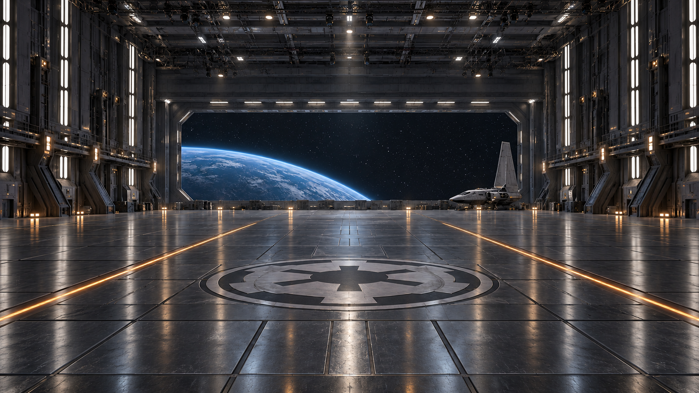</a><figcaption style="font-size:12px;margin-top:5px"><b>H28A</b> — церемония, исходный свет. <a href="references/scenes/scene-28/H28A-ceremony.png" target="_blank" rel="noopener">Открыть PNG</a></figcaption></figure>
<figure style="margin:0"><a href="references/scenes/scene-28/H28B-disco.png" target="_blank" rel="noopener">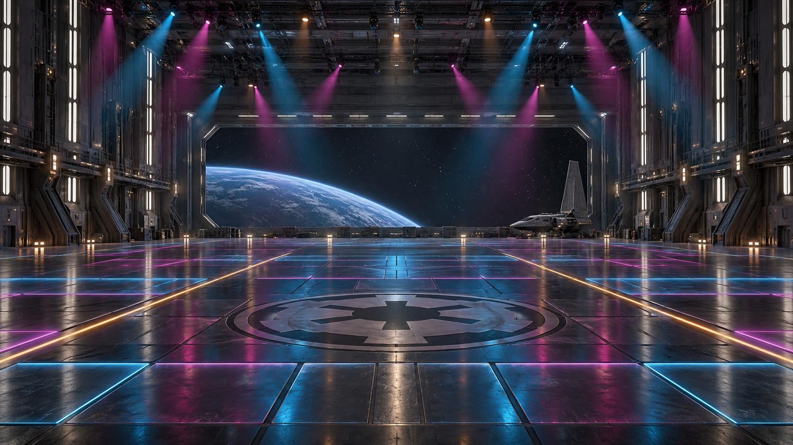</a><figcaption style="font-size:12px;margin-top:5px"><b>H28B</b> — дискотека в том же ангаре. <a href="references/scenes/scene-28/H28B-disco.png" target="_blank" rel="noopener">Открыть PNG</a></figcaption></figure>
</div>

### Сохранённые референсные кадры Scene 28

Эти изображения сохранены отдельно для повторного использования; удачные кадры **не перегенерировать без отдельной причины**. Для внешности каждого персонажа абсолютный приоритет остаётся у его individual model sheet. P28/L28/F28 можно использовать как pose/location continuity references. R28A/R28B — только вспомогательная постановка рядов/композиции, не identity authority. Неудачный полный G28 с перемешанными/дублированными лицами в канон не включён.

<div class="scene28-ref-gallery" style="display:grid;grid-template-columns:repeat(auto-fit,minmax(220px,1fr));gap:12px;margin:14px 0 20px">
<figure style="margin:0"><a href="references/scenes/scene-28/P28-pair-facing.webp" target="_blank" rel="noopener">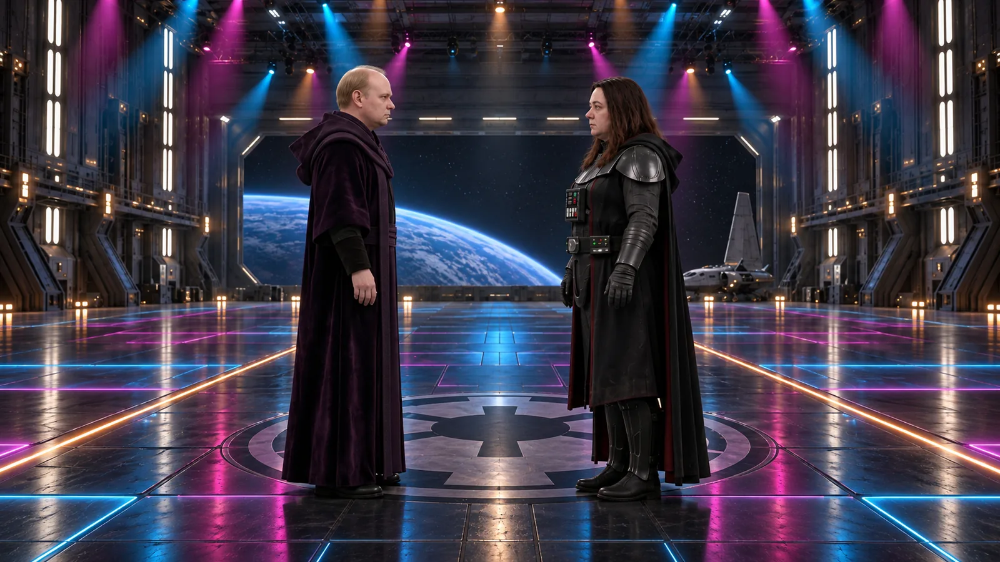</a><figcaption style="font-size:12px;margin-top:5px"><b>P28</b> — пара лицом к лицу; поза, ось и H28B.</figcaption></figure>
<figure style="margin:0"><a href="references/scenes/scene-28/L28-carry.webp" target="_blank" rel="noopener">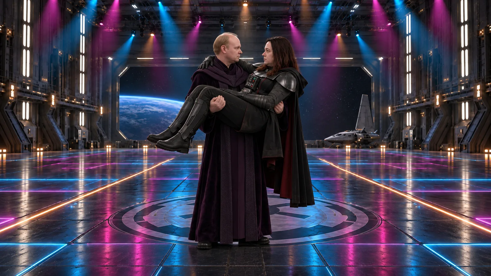</a><figcaption style="font-size:12px;margin-top:5px"><b>L28</b> — перенос Юли на руках; pose reference.</figcaption></figure>
<figure style="margin:0"><a href="references/scenes/scene-28/F28-face-gesture.webp" target="_blank" rel="noopener">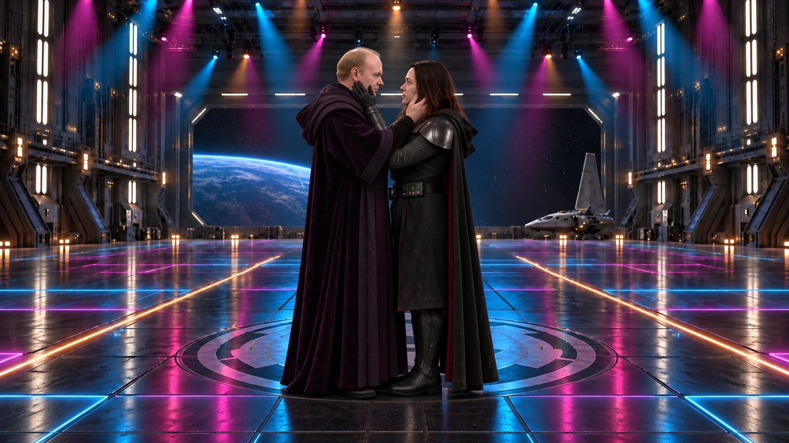</a><figcaption style="font-size:12px;margin-top:5px"><b>F28</b> — взаимный жест у лица; staging reference.</figcaption></figure>
<figure style="margin:0"><a href="references/scenes/scene-28/R28A-second-row.webp" target="_blank" rel="noopener">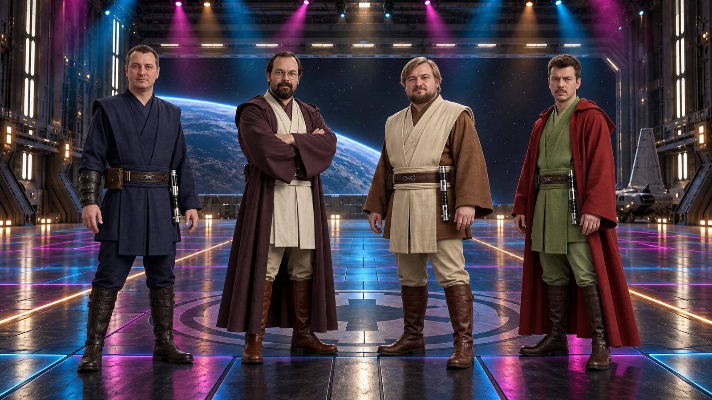</a><figcaption style="font-size:12px;margin-top:5px"><b>R28A</b> — только композиция второго ряда; лица брать из sheets.</figcaption></figure>
<figure style="margin:0"><a href="references/scenes/scene-28/R28B-third-row-cats.webp" target="_blank" rel="noopener">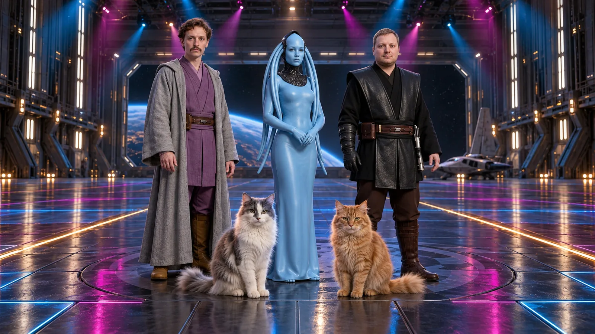</a><figcaption style="font-size:12px;margin-top:5px"><b>R28B</b> — только расстановка третьего ряда/котов; внешний вид брать из sheets.</figcaption></figure>
</div>

**Геометрия:** тёмные металлические рёбра, белые вертикальные световые вставки, две янтарные направляющие на чёрном сатиновом полу, плоская имперская эмблема в центре. В глубине широкий проём с космосом и планетой; справа неподвижный шаттл. H28B сделан как смена света H28A: камера, пол, стены, эмблема, проём и шаттл сохраняются. Нет сцены-подиума, DJ-стойки, барной мебели или новых танцоров. Слабые отражения пола не создают двойников персонажей.

**Световая партитура:** часть 1 начинается в H28A и постепенно приходит к H28B; часть 2 сохраняет стабильный H28B для читаемых взаимных жестов у лица; часть 3 допускает один медленный проход лучей только после завершения разъезда; части 4–7 используют плавное пульсирование пола и медленные симметричные проходы лучей; в частях 8–9 свет стабилен для поддержек, в части 10 лучи останавливаются для финальной позы. Нейтральный мягкий свет на лицах постоянен. Цветные акценты работают на полу, стенах и заднем плане, без пересветов кожи, изменения голубого дизайна Маши и частого стробоскопа. Если модель не удерживает переключение, взять чистую церемониальную и дискотечную фазы и соединить на музыкальном акценте; не маскировать геометрические ошибки вспышкой.

**Общий мотив:** два коротких боковых шага → низкие угловатые предплечья → небольшой поворот плеч → внезапная торжественная остановка. Вариации сохраняют один танец. Никаких улыбок, подмигиваний, эротических жестов, прыжков, бросков партнёра или оружия. Исключение из прежнего запрета поддержек: две отдельные контролируемые парные вставки 8–9, по новой команде пользователя. Маша двигается в пределах своего длинного цельного закрытого костюма; коты остаются обычными четвероногими котами.

### Музыка

**Основная музыкальная рекомендация — Electric Six, “Dance Commander”.** Здесь хорошо работает сочетание рок-гитары, танцевального пульса и комически командного характера: Серёга буквально становится распорядителем парада. Один трек на весь номер; звук генераций в финальной сборке отключить. Рабочее ощущение темпа — около 120–121 BPM, но точную сетку и монтажные точки выставлять по ВЫБРАННОМУ аудиофайлу: каталоговые оценки/версии записи различаются. Не обещать музыкальную синхронизацию одним текстом промта. [Официальное видео](https://www.youtube.com/watch?v=vboGDSUGCyY).

**Отсылка:** в первом сезоне Peacemaker звучит Wig Wam — “Do Ya Wanna Taste It”, во втором — Foxy Shazam — “Oh Lord”. “In My Dreams” и “Killin’ It” из предыдущего обсуждения были предложениями альтернатив, а не названиями тем этих сезонов. Наш выбор — “Dance Commander”; “Oh Lord” можно рассматривать только как альтернативное музыкальное решение с переразметкой монтажа. [Заставка HBO Max, сезон 1](https://www.youtube.com/watch?v=_mrr3UNALww) · [заставка HBO Max, сезон 2](https://www.youtube.com/watch?v=_74zkpM31yw). Для публичного релиза выбранная запись требует отдельного решения по использованию музыки; права этим планом не предоставляются.

### Две версии и общий монтаж примерно на 90 секунд

| Версия | Блоки | Исходный материал | Практическое назначение |
|---|---:|---:|---|
| **A · Seedance 2.0** | **10×15 с** | **150 с** | Основная рекомендация для танца: отдельный короткий дубль каждого действия, проще отбор и замена проблемного жеста. |
| **B · Wan 3.0** | **10×30 с** | **300 с** | Полноценная альтернатива с более длинным вступлением, повтором простого мотива и запасом до/после жеста. Не удваивать скорость или число сложных действий. |

Обе версии рассчитаны на **один итоговый номер около 85–95 секунд**. 150/300 секунд — суммарная длина исходников, а не обязательная длина титров. Одни и те же десять частей сохраняют состав и географию; 30-секундный вариант также разделяет жесты у лица, разъезд и две поддержки на самостоятельные рендеры. `duration_s:15` в scene-meta обозначает основную версию A; в каждом блоке B явно задано 30 секунд.

| Часть | Кто в кадре | Содержание и свет | Ориентир для монтажа |
|---:|---|---|---:|
| 1 | Серёга + Юля | Официальная стойка → танцпол и лучи → сближение. | 8 с |
| 2 | Серёга + Юля | Четыре взаимных прохода рукой у внешней щеки, строго по очереди; затем обе руки опущены. Свет стабильный. | 10 с |
| 3 | Серёга + Юля | Разъезд скользящими шагами назад в противоположные стороны с сохранением взгляда. | 8 с |
| 4 | Паша + Саша | Зеркальный джедайский устав. | 8 с |
| 5 | Артём + Илюша | Тяжеловесная вариация общего рисунка. | 8 с |
| 6 | Маша + Лёша + Виталик | Маша задаёт фигуру, мужчины отвечают с запаздыванием. | 9 с |
| 7 | Лучик + Рыжик | Кошачьи шаги, поворот головы и подъём лапы. | 7 с |
| 8 | Серёга + Юля | После склейки он уже держит её на руках; один размеренный полукруг мелкими шагами. | 9 с |
| 9 | Серёга + Юля | Новая склейка: она уже сидит боком на его правом плече; два парадных шага и замер. | 9 с |
| 10 | Все 11 | Общий акцент и торжественно нелепая финальная поза. | 4 с + 10 с стоп-кадра |

Это даёт около 90 секунд. Короткие окна — ориентир: выбирать чистые целые движения и при необходимости расширить монтаж до 95–105 с, не ускорять силой взаимодействия рук/тел. Точные склейки выставить по выбранному аудиофайлу: генерационные 15/30 секунд не обязаны совпадать с музыкальными фразами. При ~120 BPM 15 секунд — примерно 30 долей, не целое число четырёхдольных тактов; обрезать на сильную долю и использовать запас. Касание и ноги не исправлять агрессивным optical flow. Для финальных 11 персонажей достаточно нескольких чистых секунд; длинный хвост Wan — запас для выбора, не просьба всё время усложнять танец.

### Выбор модели и порядок работы

**Рекомендация — Seedance 2.0 по 15 секунд.** Это производственный выбор для коротких взаимодействий, контроля рук и монтажной замены, а не результат уже проведённого A/B-теста наших персонажей. Seedance 2.0 официально заявляет улучшения сложного движения/взаимодействий, но сам разработчик отмечает ограничения согласованности нескольких персонажей. Без сравнения одинакового эпизода нельзя честно объявить его гарантированно лучше Wan 3.0. Для спокойного открытия ангара и простого парного танца 30 секунд Wan могут быть удобны; для касания щеки, трио и общего ансамбля я бы начал с короткой версии.

При подготовке проверен live Topview config: **Seedance 2.0 — 4–15 с; Wan 3.0 — 2–30 с**, обе модели доступны в `omni_reference`, 1080p, 16:9. Подпись Wan 3.0 относится к модели, доступной в Topview; не переносить на неё автоматически сведения о других версиях Wan. Источники: [официальное описание Seedance 2.0](https://seed.bytedance.com/en/blog/seedance-2-0-official-launch) · [страница сравнения Topview](https://www.topview.ai/wan-3-vs-seedance-2).

- Части 1–9: `omni_reference`, 3–4 изображения по конкретной схеме блока. Это выбранный бюджет постановки, не заявление о максимуме модели. Model sheet с несколькими видами описывает одного персонажа.
- Часть 10: `image_to_video`, один заранее собранный и проверенный G28. Перед отправкой сверить текущую доступность режима выбранного движка; не подменять движок молча. При дрейфе 11 лиц использовать сам G28 с монтажным стоп-кадром/небольшим наездом.
- В текущем standalone Topview video tool нет входа reference audio. Это ограничение данного интерфейса, не утверждение, что модель нигде не поддерживает аудиореференс. Песню накладывать в CapCut/другом редакторе; `@Audio1` в эти промты не добавлять. Синхронизация ударов музыки — монтажная задача.
- Начать с теста части 2, затем части 3; оценить руку/щёку, лица, ось и ноги. Другую модель пробовать на том же эпизоде и с теми же входами, если нужен честный A/B. Не запускать сразу 20 задач. Новые поддержки сначала отдельно проверить на чистых L28/S28; сложную пересадку с рук на плечо не генерировать одним движением. Existing slow-задачи Scene 20 не отменять и не перезапускать.
- Видеозапуски — после отдельной команды пользователя и при наличии входов/свободных слотов. Приёмка: лица и костюмы → рука/щёка → ноги → география и свет → музыкальный акцент. Титры добавляются в редакторе, а не внутри генерации.

### Оставшиеся визуальные входы

**H28A/H28B уже существуют:** файлы выше. В части 1 H28A задаёт архитектуру/начальный свет, H28B — только конечное световое состояние; не смешивать два ракурса и не создавать второй зал. В частях 2–9 достаточно H28B как environment reference. Он не заменяет individual character sheets и не обязан задавать ту же крупность кадра.

**P28 — создан и сохранён.** [Открыть WEBP](https://virudik.github.io/ai-film-prompts/references/scenes/scene-28/P28-pair-facing.webp). Парный средний кадр в H28B: Серёга слева в профиль смотрит вправо, Юля справа — влево, лица на расстоянии 55–65 см; обе правые руки опущены. Камера видит внешние щёки и свободный путь каждой руки. P28 задаёт только позу/ось/кадрирование, model sheets сохраняют приоритет внешности.

**C28 — ещё не выбран.** После части 2 взять чистый кадр ПОСЛЕ полного отхода обеих рук. Для части 3 это reference позы и оси, а не буквальное кадрирование: общий план сознательно шире среднего. При дефекте кисти выбрать чистый предконтактный жест и монтажный акцент; искажённое лицо не переносить в следующий reference.

**L28 — создан и сохранён.** [Открыть WEBP](https://virudik.github.io/ai-film-prompts/references/scenes/scene-28/L28-carry.webp). Чистый общий парный кадр для части 8: Серёга стоит устойчиво и уже держит Юлю поперёк перед собой, левая рука поддерживает её спину, правая — бёдра над коленями. Её голова со стороны его левого плеча, согнутые ноги с правой; обе головы и все опорные конечности различимы. Плащи не переплетены. Это постановочный pose reference, individual sheets выше него по внешности.

**S28 — требует нового корректного кадра.** Предыдущая попытка не принимается: посадка Юли на плече получилась не по постановке. Нужен отдельный общий парный кадр для части 9: Юля сидит прямо боком на правом плече Серёги, обе согнутые ноги перед правой стороной его корпуса; его правая рука держит бёдра, левая стабилизирует голени. Головы разнесены и видны. Не пытаться одновременно развернуть, поднять и пересадить её из L28: переход делается монтажной склейкой. Эта конкретная поза — наша постановка мотива «на плече», а не утверждение о точной позе из сериала.

**G28 — требует новой сборки.** Предыдущие полные групповые попытки не принимаются из-за смешения лиц, дублей и лишних персонажей. Собрать общий кадр в ангаре H28B из отдельных проверенных персонажей небольшими группами/слоями. Передний человеческий ряд: Серёга слева, Юля справа. Второй слева направо: Паша, Саша, Артём, Илюша. Третий: Лёша, Маша, Виталик. Ряды раздвинуты, каждое лицо видно. Лучик на полу впереди слева, Рыжик справа, головы ниже человеческого колена. Низкая угловатая поза, руки не закрывают лица. У Маши гладкий непрозрачный голубой торс и длинный подол. G28 — один first frame части 10 после проверки всех 9+2 персонажей по их individual sheets.

Ниже — полные тексты для указанных входов. Нумерация @Image локальна каждому промту. P28/L28/F28 уже сохранены; R28A/R28B — helpers композиции. C28/S28/G28 перед использованием соответствующих блоков ещё нужно подготовить/проверить. Individual character sheets всегда выше generated pose/composition reference по внешности.

### Версия A — Seedance 2.0, десять роликов по 15 секунд

#### A1 · Танец 1 — Серёга и Юля задают устав

**Референсы:** @Image1 = H28A (ангар и начальный свет) · @Image2 = sheet Серёги · @Image3 = sheet Юли · @Image4 = H28B (только конечный дискотечный свет).

**Используемые identity-референсы на сайте:**
<div class="scene-ref-gallery" style="display:grid;grid-template-columns:repeat(auto-fit,minmax(145px,1fr));gap:10px;margin:10px 0 16px">
<figure style="margin:0"><a href="references/serega.webp" target="_blank" rel="noopener"></a><figcaption style="font-size:12px;margin-top:5px">Серёга</figcaption></figure>
<figure style="margin:0"><a href="references/yulya.webp" target="_blank" rel="noopener"></a><figcaption style="font-size:12px;margin-top:5px">Юля</figcaption></figure>
<figure style="margin:0"><a href="references/pasha.webp" target="_blank" rel="noopener"></a><figcaption style="font-size:12px;margin-top:5px">Паша</figcaption></figure>
<figure style="margin:0"><a href="references/sasha.webp" target="_blank" rel="noopener"></a><figcaption style="font-size:12px;margin-top:5px">Саша</figcaption></figure>
<figure style="margin:0"><a href="references/artem.webp" target="_blank" rel="noopener"></a><figcaption style="font-size:12px;margin-top:5px">Артём</figcaption></figure>
<figure style="margin:0"><a href="references/ilyusha.webp" target="_blank" rel="noopener"></a><figcaption style="font-size:12px;margin-top:5px">Илюша</figcaption></figure>
<figure style="margin:0"><a href="references/lesha.webp" target="_blank" rel="noopener"></a><figcaption style="font-size:12px;margin-top:5px">Лёша</figcaption></figure>
<figure style="margin:0"><a href="references/vitalik.webp" target="_blank" rel="noopener"></a><figcaption style="font-size:12px;margin-top:5px">Виталик</figcaption></figure>
<figure style="margin:0"><a href="references/masha-laguna.webp" target="_blank" rel="noopener"></a><figcaption style="font-size:12px;margin-top:5px">Маша-Лагуна</figcaption></figure>
<figure style="margin:0"><a href="references/luchik.jpg" target="_blank" rel="noopener"></a><figcaption style="font-size:12px;margin-top:5px">Лучик</figcaption></figure>
<figure style="margin:0"><a href="references/ryzhik.jpg" target="_blank" rel="noopener"></a><figcaption style="font-size:12px;margin-top:5px">Рыжик</figcaption></figure>
</div>

```text
Mode: omni-reference video | Target model: Seedance 2.0 | Duration: 15s | Resolution: 1080p | Aspect ratio: 16:9
Audio intent: silent dance plate for externally added music; no dialogue, singing or generated score.

REFERENCES / PRIORITY:
@Image1 is the supplied H28A empty hangar: exact architecture, floor markings, camera axis and STARTING white/amber ceremonial light only. @Image4 is the SAME empty hangar in H28B lighting: use it ONLY as the ENDING cyan/magenta floor-and-ceiling light target, never a second room or a second camera. @Image2 is the exact SEREGA identity/costume sheet; @Image3 is the exact YULIA identity/costume sheet. Individual sheets outrank the location for faces, age, proportions and clothing. Multiple views on a sheet describe ONE person. Exactly two performers; no other people or animals.

CHARACTER APPEARANCE / IDENTITY LOCK:
SEREGA is the pale older Chancellor with a balding crown, sparse light hair and a long deep-purple robe. YULIA has the exact referenced face, long chestnut hair, dark black-grey armor, shoulder pieces, gloves and a long black cloak. Preserve both faces and builds; no beautification or costume redesign. Hands stay empty; no lightsabers.

SCENE / STYLE:
Photoreal live-action Imperial space-cruiser ceremonial hangar. Match the supplied location geometry: tall graphite ribs and white wall strips, satin dark floor with a flush Imperial starburst medallion, two amber guide lines and embedded cyan/magenta tile borders. A huge rear opening frames stationary space and a planet; one shuttle stays parked deep frame-right. The dance floor is the original hangar floor, not a newly appearing stage. Reflections stay faint and never create duplicate performers. No traffic, extra furniture, DJ booth or crowd.

START STATE:
Full-body frontal symmetrical two-shot. Serega is frame-left and Yulia frame-right, about three metres apart, both facing the camera between the two floor lines. Camera is outside their path, looking toward the rear opening. Both look solemn and ready for an official inspection.

LIGHTING CUE / CONTINUITY:
Start with the ceremonial H28A state: white and amber practical lights only; cyan/magenta circuits and overhead colored beams are OFF. Follow the timeline to turn on the embedded floor strips first, then the ceiling beams, reaching the H28B lighting state before the final approach. Once lit, keep the ending light stable. Keep soft neutral-white key/fill on every face constant, with stable exposure and readable natural skin. Cyan/magenta accents affect floor, rear walls and thin overhead haze, never wash out faces or recolor costumes. Preserve the exact architecture, camera axis, shuttle and planet. Lighting changes are gradual adjustments of existing fixtures, not morphing scenery, flashes or rapid strobing.

TIMELINE / ACTION:
0–3s: hold the formal inspection stance in strict white/amber ceremonial light. Natural breathing and serious forward gaze; no dance or colored light yet.
3–6s: the embedded cyan/magenta floor borders slowly illuminate. Both performers keep their official posture as though nothing unusual has happened. Existing white facial fill remains unchanged.
6–11s: overhead colored beams gradually become visible, reaching the supplied H28B state. Both perform two small inward step-touches with low angular forearms, one restrained shoulder quarter-turn, then square back to camera. Grounded weight transfer and natural robe inertia; no high kicks.
11–14s: with the disco lighting now steady, each takes a final small inward step and turns toward the other: Serega left faces right; Yulia right faces left. Stop at about 60 cm face separation without touching.
14–15s: hold that facing position, both hands lowered, deadpan; all lighting steady.

CAMERA / PERFORMANCE / MATERIALS:
One locked, chest-height full-body camera, approximately 35mm equivalent perspective; feet remain visible and heads have safe margin. No orbit, zoom or cut. Serious faces, normal blinking, restrained breathing and physically grounded foot contact. Preserve skin texture, cloth weight, armor response and consistent neutral face-light shadows. No smiles or comedy mugging.

END STATE:
Serega left facing right and Yulia right facing left, approximately 60 cm face separation, both hands lowered. The next editorial shot may be closer on this same axis. H28B disco lighting is established and steady at the last frame.

NEGATIVE PROMPT:
Rapid strobing, facial color flicker, magenta skin, costume recoloring, lighting-driven identity drift, new room geometry, DJ booth, generated text, Extra dancers, duplicated sheet views, swapped identities, reversed screen positions, face drift, new hairstyle, wardrobe change, extra arms or fingers, skating without weight transfer, tangled cloak, fast spins, high kicks, weapons, heavy floor mirror images, moving architecture, abrupt light flashes, exaggerated facial comedy, singing, subtitles, credits, logos, watermark, camera shake or cuts.

FRAME FILL / NO BARS:
Fill the entire generated frame edge-to-edge. No letterboxing, pillarboxing, black bars, decorative borders or empty margins.
```

#### A2 · Танец 2 — Четыре взаимных жеста у лица

**Референсы:** @Image1 = H28B · @Image2 = sheet Серёги · @Image3 = sheet Юли · @Image4 = будущий P28 (только постановка пары).

```text
Mode: omni-reference video | Target model: Seedance 2.0 | Duration: 15s | Resolution: 1080p | Aspect ratio: 16:9
Audio intent: silent performance plate; external music will be added in editing. No speech, singing or generated score.

REFERENCES / PRIORITY:
@Image1 is the supplied H28B hangar location/H28B light design only. @Image2 is the absolute SEREGA face/body/costume reference. @Image3 is the absolute YULIA face/body/costume reference. @Image4 controls this two-person pose, camera angle and framing only. Identity sheets override the pair composition for individual appearance. Exactly two people; each multi-view sheet represents one person.

CHARACTER APPEARANCE / IDENTITY LOCK:
SEREGA: exact pale older face, balding crown with sparse light hair, long deep-purple Chancellor robe. YULIA: exact face and build, long chestnut hair, black-grey armor and shoulder pieces, gloves, long black cloak. Do not restyle either person or obscure their eyes. Each person's right hand has five stable fingers; Yulia keeps her approved glove. Never merge a glove or fingers into skin.

SCENE / START STATE:
Photoreal live-action Imperial space-cruiser ceremonial hangar. Match the supplied location geometry: tall graphite ribs and white wall strips, satin dark floor with a flush Imperial starburst medallion, two amber guide lines and embedded cyan/magenta tile borders. A huge rear opening frames stationary space and a planet; one shuttle stays parked deep frame-right. The dance floor is the original hangar floor, not a newly appearing stage. Reflections stay faint and never create duplicate performers. No traffic, extra furniture, DJ booth or crowd. Medium waist-up profile two-shot from @Image4: Serega frame-left faces right, Yulia frame-right faces left, their faces about 60 cm apart. Both right hands are down. The camera sees both outer cheeks and the separate paths each hand will take.

LIGHTING CUE / CONTINUITY:
Use the established H28B disco state from the first frame to the last: cyan/magenta floor borders and visible overhead beams, all held STEADY. No pulses or moving beams during the hand-to-cheek gesture. Do not restart the lights or revert to the ceremonial state. Keep soft neutral-white key/fill on every face constant, with stable exposure and readable natural skin. Cyan/magenta accents affect floor, rear walls and thin overhead haze, never wash out faces or recolor costumes. Preserve the exact architecture, camera axis, shuttle and planet. Lighting changes are gradual adjustments of existing fixtures, not morphing scenery, flashes or rapid strobing.

TIMELINE / FOUR ALTERNATING HAND PASSES:
Each pass follows the same short outside-cheek arc from cheekbone toward jaw. Use the back of softly grouped fingers; one very light surface brush is allowed, never pressure or a broad palm covering eyes/nose/mouth. Fully withdraw through visible air before the other person raises a hand. Only ONE hand moves at a time; the other person's hands stay down. Four passes total: SEREGA, YULIA, SEREGA, YULIA. Neither head chases the hand; both remain deadpan.
0–1s: Hold the solemn facing stance; both hands down.
1–3.5s: SEREGA makes the first right-hand pass, then withdraws his hand.
3.5–6s: YULIA answers with her right hand, then withdraws it.
6–8.5s: SEREGA repeats the same restrained pass once and withdraws.
8.5–11s: YULIA repeats her answering pass once and withdraws.
11–13s: Both lower their hands fully to their own sides; feet stay planted.
13–15s: Hold a clean, fully separated hands-down end pose for the next wide shot.

CAMERA / PERFORMANCE / REALISM:
One locked medium two-shot with natural 50mm-equivalent perspective. Keep the entire moving hand and both faces visible; never cut to a hand close-up. Maintain the left/right profile axis. Stable practical light, natural skin and fabric detail, no beauty filter. The joke is total earnestness during an oddly formal gesture; no grin, wink, seduction, slap or exaggerated reaction.

END STATE:
The same two people face one another on the same axis, stationary, both right hands fully lowered and a visible air gap between every hand and either face. A later wide shot starts from this no-contact state. H28B disco lighting is established and steady at the last frame.

NEGATIVE PROMPT:
Rapid strobing, facial color flicker, magenta skin, costume recoloring, lighting-driven identity drift, new room geometry, DJ booth, generated text, Hand covering eyes, grabbing face, palm wipe across nose, cheek stretching, melted fingers, fingers fused to skin, extra hand, left-hand substitutions, simultaneous face-touching, a fifth pass, changing face, changed hair, incorrect costume, kiss, embrace, simultaneous footwork, sliding separation, extra person, weapons, camera orbit, shake, cuts, subtitles, text, logos, watermark.

FRAME FILL / NO BARS:
Fill the entire generated frame edge-to-edge. No letterboxing, pillarboxing, black bars, decorative borders or empty margins.
```

#### A3 · Танец 3 — Невозмутимый разъезд

**Референсы:** @Image1 = H28B · @Image2 = sheet Серёги · @Image3 = sheet Юли · @Image4 = будущий C28 после отхода руки (только поза/ось; общий план шире).

```text
Mode: omni-reference video | Target model: Seedance 2.0 | Duration: 15s | Resolution: 1080p | Aspect ratio: 16:9
Audio intent: silent dance plate for an external soundtrack. No dialogue, vocals or generated score.

REFERENCES / PRIORITY:
@Image1 defines the supplied H28B hangar architecture, floor and light. @Image2 is the exact SEREGA identity/costume sheet. @Image3 is the exact YULIA identity/costume sheet. @Image4 defines only the face-to-face orientation and the arms-down pose AFTER the cheek gesture; it does not set this wider framing. Preserve the individual identities above all other image information. Exactly two people.

CHARACTER APPEARANCE / IDENTITY LOCK:
SEREGA: pale older Chancellor, balding crown, sparse light hair, long deep-purple robe and the exact referenced face/build. YULIA: exact face/build, long chestnut hair, black-grey armor with shoulder pieces and gloves, long black cloak. Empty hands, unchanged clothing; both feet remain grounded and anatomically correct.

SCENE / START STATE:
Photoreal live-action Imperial space-cruiser ceremonial hangar. Match the supplied location geometry: tall graphite ribs and white wall strips, satin dark floor with a flush Imperial starburst medallion, two amber guide lines and embedded cyan/magenta tile borders. A huge rear opening frames stationary space and a planet; one shuttle stays parked deep frame-right. The dance floor is the original hangar floor, not a newly appearing stage. Reflections stay faint and never create duplicate performers. No traffic, extra furniture, DJ booth or crowd. Wide full-body frontal camera on the same stage axis. Serega is left facing right, Yulia right facing left, about 60 cm between their faces. BOTH hands are already lowered; there is no hand-face contact.

LIGHTING CUE / CONTINUITY:
Begin in the same steady H28B state as the preceding cheek shot. Hold lighting steady throughout the retreat. Only after both people stop may the rear ceiling beams make one slow outward sweep; keep them away from faces. End at the full disco lighting level. Keep soft neutral-white key/fill on every face constant, with stable exposure and readable natural skin. Cyan/magenta accents affect floor, rear walls and thin overhead haze, never wash out faces or recolor costumes. Preserve the exact architecture, camera axis, shuttle and planet. Lighting changes are gradual adjustments of existing fixtures, not morphing scenery, flashes or rapid strobing.

TIMELINE / GLIDE GEOMETRY:
0–2s: hold the close facing pose; a short stillness sets up the musical edit.
2–9s: they make three small, smooth backward heel-toe shuffles AWAY from one another. Serega travels toward frame-left while still facing right; Yulia travels toward frame-right while still facing left. Each retreats roughly 1.2 metres along one straight horizontal line. Controlled alternating foot pressure creates a smooth theatrical glide; feet never levitate and bodies do not teleport. No lateral crossing, spinning or contact. They maintain eye contact throughout this retreat.
9–12s: both stop under control, now about three metres apart. Their cloaks settle with real inertia.
12–14s: both turn their torsos and heads toward the camera and raise bent forearms into a deliberately severe, low angular parade pose.
14–15s: hold the pose with unchanged serious faces.

CAMERA / ACTING / MATERIALS:
One locked full-body symmetrical view, approximately 35mm perspective; room on both outer sides for the retreat. Camera must not track a character and hide the separation. Keep feet and the growing air gap readable. Satin reflections are soft and secondary. No moving platforms, floor mechanisms, magic beams or wheels. Natural cloth, breathing and foot friction; absurdly formal performance without smiling.

END STATE:
Serega left, Yulia right, three metres apart, facing the camera in the same low angular arm pose. This pose supplies the graphic match-cut to the next dancing pair. Keep the established H28B disco palette and unchanged neutral facial fill through the final frame.

NEGATIVE PROMPT:
Rapid strobing, facial color flicker, magenta skin, costume recoloring, lighting-driven identity drift, new room geometry, DJ booth, generated text, Hands touching face, attached hands during separation, stretched arms, pulled skin, reversed directions, crossing positions, sliding into each other, floating, ice-skating blades, wheels, conveyor belts, teleportation, foot distortion, identity swap, duplicate bodies, heavy mirrored doubles, weapons, slapstick faces, camera movement, cuts, generated credits, text, logos or watermark.

FRAME FILL / NO BARS:
Fill the entire generated frame edge-to-edge. No letterboxing, pillarboxing, black bars, decorative borders or empty margins.
```

#### A4 · Танец 4 — Паша и Саша: джедайский устав

**Референсы:** @Image1 = H28B · @Image2 = sheet Паши · @Image3 = sheet Саши.

```text
Mode: omni-reference video | Target model: Seedance 2.0 | Duration: 15s | Resolution: 1080p | Aspect ratio: 16:9
Audio intent: silent dance plate; external soundtrack in post. No dialogue, singing or generated score.

REFERENCES / PRIORITY:
@Image1 is the supplied empty hangar environment, framing family and the H28B lighting design only. @Image2 is the exact PASHA identity/costume sheet. @Image3 is the exact SASHA identity/costume sheet. Each sheet supplies one person, not a cast of its multiple views. Individual sheets control faces and clothes above all environment information. Exactly two Jedi, empty hands and no lightsabers.

CHARACTER APPEARANCE / IDENTITY LOCK:
PASHA has the exact referenced clean-shaven face and build, dark navy Jedi tunic, brown belt, dark trousers and tall boots. SASHA has the exact referenced bearded face, round glasses, cream inner tunic and dark burgundy-brown outer robe. Keep Sasha's glasses stable and present. Do not transfer beard, glasses, hair or costume between them.

SCENE / START STATE:
Photoreal live-action Imperial space-cruiser ceremonial hangar. Match the supplied location geometry: tall graphite ribs and white wall strips, satin dark floor with a flush Imperial starburst medallion, two amber guide lines and embedded cyan/magenta tile borders. A huge rear opening frames stationary space and a planet; one shuttle stays parked deep frame-right. The dance floor is the original hangar floor, not a newly appearing stage. Reflections stay faint and never create duplicate performers. No traffic, extra furniture, DJ booth or crowd. Full-body pair composition: Pasha frame-left, Sasha frame-right, facing camera with bent forearms held in a low angular shape. Each has room to step without entering the other's silhouette.

LIGHTING CUE / CONTINUITY:
Full H28B disco state is already active at the first frame. Floor borders breathe gently in a two-second cycle and ceiling beams make slow mirrored sweeps over the rear half of the floor. White facial fill and amber guide lines remain steady. Keep soft neutral-white key/fill on every face constant, with stable exposure and readable natural skin. Cyan/magenta accents affect floor, rear walls and thin overhead haze, never wash out faces or recolor costumes. Preserve the exact architecture, camera axis, shuttle and planet. Lighting changes are gradual adjustments of existing fixtures, not morphing scenery, flashes or rapid strobing.

TIMELINE / CHOREOGRAPHY:
0–2s: hold the angular opening pose, perfectly solemn.
2–6s: two small synchronized step-touches toward frame-left. On each landing the forearms tilt as one stiff geometric shape, then return level. Hands never pass across faces.
6–10s: reverse with two small step-touches toward frame-right, returning to the original marks. Bodies remain upright; robes respond naturally.
10–13s: both lower their arms, turn their shoulders a quarter-turn toward each other, then square back to the lens as if receiving an absurd military command.
13–15s: simultaneously raise only the elbows into the same low angular ending pose and become almost still. Natural blinking continues.

CAMERA / PERFORMANCE / MATERIALS:
Locked chest-height camera with moderate 35mm perspective, both complete bodies and boots visible. No orbit, zoom or cut. The movement is small, readable, precisely ordered and intentionally odd; neither performer plays a joke to camera. Preserve skin texture, fabric weave, weighted robe hems, soft boot contact and consistent neutral face-light shadows. No rigid frozen facial mask.

END STATE:
Pasha remains left and Sasha right on their initial marks, facing camera in the angular low-arm pose, ready for a graphic match-cut to another pair. Keep the established H28B disco palette and unchanged neutral facial fill through the final frame.

NEGATIVE PROMPT:
Rapid strobing, facial color flicker, magenta skin, costume recoloring, lighting-driven identity drift, new room geometry, DJ booth, generated text, Four Jedi, background dancers, duplicated people, identity blending, missing glasses, glasses deformation, beard transfer, navy/burgundy clothing swap, extra fingers, arms through robes, high kicks, acrobatics, weapons, smiling, mugging, glossy game render, changing hangar geometry, abrupt unplanned light changes, strong mirrored doubles, camera shake, edits, text, credits, logos, watermark.

FRAME FILL / NO BARS:
Fill the entire generated frame edge-to-edge. No letterboxing, pillarboxing, black bars, decorative borders or empty margins.
```

#### A5 · Танец 5 — Артём и Илюша: заводные церемониальные фигуры

**Референсы:** @Image1 = H28B · @Image2 = sheet Артёма · @Image3 = sheet Илюши.

```text
Mode: omni-reference video | Target model: Seedance 2.0 | Duration: 15s | Resolution: 1080p | Aspect ratio: 16:9
Audio intent: silent dance plate; music added externally. No dialogue, singing or generated score.

REFERENCES / PRIORITY:
@Image1 defines only the supplied H28B hangar architecture, floor markings, lighting and background. @Image2 is the exact ARTEM identity/costume model sheet. @Image3 is the exact ILYUSHA identity/costume model sheet. Individual sheets override all other appearance information. Each multi-view sheet describes one person. Exactly these two performers, no other people or animals.

CHARACTER APPEARANCE / IDENTITY LOCK:
ARTEM has the exact referenced heavier build, short beard, cream-beige tunic, brown outer robe, broad belt and brown boots. ILYUSHA has the exact referenced face, moustache, chestnut hair, olive-green tunic, deep-red hooded cloak and brown boots. Preserve the sheet's hood placement and face visibility. Do not swap beard, moustache, colors or builds. Hands empty, no sabers.

SCENE / START STATE:
Photoreal live-action Imperial space-cruiser ceremonial hangar. Match the supplied location geometry: tall graphite ribs and white wall strips, satin dark floor with a flush Imperial starburst medallion, two amber guide lines and embedded cyan/magenta tile borders. A huge rear opening frames stationary space and a planet; one shuttle stays parked deep frame-right. The dance floor is the original hangar floor, not a newly appearing stage. Reflections stay faint and never create duplicate performers. No traffic, extra furniture, DJ booth or crowd. Artem stands frame-left and Ilyusha frame-right, full-body, front-facing, elbows bent in a low angular pose.

LIGHTING CUE / CONTINUITY:
Full H28B disco state is already active. Use the same gentle two-second floor-light pulse and one slow symmetrical outward/inward ceiling-beam sweep across the background. Do not change the palette or neutral facial fill. Keep soft neutral-white key/fill on every face constant, with stable exposure and readable natural skin. Cyan/magenta accents affect floor, rear walls and thin overhead haze, never wash out faces or recolor costumes. Preserve the exact architecture, camera axis, shuttle and planet. Lighting changes are gradual adjustments of existing fixtures, not morphing scenery, flashes or rapid strobing.

TIMELINE / CHOREOGRAPHY:
0–2s: hold with severe, earnest faces.
2–6s: both take two short grounded side-steps toward frame-right, knees softly flexing at each landing. The heavy robes settle a fraction after the bodies, while faces remain dignified.
6–10s: both return toward frame-left in two steps. Forearms stay angular and make one restrained outward-inward pulse below shoulder height; no hand flourishes.
10–13s: they perform one slow, synchronized quarter-turn of shoulders away from each other, then return square to camera with an absurdly precise stop. Their feet pivot naturally instead of twisting through the floor.
13–15s: lower hands to the belt area and hold an official inspection stance.

CAMERA / PERFORMANCE / REALISM:
One locked full-body symmetrical camera, chest height and approximately 35mm perspective. Maintain the initial screen positions, stable horizon and enough room around robe hems. No cuts or camera orbit. Choreography is stiff by intention but bodies retain real weight, natural breathing and fabric inertia. Preserve matte cloth, natural skin detail and restrained floor reflections. No comedy expressions or broad head bobbing.

END STATE:
Both stand at their original marks, arms low, looking directly at camera. Their posture reads as a solemn ceremonial punctuation to the same dance motif. Keep the established H28B disco palette and unchanged neutral facial fill through the final frame.

NEGATIVE PROMPT:
Rapid strobing, facial color flicker, magenta skin, costume recoloring, lighting-driven identity drift, new room geometry, DJ booth, generated text, Extra performers, identity change, beard/moustache swapping, red cloak on Artem, brown robe replacing Ilyusha's cloak, giant shoulders, human duplication from sheets, tangled limbs, fused hands, cloak morphing, high kicks, jumps, acrobatics, weapons, facial mugging, changing location, moving shuttle, mirrored doubles, cartoon motion, unstable camera, cuts, titles, logos, watermark.

FRAME FILL / NO BARS:
Fill the entire generated frame edge-to-edge. No letterboxing, pillarboxing, black bars, decorative borders or empty margins.
```

#### A6 · Танец 6 — Маша, Лёша и Виталик: торжественный сбой

**Референсы:** @Image1 = H28B · @Image2 = sheet Маши Лагуны · @Image3 = sheet Лёши · @Image4 = sheet Виталика.

```text
Mode: omni-reference video | Target model: Seedance 2.0 | Duration: 15s | Resolution: 1080p | Aspect ratio: 16:9
Audio intent: silent dance plate; external soundtrack in edit. No singing, dialogue, lip sync or generated score.

REFERENCES / PRIORITY:
@Image1 is the supplied H28B hangar architecture/H28B light design only. @Image2 is the absolute MASHA-LAGUNA identity/design sheet. @Image3 is the absolute LESHA identity/costume sheet. @Image4 is the absolute VITALIK identity/costume sheet. Preserve these three separate identities; multiple sheet views never create extra performers. Exactly three characters.

CHARACTER APPEARANCE / IDENTITY LOCK:
MASHA-LAGUNA is the tall slender adult aquatic-blue woman with the exact human face, long light-blue tentacle-like head strands and black ornamental crown, neck collar and upper-back structure. Her exact floor-length light-blue costume has an OPAQUE, continuous smooth torso covering the entire chest and abdomen. The torso is costume material, not bare skin: no nipples, areolae, navel, anatomical breast-tip relief, cutouts or transparency. Preserve the reference silhouette without adding new clothing panels or changing the long hem.
LESHA is the exact slimmer moustached man in a purple inner tunic, long grey hooded robe, brown belt and light boots. VITALIK is the exact heavier-built man in a black tunic, dark leather/armor panels, brown trousers and tall boots. Do not blend their faces, builds or costumes. All hands are empty.

SCENE / START STATE:
Photoreal live-action Imperial space-cruiser ceremonial hangar. Match the supplied location geometry: tall graphite ribs and white wall strips, satin dark floor with a flush Imperial starburst medallion, two amber guide lines and embedded cyan/magenta tile borders. A huge rear opening frames stationary space and a planet; one shuttle stays parked deep frame-right. The dance floor is the original hangar floor, not a newly appearing stage. Reflections stay faint and never create duplicate performers. No traffic, extra furniture, DJ booth or crowd. Masha is in the centre, Lesha frame-left and Vitalik frame-right, each separated by clear air. A locked frontal full-body camera sees Masha's intact long silhouette.

LIGHTING CUE / CONTINUITY:
Full H28B disco state is already active, with gentle two-second floor pulses and slow background beam sweeps. Keep the entire trio in neutral soft white fill. Masha must remain the same aquatic blue with a smooth opaque blue costume, never magenta skin or transparent glowing torso. Keep soft neutral-white key/fill on every face constant, with stable exposure and readable natural skin. Cyan/magenta accents affect floor, rear walls and thin overhead haze, never wash out faces or recolor costumes. Preserve the exact architecture, camera axis, shuttle and planet. Lighting changes are gradual adjustments of existing fixtures, not morphing scenery, flashes or rapid strobing.

TIMELINE / CHOREOGRAPHY:
0–3s: all three stand formally, serious and motionless apart from breathing.
3–7s: Masha raises both bent forearms into a low square shape, tilts that shape gently left then right, and stops. Lesha and Vitalik repeat that single short gesture a moment after her, like over-serious attendants responding to a command. No overlapping silhouettes or rapid arm waves.
7–11s: all three make two very small step-touches in place. Masha's steps remain inside the practical movement range of her floor-length costume; do not split the hem, expose legs or invent a tail. Head strands lag softly with natural inertia.
11–13s: all lower their hands and rotate their shoulders slightly toward centre, then face the lens again.
13–15s: the trio freezes in a dignified low angular pose, completely convinced of its grandeur.

CAMERA / ACTING / MATERIALS:
One locked approximately 40mm full-body composition with equal facial readability. No close-up of Masha's torso. Comedy comes from the delayed response and solemn timing, never a sexual gesture. Preserve natural faces, fabric/armor weight, smooth opaque blue costume material and stable low-intensity floor reflections. Architecture and neutral facial fill never change; only the specified background/floor disco cues may vary.

END STATE:
Masha centre, Lesha left, Vitalik right, all facing camera, arms held low and faces clear. No new entrants. Keep the established H28B disco palette and unchanged neutral facial fill through the final frame.

NEGATIVE PROMPT:
Rapid strobing, facial color flicker, magenta skin, costume recoloring, lighting-driven identity drift, new room geometry, DJ booth, generated text, Nipples, areolae, navel, bare chest, bare abdomen, see-through costume, anatomical torso embossing, shortened dress, slit, mermaid tail, new tentacles, ordinary hair on Masha, identity blending, duplicated people, transferred robes, extra limbs, hands through costume, dancing crowd, weapons, sexualized dance, smiling, lip movement, changing hangar, camera movement, cuts, captions, credits, logo, watermark.

FRAME FILL / NO BARS:
Fill the entire generated frame edge-to-edge. No letterboxing, pillarboxing, black bars, decorative borders or empty margins.
```

#### A7 · Танец 7 — Лучик и Рыжик: минимальная кошачья версия

**Референсы:** @Image1 = H28B · @Image2 = sheet Лучика · @Image3 = sheet Рыжика. Людей на фон не добавлять.

```text
Mode: omni-reference video | Target model: Seedance 2.0 | Duration: 15s | Resolution: 1080p | Aspect ratio: 16:9
Audio intent: silent plate for external music; no speech, human vocals or generated score.

REFERENCES / PRIORITY:
@Image1 defines the supplied H28B hangar geometry, light and floor only. @Image2 defines the exact LUCHIK feline identity; @Image3 defines the exact RYZHIK feline identity. Individual cat sheets outrank the location for face, fur, size and anatomy. Exactly two ordinary domestic cats, one of each identity. No people, animal costumes or background animals.

CHARACTER APPEARANCE / IDENTITY LOCK:
LUCHIK is the long-haired fluffy white-grey cat with white muzzle, chest and paws, grey crown/back markings and the exact referenced feline face. RYZHIK is the long-haired ginger tabby with darker orange stripes and a paler muzzle/chest. Keep their separate coat patterns, body proportions, ear shapes and natural paws. They remain ordinary domestic-cat scale relative to hangar floor panels: low bodies, four feline legs, no human torso or hands. No lightsabers in this dance.

SCENE / START STATE:
Photoreal live-action Imperial space-cruiser ceremonial hangar. Match the supplied location geometry: tall graphite ribs and white wall strips, satin dark floor with a flush Imperial starburst medallion, two amber guide lines and embedded cyan/magenta tile borders. A huge rear opening frames stationary space and a planet; one shuttle stays parked deep frame-right. The dance floor is the original hangar floor, not a newly appearing stage. Reflections stay faint and never create duplicate performers. No traffic, extra furniture, DJ booth or crowd. Camera is low at cat chest height, with both complete bodies, paws, ears and tails safely in frame. Luchik stands frame-left, Ryzhik frame-right, both on all fours facing camera, separated by about one cat body width.

LIGHTING CUE / CONTINUITY:
Full H28B disco state is already active. Floor strips behind the cats pulse gently every two seconds; ceiling beams remain high and in the rear background. The cats and paws stay clearly visible in neutral white fill. No beam points into the cats' eyes. Keep soft neutral-white key/fill on every face constant, with stable exposure and readable natural skin. Cyan/magenta accents affect floor, rear walls and thin overhead haze, never wash out faces or recolor costumes. Preserve the exact architecture, camera axis, shuttle and planet. Lighting changes are gradual adjustments of existing fixtures, not morphing scenery, flashes or rapid strobing.

TIMELINE / FELINE ACTION:
0–3s: both stare solemnly ahead with natural breathing and occasional blinking.
3–7s: each takes two small deliberate forward walking steps and stops. This is believable feline gait with alternating paws, not a human two-legged dance. The approximate shared timing supplies the joke.
7–10s: both turn their heads toward frame-left, hold briefly, then bring their gaze back toward camera. Bodies remain in place.
10–13s: each shifts weight, lifts one front paw only a few centimetres and puts it down once. No high-five, crossing paws or standing upright.
13–15s: hold the absurdly commanding feline stare; tails may make one restrained natural movement.

CAMERA / MATERIALS / PERFORMANCE:
Locked low camera, natural 50mm-equivalent perspective, no zoom, orbit or cuts. Their serious expression remains recognizably feline, never a human grin. Real soft fur, whiskers, paw-floor contact and low-contrast reflections. Do not force exact human beat-count choreography onto the cats. The external edit chooses the best synchronized moment.

END STATE:
Both cats stand calmly on all fours at the closer marks, Luchik left and Ryzhik right, facing camera with stable anatomy. Keep the established H28B disco palette and unchanged neutral facial fill through the final frame.

NEGATIVE PROMPT:
Rapid strobing, facial color flicker, magenta skin, costume recoloring, lighting-driven identity drift, new room geometry, DJ booth, generated text, Giant or waist-high cats, human limbs, human hands, bipedal dancing, cat-headed people, costumes, extra cats, merged fur patterns, grey/ginger swapping, duplicate paws, extra tails, elastic bodies, levitation, lip-sync speech, saber props, humans in background, moving architecture, rapid strobing, mirror doubles, cartoon fur, shaky camera, cuts, text, credits, logos, watermark.

FRAME FILL / NO BARS:
Fill the entire generated frame edge-to-edge. No letterboxing, pillarboxing, black bars, decorative borders or empty margins.
```

#### A8 · Танец 8 — Размеренное кружение на руках

**Референсы:** @Image1 = H28B · @Image2 = sheet Серёги · @Image3 = sheet Юли · @Image4 = будущий L28, проверенная опорная поза пары.

```text
Mode: omni-reference video | Target model: Seedance 2.0 | Duration: 15s | Resolution: 1080p | Aspect ratio: 16:9
Audio intent: silent dance plate for one externally added soundtrack. No speech, singing or generated music.

REFERENCES / PRIORITY:
@Image1 = H28B, exact hangar geometry and established disco lighting ONLY.
@Image2 = absolute SEREGA identity/costume sheet.
@Image3 = absolute YULIA identity/costume sheet.
@Image4 = the supplied and checked L28 two-person supported-pose reference: exact opening body arrangement, support points and camera framing ONLY. Individual sheets outrank it for faces, build and wardrobe. Exactly two adults; multiple sheet views never create extra people. Use this prompt only after the pose reference is actually prepared and approved for anatomy.

CHARACTER APPEARANCE / IDENTITY LOCK:
SEREGA: exact pale older Chancellor, balding crown with sparse light hair, approved build and long deep-purple robe. YULIA: exact referenced face/build, long chestnut hair, black-grey armor and shoulder pieces, gloves and a long black cloak. Preserve age, proportions, clothing and full adult scale during the support. No beautification, costume change, face blending or head/body swapping. Hands are empty apart from the specified support; no weapons.

SCENE / STYLE / LIGHT:
Photoreal live-action Imperial ceremonial hangar in the H28B disco state. Retain tall graphite ribs, white wall strips, satin dark floor, flush Imperial medallion, two amber guide lines and cyan/magenta floor borders. The rear opening, stationary planet and deep frame-right parked shuttle retain the reference geometry. Colored floor accents and overhead beams remain STEADY throughout this interaction; constant soft neutral-white face light, natural exposure, no strobe or colored face flicker. Reflections are faint, never a second pair. No other cast, crowds, machinery, platforms or new furniture. The performance is utterly serious, like a state ceremony.

START STATE / SUPPORT GEOMETRY:
SEREGA already holds YULIA in a stable two-arm cradle across the front of his torso: his left forearm supports her upper back and his right forearm supports her thighs above the knees. Her head is toward his left shoulder; her bent legs extend to his right. She keeps her torso compact, one gloved hand resting on his upper shoulder, without covering his neck or face. Both heads remain separate and visible. His feet begin shoulder-width apart on the hangar floor.
This shot begins AFTER the lift, reached by an editorial cut from another dance fragment. Do not invent an on-camera pickup or a transfer from the previous shot.

ACTION / PHYSICS:
One slow CLOCKWISE half-turn viewed from above, performed by four small grounded walking steps around a compact arc. He turns his whole supported body and her with it; he does not twist her torso independently. Keep the same hands, support points, body scale and gap between their heads throughout. Her knees stay bent and legs together, boots clear of his robe. No full revolution, throw, release, jump or switch of carrier.
Visible supporting arms stay outside bodies. Preserve contact, gravity, weight transfer and separate clothing layers; no floating support, fused limbs or arms passing through armor. Keep cloaks clear of boots and supporting joints.

TIMELINE:
0–2s: establish the already-supported cradle pose and solemn faces.
2–10s: perform the single four-step half-turn, with continuous readable foot contact and cloth inertia.
10–13s: decelerate and settle into the same secure cradle hold at the opposite orientation.
13–15s: hold a clean stable edit point; do not put her down or lift her onto a shoulder.

CAMERA / PERFORMANCE:
One locked, wide full-body two-shot, natural approximately 35mm perspective, matching the supplied pose reference. Frame the full height and width of both people with head and foot clearance for the entire motion. Do not zoom or orbit to fake the turn. Both stay solemn, with natural blinking and breathing; no smile, wink, panic, romantic kiss or exaggerated strain. Skin, armor, hair and cloth retain practical material detail and believable inertia.

END STATE:
The same pair remains in the cradle hold after ONE half-turn. Keep the support points fixed and faces solemn. The shoulder pose belongs to a separate later shot; do not morph into it here. H28B light and the hangar remain unchanged through the final frame.

NEGATIVE PROMPT:
Incorrect support geometry, missing support hand, detached grip, extra arms/legs/fingers, fused bodies, face swap, changing scale, child-sized partner, broken joints, floating feet, gliding carrier, weightless partner, duplicated people, mirrored doubles, tangled cloaks, body passing through armor, lift during camera cut, pickup transition, shoulder transfer, throw, drop, fast spin, jump, weapons, smiles, changing room, facial color flicker, strobe, camera shake, cuts within this clip, captions, credits, text, logos or watermark.

FRAME FILL / NO BARS:
Fill the entire generated frame edge-to-edge. No letterboxing, pillarboxing, black bars, decorative borders or empty margins.
```

#### A9 · Танец 9 — Парадная переноска на плече

**Референсы:** @Image1 = H28B · @Image2 = sheet Серёги · @Image3 = sheet Юли · @Image4 = будущий S28, проверенная опорная поза пары.

```text
Mode: omni-reference video | Target model: Seedance 2.0 | Duration: 15s | Resolution: 1080p | Aspect ratio: 16:9
Audio intent: silent dance plate for one externally added soundtrack. No speech, singing or generated music.

REFERENCES / PRIORITY:
@Image1 = H28B, exact hangar geometry and established disco lighting ONLY.
@Image2 = absolute SEREGA identity/costume sheet.
@Image3 = absolute YULIA identity/costume sheet.
@Image4 = the supplied and checked S28 two-person supported-pose reference: exact opening body arrangement, support points and camera framing ONLY. Individual sheets outrank it for faces, build and wardrobe. Exactly two adults; multiple sheet views never create extra people. Use this prompt only after the pose reference is actually prepared and approved for anatomy.

CHARACTER APPEARANCE / IDENTITY LOCK:
SEREGA: exact pale older Chancellor, balding crown with sparse light hair, approved build and long deep-purple robe. YULIA: exact referenced face/build, long chestnut hair, black-grey armor and shoulder pieces, gloves and a long black cloak. Preserve age, proportions, clothing and full adult scale during the support. No beautification, costume change, face blending or head/body swapping. Hands are empty apart from the specified support; no weapons.

SCENE / STYLE / LIGHT:
Photoreal live-action Imperial ceremonial hangar in the H28B disco state. Retain tall graphite ribs, white wall strips, satin dark floor, flush Imperial medallion, two amber guide lines and cyan/magenta floor borders. The rear opening, stationary planet and deep frame-right parked shuttle retain the reference geometry. Colored floor accents and overhead beams remain STEADY throughout this interaction; constant soft neutral-white face light, natural exposure, no strobe or colored face flicker. Reflections are faint, never a second pair. No other cast, crowds, machinery, platforms or new furniture. The performance is utterly serious, like a state ceremony.

START STATE / SUPPORT GEOMETRY:
YULIA is already seated upright SIDE-SADDLE on SEREGA's RIGHT shoulder, exactly as the approved pose reference: both bent legs hang together in front of the right side of his torso. His right forearm supports her thighs, while his left hand stabilizes her lower legs. Her torso stays upright and slightly balanced toward him; one gloved hand lightly rests on his shoulder away from his face. Their heads are separate with an unobstructed outline. His stance is broad and grounded, their cloaks hang separately. She is one full-size adult, not miniaturized.
This shot begins AFTER the lift, reached by an editorial cut from another dance fragment. Do not invent an on-camera pickup or a transfer from the previous shot.

ACTION / PHYSICS:
Keeping this one fixed supported pose, SEREGA performs TWO small solemn parade steps toward camera along a straight line, then stops. He carries the combined weight with measured heel-to-toe transfer and modest torso response. YULIA makes one small dignified chin lift and otherwise remains remarkably official. No mounting, dismounting, spinning, bounce, toss, shoulder swap or change of grip. The joke is a formal parade carried out in this absurd pose.
Visible supporting arms stay outside bodies. Preserve contact, gravity, weight transfer and separate clothing layers; no floating support, fused limbs or arms passing through armor. Keep cloaks clear of boots and supporting joints.

TIMELINE:
0–3s: establish the already-supported shoulder pose, both serious.
3–8s: take exactly two small grounded parade steps toward camera.
8–11s: settle the combined weight and let both cloaks fall naturally.
11–13s: YULIA makes one small formal chin lift; SEREGA holds his official gaze.
13–15s: hold a balanced clean final pose for the cut to the ensemble.

CAMERA / PERFORMANCE:
One locked, wide full-body two-shot, natural approximately 35mm perspective, matching the supplied pose reference. Frame the full height and width of both people with head and foot clearance for the entire motion. Do not zoom or orbit to fake the turn. Both stay solemn, with natural blinking and breathing; no smile, wink, panic, romantic kiss or exaggerated strain. Skin, armor, hair and cloth retain practical material detail and believable inertia.

END STATE:
Stop in the same right-shoulder pose, both faces visible, with exactly the original supporting arms and legs. The following ensemble shot is an editorial cut to another formation; do not generate the dismount or extra cast here. H28B light and the hangar remain unchanged through the final frame.

NEGATIVE PROMPT:
Incorrect support geometry, missing support hand, detached grip, extra arms/legs/fingers, fused bodies, face swap, changing scale, child-sized partner, broken joints, floating feet, gliding carrier, weightless partner, duplicated people, mirrored doubles, tangled cloaks, body passing through armor, lift during camera cut, pickup transition, shoulder transfer, throw, drop, fast spin, jump, weapons, smiles, changing room, facial color flicker, strobe, camera shake, cuts within this clip, captions, credits, text, logos or watermark.

FRAME FILL / NO BARS:
Fill the entire generated frame edge-to-edge. No letterboxing, pillarboxing, black bars, decorative borders or empty margins.
```

#### A10 · Танец 10 — Общая финальная печать

**Референсы:** @Image1 = будущий проверенный G28 с 9 людьми/гуманоидами и 2 котами в свете H28B; единый first frame. Не загружать 11 individual sheets вместо него.

```text
Mode: image-to-video from one approved first frame | Target model: Seedance 2.0 | Duration: 15s | Resolution: 1080p | Aspect ratio: 16:9 from the source frame
Audio intent: silent ensemble plate; soundtrack and final credits are added in editing.

REFERENCE / PRIORITY:
@Image1 is the already checked eleven-character GROUP MASTER and the exact first frame. Preserve its identities, complete head count, costumes, row positions, cat scale, hangar geometry, steady H28B light and camera. It was assembled from the approved individual character sheets; animate those existing people, do not invent or recompose a cast. Exactly NINE adult human/humanoid characters and TWO ordinary cats. No new references are needed for this animation input.

CHARACTER APPEARANCE / IDENTITY LOCK:
Front human row: SEREGA, pale older balding man in deep-purple robe, left; YULIA, long chestnut hair and dark armor/black cloak, right. Second row left to right: PASHA, clean-shaven/navy Jedi; SASHA, beard/round glasses/cream-burgundy robe; ARTEM, heavier bearded man/cream-brown robes; ILYUSHA, moustache/olive tunic/deep-red cloak. Rear row left to right: LESHA, slimmer moustached man/purple inner tunic/grey robe; MASHA-LAGUNA, aquatic-blue woman/long blue head strands/black crown-collar/back ornament/opaque floor-length blue costume; VITALIK, heavier man/black tunic/dark leather panels/brown trousers. Preserve every face exactly as visible in @Image1.
LUCHIK, fluffy white-grey cat, is on the floor front-left; RYZHIK, fluffy ginger tabby, is front-right. Both remain on all fours at ordinary domestic-cat scale, their standing heads below a nearby adult knee. Masha's chest and abdomen remain covered by one smooth opaque blue costume surface: no nipples, areolae, navel or anatomical relief. No weapons.

SCENE / START STATE:
Photoreal live-action Imperial space-cruiser ceremonial hangar. Match the supplied location geometry: tall graphite ribs and white wall strips, satin dark floor with a flush Imperial starburst medallion, two amber guide lines and embedded cyan/magenta tile borders. A huge rear opening frames stationary space and a planet; one shuttle stays parked deep frame-right. The dance floor is the original hangar floor, not a newly appearing stage. Reflections stay faint and never create duplicate performers. No traffic, extra furniture, DJ booth or crowd. All faces are visible through staggered rows. The nine people already hold a low angular arm pose below their faces; cats stand normally. Retain upper-corner negative space for later titles without generating any text.

LIGHTING CUE / CONTINUITY:
The provided group master already contains the H28B disco light. Hold the floor strips and ceiling beams completely steady for the entire final tableau: no new lighting event, pulse or sweep. Keep every face, Masha's smooth blue costume and both cats readable. Keep soft neutral-white key/fill on every face constant, with stable exposure and readable natural skin. Cyan/magenta accents affect floor, rear walls and thin overhead haze, never wash out faces or recolor costumes. Preserve the exact architecture, camera axis, shuttle and planet. Lighting changes are gradual adjustments of existing fixtures, not morphing scenery, flashes or rapid strobing.

TIMELINE / MINIMAL ENSEMBLE ACTION:
0–2s: hold the source composition in steady disco lighting with natural breathing.
2–5s: the nine people make ONE small coordinated downward forearm pulse and return to the same low angular pose. Feet remain planted. Both cats stay on all fours with at most a slight natural head lift.
5–15s: settle into the same solemn final tableau and hold. Only natural breathing, occasional blinking and tiny cloth/fur settling. No extra gestures, steps or formation changes. Preserve a clean still frame for the later editorial freeze.

CAMERA / PERFORMANCE / REALISM:
One completely locked camera with the source lens, perspective and framing. No push-in during generation, parallax, orbit, reframing or focus rack. Preserve source skin, fur, cloth and armor textures. The ensemble's conviction makes the pose funny; no smiles, comic grimaces, applause or waving. This is a live-action tableau, not rubber animation.

END STATE:
The same eleven visible identities in the same positions and low final pose, no occluded faces and no changed bodies. Hold until the last frame; credits and any extended freeze are editorial operations outside this generation. H28B disco lighting is established and steady at the last frame.

NEGATIVE PROMPT:
Rapid strobing, facial color flicker, magenta skin, costume recoloring, lighting-driven identity drift, new room geometry, DJ booth, Missing or extra person, duplicated face, merged rows, costume swap, changed glasses, changed cat colors, human-scale cats, humanoid cats, bipedal cats, Masha torso anatomy, nipples, navel, exposed abdomen, new weapons, crossing arms over faces, walking, dancing formations, big gestures, mirror doubles, camera movement, background motion, lip sync, generated titles, captions, logos, watermark, cartoon or game-render look.

FRAME FILL / NO BARS:
Fill the entire generated frame edge-to-edge. No letterboxing, pillarboxing, black bars, decorative borders or empty margins.
```

### Версия B — Wan 3.0, десять роликов по 30 секунд

#### B1 · Танец 1 — Серёга и Юля задают устав

**Референсы:** @Image1 = H28A (ангар и начальный свет) · @Image2 = sheet Серёги · @Image3 = sheet Юли · @Image4 = H28B (только конечный дискотечный свет).

```text
Mode: omni-reference video | Target model: Wan 3.0 | Duration: 30s | Resolution: 1080p | Aspect ratio: 16:9
Audio intent: silent dance plate for externally added music; no dialogue, singing or generated score.

REFERENCES / PRIORITY:
@Image1 is the supplied H28A empty hangar: exact architecture, floor markings, camera axis and STARTING white/amber ceremonial light only. @Image4 is the SAME empty hangar in H28B lighting: use it ONLY as the ENDING cyan/magenta floor-and-ceiling light target, never a second room or a second camera. @Image2 is the exact SEREGA identity/costume sheet; @Image3 is the exact YULIA identity/costume sheet. Individual sheets outrank the location for faces, age, proportions and clothing. Multiple views on a sheet describe ONE person. Exactly two performers; no other people or animals.

CHARACTER APPEARANCE / IDENTITY LOCK:
SEREGA is the pale older Chancellor with a balding crown, sparse light hair and a long deep-purple robe. YULIA has the exact referenced face, long chestnut hair, dark black-grey armor, shoulder pieces, gloves and a long black cloak. Preserve both faces and builds; no beautification or costume redesign. Hands stay empty; no lightsabers.

SCENE / STYLE:
Photoreal live-action Imperial space-cruiser ceremonial hangar. Match the supplied location geometry: tall graphite ribs and white wall strips, satin dark floor with a flush Imperial starburst medallion, two amber guide lines and embedded cyan/magenta tile borders. A huge rear opening frames stationary space and a planet; one shuttle stays parked deep frame-right. The dance floor is the original hangar floor, not a newly appearing stage. Reflections stay faint and never create duplicate performers. No traffic, extra furniture, DJ booth or crowd.

START STATE:
Full-body frontal symmetrical two-shot. Serega is frame-left and Yulia frame-right, about three metres apart, both facing the camera between the two floor lines. Camera is outside their path, looking toward the rear opening. Both look solemn and ready for an official inspection.

LIGHTING CUE / CONTINUITY:
Start with the ceremonial H28A state: white and amber practical lights only; cyan/magenta circuits and overhead colored beams are OFF. Follow the timeline to turn on the embedded floor strips first, then the ceiling beams, reaching the H28B lighting state before the final approach. Once lit, keep the ending light stable. Keep soft neutral-white key/fill on every face constant, with stable exposure and readable natural skin. Cyan/magenta accents affect floor, rear walls and thin overhead haze, never wash out faces or recolor costumes. Preserve the exact architecture, camera axis, shuttle and planet. Lighting changes are gradual adjustments of existing fixtures, not morphing scenery, flashes or rapid strobing.

TIMELINE / ACTION:
0–6s: everyone holds an official inspection stance in white/amber ceremony light. Both stare forward, completely serious, with natural breathing. No colored light or dancing yet.
6–10s: cyan/magenta borders slowly illuminate inside the existing floor panels. Neither performer acknowledges the change. Do not change facial fill or architecture.
10–16s: the ceiling beams fade in gradually to the supplied H28B state. Both perform two small synchronized inward step-touches, low angular forearms and one restrained shoulder quarter-turn, then square to camera.
16–22s: repeat the same short geometric arm motif once with two tiny step-touches in place. Keep the tempo natural, with real weight transfer; do not stretch every motion into slow motion. Disco light is now steady.
22–28s: each takes one controlled inward step and turns toward the other. Serega stays left facing right; Yulia stays right facing left. Stop at about 60 cm face separation, without touching or overlapping.
28–30s: hold face-to-face, both arms fully lowered and all light steady.

CAMERA / PERFORMANCE / MATERIALS:
One locked, chest-height full-body camera, approximately 35mm equivalent perspective; feet remain visible and heads have safe margin. No orbit, zoom or cut. Serious faces, normal blinking, restrained breathing and physically grounded foot contact. Preserve skin texture, cloth weight, armor response and consistent neutral face-light shadows. No smiles or comedy mugging.

END STATE:
Serega left facing right and Yulia right facing left, approximately 60 cm face separation, both hands lowered. The next editorial shot may be closer on this same axis. H28B disco lighting is established and steady at the last frame.

NEGATIVE PROMPT:
Rapid strobing, facial color flicker, magenta skin, costume recoloring, lighting-driven identity drift, new room geometry, DJ booth, generated text, Extra dancers, duplicated sheet views, swapped identities, reversed screen positions, face drift, new hairstyle, wardrobe change, extra arms or fingers, skating without weight transfer, tangled cloak, fast spins, high kicks, weapons, heavy floor mirror images, moving architecture, abrupt light flashes, exaggerated facial comedy, singing, subtitles, credits, logos, watermark, camera shake or cuts.

FRAME FILL / NO BARS:
Fill the entire generated frame edge-to-edge. No letterboxing, pillarboxing, black bars, decorative borders or empty margins.
```

#### B2 · Танец 2 — Четыре взаимных жеста у лица

**Референсы:** @Image1 = H28B · @Image2 = sheet Серёги · @Image3 = sheet Юли · @Image4 = будущий P28 (только постановка пары).

```text
Mode: omni-reference video | Target model: Wan 3.0 | Duration: 30s | Resolution: 1080p | Aspect ratio: 16:9
Audio intent: silent performance plate; external music will be added in editing. No speech, singing or generated score.

REFERENCES / PRIORITY:
@Image1 is the supplied H28B hangar location/H28B light design only. @Image2 is the absolute SEREGA face/body/costume reference. @Image3 is the absolute YULIA face/body/costume reference. @Image4 controls this two-person pose, camera angle and framing only. Identity sheets override the pair composition for individual appearance. Exactly two people; each multi-view sheet represents one person.

CHARACTER APPEARANCE / IDENTITY LOCK:
SEREGA: exact pale older face, balding crown with sparse light hair, long deep-purple Chancellor robe. YULIA: exact face and build, long chestnut hair, black-grey armor and shoulder pieces, gloves, long black cloak. Do not restyle either person or obscure their eyes. Each person's right hand has five stable fingers; Yulia keeps her approved glove. Never merge a glove or fingers into skin.

SCENE / START STATE:
Photoreal live-action Imperial space-cruiser ceremonial hangar. Match the supplied location geometry: tall graphite ribs and white wall strips, satin dark floor with a flush Imperial starburst medallion, two amber guide lines and embedded cyan/magenta tile borders. A huge rear opening frames stationary space and a planet; one shuttle stays parked deep frame-right. The dance floor is the original hangar floor, not a newly appearing stage. Reflections stay faint and never create duplicate performers. No traffic, extra furniture, DJ booth or crowd. Medium waist-up profile two-shot from @Image4: Serega frame-left faces right, Yulia frame-right faces left, their faces about 60 cm apart. Both right hands are down. The camera sees both outer cheeks and the separate paths each hand will take.

LIGHTING CUE / CONTINUITY:
Use the established H28B disco state from the first frame to the last: cyan/magenta floor borders and visible overhead beams, all held STEADY. No pulses or moving beams during the hand-to-cheek gesture. Do not restart the lights or revert to the ceremonial state. Keep soft neutral-white key/fill on every face constant, with stable exposure and readable natural skin. Cyan/magenta accents affect floor, rear walls and thin overhead haze, never wash out faces or recolor costumes. Preserve the exact architecture, camera axis, shuttle and planet. Lighting changes are gradual adjustments of existing fixtures, not morphing scenery, flashes or rapid strobing.

TIMELINE / FOUR ALTERNATING HAND PASSES:
Each pass follows the same short outside-cheek arc from cheekbone toward jaw. Use the back of softly grouped fingers; one very light surface brush is allowed, never pressure or a broad palm covering eyes/nose/mouth. Fully withdraw through visible air before the other person raises a hand. Only ONE hand moves at a time; the other person's hands stay down. Four passes total: SEREGA, YULIA, SEREGA, YULIA. Neither head chases the hand; both remain deadpan.
0–3s: Hold the solemn facing stance; both hands down.
3–8s: SEREGA makes the first right-hand pass, then withdraws his hand.
8–13s: YULIA answers with her right hand, then withdraws it.
13–18s: SEREGA repeats the same restrained pass once and withdraws.
18–23s: YULIA repeats her answering pass once and withdraws.
23–26s: Both lower their hands fully to their own sides; feet stay planted.
26–30s: Hold a clean, fully separated hands-down end pose for the next wide shot. No fifth gesture.

CAMERA / PERFORMANCE / REALISM:
One locked medium two-shot with natural 50mm-equivalent perspective. Keep the entire moving hand and both faces visible; never cut to a hand close-up. Maintain the left/right profile axis. Stable practical light, natural skin and fabric detail, no beauty filter. The joke is total earnestness during an oddly formal gesture; no grin, wink, seduction, slap or exaggerated reaction.

END STATE:
The same two people face one another on the same axis, stationary, both right hands fully lowered and a visible air gap between every hand and either face. A later wide shot starts from this no-contact state. H28B disco lighting is established and steady at the last frame.

NEGATIVE PROMPT:
Rapid strobing, facial color flicker, magenta skin, costume recoloring, lighting-driven identity drift, new room geometry, DJ booth, generated text, Hand covering eyes, grabbing face, palm wipe across nose, cheek stretching, melted fingers, fingers fused to skin, extra hand, left-hand substitutions, simultaneous face-touching, a fifth pass, changing face, changed hair, incorrect costume, kiss, embrace, simultaneous footwork, sliding separation, extra person, weapons, camera orbit, shake, cuts, subtitles, text, logos, watermark.

FRAME FILL / NO BARS:
Fill the entire generated frame edge-to-edge. No letterboxing, pillarboxing, black bars, decorative borders or empty margins.
```

#### B3 · Танец 3 — Невозмутимый разъезд

**Референсы:** @Image1 = H28B · @Image2 = sheet Серёги · @Image3 = sheet Юли · @Image4 = будущий C28 после отхода руки (только поза/ось; общий план шире).

```text
Mode: omni-reference video | Target model: Wan 3.0 | Duration: 30s | Resolution: 1080p | Aspect ratio: 16:9
Audio intent: silent dance plate for an external soundtrack. No dialogue, vocals or generated score.

REFERENCES / PRIORITY:
@Image1 defines the supplied H28B hangar architecture, floor and light. @Image2 is the exact SEREGA identity/costume sheet. @Image3 is the exact YULIA identity/costume sheet. @Image4 defines only the face-to-face orientation and the arms-down pose AFTER the cheek gesture; it does not set this wider framing. Preserve the individual identities above all other image information. Exactly two people.

CHARACTER APPEARANCE / IDENTITY LOCK:
SEREGA: pale older Chancellor, balding crown, sparse light hair, long deep-purple robe and the exact referenced face/build. YULIA: exact face/build, long chestnut hair, black-grey armor with shoulder pieces and gloves, long black cloak. Empty hands, unchanged clothing; both feet remain grounded and anatomically correct.

SCENE / START STATE:
Photoreal live-action Imperial space-cruiser ceremonial hangar. Match the supplied location geometry: tall graphite ribs and white wall strips, satin dark floor with a flush Imperial starburst medallion, two amber guide lines and embedded cyan/magenta tile borders. A huge rear opening frames stationary space and a planet; one shuttle stays parked deep frame-right. The dance floor is the original hangar floor, not a newly appearing stage. Reflections stay faint and never create duplicate performers. No traffic, extra furniture, DJ booth or crowd. Wide full-body frontal camera on the same stage axis. Serega is left facing right, Yulia right facing left, about 60 cm between their faces. BOTH hands are already lowered; there is no hand-face contact.

LIGHTING CUE / CONTINUITY:
Begin in the same steady H28B state as the preceding cheek shot. Hold lighting steady throughout the retreat. Only after both people stop may the rear ceiling beams make one slow outward sweep; keep them away from faces. End at the full disco lighting level. Keep soft neutral-white key/fill on every face constant, with stable exposure and readable natural skin. Cyan/magenta accents affect floor, rear walls and thin overhead haze, never wash out faces or recolor costumes. Preserve the exact architecture, camera axis, shuttle and planet. Lighting changes are gradual adjustments of existing fixtures, not morphing scenery, flashes or rapid strobing.

TIMELINE / GLIDE GEOMETRY:
0–5s: hold the close face-to-face pose, both arms already lowered and no hand-face contact. Steady disco light.
5–14s: perform three small smooth backward heel-toe shuffles AWAY from each other. Serega travels left while facing right; Yulia travels right while facing left. Each moves about 1.2 metres along the same straight horizontal line. Maintain eye contact, alternating foot pressure and continuous floor contact. No floating, crossing or teleportation.
14–18s: both stop under control about three metres apart; cloak and robe settle naturally. Keep the light steady until the bodies have stopped.
18–23s: both turn toward the camera and form the same low angular forearm pose. Only now do the ceiling beams make one slow outward sweep behind them, never over faces.
23–27s: make one small downward forearm pulse, then return to the angular pose; feet remain planted.
27–30s: hold the final front-facing pose, faces solemn, screen positions unchanged.

CAMERA / ACTING / MATERIALS:
One locked full-body symmetrical view, approximately 35mm perspective; room on both outer sides for the retreat. Camera must not track a character and hide the separation. Keep feet and the growing air gap readable. Satin reflections are soft and secondary. No moving platforms, floor mechanisms, magic beams or wheels. Natural cloth, breathing and foot friction; absurdly formal performance without smiling.

END STATE:
Serega left, Yulia right, three metres apart, facing the camera in the same low angular arm pose. This pose supplies the graphic match-cut to the next dancing pair. Keep the established H28B disco palette and unchanged neutral facial fill through the final frame.

NEGATIVE PROMPT:
Rapid strobing, facial color flicker, magenta skin, costume recoloring, lighting-driven identity drift, new room geometry, DJ booth, generated text, Hands touching face, attached hands during separation, stretched arms, pulled skin, reversed directions, crossing positions, sliding into each other, floating, ice-skating blades, wheels, conveyor belts, teleportation, foot distortion, identity swap, duplicate bodies, heavy mirrored doubles, weapons, slapstick faces, camera movement, cuts, generated credits, text, logos or watermark.

FRAME FILL / NO BARS:
Fill the entire generated frame edge-to-edge. No letterboxing, pillarboxing, black bars, decorative borders or empty margins.
```

#### B4 · Танец 4 — Паша и Саша: джедайский устав

**Референсы:** @Image1 = H28B · @Image2 = sheet Паши · @Image3 = sheet Саши.

```text
Mode: omni-reference video | Target model: Wan 3.0 | Duration: 30s | Resolution: 1080p | Aspect ratio: 16:9
Audio intent: silent dance plate; external soundtrack in post. No dialogue, singing or generated score.

REFERENCES / PRIORITY:
@Image1 is the supplied empty hangar environment, framing family and the H28B lighting design only. @Image2 is the exact PASHA identity/costume sheet. @Image3 is the exact SASHA identity/costume sheet. Each sheet supplies one person, not a cast of its multiple views. Individual sheets control faces and clothes above all environment information. Exactly two Jedi, empty hands and no lightsabers.

CHARACTER APPEARANCE / IDENTITY LOCK:
PASHA has the exact referenced clean-shaven face and build, dark navy Jedi tunic, brown belt, dark trousers and tall boots. SASHA has the exact referenced bearded face, round glasses, cream inner tunic and dark burgundy-brown outer robe. Keep Sasha's glasses stable and present. Do not transfer beard, glasses, hair or costume between them.

SCENE / START STATE:
Photoreal live-action Imperial space-cruiser ceremonial hangar. Match the supplied location geometry: tall graphite ribs and white wall strips, satin dark floor with a flush Imperial starburst medallion, two amber guide lines and embedded cyan/magenta tile borders. A huge rear opening frames stationary space and a planet; one shuttle stays parked deep frame-right. The dance floor is the original hangar floor, not a newly appearing stage. Reflections stay faint and never create duplicate performers. No traffic, extra furniture, DJ booth or crowd. Full-body pair composition: Pasha frame-left, Sasha frame-right, facing camera with bent forearms held in a low angular shape. Each has room to step without entering the other's silhouette.

LIGHTING CUE / CONTINUITY:
Full H28B disco state is already active at the first frame. Floor borders breathe gently in a two-second cycle and ceiling beams make slow mirrored sweeps over the rear half of the floor. White facial fill and amber guide lines remain steady. Keep soft neutral-white key/fill on every face constant, with stable exposure and readable natural skin. Cyan/magenta accents affect floor, rear walls and thin overhead haze, never wash out faces or recolor costumes. Preserve the exact architecture, camera axis, shuttle and planet. Lighting changes are gradual adjustments of existing fixtures, not morphing scenery, flashes or rapid strobing.

TIMELINE / CHOREOGRAPHY:
0–3s: hold the low angular inspection pose, perfectly solemn, in the already active disco state.
3–8s: two small synchronized step-touches toward frame-left. Forearms tilt as one geometric shape on each landing, then return level; hands stay below faces.
8–13s: two step-touches toward frame-right return both to their original marks. Real foot contact and weighted robe hems.
13–18s: repeat the same leftward two-step motif once, no new choreography or bigger movements.
18–23s: repeat the rightward return once, maintaining the same faces, spacing and natural tempo.
23–27s: lower the arms, turn shoulders a quarter-turn toward each other, then square back to the lens as if obeying a military command.
27–30s: raise elbows into the original low angular pose and hold with natural blinking.

CAMERA / PERFORMANCE / MATERIALS:
Locked chest-height camera with moderate 35mm perspective, both complete bodies and boots visible. No orbit, zoom or cut. The movement is small, readable, precisely ordered and intentionally odd; neither performer plays a joke to camera. Preserve skin texture, fabric weave, weighted robe hems, soft boot contact and consistent neutral face-light shadows. No rigid frozen facial mask.

END STATE:
Pasha remains left and Sasha right on their initial marks, facing camera in the angular low-arm pose, ready for a graphic match-cut to another pair. Keep the established H28B disco palette and unchanged neutral facial fill through the final frame.

NEGATIVE PROMPT:
Rapid strobing, facial color flicker, magenta skin, costume recoloring, lighting-driven identity drift, new room geometry, DJ booth, generated text, Four Jedi, background dancers, duplicated people, identity blending, missing glasses, glasses deformation, beard transfer, navy/burgundy clothing swap, extra fingers, arms through robes, high kicks, acrobatics, weapons, smiling, mugging, glossy game render, changing hangar geometry, abrupt unplanned light changes, strong mirrored doubles, camera shake, edits, text, credits, logos, watermark.

FRAME FILL / NO BARS:
Fill the entire generated frame edge-to-edge. No letterboxing, pillarboxing, black bars, decorative borders or empty margins.
```

#### B5 · Танец 5 — Артём и Илюша: заводные церемониальные фигуры

**Референсы:** @Image1 = H28B · @Image2 = sheet Артёма · @Image3 = sheet Илюши.

```text
Mode: omni-reference video | Target model: Wan 3.0 | Duration: 30s | Resolution: 1080p | Aspect ratio: 16:9
Audio intent: silent dance plate; music added externally. No dialogue, singing or generated score.

REFERENCES / PRIORITY:
@Image1 defines only the supplied H28B hangar architecture, floor markings, lighting and background. @Image2 is the exact ARTEM identity/costume model sheet. @Image3 is the exact ILYUSHA identity/costume model sheet. Individual sheets override all other appearance information. Each multi-view sheet describes one person. Exactly these two performers, no other people or animals.

CHARACTER APPEARANCE / IDENTITY LOCK:
ARTEM has the exact referenced heavier build, short beard, cream-beige tunic, brown outer robe, broad belt and brown boots. ILYUSHA has the exact referenced face, moustache, chestnut hair, olive-green tunic, deep-red hooded cloak and brown boots. Preserve the sheet's hood placement and face visibility. Do not swap beard, moustache, colors or builds. Hands empty, no sabers.

SCENE / START STATE:
Photoreal live-action Imperial space-cruiser ceremonial hangar. Match the supplied location geometry: tall graphite ribs and white wall strips, satin dark floor with a flush Imperial starburst medallion, two amber guide lines and embedded cyan/magenta tile borders. A huge rear opening frames stationary space and a planet; one shuttle stays parked deep frame-right. The dance floor is the original hangar floor, not a newly appearing stage. Reflections stay faint and never create duplicate performers. No traffic, extra furniture, DJ booth or crowd. Artem stands frame-left and Ilyusha frame-right, full-body, front-facing, elbows bent in a low angular pose.

LIGHTING CUE / CONTINUITY:
Full H28B disco state is already active. Use the same gentle two-second floor-light pulse and one slow symmetrical outward/inward ceiling-beam sweep across the background. Do not change the palette or neutral facial fill. Keep soft neutral-white key/fill on every face constant, with stable exposure and readable natural skin. Cyan/magenta accents affect floor, rear walls and thin overhead haze, never wash out faces or recolor costumes. Preserve the exact architecture, camera axis, shuttle and planet. Lighting changes are gradual adjustments of existing fixtures, not morphing scenery, flashes or rapid strobing.

TIMELINE / CHOREOGRAPHY:
0–3s: hold severe official posture in the already active disco lighting.
3–8s: take two short grounded side-steps toward frame-right, knees flexing slightly; heavy cloth settles after each step.
8–13s: return toward frame-left with two steps. Low angular forearms make one restrained outward-inward pulse.
13–18s: repeat the same two rightward steps once with identical spacing and normal tempo, no new gesture.
18–23s: return left to the original marks once. Keep heels, boots and robe hems separate and grounded.
23–27s: make one synchronized shoulder quarter-turn away from each other, then return square to camera with a precise stop. Feet pivot naturally.
27–30s: lower hands to belt level and hold the official inspection stance.

CAMERA / PERFORMANCE / REALISM:
One locked full-body symmetrical camera, chest height and approximately 35mm perspective. Maintain the initial screen positions, stable horizon and enough room around robe hems. No cuts or camera orbit. Choreography is stiff by intention but bodies retain real weight, natural breathing and fabric inertia. Preserve matte cloth, natural skin detail and restrained floor reflections. No comedy expressions or broad head bobbing.

END STATE:
Both stand at their original marks, arms low, looking directly at camera. Their posture reads as a solemn ceremonial punctuation to the same dance motif. Keep the established H28B disco palette and unchanged neutral facial fill through the final frame.

NEGATIVE PROMPT:
Rapid strobing, facial color flicker, magenta skin, costume recoloring, lighting-driven identity drift, new room geometry, DJ booth, generated text, Extra performers, identity change, beard/moustache swapping, red cloak on Artem, brown robe replacing Ilyusha's cloak, giant shoulders, human duplication from sheets, tangled limbs, fused hands, cloak morphing, high kicks, jumps, acrobatics, weapons, facial mugging, changing location, moving shuttle, mirrored doubles, cartoon motion, unstable camera, cuts, titles, logos, watermark.

FRAME FILL / NO BARS:
Fill the entire generated frame edge-to-edge. No letterboxing, pillarboxing, black bars, decorative borders or empty margins.
```

#### B6 · Танец 6 — Маша, Лёша и Виталик: торжественный сбой

**Референсы:** @Image1 = H28B · @Image2 = sheet Маши Лагуны · @Image3 = sheet Лёши · @Image4 = sheet Виталика.

```text
Mode: omni-reference video | Target model: Wan 3.0 | Duration: 30s | Resolution: 1080p | Aspect ratio: 16:9
Audio intent: silent dance plate; external soundtrack in edit. No singing, dialogue, lip sync or generated score.

REFERENCES / PRIORITY:
@Image1 is the supplied H28B hangar architecture/H28B light design only. @Image2 is the absolute MASHA-LAGUNA identity/design sheet. @Image3 is the absolute LESHA identity/costume sheet. @Image4 is the absolute VITALIK identity/costume sheet. Preserve these three separate identities; multiple sheet views never create extra performers. Exactly three characters.

CHARACTER APPEARANCE / IDENTITY LOCK:
MASHA-LAGUNA is the tall slender adult aquatic-blue woman with the exact human face, long light-blue tentacle-like head strands and black ornamental crown, neck collar and upper-back structure. Her exact floor-length light-blue costume has an OPAQUE, continuous smooth torso covering the entire chest and abdomen. The torso is costume material, not bare skin: no nipples, areolae, navel, anatomical breast-tip relief, cutouts or transparency. Preserve the reference silhouette without adding new clothing panels or changing the long hem.
LESHA is the exact slimmer moustached man in a purple inner tunic, long grey hooded robe, brown belt and light boots. VITALIK is the exact heavier-built man in a black tunic, dark leather/armor panels, brown trousers and tall boots. Do not blend their faces, builds or costumes. All hands are empty.

SCENE / START STATE:
Photoreal live-action Imperial space-cruiser ceremonial hangar. Match the supplied location geometry: tall graphite ribs and white wall strips, satin dark floor with a flush Imperial starburst medallion, two amber guide lines and embedded cyan/magenta tile borders. A huge rear opening frames stationary space and a planet; one shuttle stays parked deep frame-right. The dance floor is the original hangar floor, not a newly appearing stage. Reflections stay faint and never create duplicate performers. No traffic, extra furniture, DJ booth or crowd. Masha is in the centre, Lesha frame-left and Vitalik frame-right, each separated by clear air. A locked frontal full-body camera sees Masha's intact long silhouette.

LIGHTING CUE / CONTINUITY:
Full H28B disco state is already active, with gentle two-second floor pulses and slow background beam sweeps. Keep the entire trio in neutral soft white fill. Masha must remain the same aquatic blue with a smooth opaque blue costume, never magenta skin or transparent glowing torso. Keep soft neutral-white key/fill on every face constant, with stable exposure and readable natural skin. Cyan/magenta accents affect floor, rear walls and thin overhead haze, never wash out faces or recolor costumes. Preserve the exact architecture, camera axis, shuttle and planet. Lighting changes are gradual adjustments of existing fixtures, not morphing scenery, flashes or rapid strobing.

TIMELINE / CHOREOGRAPHY:
0–4s: the three stand formally, serious, in already active disco light with neutral white fill on bodies and faces.
4–10s: Masha raises bent forearms into a low square shape, tilts it gently left and right, then stops. Lesha and Vitalik repeat the same gesture a short moment after her. Arms stay below faces; silhouettes remain separate.
10–16s: all perform two very small step-touches in place. Masha stays within her floor-length costume's practical movement range; preserve the intact hem and smooth opaque torso. Head strands lag naturally.
16–22s: repeat the same low square-arm gesture once, Masha first and the two men following with the same small delay. Do not introduce hip thrusts, new gestures or extra tentacles.
22–26s: lower hands, make one small shoulder turn toward centre, then face the lens again.
26–30s: hold the dignified low angular final pose, no new entrants, no costume or skin changes.

CAMERA / ACTING / MATERIALS:
One locked approximately 40mm full-body composition with equal facial readability. No close-up of Masha's torso. Comedy comes from the delayed response and solemn timing, never a sexual gesture. Preserve natural faces, fabric/armor weight, smooth opaque blue costume material and stable low-intensity floor reflections. Architecture and neutral facial fill never change; only the specified background/floor disco cues may vary.

END STATE:
Masha centre, Lesha left, Vitalik right, all facing camera, arms held low and faces clear. No new entrants. Keep the established H28B disco palette and unchanged neutral facial fill through the final frame.

NEGATIVE PROMPT:
Rapid strobing, facial color flicker, magenta skin, costume recoloring, lighting-driven identity drift, new room geometry, DJ booth, generated text, Nipples, areolae, navel, bare chest, bare abdomen, see-through costume, anatomical torso embossing, shortened dress, slit, mermaid tail, new tentacles, ordinary hair on Masha, identity blending, duplicated people, transferred robes, extra limbs, hands through costume, dancing crowd, weapons, sexualized dance, smiling, lip movement, changing hangar, camera movement, cuts, captions, credits, logo, watermark.

FRAME FILL / NO BARS:
Fill the entire generated frame edge-to-edge. No letterboxing, pillarboxing, black bars, decorative borders or empty margins.
```

#### B7 · Танец 7 — Лучик и Рыжик: минимальная кошачья версия

**Референсы:** @Image1 = H28B · @Image2 = sheet Лучика · @Image3 = sheet Рыжика. Людей на фон не добавлять.

```text
Mode: omni-reference video | Target model: Wan 3.0 | Duration: 30s | Resolution: 1080p | Aspect ratio: 16:9
Audio intent: silent plate for external music; no speech, human vocals or generated score.

REFERENCES / PRIORITY:
@Image1 defines the supplied H28B hangar geometry, light and floor only. @Image2 defines the exact LUCHIK feline identity; @Image3 defines the exact RYZHIK feline identity. Individual cat sheets outrank the location for face, fur, size and anatomy. Exactly two ordinary domestic cats, one of each identity. No people, animal costumes or background animals.

CHARACTER APPEARANCE / IDENTITY LOCK:
LUCHIK is the long-haired fluffy white-grey cat with white muzzle, chest and paws, grey crown/back markings and the exact referenced feline face. RYZHIK is the long-haired ginger tabby with darker orange stripes and a paler muzzle/chest. Keep their separate coat patterns, body proportions, ear shapes and natural paws. They remain ordinary domestic-cat scale relative to hangar floor panels: low bodies, four feline legs, no human torso or hands. No lightsabers in this dance.

SCENE / START STATE:
Photoreal live-action Imperial space-cruiser ceremonial hangar. Match the supplied location geometry: tall graphite ribs and white wall strips, satin dark floor with a flush Imperial starburst medallion, two amber guide lines and embedded cyan/magenta tile borders. A huge rear opening frames stationary space and a planet; one shuttle stays parked deep frame-right. The dance floor is the original hangar floor, not a newly appearing stage. Reflections stay faint and never create duplicate performers. No traffic, extra furniture, DJ booth or crowd. Camera is low at cat chest height, with both complete bodies, paws, ears and tails safely in frame. Luchik stands frame-left, Ryzhik frame-right, both on all fours facing camera, separated by about one cat body width.

LIGHTING CUE / CONTINUITY:
Full H28B disco state is already active. Floor strips behind the cats pulse gently every two seconds; ceiling beams remain high and in the rear background. The cats and paws stay clearly visible in neutral white fill. No beam points into the cats' eyes. Keep soft neutral-white key/fill on every face constant, with stable exposure and readable natural skin. Cyan/magenta accents affect floor, rear walls and thin overhead haze, never wash out faces or recolor costumes. Preserve the exact architecture, camera axis, shuttle and planet. Lighting changes are gradual adjustments of existing fixtures, not morphing scenery, flashes or rapid strobing.

TIMELINE / FELINE ACTION:
0–5s: both cats stand on all fours and look solemnly forward, with natural breathing and blinking. Disco lighting is already established behind them.
5–10s: each takes two small deliberate forward walking steps and stops. Use normal alternating feline gait, never human bipedal dance.
10–15s: both turn heads toward frame-left, pause, then look back to camera; bodies stay planted.
15–20s: each shifts weight and lifts one front paw only a few centimetres, then places it down once. No high-five, crossed paws or human hands.
20–25s: hold the closer marks. Allow one restrained natural tail-tip movement; do not repeat the walk or add tricks.
25–30s: both hold a calm commanding feline stare on all fours, fur and anatomy stable.

CAMERA / MATERIALS / PERFORMANCE:
Locked low camera, natural 50mm-equivalent perspective, no zoom, orbit or cuts. Their serious expression remains recognizably feline, never a human grin. Real soft fur, whiskers, paw-floor contact and low-contrast reflections. Do not force exact human beat-count choreography onto the cats. The external edit chooses the best synchronized moment.

END STATE:
Both cats stand calmly on all fours at the closer marks, Luchik left and Ryzhik right, facing camera with stable anatomy. Keep the established H28B disco palette and unchanged neutral facial fill through the final frame.

NEGATIVE PROMPT:
Rapid strobing, facial color flicker, magenta skin, costume recoloring, lighting-driven identity drift, new room geometry, DJ booth, generated text, Giant or waist-high cats, human limbs, human hands, bipedal dancing, cat-headed people, costumes, extra cats, merged fur patterns, grey/ginger swapping, duplicate paws, extra tails, elastic bodies, levitation, lip-sync speech, saber props, humans in background, moving architecture, rapid strobing, mirror doubles, cartoon fur, shaky camera, cuts, text, credits, logos, watermark.

FRAME FILL / NO BARS:
Fill the entire generated frame edge-to-edge. No letterboxing, pillarboxing, black bars, decorative borders or empty margins.
```

#### B8 · Танец 8 — Размеренное кружение на руках

**Референсы:** @Image1 = H28B · @Image2 = sheet Серёги · @Image3 = sheet Юли · @Image4 = будущий L28, проверенная опорная поза пары.

```text
Mode: omni-reference video | Target model: Wan 3.0 | Duration: 30s | Resolution: 1080p | Aspect ratio: 16:9
Audio intent: silent dance plate for one externally added soundtrack. No speech, singing or generated music.

REFERENCES / PRIORITY:
@Image1 = H28B, exact hangar geometry and established disco lighting ONLY.
@Image2 = absolute SEREGA identity/costume sheet.
@Image3 = absolute YULIA identity/costume sheet.
@Image4 = the supplied and checked L28 two-person supported-pose reference: exact opening body arrangement, support points and camera framing ONLY. Individual sheets outrank it for faces, build and wardrobe. Exactly two adults; multiple sheet views never create extra people. Use this prompt only after the pose reference is actually prepared and approved for anatomy.

CHARACTER APPEARANCE / IDENTITY LOCK:
SEREGA: exact pale older Chancellor, balding crown with sparse light hair, approved build and long deep-purple robe. YULIA: exact referenced face/build, long chestnut hair, black-grey armor and shoulder pieces, gloves and a long black cloak. Preserve age, proportions, clothing and full adult scale during the support. No beautification, costume change, face blending or head/body swapping. Hands are empty apart from the specified support; no weapons.

SCENE / STYLE / LIGHT:
Photoreal live-action Imperial ceremonial hangar in the H28B disco state. Retain tall graphite ribs, white wall strips, satin dark floor, flush Imperial medallion, two amber guide lines and cyan/magenta floor borders. The rear opening, stationary planet and deep frame-right parked shuttle retain the reference geometry. Colored floor accents and overhead beams remain STEADY throughout this interaction; constant soft neutral-white face light, natural exposure, no strobe or colored face flicker. Reflections are faint, never a second pair. No other cast, crowds, machinery, platforms or new furniture. The performance is utterly serious, like a state ceremony.

START STATE / SUPPORT GEOMETRY:
SEREGA already holds YULIA in a stable two-arm cradle across the front of his torso: his left forearm supports her upper back and his right forearm supports her thighs above the knees. Her head is toward his left shoulder; her bent legs extend to his right. She keeps her torso compact, one gloved hand resting on his upper shoulder, without covering his neck or face. Both heads remain separate and visible. His feet begin shoulder-width apart on the hangar floor.
This shot begins AFTER the lift, reached by an editorial cut from another dance fragment. Do not invent an on-camera pickup or a transfer from the previous shot.

ACTION / PHYSICS:
One slow CLOCKWISE half-turn viewed from above, performed by four small grounded walking steps around a compact arc. He turns his whole supported body and her with it; he does not twist her torso independently. Keep the same hands, support points, body scale and gap between their heads throughout. Her knees stay bent and legs together, boots clear of his robe. No full revolution, throw, release, jump or switch of carrier.
Visible supporting arms stay outside bodies. Preserve contact, gravity, weight transfer and separate clothing layers; no floating support, fused limbs or arms passing through armor. Keep cloaks clear of boots and supporting joints.

TIMELINE:
0–5s: establish the already-supported cradle pose and solemn faces.
5–19s: perform the single four-step half-turn, unhurried and continuous.
19–24s: decelerate and settle into the same secure cradle hold at the opposite orientation.
24–30s: maintain the stable pose with natural breathing for the edit; no second turn, set-down or shoulder transfer.

CAMERA / PERFORMANCE:
One locked, wide full-body two-shot, natural approximately 35mm perspective, matching the supplied pose reference. Frame the full height and width of both people with head and foot clearance for the entire motion. Do not zoom or orbit to fake the turn. Both stay solemn, with natural blinking and breathing; no smile, wink, panic, romantic kiss or exaggerated strain. Skin, armor, hair and cloth retain practical material detail and believable inertia.

END STATE:
The same pair remains in the cradle hold after ONE half-turn. Keep the support points fixed and faces solemn. The shoulder pose belongs to a separate later shot; do not morph into it here. H28B light and the hangar remain unchanged through the final frame.

NEGATIVE PROMPT:
Incorrect support geometry, missing support hand, detached grip, extra arms/legs/fingers, fused bodies, face swap, changing scale, child-sized partner, broken joints, floating feet, gliding carrier, weightless partner, duplicated people, mirrored doubles, tangled cloaks, body passing through armor, lift during camera cut, pickup transition, shoulder transfer, throw, drop, fast spin, jump, weapons, smiles, changing room, facial color flicker, strobe, camera shake, cuts within this clip, captions, credits, text, logos or watermark.

FRAME FILL / NO BARS:
Fill the entire generated frame edge-to-edge. No letterboxing, pillarboxing, black bars, decorative borders or empty margins.
```

#### B9 · Танец 9 — Парадная переноска на плече

**Референсы:** @Image1 = H28B · @Image2 = sheet Серёги · @Image3 = sheet Юли · @Image4 = будущий S28, проверенная опорная поза пары.

```text
Mode: omni-reference video | Target model: Wan 3.0 | Duration: 30s | Resolution: 1080p | Aspect ratio: 16:9
Audio intent: silent dance plate for one externally added soundtrack. No speech, singing or generated music.

REFERENCES / PRIORITY:
@Image1 = H28B, exact hangar geometry and established disco lighting ONLY.
@Image2 = absolute SEREGA identity/costume sheet.
@Image3 = absolute YULIA identity/costume sheet.
@Image4 = the supplied and checked S28 two-person supported-pose reference: exact opening body arrangement, support points and camera framing ONLY. Individual sheets outrank it for faces, build and wardrobe. Exactly two adults; multiple sheet views never create extra people. Use this prompt only after the pose reference is actually prepared and approved for anatomy.

CHARACTER APPEARANCE / IDENTITY LOCK:
SEREGA: exact pale older Chancellor, balding crown with sparse light hair, approved build and long deep-purple robe. YULIA: exact referenced face/build, long chestnut hair, black-grey armor and shoulder pieces, gloves and a long black cloak. Preserve age, proportions, clothing and full adult scale during the support. No beautification, costume change, face blending or head/body swapping. Hands are empty apart from the specified support; no weapons.

SCENE / STYLE / LIGHT:
Photoreal live-action Imperial ceremonial hangar in the H28B disco state. Retain tall graphite ribs, white wall strips, satin dark floor, flush Imperial medallion, two amber guide lines and cyan/magenta floor borders. The rear opening, stationary planet and deep frame-right parked shuttle retain the reference geometry. Colored floor accents and overhead beams remain STEADY throughout this interaction; constant soft neutral-white face light, natural exposure, no strobe or colored face flicker. Reflections are faint, never a second pair. No other cast, crowds, machinery, platforms or new furniture. The performance is utterly serious, like a state ceremony.

START STATE / SUPPORT GEOMETRY:
YULIA is already seated upright SIDE-SADDLE on SEREGA's RIGHT shoulder, exactly as the approved pose reference: both bent legs hang together in front of the right side of his torso. His right forearm supports her thighs, while his left hand stabilizes her lower legs. Her torso stays upright and slightly balanced toward him; one gloved hand lightly rests on his shoulder away from his face. Their heads are separate with an unobstructed outline. His stance is broad and grounded, their cloaks hang separately. She is one full-size adult, not miniaturized.
This shot begins AFTER the lift, reached by an editorial cut from another dance fragment. Do not invent an on-camera pickup or a transfer from the previous shot.

ACTION / PHYSICS:
Keeping this one fixed supported pose, SEREGA performs TWO small solemn parade steps toward camera along a straight line, then stops. He carries the combined weight with measured heel-to-toe transfer and modest torso response. YULIA makes one small dignified chin lift and otherwise remains remarkably official. No mounting, dismounting, spinning, bounce, toss, shoulder swap or change of grip. The joke is a formal parade carried out in this absurd pose.
Visible supporting arms stay outside bodies. Preserve contact, gravity, weight transfer and separate clothing layers; no floating support, fused limbs or arms passing through armor. Keep cloaks clear of boots and supporting joints.

TIMELINE:
0–6s: establish the already-supported shoulder pose, both serious.
6–16s: take exactly two small grounded parade steps toward camera with pauses for weight transfer.
16–22s: settle the combined weight and let both cloaks fall naturally.
22–25s: YULIA makes one small formal chin lift; SEREGA holds his official gaze.
25–30s: hold the balanced final pose for the edit; do not invent more steps or a dismount.

CAMERA / PERFORMANCE:
One locked, wide full-body two-shot, natural approximately 35mm perspective, matching the supplied pose reference. Frame the full height and width of both people with head and foot clearance for the entire motion. Do not zoom or orbit to fake the turn. Both stay solemn, with natural blinking and breathing; no smile, wink, panic, romantic kiss or exaggerated strain. Skin, armor, hair and cloth retain practical material detail and believable inertia.

END STATE:
Stop in the same right-shoulder pose, both faces visible, with exactly the original supporting arms and legs. The following ensemble shot is an editorial cut to another formation; do not generate the dismount or extra cast here. H28B light and the hangar remain unchanged through the final frame.

NEGATIVE PROMPT:
Incorrect support geometry, missing support hand, detached grip, extra arms/legs/fingers, fused bodies, face swap, changing scale, child-sized partner, broken joints, floating feet, gliding carrier, weightless partner, duplicated people, mirrored doubles, tangled cloaks, body passing through armor, lift during camera cut, pickup transition, shoulder transfer, throw, drop, fast spin, jump, weapons, smiles, changing room, facial color flicker, strobe, camera shake, cuts within this clip, captions, credits, text, logos or watermark.

FRAME FILL / NO BARS:
Fill the entire generated frame edge-to-edge. No letterboxing, pillarboxing, black bars, decorative borders or empty margins.
```

#### B10 · Танец 10 — Общая финальная печать

**Референсы:** @Image1 = будущий проверенный G28 с 9 людьми/гуманоидами и 2 котами в свете H28B; единый first frame. Не загружать 11 individual sheets вместо него.

```text
Mode: image-to-video from one approved first frame | Target model: Wan 3.0 | Duration: 30s | Resolution: 1080p | Aspect ratio: 16:9 from the source frame
Audio intent: silent ensemble plate; soundtrack and final credits are added in editing.

REFERENCE / PRIORITY:
@Image1 is the already checked eleven-character GROUP MASTER and the exact first frame. Preserve its identities, complete head count, costumes, row positions, cat scale, hangar geometry, steady H28B light and camera. It was assembled from the approved individual character sheets; animate those existing people, do not invent or recompose a cast. Exactly NINE adult human/humanoid characters and TWO ordinary cats. No new references are needed for this animation input.

CHARACTER APPEARANCE / IDENTITY LOCK:
Front human row: SEREGA, pale older balding man in deep-purple robe, left; YULIA, long chestnut hair and dark armor/black cloak, right. Second row left to right: PASHA, clean-shaven/navy Jedi; SASHA, beard/round glasses/cream-burgundy robe; ARTEM, heavier bearded man/cream-brown robes; ILYUSHA, moustache/olive tunic/deep-red cloak. Rear row left to right: LESHA, slimmer moustached man/purple inner tunic/grey robe; MASHA-LAGUNA, aquatic-blue woman/long blue head strands/black crown-collar/back ornament/opaque floor-length blue costume; VITALIK, heavier man/black tunic/dark leather panels/brown trousers. Preserve every face exactly as visible in @Image1.
LUCHIK, fluffy white-grey cat, is on the floor front-left; RYZHIK, fluffy ginger tabby, is front-right. Both remain on all fours at ordinary domestic-cat scale, their standing heads below a nearby adult knee. Masha's chest and abdomen remain covered by one smooth opaque blue costume surface: no nipples, areolae, navel or anatomical relief. No weapons.

SCENE / START STATE:
Photoreal live-action Imperial space-cruiser ceremonial hangar. Match the supplied location geometry: tall graphite ribs and white wall strips, satin dark floor with a flush Imperial starburst medallion, two amber guide lines and embedded cyan/magenta tile borders. A huge rear opening frames stationary space and a planet; one shuttle stays parked deep frame-right. The dance floor is the original hangar floor, not a newly appearing stage. Reflections stay faint and never create duplicate performers. No traffic, extra furniture, DJ booth or crowd. All faces are visible through staggered rows. The nine people already hold a low angular arm pose below their faces; cats stand normally. Retain upper-corner negative space for later titles without generating any text.

LIGHTING CUE / CONTINUITY:
The provided group master already contains the H28B disco light. Hold the floor strips and ceiling beams completely steady for the entire final tableau: no new lighting event, pulse or sweep. Keep every face, Masha's smooth blue costume and both cats readable. Keep soft neutral-white key/fill on every face constant, with stable exposure and readable natural skin. Cyan/magenta accents affect floor, rear walls and thin overhead haze, never wash out faces or recolor costumes. Preserve the exact architecture, camera axis, shuttle and planet. Lighting changes are gradual adjustments of existing fixtures, not morphing scenery, flashes or rapid strobing.

TIMELINE / MINIMAL ENSEMBLE ACTION:
0–4s: hold the complete supplied group composition with natural breathing and fully steady disco lighting.
4–7s: the nine people make ONE small coordinated downward forearm pulse and return to the source low angular pose. Feet remain planted; both cats stay on all fours, with at most a slight natural head lift.
7–15s: settle into the solemn final tableau, no new choreography. Keep all nine faces and two feline identities unchanged.
15–23s: hold that same pose, allowing only breathing, occasional natural blinks and tiny cloth/fur settling. No walking, turns, hand waves or formation changes.
23–30s: continue the clean unchanged tableau through the final frame, suitable for an editorial freeze. Do not invent a second ending or alter any face to fill the duration.

CAMERA / PERFORMANCE / REALISM:
One completely locked camera with the source lens, perspective and framing. No push-in during generation, parallax, orbit, reframing or focus rack. Preserve source skin, fur, cloth and armor textures. The ensemble's conviction makes the pose funny; no smiles, comic grimaces, applause or waving. This is a live-action tableau, not rubber animation.

END STATE:
The same eleven visible identities in the same positions and low final pose, no occluded faces and no changed bodies. Hold until the last frame; credits and any extended freeze are editorial operations outside this generation. H28B disco lighting is established and steady at the last frame.

NEGATIVE PROMPT:
Rapid strobing, facial color flicker, magenta skin, costume recoloring, lighting-driven identity drift, new room geometry, DJ booth, Missing or extra person, duplicated face, merged rows, costume swap, changed glasses, changed cat colors, human-scale cats, humanoid cats, bipedal cats, Masha torso anatomy, nipples, navel, exposed abdomen, new weapons, crossing arms over faces, walking, dancing formations, big gestures, mirror doubles, camera movement, background motion, lip sync, generated titles, captions, logos, watermark, cartoon or game-render look.

FRAME FILL / NO BARS:
Fill the entire generated frame edge-to-edge. No letterboxing, pillarboxing, black bars, decorative borders or empty margins.
```

**Проверка результата:** сверить каждое видимое лицо/костюм с individual sheet; очередность четырёх жестов и обе кисти/щёки в части 2; разрыв контакта и направления разъезда в части 3; закрытый гладкий торс Маши в части 6; масштаб и лапы котов в части 7; контакты рук/тел и опору в частях 8–9; точный состав 9+2 в части 10. Свет может меняться только по партитуре, геометрия и внешность остаются теми же. Technical success не равен принятому дублю. Если общий рендер плывёт, использовать проверенный G28 и монтажный стоп-кадр.
